## chrsep-Kingfish
----
#### Metrics provided by Detekt
* Number of lines of code 4059
* Number of Kotlin files: 92
* Cyclomatic complexity: 552
* Cyclomatic complexity by thousands of lines: 265 

----
**13** features analyzed

*	<a href="#type_inference">Type Inference</a> 
*	<a href="#lambda">Lambda</a> 
*	<a href="#safe_call">Safe Call</a> 
*	<a href="#when_expr">When expression</a> 
*	<a href="#string_template">String Template</a> 
*	<a href="#func_with_default_value">Function with Default Value</a> 
*	<a href="#singleton">Singleton</a> 
*	<a href="#smart_cast">Smart Cast</a> 
*	<a href="#func_call_with_named_arg">Function call with Named Argument</a> 
*	<a href="#data_class">Data Class</a> 
*	<a href="#extension_function">Extension Function</a> 
*	<a href="#property_delegation">Property Delegation</a> 
*	<a href="#destructuring_declaration">Destructuring Declaration</a> 

### <a name="type_inference">Type Inference</a>
----
#### Functions
* **Constant Rise - Linear:** 
    * **R_Squared:** 0.81544589
* **Plateau Sudden Rise - Binary Sigmoid:** 
    * **R_Squared:** 0.62214569
* **Sudden Rise Plateau - Logarithm:** 
    * **R_Squared:** 0.59937871

**Plots** :chart_with_upwards_trend:
-----

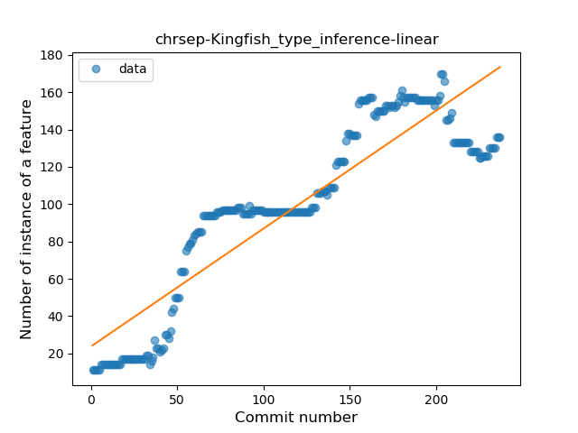
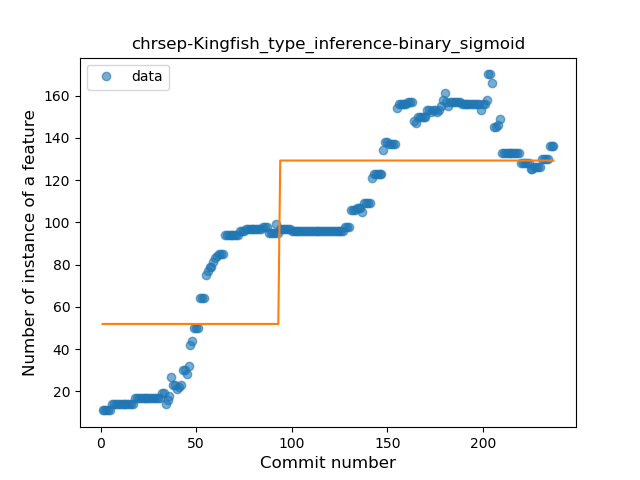
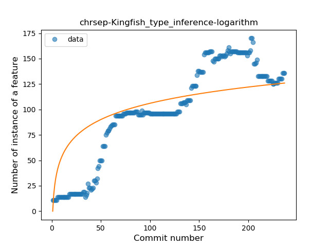
### <a name="lambda">Lambda</a>
----
#### Functions
* **Constant Rise - Linear:** 
    * **R_Squared:** 0.84991711
* **Plateau Sudden Rise - Binary Sigmoid:** 
    * **R_Squared:** 0.61559272
* **Sudden Rise Plateau - Logarithm:** 
    * **R_Squared:** 0.57760757

**Plots** :chart_with_upwards_trend:
-----

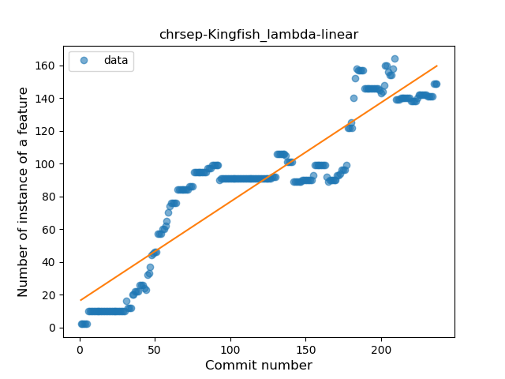
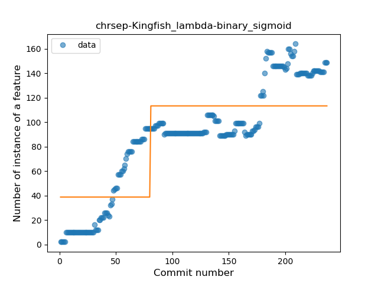
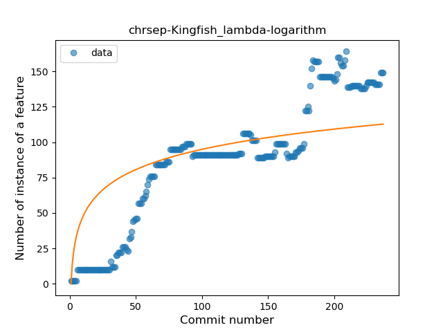
### <a name="safe_call">Safe Call</a>
----
#### Functions
* **Sudden Rise Plateau - Logarithm:** 
    * **R_Squared:** 0.83478853
* **Constant Rise - Linear:** 
    * **R_Squared:** 0.60688032

**Plots** :chart_with_upwards_trend:
-----

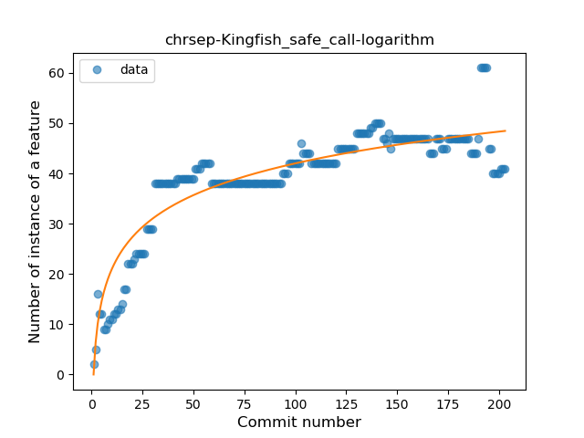
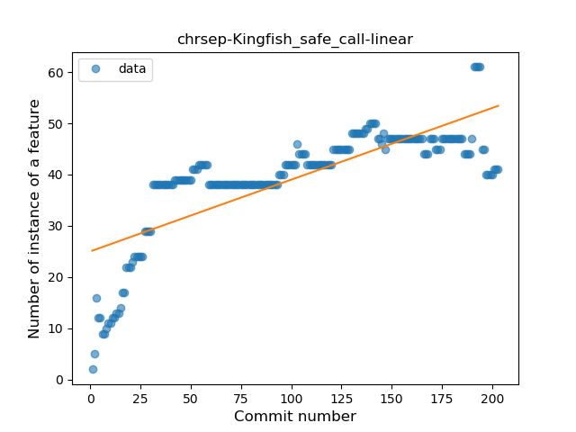
### <a name="when_expr">When expression</a>
----
#### Functions
* **Constant Rise - Linear:** 
    * **R_Squared:** 0.6769857
* **Sudden Rise Plateau - Logarithm:** 
    * **R_Squared:** 0.67766108

**Plots** :chart_with_upwards_trend:
-----

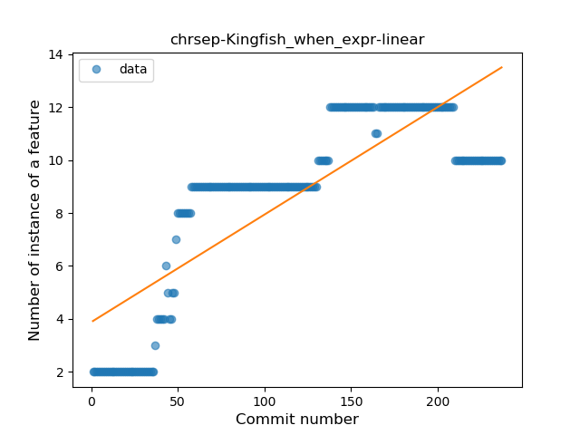
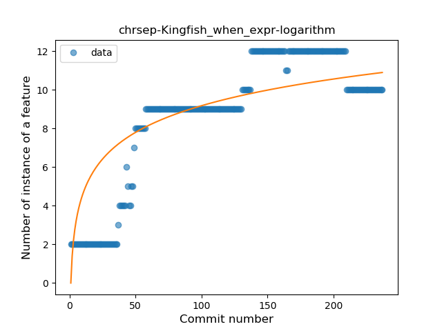
### <a name="string_template">String Template</a>
----
#### Functions
* **Plateau Gradual Rise - Sigmoid:** 
    * **R_Squared:** 0.89766592
* **Sudden Rise Plateau - Logarithm:** 
    * **R_Squared:** 0.72944657
* **Constant Rise - Linear:** 
    * **R_Squared:** 0.67977593

**Plots** :chart_with_upwards_trend:
-----

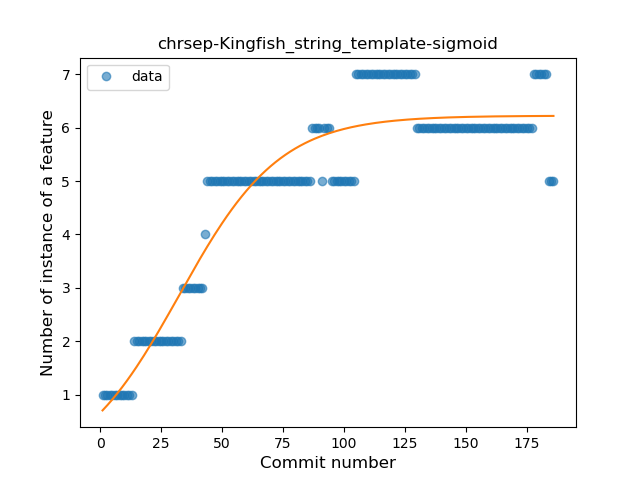
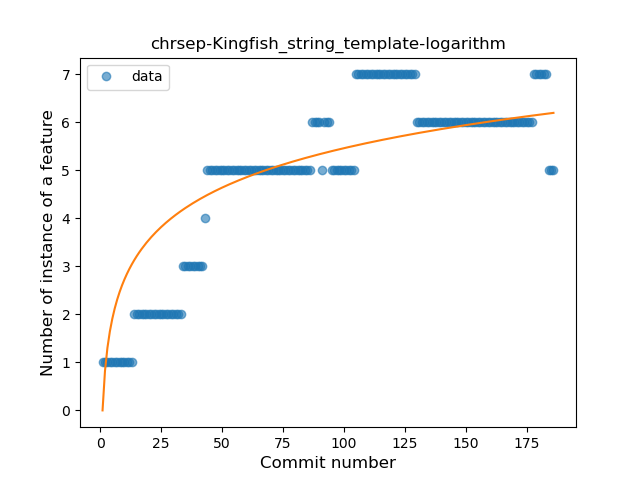
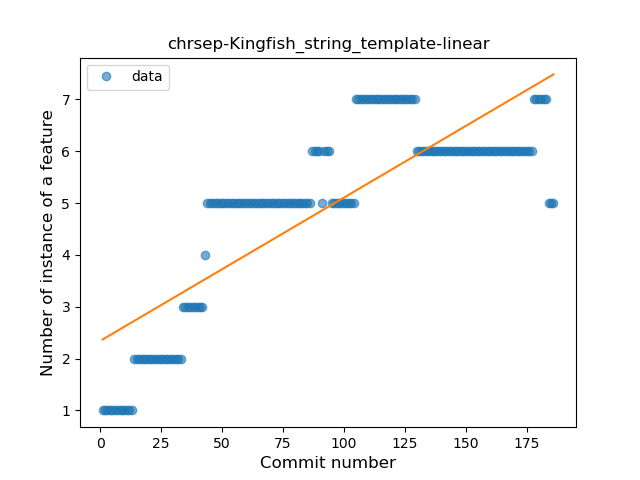
### <a name="func_with_default_value">Function with Default Value</a>
----
#### Functions
* **Constant Rise - Linear:** 
    * **R_Squared:** 0.75793512
* **Plateau Sudden Rise - Binary Sigmoid:** 
    * **R_Squared:** 0.75854269
* **Sudden Rise Plateau - Logarithm:** 
    * **R_Squared:** 0.70415213

**Plots** :chart_with_upwards_trend:
-----

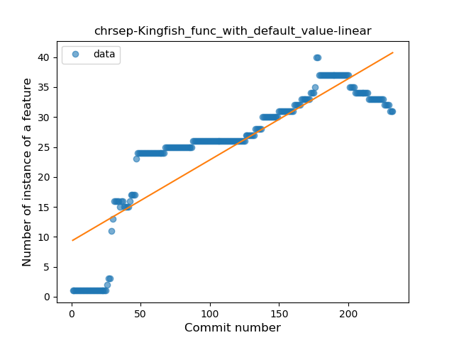
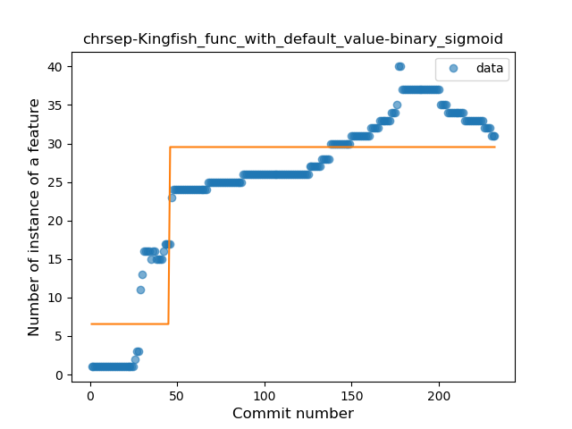
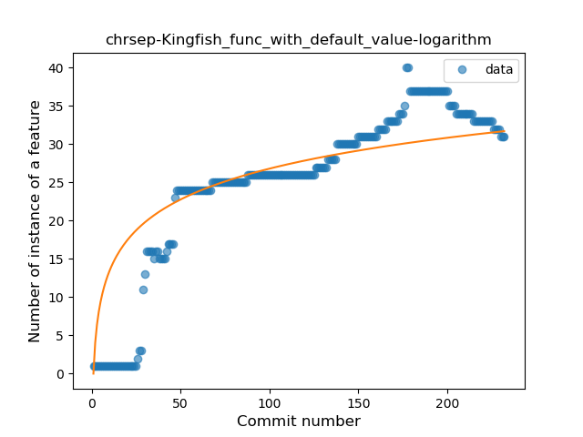
### <a name="singleton">Singleton</a>
----
#### Functions
* **Constant Decline - Linear:** 
    * **R_Squared:** 0.02940532
* **Sudden Rise Plateau - Logarithm:** 
    * **R_Squared:** -0.0

**Plots** :chart_with_upwards_trend:
-----

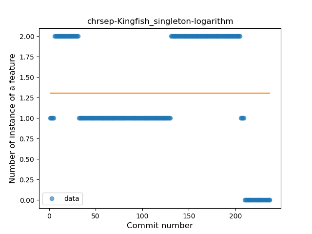
### <a name="smart_cast">Smart Cast</a>
----
#### Functions
* **Plateau Gradual Rise - Sigmoid:** 
    * **R_Squared:** 0.5742521
* **Constant Rise - Linear:** 
    * **R_Squared:** 0.54000179
* **Sudden Rise Plateau - Logarithm:** 
    * **R_Squared:** 0.46069798

**Plots** :chart_with_upwards_trend:
-----

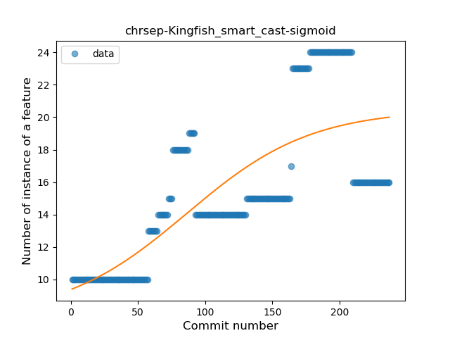
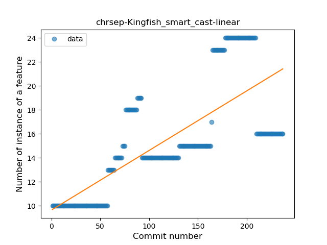
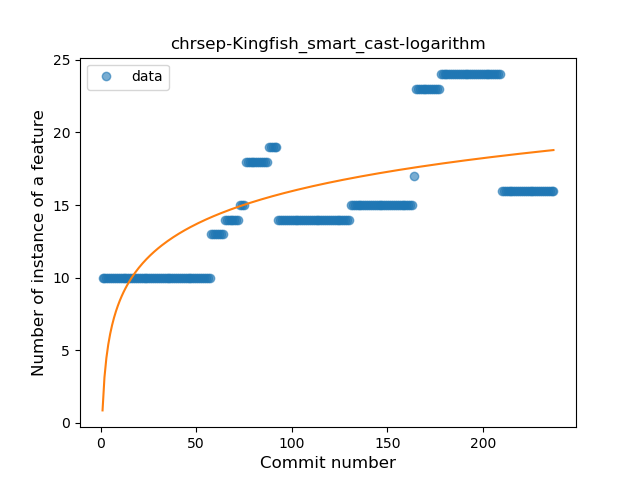
### <a name="func_call_with_named_arg">Function call with Named Argument</a>
----
#### Functions
* **Sudden Rise - Exponential:** 
    * **R_Squared:** 0.27267993
* **Constant Rise - Linear:** 
    * **R_Squared:** 0.20039112
* **Plateau Sudden Decline - Binary Sigmoid:** 
    * **R_Squared:** 0.17054263
* **Sudden Rise Plateau - Logarithm:** 
    * **R_Squared:** 0.01952341

**Plots** :chart_with_upwards_trend:
-----

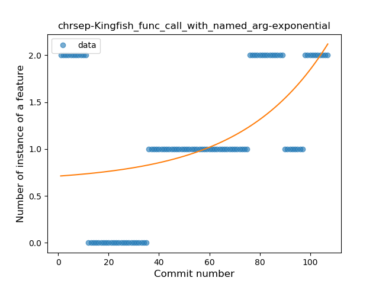
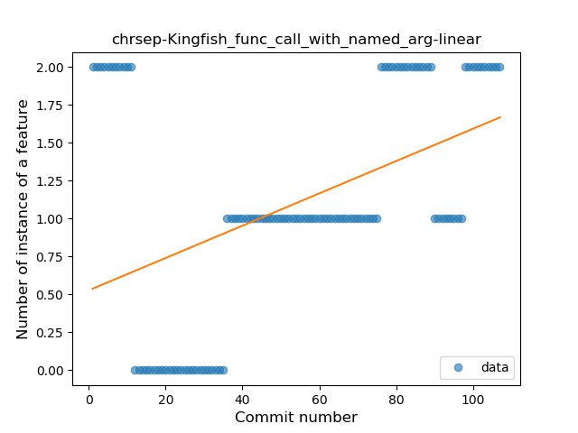
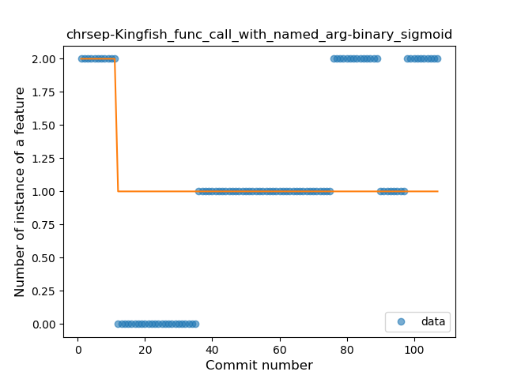
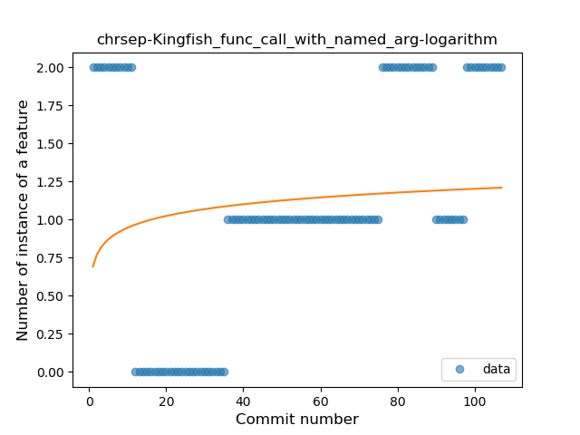
### <a name="data_class">Data Class</a>
----
#### Functions
* **Plateau Gradual Rise - Sigmoid:** 
    * **R_Squared:** 0.8558947
* **Constant Rise - Linear:** 
    * **R_Squared:** 0.60389362
* **Sudden Rise - Exponential:** 
    * **R_Squared:** 0.61020219
* **Sudden Rise Plateau - Logarithm:** 
    * **R_Squared:** 0.28064213

**Plots** :chart_with_upwards_trend:
-----

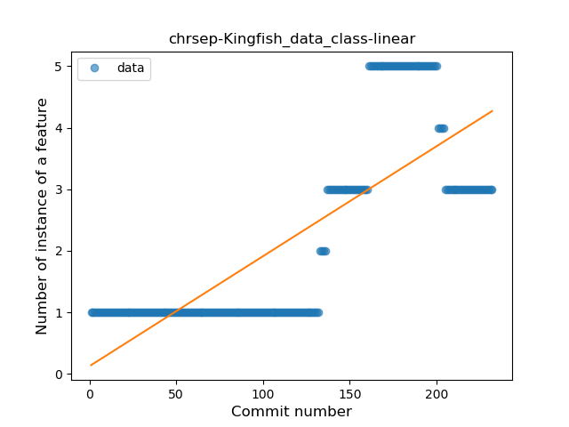
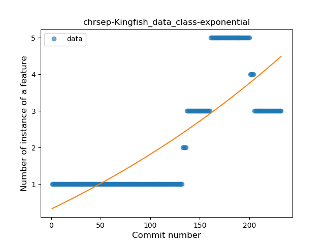
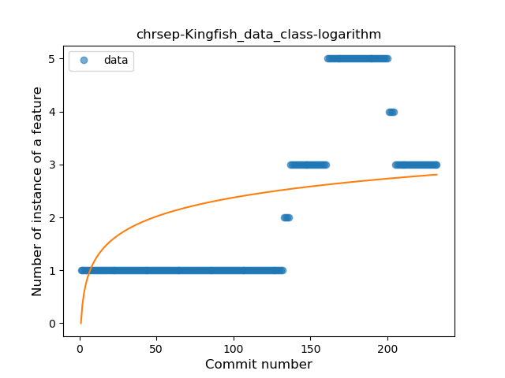
### <a name="extension_function">Extension Function</a>
----
#### Functions
* **Constant Rise - Linear:** 
    * **R_Squared:** 0.72130011
* **Sudden Rise Plateau - Logarithm:** 
    * **R_Squared:** 0.62540909

**Plots** :chart_with_upwards_trend:
-----

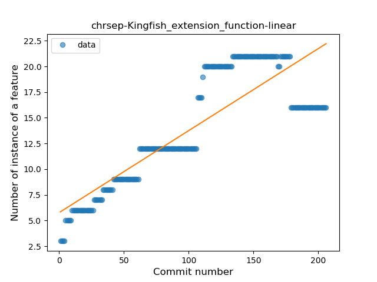
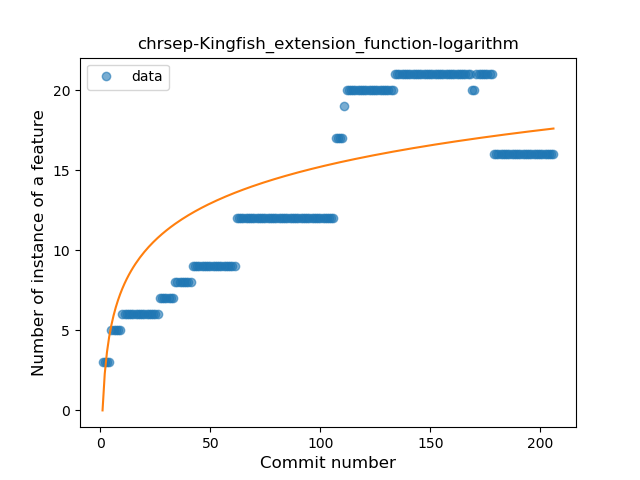
### <a name="property_delegation">Property Delegation</a>
----
#### Functions
* **Constant Decline - Linear:** 
    * **R_Squared:** 0.68380919
* **Sudden Rise Plateau - Logarithm:** 
    * **R_Squared:** -0.0

**Plots** :chart_with_upwards_trend:
-----

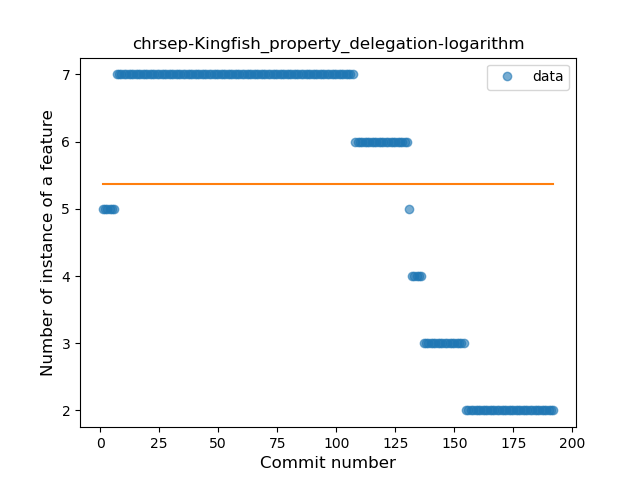
### <a name="destructuring_declaration">Destructuring Declaration</a>
----
#### Functions
* **Plateau Sudden Decline - Binary Sigmoid:** 
    * **R_Squared:** 1.0
* **Constant Decline - Linear:** 
    * **R_Squared:** 0.65286529
* **Sudden Rise Plateau - Logarithm:** 
    * **R_Squared:** -0.0

**Plots** :chart_with_upwards_trend:
-----

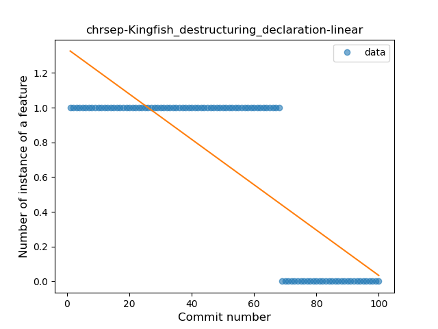
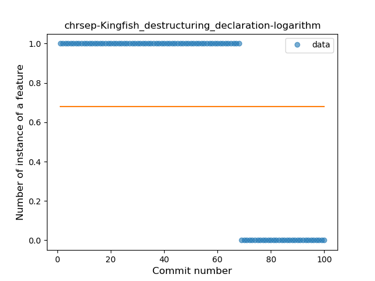
