## citiususc-calendula
----
#### Metrics provided by Detekt
* Number of lines of code 3444
* Number of Kotlin files: 43
* Cyclomatic complexity: 312
* Cyclomatic complexity by thousands of lines: 235 

----
**14** features analyzed

*	<a href="#type_inference">Type Inference</a> 
*	<a href="#lambda">Lambda</a> 
*	<a href="#safe_call">Safe Call</a> 
*	<a href="#when_expr">When expression</a> 
*	<a href="#companion_object">Companion Object</a> 
*	<a href="#unsafe_call">Unsafe Call</a> 
*	<a href="#string_template">String Template</a> 
*	<a href="#func_with_default_value">Function with Default Value</a> 
*	<a href="#singleton">Singleton</a> 
*	<a href="#smart_cast">Smart Cast</a> 
*	<a href="#func_call_with_named_arg">Function call with Named Argument</a> 
*	<a href="#property_delegation">Property Delegation</a> 
*	<a href="#destructuring_declaration">Destructuring Declaration</a> 
*	<a href="#overloaded_op">Overloaded Operator</a> 

### <a name="type_inference">Type Inference</a>
----
#### Functions
* **Constant Rise - Linear:** 
    * **R_Squared:** 0.93886532
* **Sudden Rise Plateau - Logarithm:** 
    * **R_Squared:** 0.60422618
* **Plateau Sudden Rise - Binary Sigmoid:** 
    * **R_Squared:** 0.49237958

**Plots** :chart_with_upwards_trend:
-----

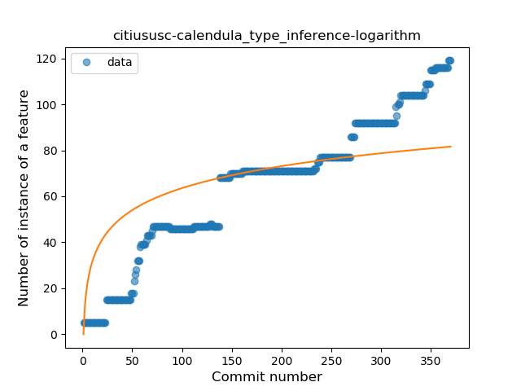
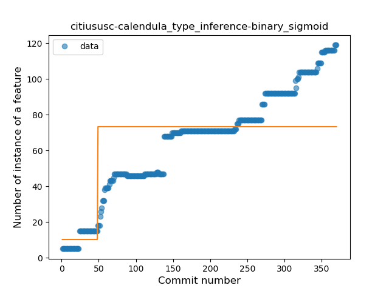
### <a name="lambda">Lambda</a>
----
#### Functions
* **Plateau Gradual Rise - Sigmoid:** 
    * **R_Squared:** 0.92212285
* **Constant Rise - Linear:** 
    * **R_Squared:** 0.71258385
* **Sudden Rise Plateau - Logarithm:** 
    * **R_Squared:** 0.67349949

**Plots** :chart_with_upwards_trend:
-----

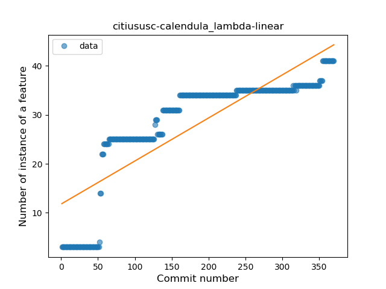
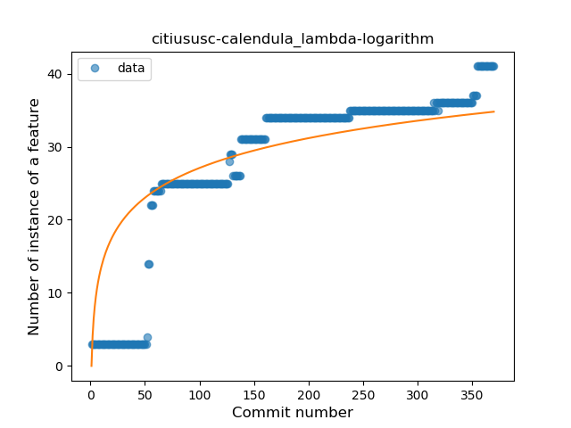
### <a name="safe_call">Safe Call</a>
----
#### Functions
* **Constant Rise - Linear:** 
    * **R_Squared:** 0.71903908
* **Sudden Rise Plateau - Logarithm:** 
    * **R_Squared:** 0.70370379
* **Plateau Gradual Rise - Sigmoid:** 
    * **R_Squared:** 0.66291994

**Plots** :chart_with_upwards_trend:
-----

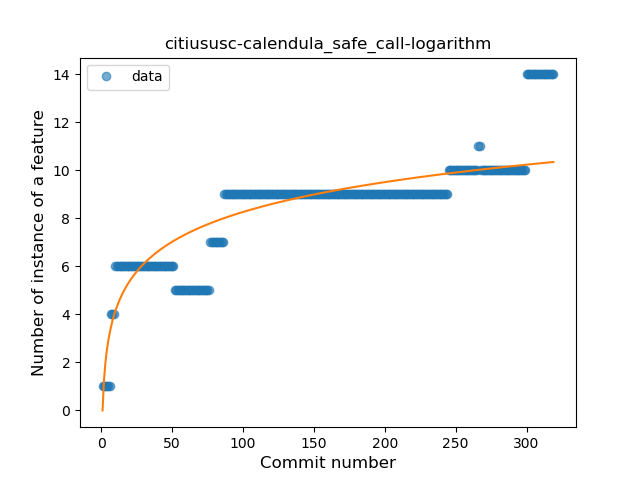
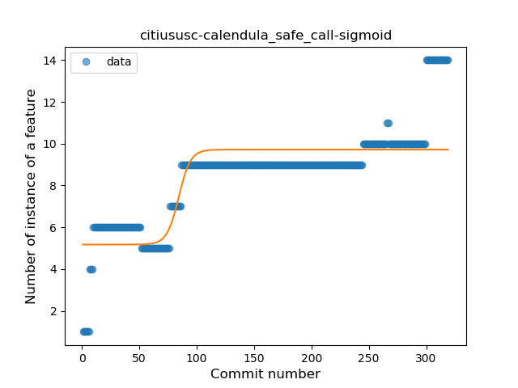
### <a name="when_expr">When expression</a>
----
#### Functions
* **Constant Rise - Linear:** 
    * **R_Squared:** 0.87029512
* **Sudden Rise - Exponential:** 
    * **R_Squared:** 0.8721099
* **Sudden Rise Plateau - Logarithm:** 
    * **R_Squared:** 0.71730151

**Plots** :chart_with_upwards_trend:
-----

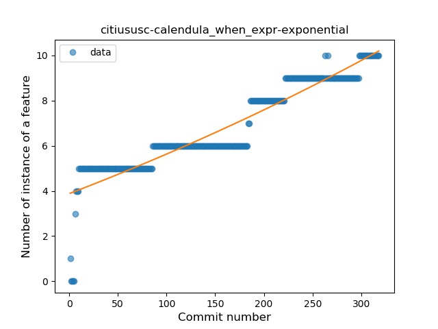
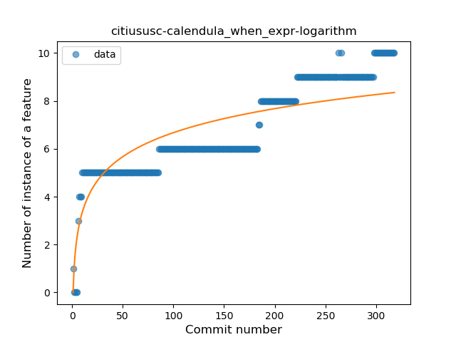
### <a name="companion_object">Companion Object</a>
----
#### Functions
* **Constant Rise - Linear:** 
    * **R_Squared:** 0.78677317
* **Sudden Rise Plateau - Logarithm:** 
    * **R_Squared:** 0.77416751

**Plots** :chart_with_upwards_trend:
-----

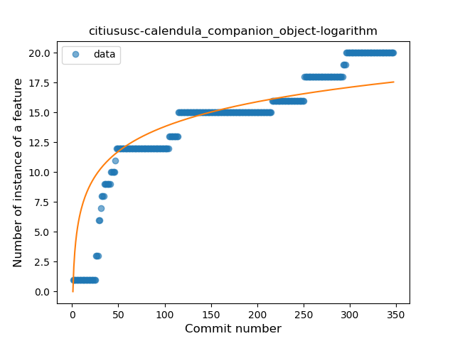
### <a name="unsafe_call">Unsafe Call</a>
----
#### Functions
* **Sudden Rise - Exponential:** 
    * **R_Squared:** 0.88647797
* **Constant Rise - Linear:** 
    * **R_Squared:** 0.79879647
* **Sudden Rise Plateau - Logarithm:** 
    * **R_Squared:** 0.41598569

**Plots** :chart_with_upwards_trend:
-----

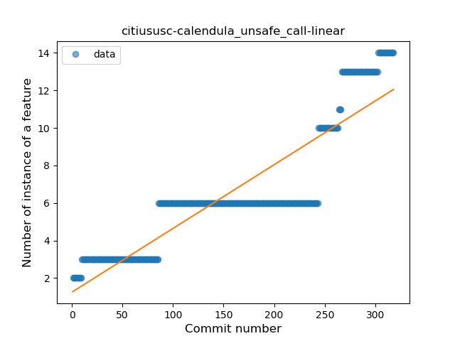
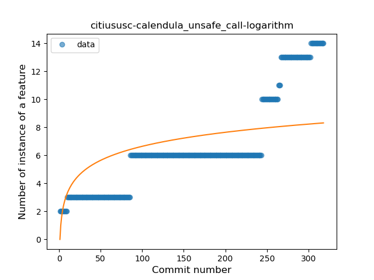
### <a name="string_template">String Template</a>
----
#### Functions
* **Sudden Rise Plateau - Logarithm:** 
    * **R_Squared:** 0.68556744
* **Constant Rise - Linear:** 
    * **R_Squared:** 0.622029
* **Plateau Sudden Rise - Binary Sigmoid:** 
    * **R_Squared:** 0.10358946

**Plots** :chart_with_upwards_trend:
-----

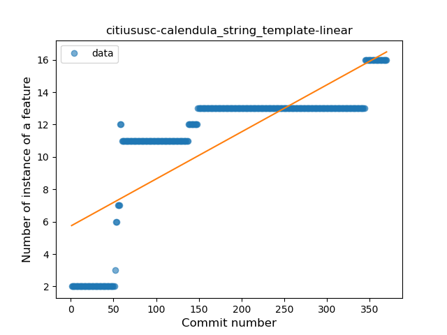
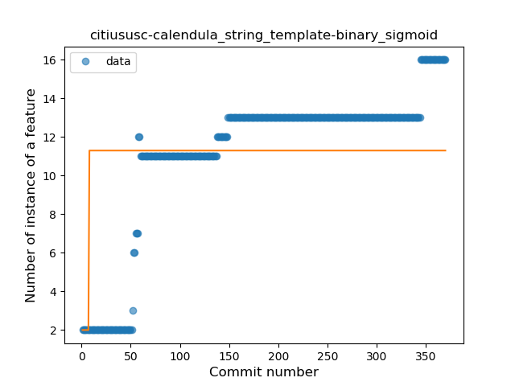
### <a name="func_with_default_value">Function with Default Value</a>
----
#### Functions
* **Constant Decline - Linear:** 
    * **R_Squared:** 0.05263158
* **Sudden Rise Plateau - Logarithm:** 
    * **R_Squared:** -0.0

**Plots** :chart_with_upwards_trend:
-----

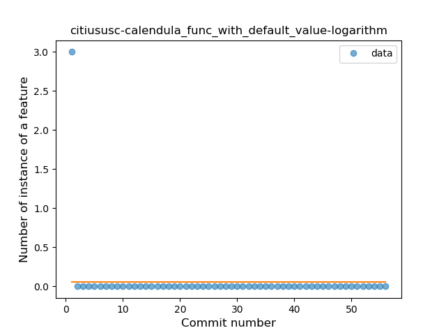
### <a name="singleton">Singleton</a>
----
#### Functions
* **Plateau Gradual Rise - Sigmoid:** 
    * **R_Squared:** 0.9223715
* **Constant Rise - Linear:** 
    * **R_Squared:** 0.85857517
* **Sudden Rise Plateau - Logarithm:** 
    * **R_Squared:** 0.42592021

**Plots** :chart_with_upwards_trend:
-----

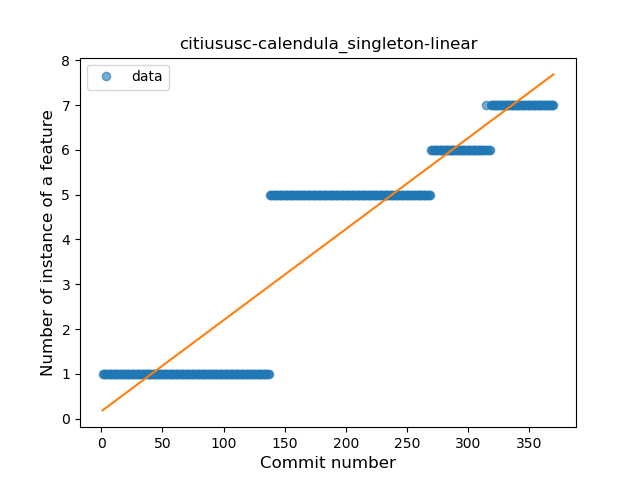
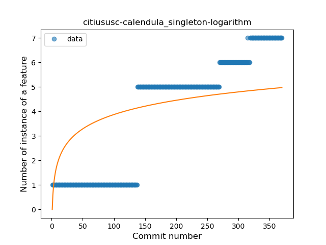
### <a name="smart_cast">Smart Cast</a>
----
#### Functions
* **Constant Rise - Linear:** 
    * **R_Squared:** 0.00711702
* **Sudden Rise - Exponential:** 
    * **R_Squared:** 0.00711057
* **Sudden Rise Plateau - Logarithm:** 
    * **R_Squared:** 0.004735

**Plots** :chart_with_upwards_trend:
-----

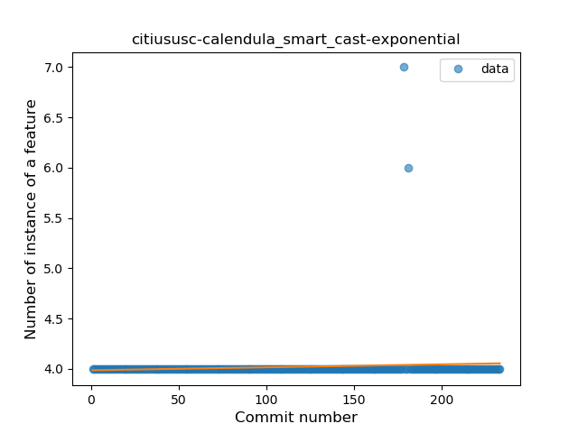
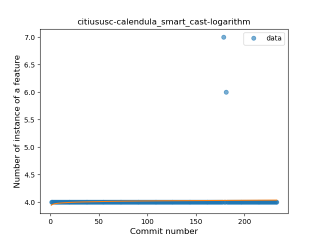
### <a name="func_call_with_named_arg">Function call with Named Argument</a>
----
#### Functions
* **Constant Rise - Linear:** 
    * **R_Squared:** 0.00354527
* **Sudden Rise - Exponential:** 
    * **R_Squared:** 0.00354256
* **Sudden Rise Plateau - Logarithm:** 
    * **R_Squared:** 0.00240718

**Plots** :chart_with_upwards_trend:
-----

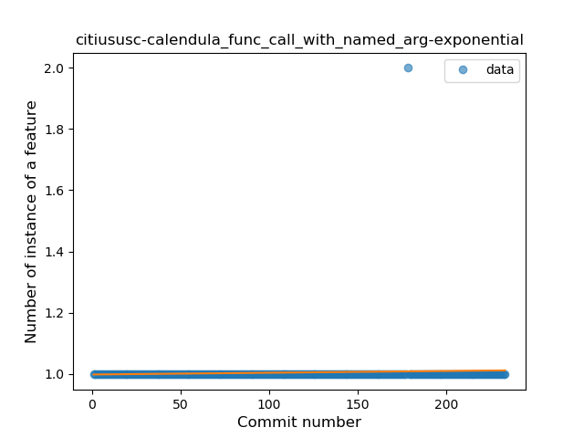
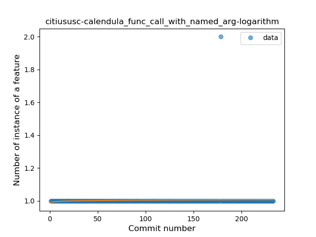
### <a name="property_delegation">Property Delegation</a>
----
#### Functions
* **Plateau Gradual Rise - Sigmoid:** 
    * **R_Squared:** 0.89905795
* **Constant Rise - Linear:** 
    * **R_Squared:** 0.82534743
* **Sudden Rise Plateau - Logarithm:** 
    * **R_Squared:** 0.78335955

**Plots** :chart_with_upwards_trend:
-----

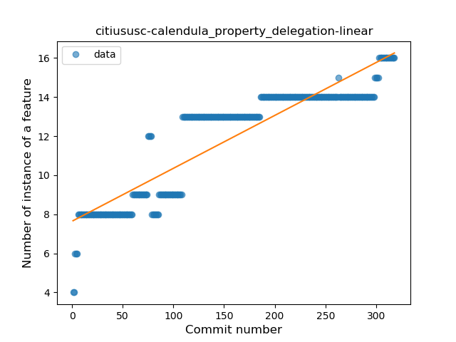
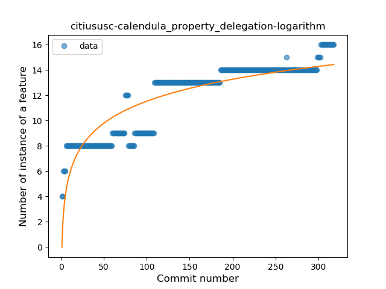
### <a name="destructuring_declaration">Destructuring Declaration</a>
----
#### Functions
* **Constant Rise - Linear:** 
    * **R_Squared:** 0.00400917
* **Sudden Rise - Exponential:** 
    * **R_Squared:** 0.0040125
* **Sudden Rise Plateau - Logarithm:** 
    * **R_Squared:** 0.00215978

**Plots** :chart_with_upwards_trend:
-----

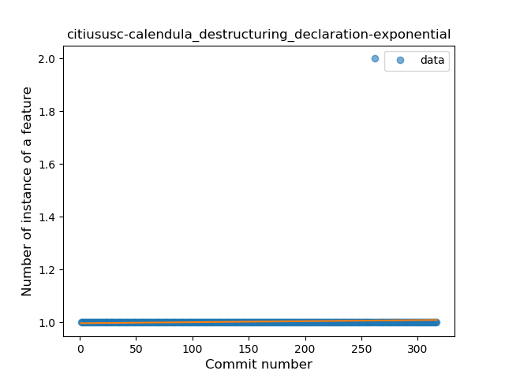
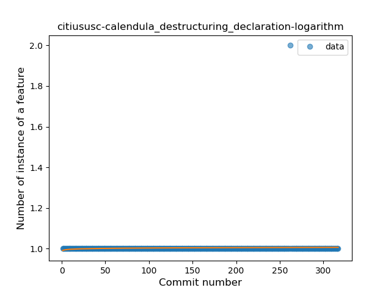
### <a name="overloaded_op">Overloaded Operator</a>
----
#### Functions
* **Constant Rise - Linear:** 
    * **R_Squared:** 0.21373749
* **Sudden Rise Plateau - Logarithm:** 
    * **R_Squared:** 0.16080477

**Plots** :chart_with_upwards_trend:
-----

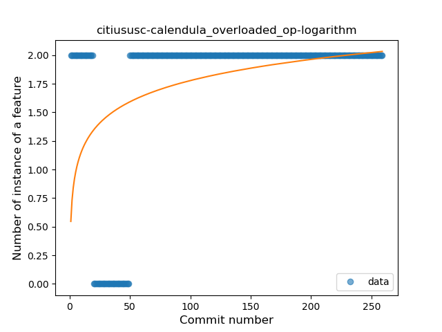
