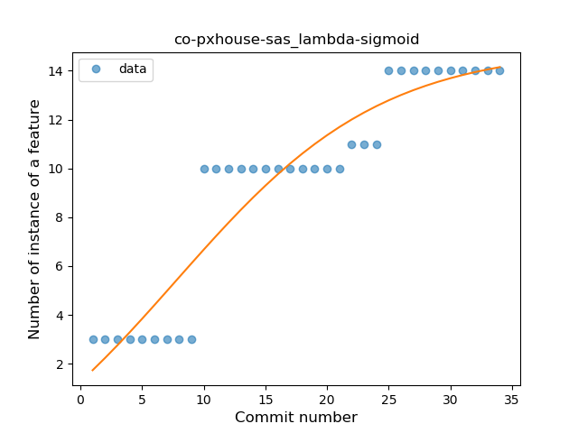
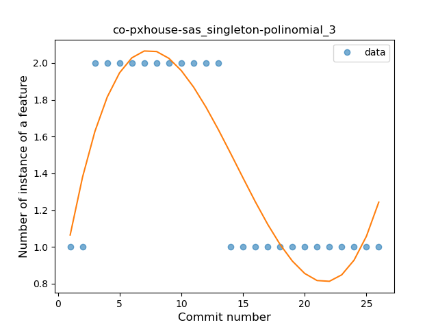
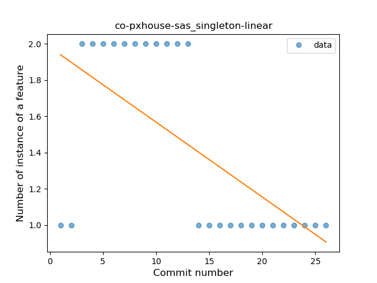
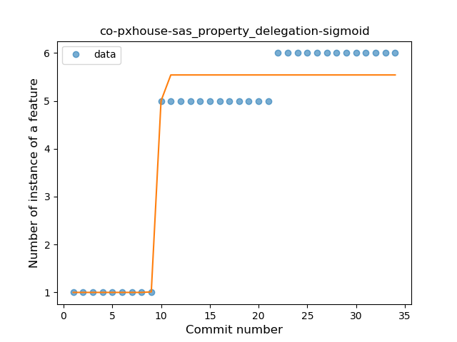

## co-pxhouse-sas
----
#### Metrics provided by Detekt
* Number of lines of code 342
* Number of Kotlin files: 6
* Cyclomatic complexity: 47
* Cyclomatic complexity by thousands of lines: 237 

----
**6** features analyzed

*	<a href="#type_inference">Type Inference</a> 
*	<a href="#lambda">Lambda</a> 
*	<a href="#func_with_default_value">Function with Default Value</a> 
*	<a href="#singleton">Singleton</a> 
*	<a href="#data_class">Data Class</a> 
*	<a href="#property_delegation">Property Delegation</a> 

### <a name="type_inference">Type Inference</a>
----
#### Functions
* **Plateau Gradual Rise - Sigmoid:** 
    * **R_Squared:** 0.85264918
* **Constant Rise - Linear:** 
    * **R_Squared:** 0.70597807
* **Sudden Rise Plateau - Logarithm:** 
    * **R_Squared:** 0.70529523

**Plots** :chart_with_upwards_trend:
-----

### <a name="lambda">Lambda</a>
----
#### Functions
* **Plateau Gradual Rise - Sigmoid:** 
    * **R_Squared:** 0.88422139
* **Constant Rise - Linear:** 
    * **R_Squared:** 0.85066019
* **Sudden Rise Plateau - Logarithm:** 
    * **R_Squared:** 0.76987063

**Plots** :chart_with_upwards_trend:
-----

### <a name="func_with_default_value">Function with Default Value</a>
----
#### Functions
* **Plateau Sudden Decline - Binary Sigmoid:** 
    * **R_Squared:** 1.0
* **Instability - Polinomial 4:** 
    * **R_Squared:** 0.87813028
* **Instability - Polinomial 3:** )
    * **R_Squared:** 0.83717611
* **Constant Decline - Linear:** 
    * **R_Squared:** 0.72115385
* **Sudden Rise Plateau - Logarithm:** 
    * **R_Squared:** -0.0

**Plots** :chart_with_upwards_trend:
-----

### <a name="singleton">Singleton</a>
----
#### Functions
* **Instability - Polinomial 3:** )
    * **R_Squared:** 0.81061596
* **Plateau Sudden Decline - Binary Sigmoid:** 
    * **R_Squared:** 0.73333333
* **Constant Decline - Linear:** 
    * **R_Squared:** 0.39437037
* **Sudden Rise Plateau - Logarithm:** 
    * **R_Squared:** -0.0

**Plots** :chart_with_upwards_trend:
-----

### <a name="data_class">Data Class</a>
----
#### Functions
* **Plateau Sudden Decline - Binary Sigmoid:** 
    * **R_Squared:** 1.0
* **Instability - Polinomial 3:** )
    * **R_Squared:** 0.86146927
* **Constant Decline - Linear:** 
    * **R_Squared:** 0.75111111
* **Sudden Rise Plateau - Logarithm:** 
    * **R_Squared:** 0.0

**Plots** :chart_with_upwards_trend:
-----

### <a name="property_delegation">Property Delegation</a>
----
#### Functions
* **Plateau Gradual Rise - Sigmoid:** 
    * **R_Squared:** 0.95787491
* **Constant Rise - Linear:** 
    * **R_Squared:** 0.74315691
* **Sudden Rise Plateau - Logarithm:** 
    * **R_Squared:** 0.74569497

**Plots** :chart_with_upwards_trend:
-----

