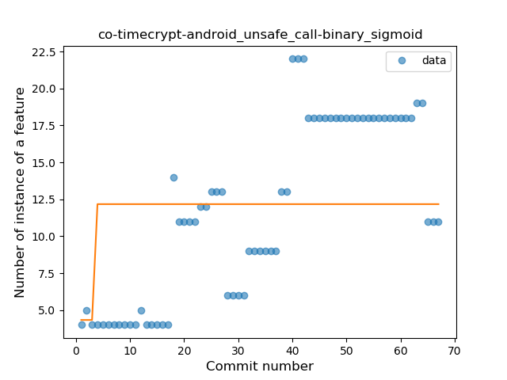
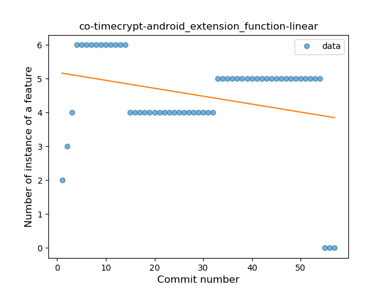

## co-timecrypt-android
----
#### Metrics provided by Detekt
* Number of lines of code 1950
* Number of Kotlin files: 24
* Cyclomatic complexity: 223
* Cyclomatic complexity by thousands of lines: 240 

----
**12** features analyzed

*	<a href="#type_inference">Type Inference</a> 
*	<a href="#lambda">Lambda</a> 
*	<a href="#safe_call">Safe Call</a> 
*	<a href="#when_expr">When expression</a> 
*	<a href="#unsafe_call">Unsafe Call</a> 
*	<a href="#companion_object">Companion Object</a> 
*	<a href="#string_template">String Template</a> 
*	<a href="#func_with_default_value">Function with Default Value</a> 
*	<a href="#singleton">Singleton</a> 
*	<a href="#func_call_with_named_arg">Function call with Named Argument</a> 
*	<a href="#extension_function">Extension Function</a> 
*	<a href="#destructuring_declaration">Destructuring Declaration</a> 

### <a name="type_inference">Type Inference</a>
----
#### Functions
* **Sudden Rise Plateau - Logarithm:** 
    * **R_Squared:** 0.85038681
* **Constant Rise - Linear:** 
    * **R_Squared:** 0.78960173

**Plots** :chart_with_upwards_trend:
-----

### <a name="lambda">Lambda</a>
----
#### Functions
* **Instability - Polinomial 3:** )
    * **R_Squared:** 0.85571322
* **Plateau Gradual Rise - Sigmoid:** 
    * **R_Squared:** 0.79182798
* **Constant Rise - Linear:** 
    * **R_Squared:** 0.71106756
* **Sudden Rise Plateau - Logarithm:** 
    * **R_Squared:** 0.54004083

**Plots** :chart_with_upwards_trend:
-----

### <a name="safe_call">Safe Call</a>
----
#### Functions
* **Sudden Rise - Exponential:** 
    * **R_Squared:** 0.85347905
* **Constant Rise - Linear:** 
    * **R_Squared:** 0.80898217
* **Sudden Rise Plateau - Logarithm:** 
    * **R_Squared:** 0.47083664
* **Plateau Sudden Rise - Binary Sigmoid:** 
    * **R_Squared:** 0.35952403

**Plots** :chart_with_upwards_trend:
-----

### <a name="when_expr">When expression</a>
----
#### Functions
* **Plateau Gradual Rise - Sigmoid:** 
    * **R_Squared:** 0.88695193
* **Instability - Polinomial 3:** )
    * **R_Squared:** 0.87430244
* **Constant Rise - Linear:** 
    * **R_Squared:** 0.67839133
* **Sudden Rise Plateau - Logarithm:** 
    * **R_Squared:** 0.59484699

**Plots** :chart_with_upwards_trend:
-----

### <a name="unsafe_call">Unsafe Call</a>
----
#### Functions
* **Instability - Polinomial 3:** )
    * **R_Squared:** 0.75089764
* **Constant Rise - Linear:** 
    * **R_Squared:** 0.64222867
* **Sudden Rise Plateau - Logarithm:** 
    * **R_Squared:** 0.52909793
* **Plateau Sudden Rise - Binary Sigmoid:** 
    * **R_Squared:** 0.07373773

**Plots** :chart_with_upwards_trend:
-----

### <a name="companion_object">Companion Object</a>
----
#### Functions
* **Instability - Polinomial 3:** )
    * **R_Squared:** 0.90275287
* **Plateau Gradual Rise - Sigmoid:** 
    * **R_Squared:** 0.78669722
* **Constant Rise - Linear:** 
    * **R_Squared:** 0.64963779
* **Sudden Rise Plateau - Logarithm:** 
    * **R_Squared:** 0.58469645

**Plots** :chart_with_upwards_trend:
-----

### <a name="string_template">String Template</a>
----
#### Functions
* **Sudden Rise Plateau - Logarithm:** 
    * **R_Squared:** 0.83106842
* **Constant Rise - Linear:** 
    * **R_Squared:** 0.65129822

**Plots** :chart_with_upwards_trend:
-----

### <a name="func_with_default_value">Function with Default Value</a>
----
#### Functions
* **Instability - Polinomial 3:** )
    * **R_Squared:** 0.66524871
* **Plateau Gradual Rise - Sigmoid:** 
    * **R_Squared:** 0.5733759
* **Sudden Rise Plateau - Logarithm:** 
    * **R_Squared:** 0.517439
* **Constant Rise - Linear:** 
    * **R_Squared:** 0.5022814

**Plots** :chart_with_upwards_trend:
-----

### <a name="singleton">Singleton</a>
----
#### Functions
* **Plateau Sudden Decline - Binary Sigmoid:** 
    * **R_Squared:** 1.0
* **Constant Decline - Linear:** 
    * **R_Squared:** 0.11824324
* **Sudden Rise Plateau - Logarithm:** 
    * **R_Squared:** -0.0

**Plots** :chart_with_upwards_trend:
-----

### <a name="func_call_with_named_arg">Function call with Named Argument</a>
----
#### Functions
* **Sudden Decline - Exponential:** 
    * **R_Squared:** 1.0
* **Instability - Polinomial 3:** )
    * **R_Squared:** 0.45940171
* **Constant Decline - Linear:** 
    * **R_Squared:** 0.11538462
* **Sudden Rise Plateau - Logarithm:** 
    * **R_Squared:** -0.0

**Plots** :chart_with_upwards_trend:
-----

### <a name="extension_function">Extension Function</a>
----
#### Functions
* **Instability - Polinomial 3:** )
    * **R_Squared:** 0.22598644
* **Plateau Sudden Decline - Binary Sigmoid:** 
    * **R_Squared:** 0.12812922
* **Constant Decline - Linear:** 
    * **R_Squared:** 0.08147976
* **Sudden Rise Plateau - Logarithm:** 
    * **R_Squared:** -0.0

**Plots** :chart_with_upwards_trend:
-----

### <a name="destructuring_declaration">Destructuring Declaration</a>
----
#### Functions
* **Plateau Sudden Rise - Binary Sigmoid:** 
    * **R_Squared:** 1.0
* **Instability - Polinomial 3:** )
    * **R_Squared:** 0.85698364
* **Constant Rise - Linear:** 
    * **R_Squared:** 0.74703557
* **Sudden Rise Plateau - Logarithm:** 
    * **R_Squared:** 0.57747558

**Plots** :chart_with_upwards_trend:
-----

