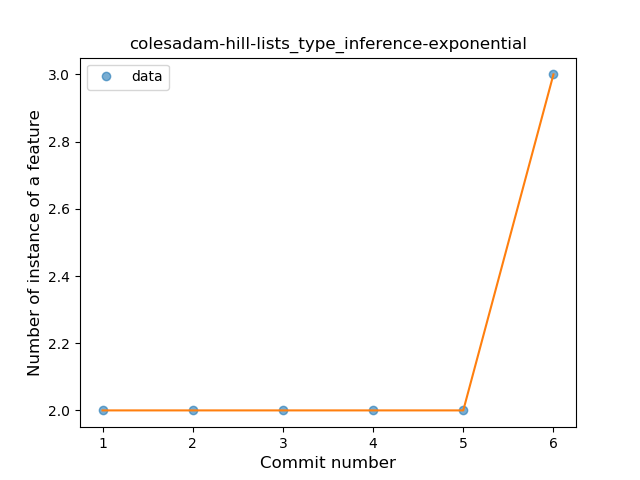
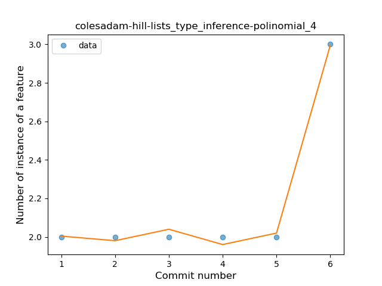
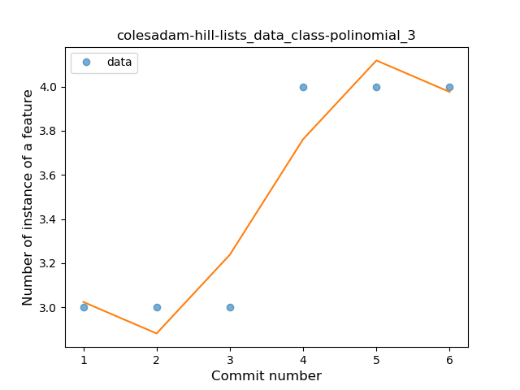
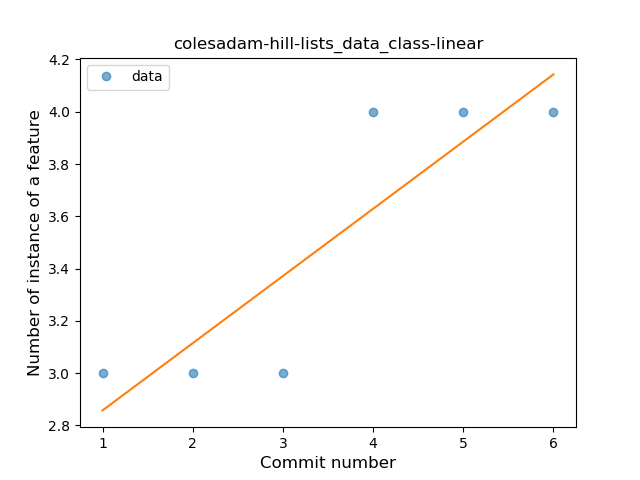
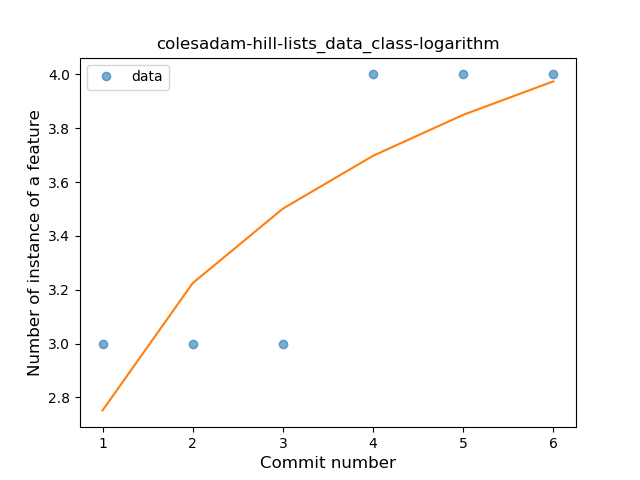

## colesadam-hill-lists
----
#### Metrics provided by Detekt
* Number of lines of code 265
* Number of Kotlin files: 9
* Cyclomatic complexity: 10
* Cyclomatic complexity by thousands of lines: 57 

----
**2** features analyzed

*	<a href="#type_inference">Type Inference</a> 
*	<a href="#data_class">Data Class</a> 

### <a name="type_inference">Type Inference</a>
----
#### Functions
* **Sudden Rise - Exponential:** 
    * **R_Squared:** 1.0
* **Instability - Polinomial 4:** 
    * **R_Squared:** 0.9952381
* **Instability - Polinomial 3:** )
    * **R_Squared:** 0.95238095
* **Constant Rise - Linear:** 
    * **R_Squared:** 0.42857143
* **Sudden Rise Plateau - Logarithm:** 
    * **R_Squared:** 0.26417571

**Plots** :chart_with_upwards_trend:
-----

### <a name="data_class">Data Class</a>
----
#### Functions
* **Plateau Sudden Rise - Binary Sigmoid:** 
    * **R_Squared:** 1.0
* **Instability - Polinomial 3:** )
    * **R_Squared:** 0.9047619
* **Constant Rise - Linear:** 
    * **R_Squared:** 0.77142857
* **Sudden Rise Plateau - Logarithm:** 
    * **R_Squared:** 0.68127878

**Plots** :chart_with_upwards_trend:
-----

