## com-BibleQuote
----
#### Metrics provided by Detekt
* Number of lines of code 726
* Number of Kotlin files: 10
* Cyclomatic complexity: 62
* Cyclomatic complexity by thousands of lines: 275 

----
**4** features analyzed

*	<a href="#type_inference">Type Inference</a> 
*	<a href="#lambda">Lambda</a> 
*	<a href="#safe_call">Safe Call</a> 
*	<a href="#string_template">String Template</a> 

### <a name="type_inference">Type Inference</a>
----
#### Functions
* **Instability - Polinomial 4:** 
    * **R_Squared:** 0.93227084
* **Sudden Rise Plateau - Logarithm:** 
    * **R_Squared:** 0.77752661
* **Constant Rise - Linear:** 
    * **R_Squared:** 0.7624853

**Plots** :chart_with_upwards_trend:
-----

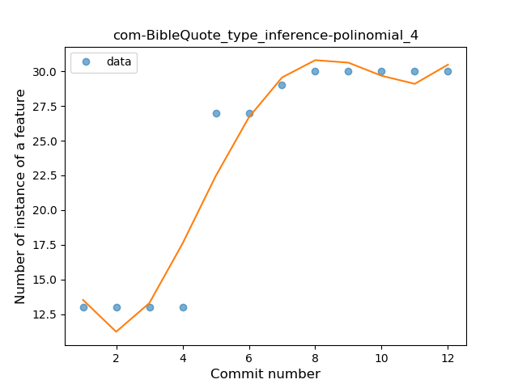
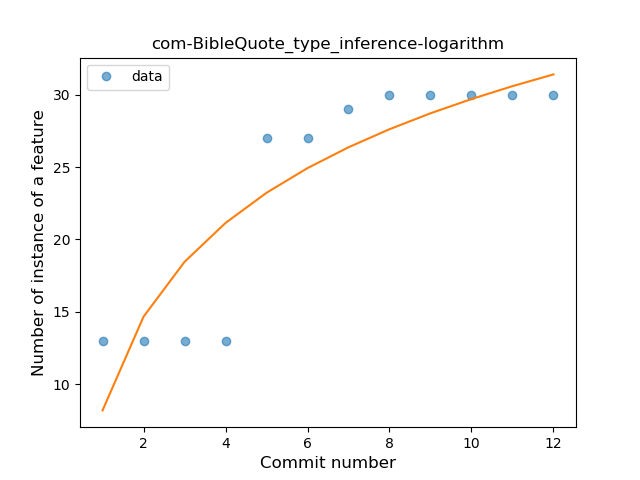
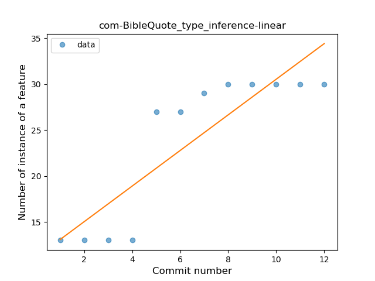
### <a name="lambda">Lambda</a>
----
#### Functions
* **Plateau Gradual Rise - Sigmoid:** 
    * **R_Squared:** 0.96618373
* **Instability - Polinomial 4:** 
    * **R_Squared:** 0.95581854
* **Constant Rise - Linear:** 
    * **R_Squared:** 0.80688542
* **Sudden Rise Plateau - Logarithm:** 
    * **R_Squared:** 0.79178995

**Plots** :chart_with_upwards_trend:
-----

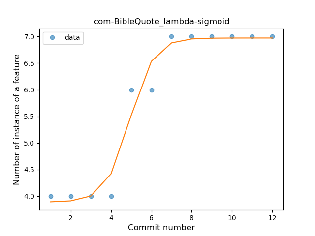
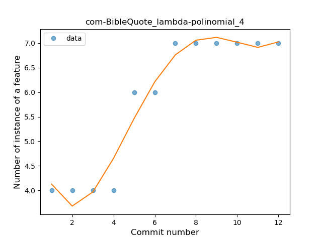
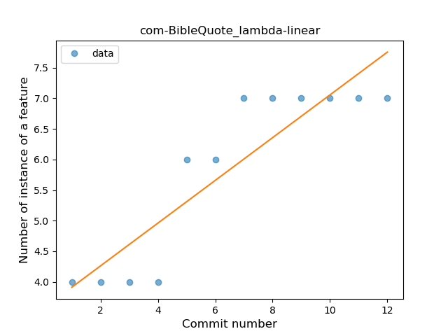
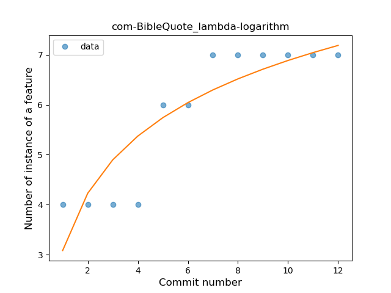
### <a name="safe_call">Safe Call</a>
----
#### Functions
* **Plateau Sudden Rise - Binary Sigmoid:** 
    * **R_Squared:** 1.0
* **Instability - Polinomial 3:** )
    * **R_Squared:** 0.86946387
* **Constant Rise - Linear:** 
    * **R_Squared:** 0.75524476
* **Sudden Rise Plateau - Logarithm:** 
    * **R_Squared:** 0.61836924

**Plots** :chart_with_upwards_trend:
-----

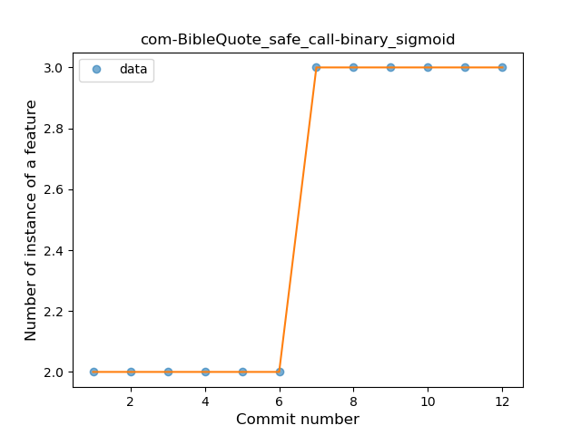
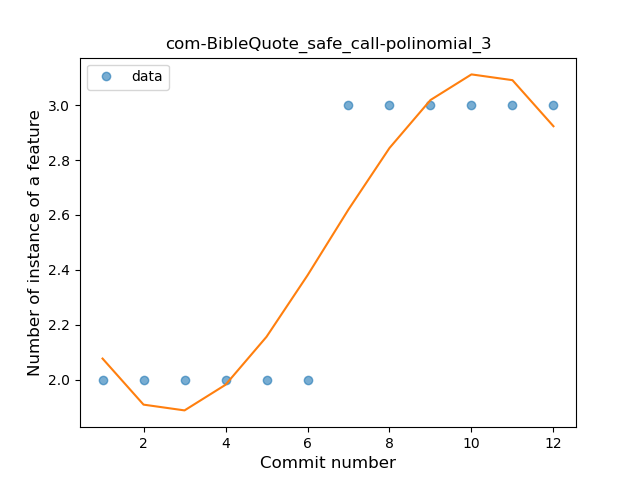
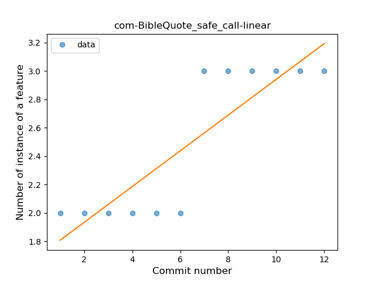
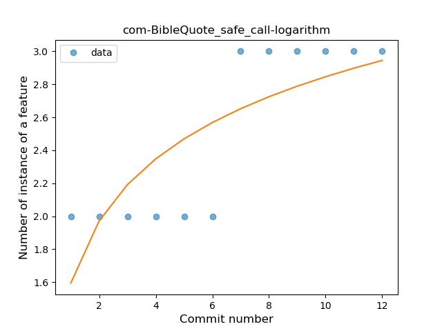
### <a name="string_template">String Template</a>
----
#### Functions
* **Plateau Sudden Rise - Binary Sigmoid:** 
    * **R_Squared:** 1.0
* **Instability - Polinomial 4:** 
    * **R_Squared:** 0.87445887
* **Sudden Rise Plateau - Logarithm:** 
    * **R_Squared:** 0.73797112
* **Constant Rise - Linear:** 
    * **R_Squared:** 0.57142857

**Plots** :chart_with_upwards_trend:
-----

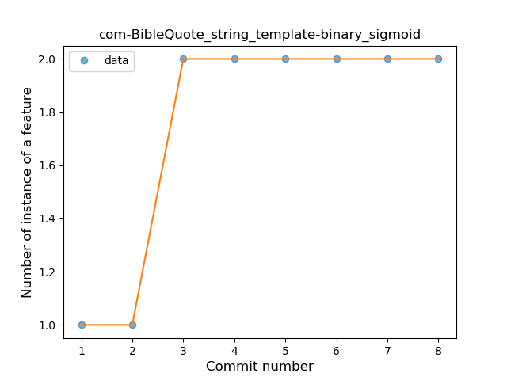
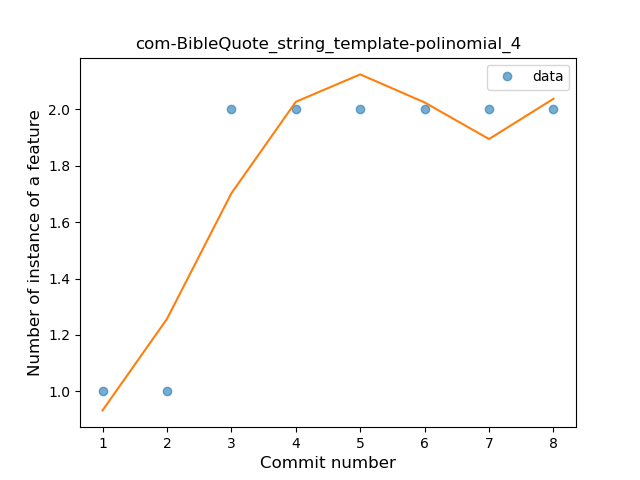
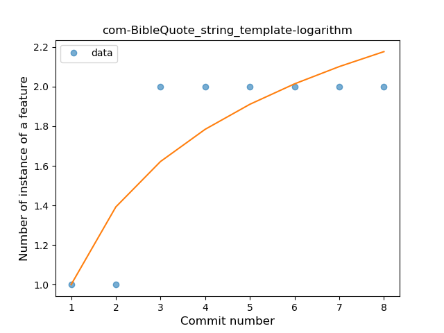
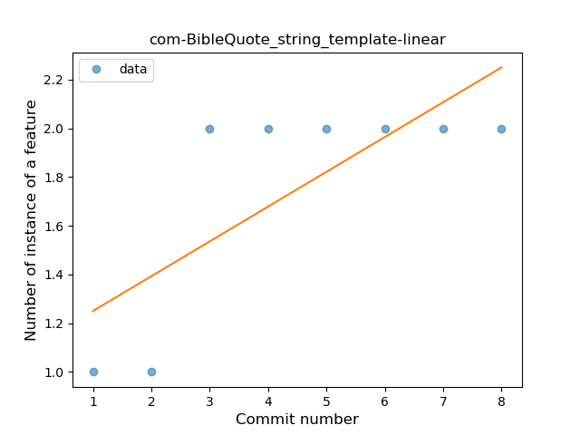
