## com-aaplab-bakubus
----
#### Metrics provided by Detekt
* Number of lines of code 361
* Number of Kotlin files: 3
* Cyclomatic complexity: 41
* Cyclomatic complexity by thousands of lines: 207 

----
**7** features analyzed

*	<a href="#type_inference">Type Inference</a> 
*	<a href="#lambda">Lambda</a> 
*	<a href="#safe_call">Safe Call</a> 
*	<a href="#unsafe_call">Unsafe Call</a> 
*	<a href="#range_expr">Range Expression</a> 
*	<a href="#property_delegation">Property Delegation</a> 
*	<a href="#destructuring_declaration">Destructuring Declaration</a> 

### <a name="type_inference">Type Inference</a>
----
#### Functions
* **Instability - Polinomial 3:** )
    * **R_Squared:** 0.81176656
* **Instability - Polinomial 4:** 
    * **R_Squared:** 0.81427888
* **Sudden Rise Plateau - Logarithm:** 
    * **R_Squared:** 0.63371572
* **Constant Rise - Linear:** 
    * **R_Squared:** 0.36890614

**Plots** :chart_with_upwards_trend:
-----

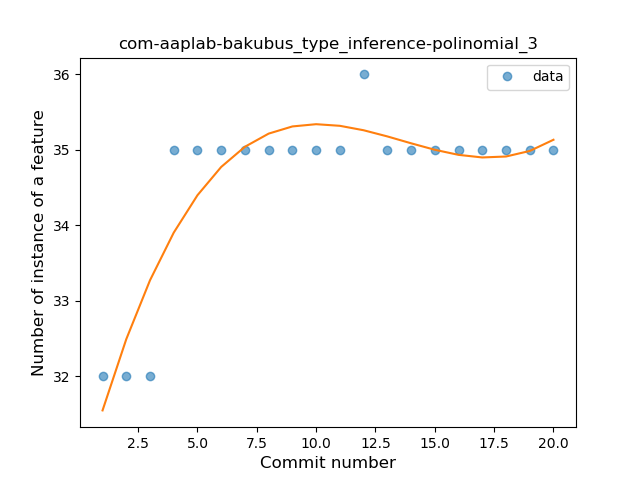
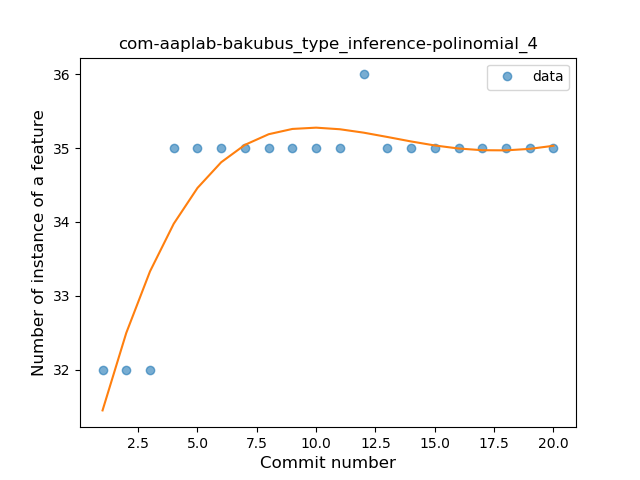
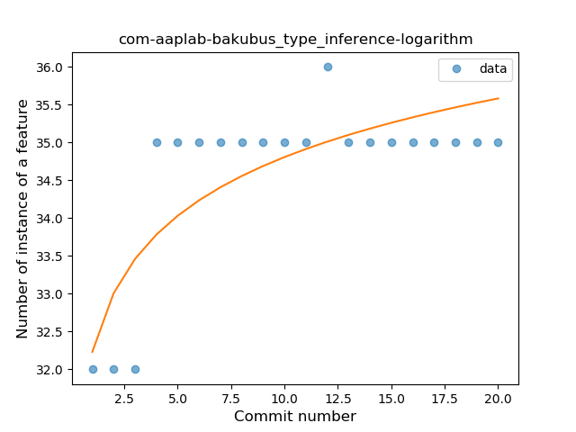
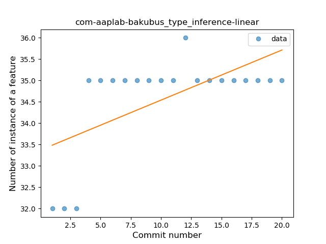
### <a name="lambda">Lambda</a>
----
#### Functions
* **Constant Rise - Linear:** 
    * **R_Squared:** 0.8513807
* **Sudden Rise Plateau - Logarithm:** 
    * **R_Squared:** 0.84418709

**Plots** :chart_with_upwards_trend:
-----

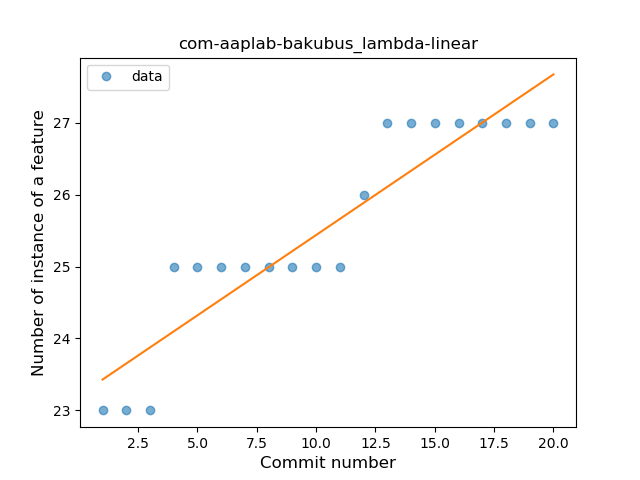
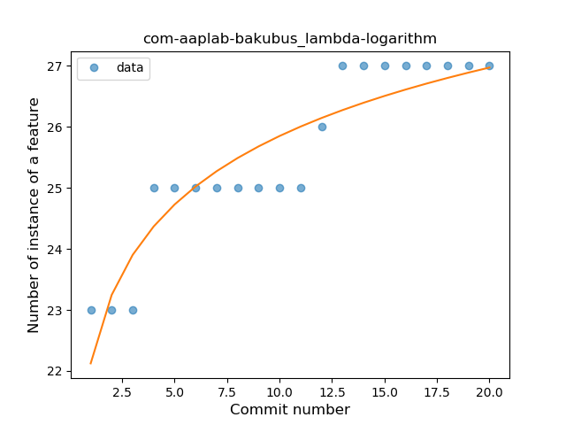
### <a name="safe_call">Safe Call</a>
----
#### Functions
* **Instability - Polinomial 4:** 
    * **R_Squared:** 0.85396082
* **Instability - Polinomial 3:** )
    * **R_Squared:** 0.83839789
* **Sudden Rise - Exponential:** 
    * **R_Squared:** 0.40654433
* **Constant Rise - Linear:** 
    * **R_Squared:** 0.28362829
* **Sudden Rise Plateau - Logarithm:** 
    * **R_Squared:** 0.07056221

**Plots** :chart_with_upwards_trend:
-----

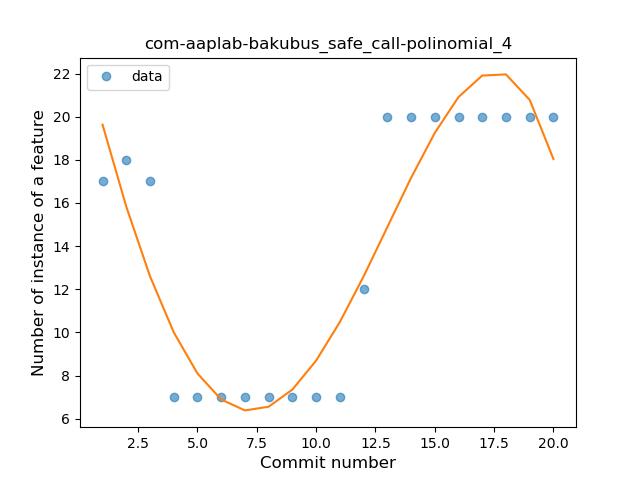
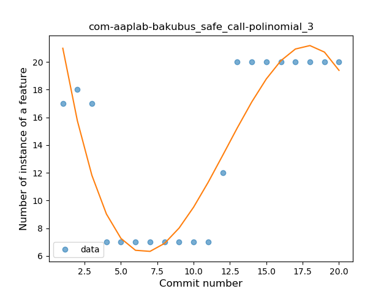
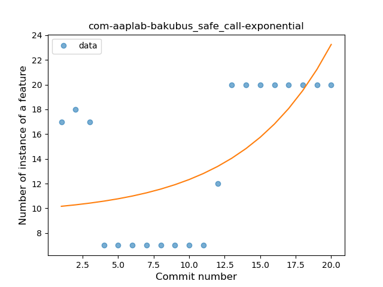
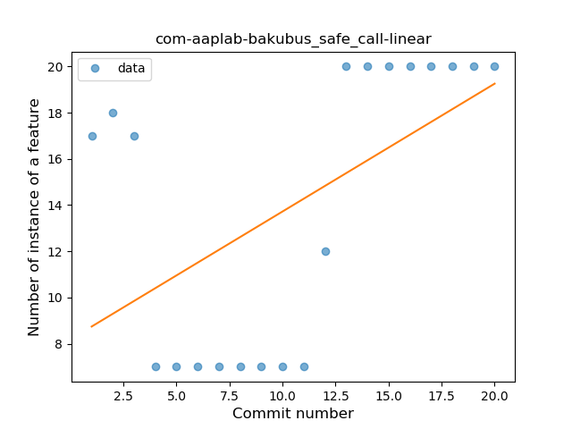
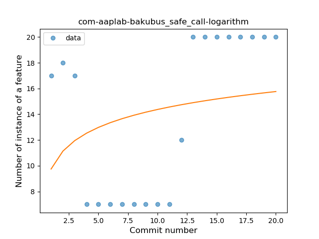
### <a name="unsafe_call">Unsafe Call</a>
----
#### Functions
* **Instability - Polinomial 4:** 
    * **R_Squared:** 0.58188006
* **Instability - Polinomial 3:** )
    * **R_Squared:** 0.44632105
* **Sudden Rise - Exponential:** 
    * **R_Squared:** 0.0360629
* **Constant Rise - Linear:** 
    * **R_Squared:** 0.01781214
* **Sudden Rise Plateau - Logarithm:** 
    * **R_Squared:** -0.0

**Plots** :chart_with_upwards_trend:
-----

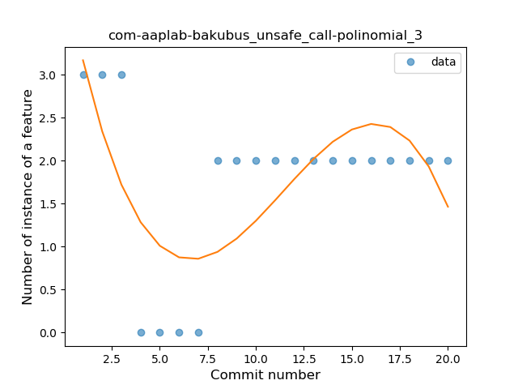
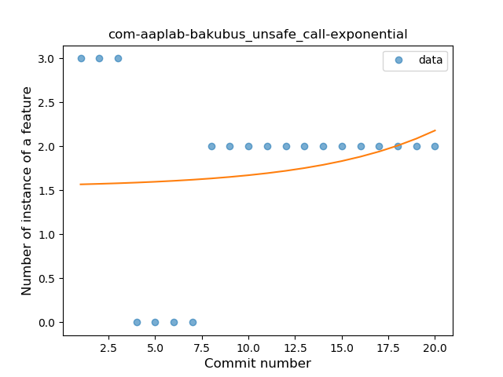
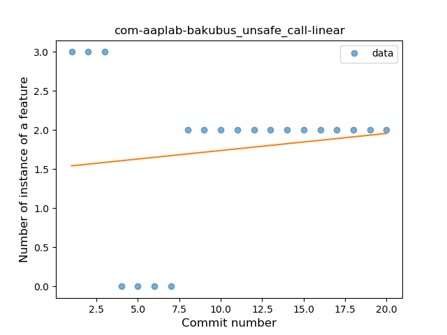
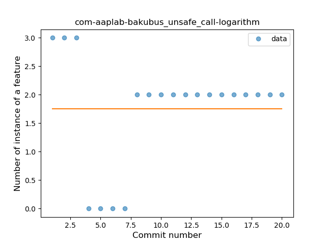
### <a name="range_expr">Range Expression</a>
----
#### Functions
* **Instability - Polinomial 3:** )
    * **R_Squared:** 0.8229566
* **Instability - Polinomial 4:** 
    * **R_Squared:** 0.83169386
* **Sudden Decline - Exponential:** 
    * **R_Squared:** 0.80152106
* **Constant Decline - Linear:** 
    * **R_Squared:** 0.38345865
* **Sudden Rise Plateau - Logarithm:** 
    * **R_Squared:** -0.0

**Plots** :chart_with_upwards_trend:
-----

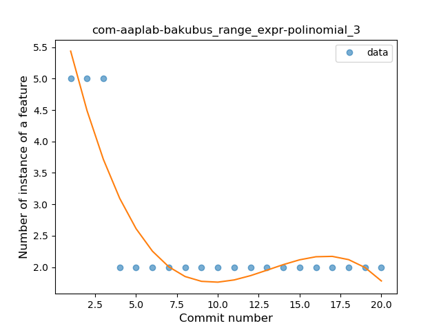
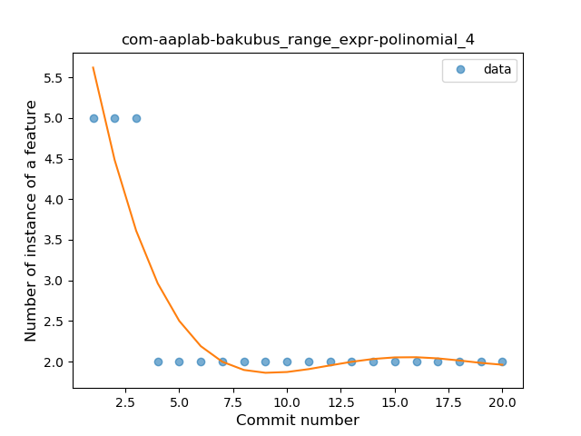
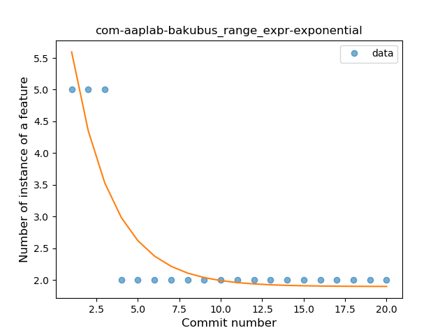
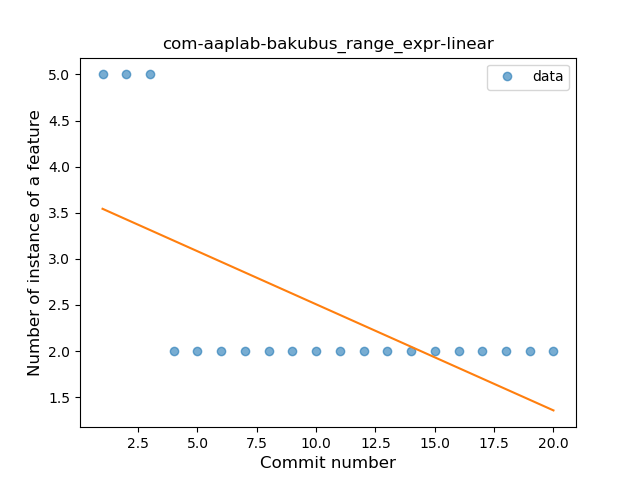
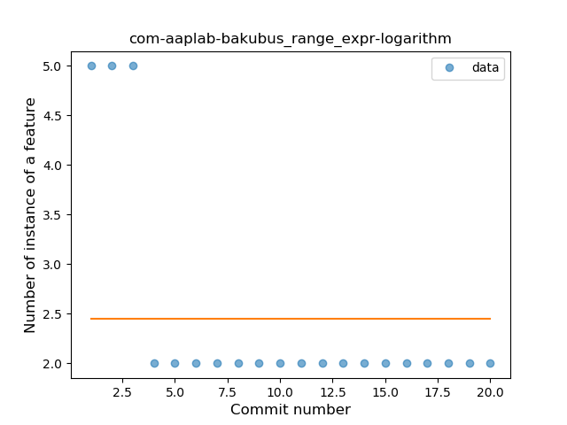
### <a name="property_delegation">Property Delegation</a>
----
#### Functions
* **Plateau Sudden Rise - Binary Sigmoid:** 
    * **R_Squared:** 1.0
* **Instability - Polinomial 3:** )
    * **R_Squared:** 0.8229566
* **Sudden Rise Plateau - Logarithm:** 
    * **R_Squared:** 0.64936939
* **Constant Rise - Linear:** 
    * **R_Squared:** 0.38345865

**Plots** :chart_with_upwards_trend:
-----

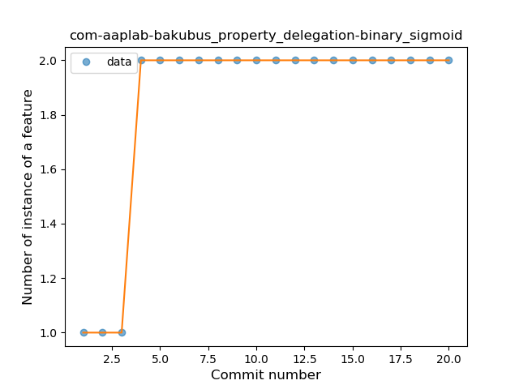
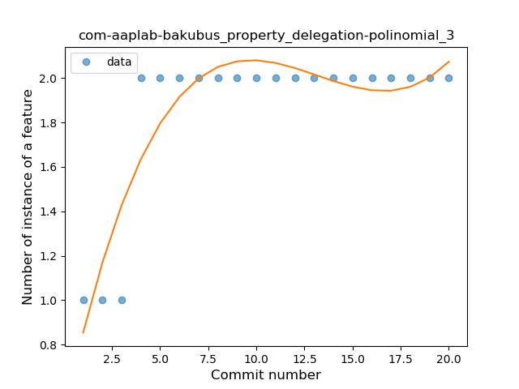
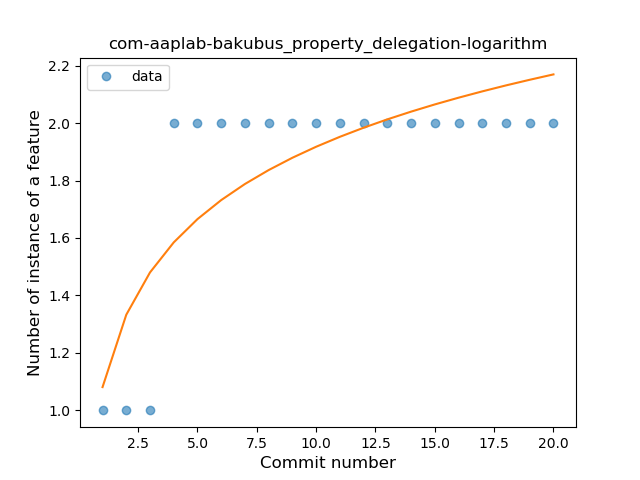
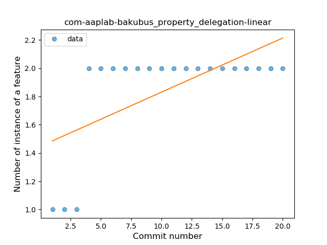
### <a name="destructuring_declaration">Destructuring Declaration</a>
----
#### Functions
* **Instability - Polinomial 3:** )
    * **R_Squared:** 0.8229566
* **Sudden Decline - Exponential:** 
    * **R_Squared:** 0.80152106
* **Constant Decline - Linear:** 
    * **R_Squared:** 0.38345865
* **Sudden Rise Plateau - Logarithm:** 
    * **R_Squared:** -0.0

**Plots** :chart_with_upwards_trend:
-----

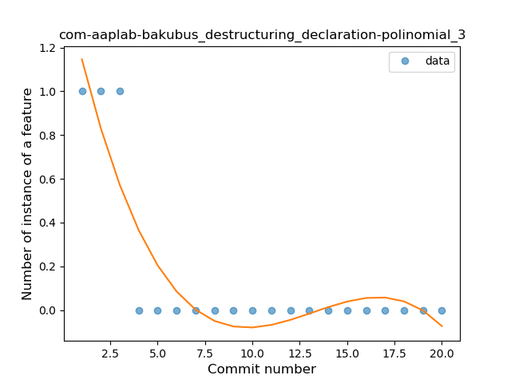
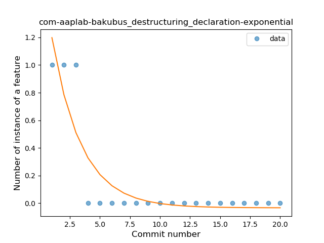
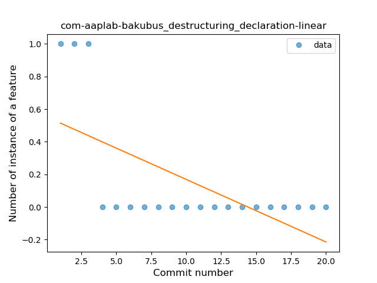
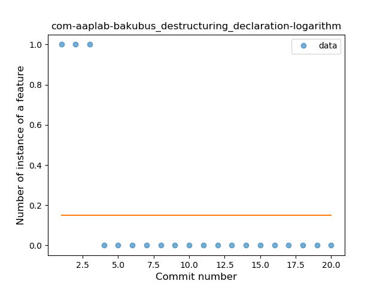
