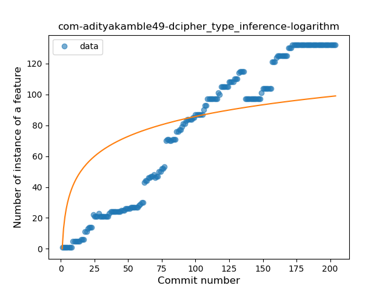
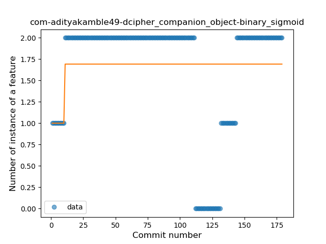

## com-adityakamble49-dcipher
----
#### Metrics provided by Detekt
* Number of lines of code 3177
* Number of Kotlin files: 59
* Cyclomatic complexity: 359
* Cyclomatic complexity by thousands of lines: 259 

----
**11** features analyzed

*	<a href="#type_inference">Type Inference</a> 
*	<a href="#lambda">Lambda</a> 
*	<a href="#safe_call">Safe Call</a> 
*	<a href="#when_expr">When expression</a> 
*	<a href="#companion_object">Companion Object</a> 
*	<a href="#string_template">String Template</a> 
*	<a href="#func_with_default_value">Function with Default Value</a> 
*	<a href="#singleton">Singleton</a> 
*	<a href="#smart_cast">Smart Cast</a> 
*	<a href="#data_class">Data Class</a> 
*	<a href="#extension_function">Extension Function</a> 

### <a name="type_inference">Type Inference</a>
----
#### Functions
* **Constant Rise - Linear:** 
    * **R_Squared:** 0.9530286
* **Plateau Sudden Rise - Binary Sigmoid:** 
    * **R_Squared:** 0.78326366
* **Sudden Rise Plateau - Logarithm:** 
    * **R_Squared:** 0.53729948

**Plots** :chart_with_upwards_trend:
-----

### <a name="lambda">Lambda</a>
----
#### Functions
* **Constant Rise - Linear:** 
    * **R_Squared:** 0.92125379
* **Sudden Rise Plateau - Logarithm:** 
    * **R_Squared:** 0.53995169
* **Plateau Sudden Rise - Binary Sigmoid:** 
    * **R_Squared:** 0.33026329

**Plots** :chart_with_upwards_trend:
-----

### <a name="safe_call">Safe Call</a>
----
#### Functions
* **Constant Rise - Linear:** 
    * **R_Squared:** 0.93586449
* **Sudden Rise Plateau - Logarithm:** 
    * **R_Squared:** 0.57107473
* **Plateau Sudden Rise - Binary Sigmoid:** 
    * **R_Squared:** 0.33653788

**Plots** :chart_with_upwards_trend:
-----

### <a name="when_expr">When expression</a>
----
#### Functions
* **Plateau Gradual Rise - Sigmoid:** 
    * **R_Squared:** 0.98369034
* **Constant Rise - Linear:** 
    * **R_Squared:** 0.91595289
* **Sudden Rise Plateau - Logarithm:** 
    * **R_Squared:** 0.70463241

**Plots** :chart_with_upwards_trend:
-----

### <a name="companion_object">Companion Object</a>
----
#### Functions
* **Plateau Sudden Rise - Binary Sigmoid:** 
    * **R_Squared:** 0.05619536
* **Constant Decline - Linear:** 
    * **R_Squared:** 0.02521022
* **Sudden Decline - Exponential:** 
    * **R_Squared:** 0.02654077
* **Sudden Rise Plateau - Logarithm:** 
    * **R_Squared:** 0.0

**Plots** :chart_with_upwards_trend:
-----

### <a name="string_template">String Template</a>
----
#### Functions
* **Plateau Gradual Rise - Sigmoid:** 
    * **R_Squared:** 0.9289057
* **Constant Rise - Linear:** 
    * **R_Squared:** 0.88887173
* **Sudden Rise Plateau - Logarithm:** 
    * **R_Squared:** 0.54502147

**Plots** :chart_with_upwards_trend:
-----

### <a name="func_with_default_value">Function with Default Value</a>
----
#### Functions
* **Plateau Sudden Rise - Binary Sigmoid:** 
    * **R_Squared:** 1.0
* **Sudden Rise - Exponential:** 
    * **R_Squared:** 0.76435007
* **Constant Rise - Linear:** 
    * **R_Squared:** 0.61874268
* **Sudden Rise Plateau - Logarithm:** 
    * **R_Squared:** 0.30674113

**Plots** :chart_with_upwards_trend:
-----

### <a name="singleton">Singleton</a>
----
#### Functions
* **Sudden Rise - Exponential:** 
    * **R_Squared:** 0.13191398
* **Constant Rise - Linear:** 
    * **R_Squared:** 0.06589904
* **Sudden Rise Plateau - Logarithm:** 
    * **R_Squared:** 0.03384833
* **Plateau Sudden Rise - Binary Sigmoid:** 
    * **R_Squared:** 0.03258987

**Plots** :chart_with_upwards_trend:
-----

### <a name="smart_cast">Smart Cast</a>
----
#### Functions
* **Plateau Sudden Rise - Binary Sigmoid:** 
    * **R_Squared:** 0.9269682
* **Sudden Rise Plateau - Logarithm:** 
    * **R_Squared:** 0.53395609
* **Constant Rise - Linear:** 
    * **R_Squared:** 0.17939961

**Plots** :chart_with_upwards_trend:
-----

### <a name="data_class">Data Class</a>
----
#### Functions
* **Plateau Gradual Rise - Sigmoid:** 
    * **R_Squared:** 0.98284601
* **Sudden Rise - Exponential:** 
    * **R_Squared:** 0.82385751
* **Constant Rise - Linear:** 
    * **R_Squared:** 0.62130131
* **Sudden Rise Plateau - Logarithm:** 
    * **R_Squared:** 0.27718051

**Plots** :chart_with_upwards_trend:
-----

### <a name="extension_function">Extension Function</a>
----
#### Functions
* **Plateau Gradual Rise - Sigmoid:** 
    * **R_Squared:** 0.95654716
* **Constant Rise - Linear:** 
    * **R_Squared:** 0.92851701
* **Sudden Rise - Exponential:** 
    * **R_Squared:** 0.92888199
* **Sudden Rise Plateau - Logarithm:** 
    * **R_Squared:** 0.56542433

**Plots** :chart_with_upwards_trend:
-----

