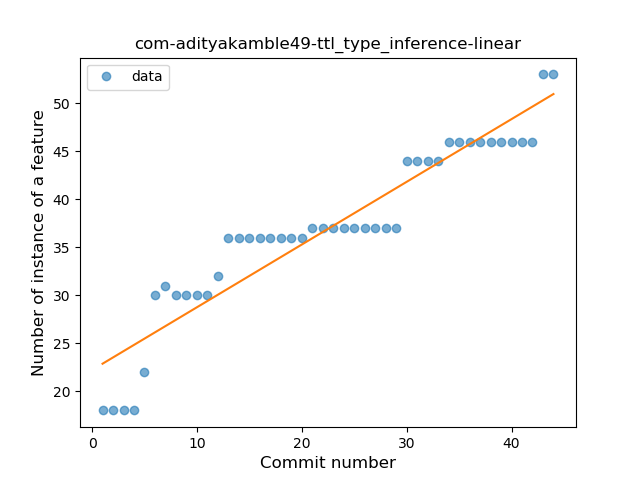
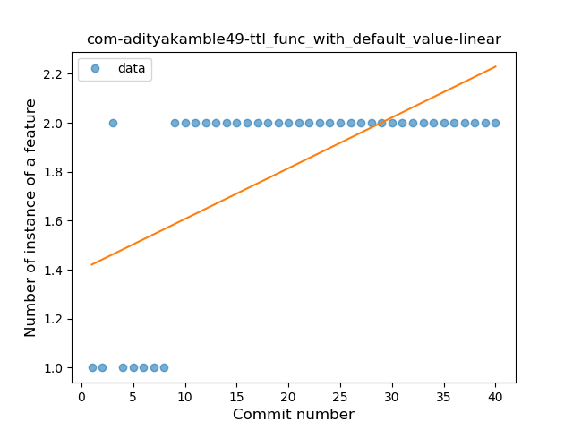
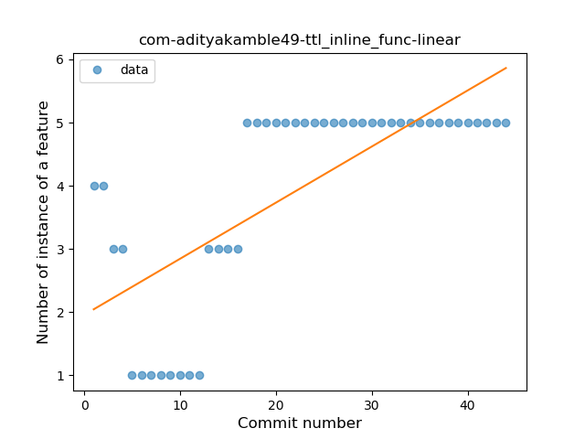

## com-adityakamble49-ttl
----
#### Metrics provided by Detekt
* Number of lines of code 1118
* Number of Kotlin files: 20
* Cyclomatic complexity: 126
* Cyclomatic complexity by thousands of lines: 288 

----
**8** features analyzed

*	<a href="#type_inference">Type Inference</a> 
*	<a href="#lambda">Lambda</a> 
*	<a href="#safe_call">Safe Call</a> 
*	<a href="#when_expr">When expression</a> 
*	<a href="#companion_object">Companion Object</a> 
*	<a href="#func_with_default_value">Function with Default Value</a> 
*	<a href="#extension_function">Extension Function</a> 
*	<a href="#inline_func">Inline Function</a> 

### <a name="type_inference">Type Inference</a>
----
#### Functions
* **Constant Rise - Linear:** 
    * **R_Squared:** 0.88545634
* **Sudden Rise Plateau - Logarithm:** 
    * **R_Squared:** 0.88070276
* **Plateau Sudden Rise - Binary Sigmoid:** 
    * **R_Squared:** 0.5811167

**Plots** :chart_with_upwards_trend:
-----

### <a name="lambda">Lambda</a>
----
#### Functions
* **Instability - Polinomial 3:** )
    * **R_Squared:** 0.97382191
* **Sudden Rise Plateau - Logarithm:** 
    * **R_Squared:** 0.85858253
* **Constant Rise - Linear:** 
    * **R_Squared:** 0.53536961

**Plots** :chart_with_upwards_trend:
-----

### <a name="safe_call">Safe Call</a>
----
#### Functions
* **Plateau Gradual Rise - Sigmoid:** 
    * **R_Squared:** 0.7958883
* **Sudden Rise Plateau - Logarithm:** 
    * **R_Squared:** 0.35459515
* **Constant Rise - Linear:** 
    * **R_Squared:** 0.10575543

**Plots** :chart_with_upwards_trend:
-----

### <a name="when_expr">When expression</a>
----
#### Functions
* **Plateau Sudden Rise - Binary Sigmoid:** 
    * **R_Squared:** 0.88081988
* **Sudden Rise - Exponential:** 
    * **R_Squared:** 0.79538957
* **Constant Rise - Linear:** 
    * **R_Squared:** 0.73298164
* **Sudden Rise Plateau - Logarithm:** 
    * **R_Squared:** 0.5343689

**Plots** :chart_with_upwards_trend:
-----

### <a name="companion_object">Companion Object</a>
----
#### Functions
* **Instability - Polinomial 3:** )
    * **R_Squared:** 0.232717
* **Plateau Gradual Rise - Sigmoid:** 
    * **R_Squared:** 0.17595518
* **Constant Rise - Linear:** 
    * **R_Squared:** 0.1202041
* **Sudden Rise Plateau - Logarithm:** 
    * **R_Squared:** 0.11788744

**Plots** :chart_with_upwards_trend:
-----

### <a name="func_with_default_value">Function with Default Value</a>
----
#### Functions
* **Plateau Sudden Rise - Binary Sigmoid:** 
    * **R_Squared:** 0.84848485
* **Instability - Polinomial 3:** )
    * **R_Squared:** 0.64367193
* **Sudden Rise Plateau - Logarithm:** 
    * **R_Squared:** 0.55902033
* **Constant Rise - Linear:** 
    * **R_Squared:** 0.39668462

**Plots** :chart_with_upwards_trend:
-----

### <a name="extension_function">Extension Function</a>
----
#### Functions
* **Plateau Gradual Rise - Sigmoid:** 
    * **R_Squared:** 0.93555889
* **Instability - Polinomial 4:** 
    * **R_Squared:** 0.85126466
* **Constant Rise - Linear:** 
    * **R_Squared:** 0.59395865
* **Sudden Rise Plateau - Logarithm:** 
    * **R_Squared:** 0.56767559

**Plots** :chart_with_upwards_trend:
-----

### <a name="inline_func">Inline Function</a>
----
#### Functions
* **Plateau Gradual Rise - Sigmoid:** 
    * **R_Squared:** 0.81029015
* **Instability - Polinomial 3:** )
    * **R_Squared:** 0.68160213
* **Constant Rise - Linear:** 
    * **R_Squared:** 0.52819643
* **Sudden Rise Plateau - Logarithm:** 
    * **R_Squared:** 0.38254924

**Plots** :chart_with_upwards_trend:
-----

