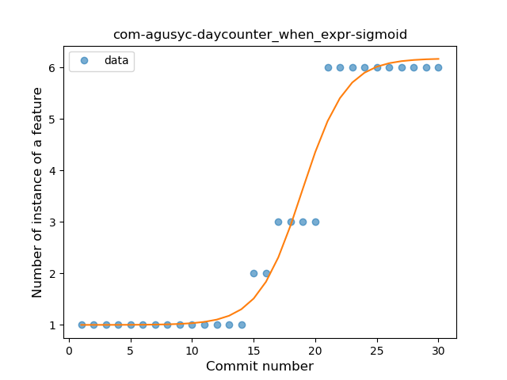
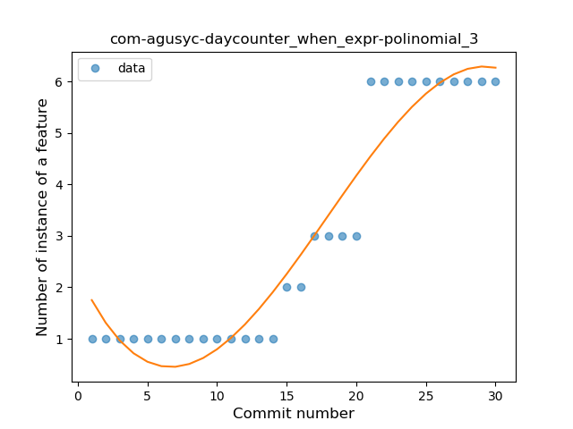
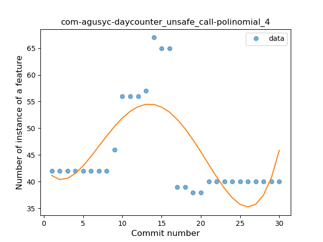
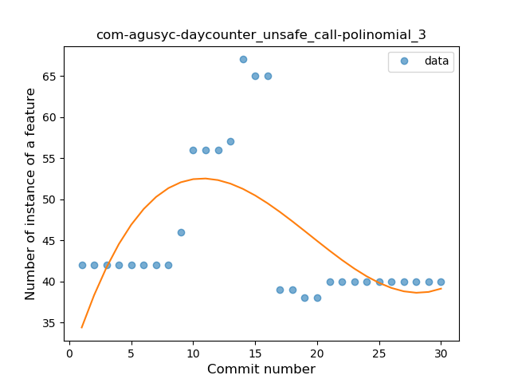

## com-agusyc-daycounter
----
#### Metrics provided by Detekt
* Number of lines of code 1700
* Number of Kotlin files: 14
* Cyclomatic complexity: 206
* Cyclomatic complexity by thousands of lines: 225 

----
**8** features analyzed

*	<a href="#type_inference">Type Inference</a> 
*	<a href="#lambda">Lambda</a> 
*	<a href="#when_expr">When expression</a> 
*	<a href="#unsafe_call">Unsafe Call</a> 
*	<a href="#companion_object">Companion Object</a> 
*	<a href="#string_template">String Template</a> 
*	<a href="#range_expr">Range Expression</a> 
*	<a href="#smart_cast">Smart Cast</a> 

### <a name="type_inference">Type Inference</a>
----
#### Functions
* **Constant Rise - Linear:** 
    * **R_Squared:** 0.91884269
* **Sudden Rise Plateau - Logarithm:** 
    * **R_Squared:** 0.76850493

**Plots** :chart_with_upwards_trend:
-----

### <a name="lambda">Lambda</a>
----
#### Functions
* **Instability - Polinomial 4:** 
    * **R_Squared:** 0.77666415
* **Sudden Rise - Exponential:** 
    * **R_Squared:** 0.67229543
* **Constant Rise - Linear:** 
    * **R_Squared:** 0.6133769
* **Sudden Rise Plateau - Logarithm:** 
    * **R_Squared:** 0.39322201

**Plots** :chart_with_upwards_trend:
-----

### <a name="when_expr">When expression</a>
----
#### Functions
* **Plateau Gradual Rise - Sigmoid:** 
    * **R_Squared:** 0.96768592
* **Instability - Polinomial 4:** 
    * **R_Squared:** 0.9584814
* **Instability - Polinomial 3:** )
    * **R_Squared:** 0.93029921
* **Sudden Rise - Exponential:** 
    * **R_Squared:** 0.86218533
* **Constant Rise - Linear:** 
    * **R_Squared:** 0.82546974
* **Sudden Rise Plateau - Logarithm:** 
    * **R_Squared:** 0.47185045

**Plots** :chart_with_upwards_trend:
-----

### <a name="unsafe_call">Unsafe Call</a>
----
#### Functions
* **Instability - Polinomial 4:** 
    * **R_Squared:** 0.51400034
* **Instability - Polinomial 3:** )
    * **R_Squared:** 0.38344551
* **Constant Decline - Linear:** 
    * **R_Squared:** 0.05560227
* **Sudden Decline - Exponential:** 
    * **R_Squared:** 0.0
* **Sudden Rise Plateau - Logarithm:** 
    * **R_Squared:** -0.0

**Plots** :chart_with_upwards_trend:
-----

### <a name="companion_object">Companion Object</a>
----
#### Functions
* **Plateau Sudden Rise - Binary Sigmoid:** 
    * **R_Squared:** 1.0
* **Instability - Polinomial 4:** 
    * **R_Squared:** 0.87066344
* **Sudden Rise Plateau - Logarithm:** 
    * **R_Squared:** 0.69682923
* **Constant Rise - Linear:** 
    * **R_Squared:** 0.63070078

**Plots** :chart_with_upwards_trend:
-----

### <a name="string_template">String Template</a>
----
#### Functions
* **Plateau Sudden Rise - Binary Sigmoid:** 
    * **R_Squared:** 0.78835472
* **Instability - Polinomial 4:** 
    * **R_Squared:** 0.688066
* **Instability - Polinomial 3:** )
    * **R_Squared:** 0.63823975
* **Sudden Rise - Exponential:** 
    * **R_Squared:** 0.49250206
* **Constant Rise - Linear:** 
    * **R_Squared:** 0.16770959
* **Sudden Rise Plateau - Logarithm:** 
    * **R_Squared:** 0.05191953

**Plots** :chart_with_upwards_trend:
-----

### <a name="range_expr">Range Expression</a>
----
#### Functions
* **Plateau Sudden Rise - Binary Sigmoid:** 
    * **R_Squared:** 1.0
* **Instability - Polinomial 3:** )
    * **R_Squared:** 0.85784148
* **Constant Rise - Linear:** 
    * **R_Squared:** 0.74749722
* **Sudden Rise - Exponential:** 
    * **R_Squared:** 0.75122157
* **Sudden Rise Plateau - Logarithm:** 
    * **R_Squared:** 0.5341234

**Plots** :chart_with_upwards_trend:
-----

### <a name="smart_cast">Smart Cast</a>
----
#### Functions
* **Instability - Polinomial 4:** 
    * **R_Squared:** 0.26913578
* **Plateau Gradual Rise - Sigmoid:** 
    * **R_Squared:** 0.08446704
* **Constant Decline - Linear:** 
    * **R_Squared:** 0.00037078
* **Sudden Decline - Exponential:** 
    * **R_Squared:** 0.00036341
* **Sudden Rise Plateau - Logarithm:** 
    * **R_Squared:** 0.0075499

**Plots** :chart_with_upwards_trend:
-----

