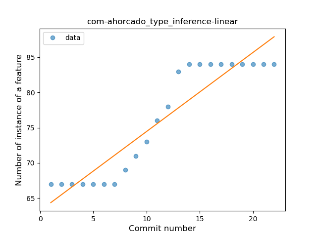
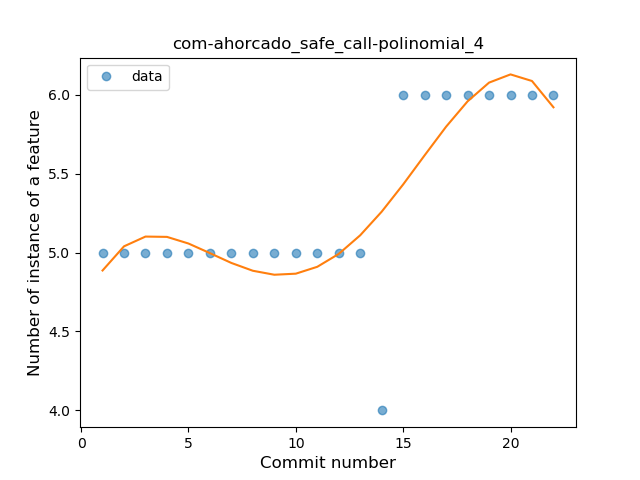

## com-ahorcado
----
#### Metrics provided by Detekt
* Number of lines of code 619
* Number of Kotlin files: 8
* Cyclomatic complexity: 81
* Cyclomatic complexity by thousands of lines: 221 

----
**7** features analyzed

*	<a href="#type_inference">Type Inference</a> 
*	<a href="#lambda">Lambda</a> 
*	<a href="#safe_call">Safe Call</a> 
*	<a href="#when_expr">When expression</a> 
*	<a href="#unsafe_call">Unsafe Call</a> 
*	<a href="#string_template">String Template</a> 
*	<a href="#range_expr">Range Expression</a> 

### <a name="type_inference">Type Inference</a>
----
#### Functions
* **Instability - Polinomial 3:** )
    * **R_Squared:** 0.96890846
* **Instability - Polinomial 4:** 
    * **R_Squared:** 0.97283926
* **Constant Rise - Linear:** 
    * **R_Squared:** 0.87179739
* **Sudden Rise Plateau - Logarithm:** 
    * **R_Squared:** 0.72222405

**Plots** :chart_with_upwards_trend:
-----

### <a name="lambda">Lambda</a>
----
#### Functions
* **Instability - Polinomial 3:** )
    * **R_Squared:** 0.88297235
* **Instability - Polinomial 4:** 
    * **R_Squared:** 0.88909347
* **Constant Decline - Linear:** 
    * **R_Squared:** 0.75405514
* **Sudden Rise Plateau - Logarithm:** 
    * **R_Squared:** -0.0

**Plots** :chart_with_upwards_trend:
-----

### <a name="safe_call">Safe Call</a>
----
#### Functions
* **Instability - Polinomial 4:** 
    * **R_Squared:** 0.66808807
* **Sudden Rise - Exponential:** 
    * **R_Squared:** 0.56005952
* **Constant Rise - Linear:** 
    * **R_Squared:** 0.47726041
* **Sudden Rise Plateau - Logarithm:** 
    * **R_Squared:** 0.28323815

**Plots** :chart_with_upwards_trend:
-----

### <a name="when_expr">When expression</a>
----
#### Functions
* **Plateau Gradual Rise - Sigmoid:** 
    * **R_Squared:** 0.43031649
* **Constant Rise - Linear:** 
    * **R_Squared:** 0.40928205
* **Sudden Rise Plateau - Logarithm:** 
    * **R_Squared:** 0.3862226

**Plots** :chart_with_upwards_trend:
-----

### <a name="unsafe_call">Unsafe Call</a>
----
#### Functions
* **Instability - Polinomial 3:** )
    * **R_Squared:** 0.90735506
* **Instability - Polinomial 4:** 
    * **R_Squared:** 0.90739757
* **Sudden Rise Plateau - Logarithm:** 
    * **R_Squared:** 0.73602212
* **Constant Rise - Linear:** 
    * **R_Squared:** 0.49083541

**Plots** :chart_with_upwards_trend:
-----

### <a name="string_template">String Template</a>
----
#### Functions
* **Instability - Polinomial 4:** 
    * **R_Squared:** 0.87879599
* **Sudden Decline - Exponential:** 
    * **R_Squared:** 0.7635816
* **Constant Decline - Linear:** 
    * **R_Squared:** 0.65217391
* **Sudden Rise Plateau - Logarithm:** 
    * **R_Squared:** 0.0

**Plots** :chart_with_upwards_trend:
-----

### <a name="range_expr">Range Expression</a>
----
#### Functions
* **Plateau Sudden Rise - Binary Sigmoid:** 
    * **R_Squared:** 1.0
* **Instability - Polinomial 3:** )
    * **R_Squared:** 0.85657077
* **Constant Rise - Linear:** 
    * **R_Squared:** 0.74534161
* **Sudden Rise Plateau - Logarithm:** 
    * **R_Squared:** 0.61989034

**Plots** :chart_with_upwards_trend:
-----

