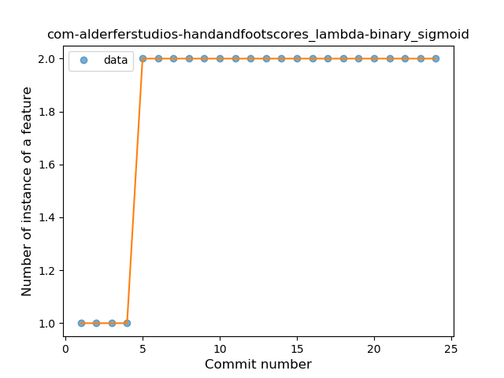
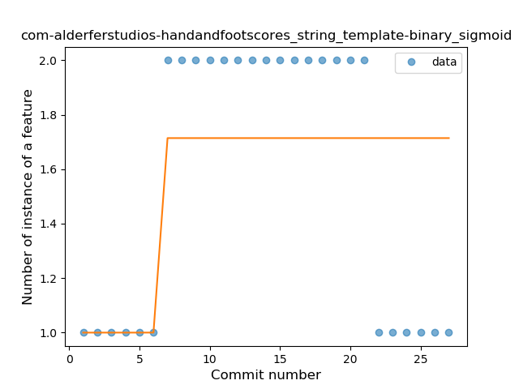

## com-alderferstudios-handandfootscores
----
#### Metrics provided by Detekt
* Number of lines of code 1285
* Number of Kotlin files: 8
* Cyclomatic complexity: 173
* Cyclomatic complexity by thousands of lines: 317 

----
**8** features analyzed

*	<a href="#type_inference">Type Inference</a> 
*	<a href="#lambda">Lambda</a> 
*	<a href="#safe_call">Safe Call</a> 
*	<a href="#when_expr">When expression</a> 
*	<a href="#unsafe_call">Unsafe Call</a> 
*	<a href="#companion_object">Companion Object</a> 
*	<a href="#string_template">String Template</a> 
*	<a href="#data_class">Data Class</a> 

### <a name="type_inference">Type Inference</a>
----
#### Functions
* **Instability - Polinomial 4:** 
    * **R_Squared:** 0.88636495
* **Instability - Polinomial 3:** )
    * **R_Squared:** 0.85923685
* **Sudden Rise Plateau - Logarithm:** 
    * **R_Squared:** 0.64714795
* **Constant Rise - Linear:** 
    * **R_Squared:** 0.33478169

**Plots** :chart_with_upwards_trend:
-----

### <a name="lambda">Lambda</a>
----
#### Functions
* **Plateau Sudden Rise - Binary Sigmoid:** 
    * **R_Squared:** 1.0
* **Instability - Polinomial 3:** )
    * **R_Squared:** 0.82281004
* **Sudden Rise Plateau - Logarithm:** 
    * **R_Squared:** 0.67015248
* **Constant Rise - Linear:** 
    * **R_Squared:** 0.4173913

**Plots** :chart_with_upwards_trend:
-----

### <a name="safe_call">Safe Call</a>
----
#### Functions
* **Instability - Polinomial 4:** 
    * **R_Squared:** 0.84847026
* **Instability - Polinomial 3:** )
    * **R_Squared:** 0.79234465
* **Sudden Rise Plateau - Logarithm:** 
    * **R_Squared:** 0.6412638
* **Constant Rise - Linear:** 
    * **R_Squared:** 0.34988326

**Plots** :chart_with_upwards_trend:
-----

### <a name="when_expr">When expression</a>
----
#### Functions
* **Plateau Sudden Rise - Binary Sigmoid:** 
    * **R_Squared:** 1.0
* **Instability - Polinomial 3:** )
    * **R_Squared:** 0.77906404
* **Sudden Rise Plateau - Logarithm:** 
    * **R_Squared:** 0.59017497
* **Constant Rise - Linear:** 
    * **R_Squared:** 0.2967033

**Plots** :chart_with_upwards_trend:
-----

### <a name="unsafe_call">Unsafe Call</a>
----
#### Functions
* **Plateau Sudden Rise - Binary Sigmoid:** 
    * **R_Squared:** 1.0
* **Instability - Polinomial 4:** 
    * **R_Squared:** 0.8358096
* **Instability - Polinomial 3:** )
    * **R_Squared:** 0.80133104
* **Sudden Rise Plateau - Logarithm:** 
    * **R_Squared:** 0.61398982
* **Constant Rise - Linear:** 
    * **R_Squared:** 0.32869565

**Plots** :chart_with_upwards_trend:
-----

### <a name="companion_object">Companion Object</a>
----
#### Functions
* **Plateau Sudden Rise - Binary Sigmoid:** 
    * **R_Squared:** 1.0
* **Instability - Polinomial 3:** )
    * **R_Squared:** 0.77906404
* **Sudden Rise Plateau - Logarithm:** 
    * **R_Squared:** 0.59017497
* **Constant Rise - Linear:** 
    * **R_Squared:** 0.2967033

**Plots** :chart_with_upwards_trend:
-----

### <a name="string_template">String Template</a>
----
#### Functions
* **Plateau Sudden Rise - Binary Sigmoid:** 
    * **R_Squared:** 0.35714286
* **Sudden Rise Plateau - Logarithm:** 
    * **R_Squared:** 0.07025167
* **Constant Decline - Linear:** 
    * **R_Squared:** 0.0
* **Sudden Decline - Exponential:** 
    * **R_Squared:** -0.0

**Plots** :chart_with_upwards_trend:
-----

### <a name="data_class">Data Class</a>
----
#### Functions
* **Sudden Decline - Exponential:** 
    * **R_Squared:** 1.0
* **Instability - Polinomial 4:** 
    * **R_Squared:** 0.75119617
* **Instability - Polinomial 3:** )
    * **R_Squared:** 0.57894737
* **Constant Decline - Linear:** 
    * **R_Squared:** 0.15789474
* **Sudden Rise Plateau - Logarithm:** 
    * **R_Squared:** -0.0

**Plots** :chart_with_upwards_trend:
-----

