## com-amar-NoteDirector
----
#### Metrics provided by Detekt
* Number of lines of code 7181
* Number of Kotlin files: 41
* Cyclomatic complexity: 1447
* Cyclomatic complexity by thousands of lines: 328 

----
**8** features analyzed

*	<a href="#type_inference">Type Inference</a> 
*	<a href="#lambda">Lambda</a> 
*	<a href="#safe_call">Safe Call</a> 
*	<a href="#when_expr">When expression</a> 
*	<a href="#unsafe_call">Unsafe Call</a> 
*	<a href="#singleton">Singleton</a> 
*	<a href="#range_expr">Range Expression</a> 
*	<a href="#func_call_with_named_arg">Function call with Named Argument</a> 

### <a name="type_inference">Type Inference</a>
----
#### Functions
* **Instability - Polinomial 3:** )
    * **R_Squared:** 0.55565863
* **Instability - Polinomial 4:** 
    * **R_Squared:** 0.55694306
* **Constant Decline - Linear:** 
    * **R_Squared:** 0.09642857
* **Sudden Rise - Exponential:** 
    * **R_Squared:** 0.04125627
* **Sudden Rise Plateau - Logarithm:** 
    * **R_Squared:** -0.0

**Plots** :chart_with_upwards_trend:
-----

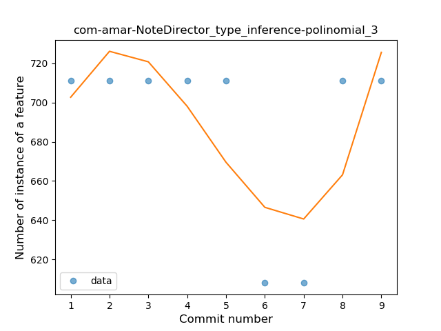

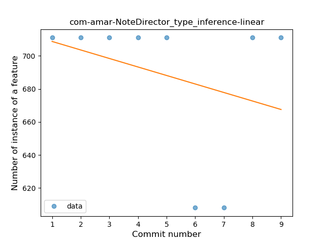
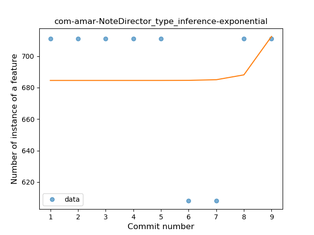
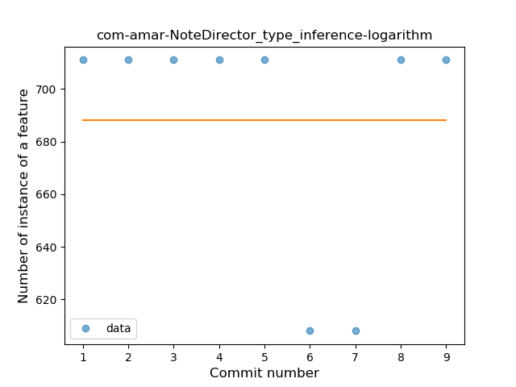
### <a name="lambda">Lambda</a>
----
#### Functions
* **Instability - Polinomial 3:** )
    * **R_Squared:** 0.55565863
* **Instability - Polinomial 4:** 
    * **R_Squared:** 0.55694306
* **Constant Decline - Linear:** 
    * **R_Squared:** 0.09642857
* **Sudden Rise Plateau - Logarithm:** 
    * **R_Squared:** -0.0

**Plots** :chart_with_upwards_trend:
-----

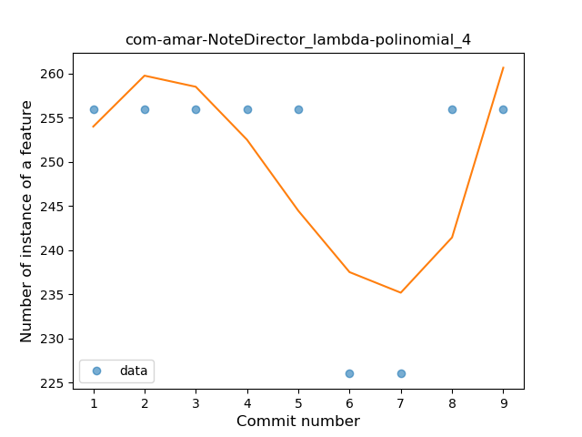

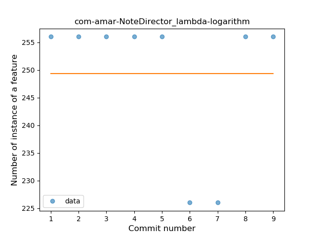
### <a name="safe_call">Safe Call</a>
----
#### Functions
* **Instability - Polinomial 3:** )
    * **R_Squared:** 0.55565863
* **Instability - Polinomial 4:** 
    * **R_Squared:** 0.55694306
* **Constant Decline - Linear:** 
    * **R_Squared:** 0.09642857
* **Sudden Rise Plateau - Logarithm:** 
    * **R_Squared:** -0.0

**Plots** :chart_with_upwards_trend:
-----

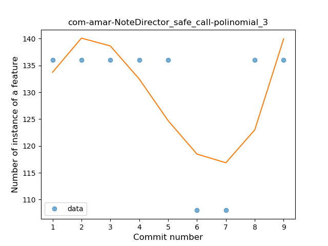
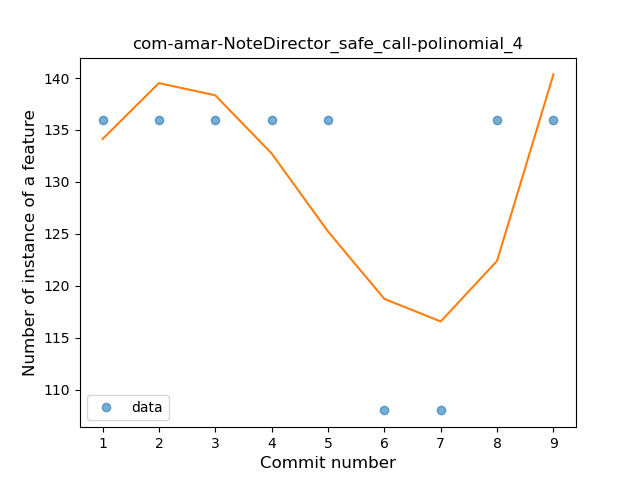

### <a name="when_expr">When expression</a>
----
#### Functions
* **Instability - Polinomial 3:** )
    * **R_Squared:** 0.55565863
* **Instability - Polinomial 4:** 
    * **R_Squared:** 0.55694306
* **Sudden Decline - Exponential:** 
    * **R_Squared:** 0.1419872
* **Constant Decline - Linear:** 
    * **R_Squared:** 0.09642857
* **Sudden Rise Plateau - Logarithm:** 
    * **R_Squared:** -0.0

**Plots** :chart_with_upwards_trend:
-----

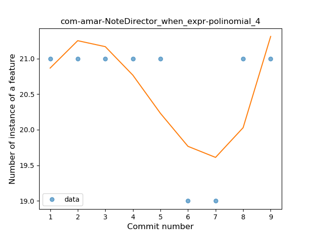
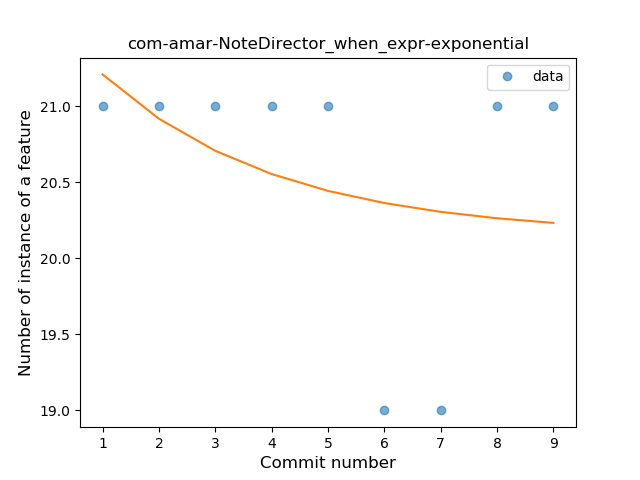
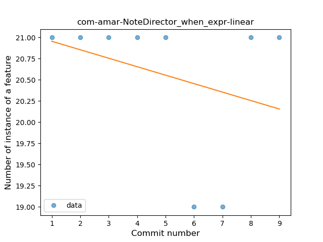
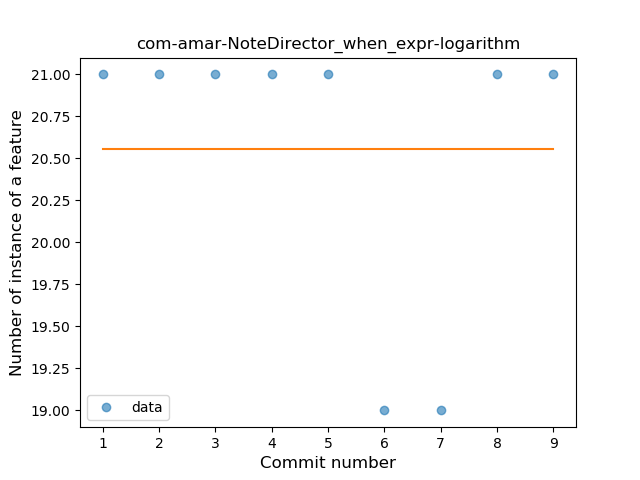
### <a name="unsafe_call">Unsafe Call</a>
----
#### Functions
* **Instability - Polinomial 3:** )
    * **R_Squared:** 0.55565863
* **Instability - Polinomial 4:** 
    * **R_Squared:** 0.55694306
* **Sudden Decline - Exponential:** 
    * **R_Squared:** 0.14198719
* **Constant Decline - Linear:** 
    * **R_Squared:** 0.09642857
* **Sudden Rise Plateau - Logarithm:** 
    * **R_Squared:** -0.0

**Plots** :chart_with_upwards_trend:
-----

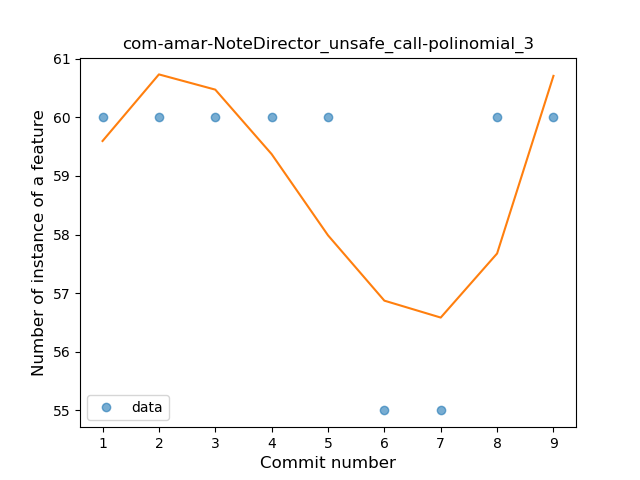

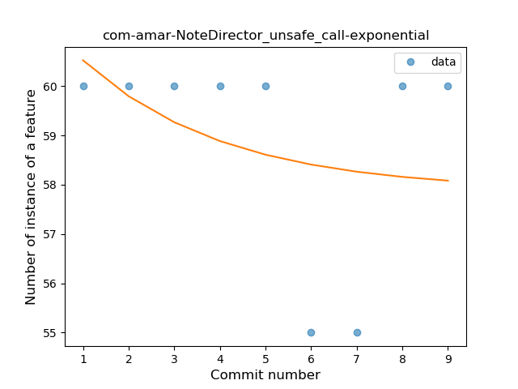
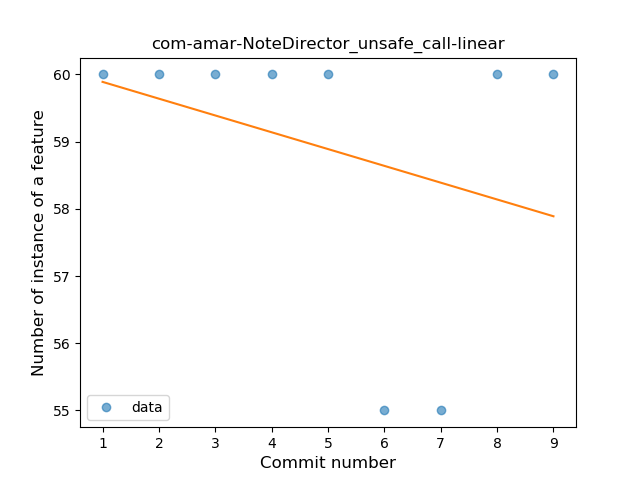
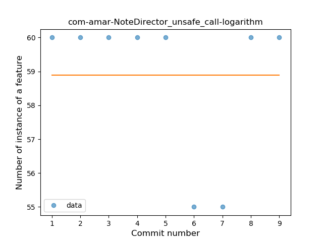
### <a name="singleton">Singleton</a>
----
#### Functions
* **Instability - Polinomial 3:** )
    * **R_Squared:** 0.55565863
* **Instability - Polinomial 4:** 
    * **R_Squared:** 0.55694306
* **Sudden Decline - Exponential:** 
    * **R_Squared:** 0.14198719
* **Constant Decline - Linear:** 
    * **R_Squared:** 0.09642857
* **Sudden Rise Plateau - Logarithm:** 
    * **R_Squared:** -0.0

**Plots** :chart_with_upwards_trend:
-----

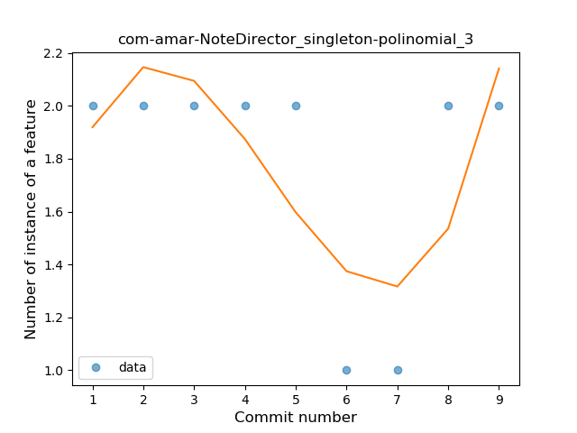

### <a name="range_expr">Range Expression</a>
----
#### Functions
* **Instability - Polinomial 3:** )
    * **R_Squared:** 0.55565863
* **Instability - Polinomial 4:** 
    * **R_Squared:** 0.55694306
* **Sudden Decline - Exponential:** 
    * **R_Squared:** 0.14198719
* **Constant Decline - Linear:** 
    * **R_Squared:** 0.09642857
* **Sudden Rise Plateau - Logarithm:** 
    * **R_Squared:** -0.0

**Plots** :chart_with_upwards_trend:
-----

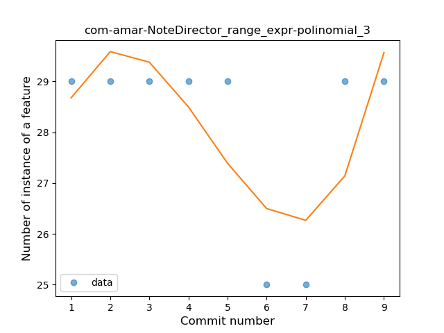
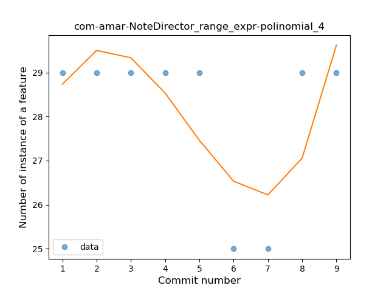
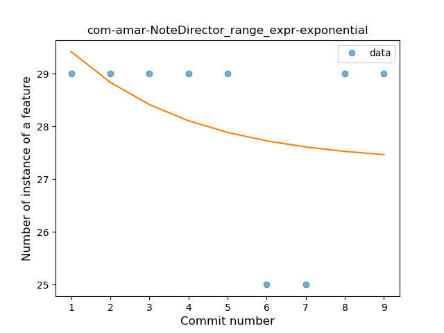
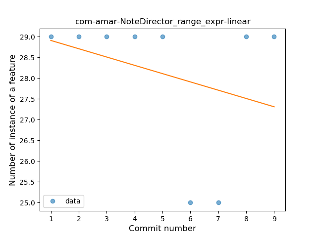

### <a name="func_call_with_named_arg">Function call with Named Argument</a>
----
#### Functions
* **Instability - Polinomial 3:** )
    * **R_Squared:** 0.55565863
* **Instability - Polinomial 4:** 
    * **R_Squared:** 0.55694306
* **Sudden Decline - Exponential:** 
    * **R_Squared:** 0.1419872
* **Constant Decline - Linear:** 
    * **R_Squared:** 0.09642857
* **Sudden Rise Plateau - Logarithm:** 
    * **R_Squared:** -0.0

**Plots** :chart_with_upwards_trend:
-----

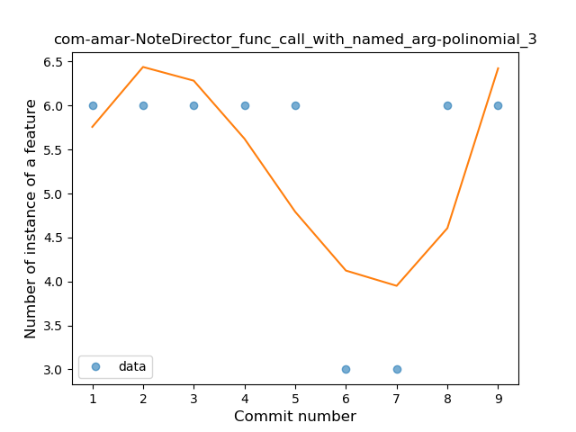

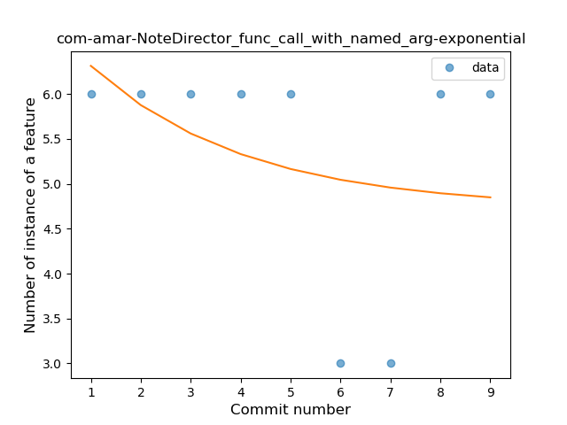
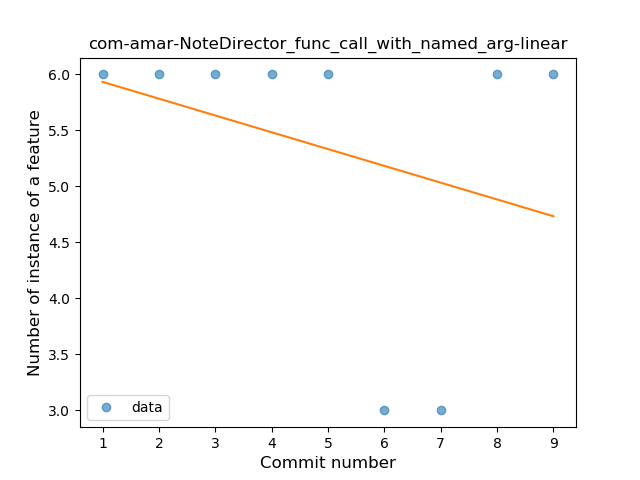
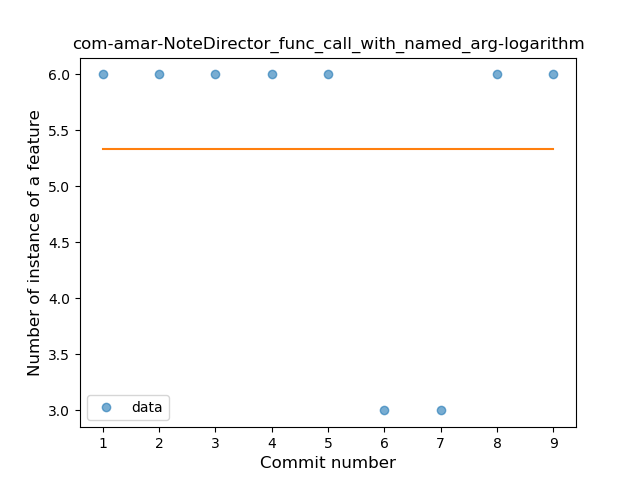
