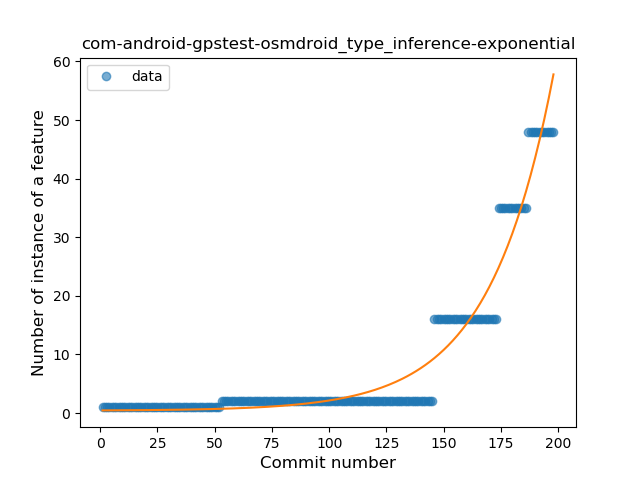

## com-android-gpstest-osmdroid
----
#### Metrics provided by Detekt
* Number of lines of code 485
* Number of Kotlin files: 6
* Cyclomatic complexity: 32
* Cyclomatic complexity by thousands of lines: 140 

----
**3** features analyzed

*	<a href="#type_inference">Type Inference</a> 
*	<a href="#companion_object">Companion Object</a> 
*	<a href="#data_class">Data Class</a> 

### <a name="type_inference">Type Inference</a>
----
#### Functions
* **Sudden Rise - Exponential:** 
    * **R_Squared:** 0.94619834
* **Constant Rise - Linear:** 
    * **R_Squared:** 0.54597238
* **Sudden Rise Plateau - Logarithm:** 
    * **R_Squared:** 0.12735673

**Plots** :chart_with_upwards_trend:
-----

### <a name="companion_object">Companion Object</a>
----
#### Functions
* **Plateau Sudden Rise - Binary Sigmoid:** 
    * **R_Squared:** 1.0
* **Sudden Rise Plateau - Logarithm:** 
    * **R_Squared:** 0.66380325
* **Constant Rise - Linear:** 
    * **R_Squared:** 0.58097595

**Plots** :chart_with_upwards_trend:
-----

### <a name="data_class">Data Class</a>
----
#### Functions
* **Plateau Sudden Rise - Binary Sigmoid:** 
    * **R_Squared:** 1.0
* **Sudden Rise Plateau - Logarithm:** 
    * **R_Squared:** 0.62818419
* **Constant Rise - Linear:** 
    * **R_Squared:** 0.58097595

**Plots** :chart_with_upwards_trend:
-----

