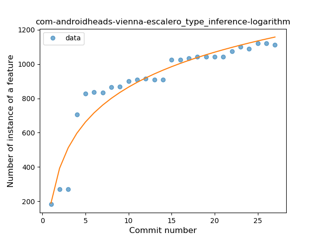
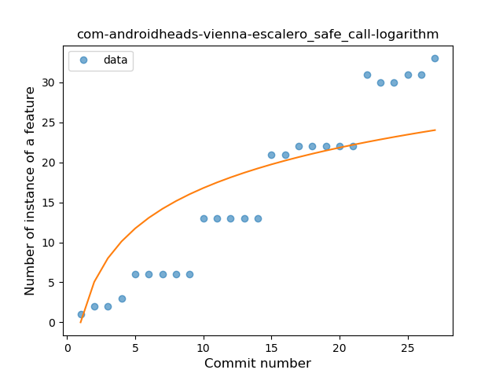

## com-androidheads-vienna-escalero
----
#### Metrics provided by Detekt
* Number of lines of code 14872
* Number of Kotlin files: 20
* Cyclomatic complexity: 2528
* Cyclomatic complexity by thousands of lines: 284 

----
**13** features analyzed

*	<a href="#type_inference">Type Inference</a> 
*	<a href="#lambda">Lambda</a> 
*	<a href="#safe_call">Safe Call</a> 
*	<a href="#when_expr">When expression</a> 
*	<a href="#unsafe_call">Unsafe Call</a> 
*	<a href="#companion_object">Companion Object</a> 
*	<a href="#string_template">String Template</a> 
*	<a href="#func_with_default_value">Function with Default Value</a> 
*	<a href="#range_expr">Range Expression</a> 
*	<a href="#smart_cast">Smart Cast</a> 
*	<a href="#data_class">Data Class</a> 
*	<a href="#destructuring_declaration">Destructuring Declaration</a> 
*	<a href="#coroutine">Coroutine</a> 

### <a name="type_inference">Type Inference</a>
----
#### Functions
* **Sudden Rise Plateau - Logarithm:** 
    * **R_Squared:** 0.9116435
* **Constant Rise - Linear:** 
    * **R_Squared:** 0.69520707

**Plots** :chart_with_upwards_trend:
-----

### <a name="lambda">Lambda</a>
----
#### Functions
* **Constant Rise - Linear:** 
    * **R_Squared:** 0.93912341
* **Sudden Rise Plateau - Logarithm:** 
    * **R_Squared:** 0.84160734

**Plots** :chart_with_upwards_trend:
-----

### <a name="safe_call">Safe Call</a>
----
#### Functions
* **Constant Rise - Linear:** 
    * **R_Squared:** 0.96304397
* **Sudden Rise - Exponential:** 
    * **R_Squared:** 0.96384855
* **Sudden Rise Plateau - Logarithm:** 
    * **R_Squared:** 0.68177818

**Plots** :chart_with_upwards_trend:
-----

### <a name="when_expr">When expression</a>
----
#### Functions
* **Instability - Polinomial 4:** 
    * **R_Squared:** 0.90667659
* **Instability - Polinomial 3:** )
    * **R_Squared:** 0.8541584
* **Sudden Rise Plateau - Logarithm:** 
    * **R_Squared:** 0.75603459
* **Constant Rise - Linear:** 
    * **R_Squared:** 0.45633875

**Plots** :chart_with_upwards_trend:
-----

### <a name="unsafe_call">Unsafe Call</a>
----
#### Functions
* **Instability - Polinomial 3:** )
    * **R_Squared:** 0.90405317
* **Instability - Polinomial 4:** 
    * **R_Squared:** 0.90483269
* **Sudden Rise Plateau - Logarithm:** 
    * **R_Squared:** 0.83288454
* **Constant Rise - Linear:** 
    * **R_Squared:** 0.69483762

**Plots** :chart_with_upwards_trend:
-----

### <a name="companion_object">Companion Object</a>
----
#### Functions
* **Instability - Polinomial 4:** 
    * **R_Squared:** 0.87922342
* **Sudden Rise - Exponential:** 
    * **R_Squared:** 0.82025582
* **Constant Rise - Linear:** 
    * **R_Squared:** 0.56136678
* **Sudden Rise Plateau - Logarithm:** 
    * **R_Squared:** 0.30068317

**Plots** :chart_with_upwards_trend:
-----

### <a name="string_template">String Template</a>
----
#### Functions
* **Sudden Rise Plateau - Logarithm:** 
    * **R_Squared:** 0.91523438
* **Constant Rise - Linear:** 
    * **R_Squared:** 0.83654546

**Plots** :chart_with_upwards_trend:
-----

### <a name="func_with_default_value">Function with Default Value</a>
----
#### Functions
* **Instability - Polinomial 4:** 
    * **R_Squared:** 1.0
* **Sudden Rise - Exponential:** 
    * **R_Squared:** 0.94768404
* **Instability - Polinomial 3:** )
    * **R_Squared:** 0.92582418
* **Constant Rise - Linear:** 
    * **R_Squared:** 0.64615385
* **Sudden Rise Plateau - Logarithm:** 
    * **R_Squared:** 0.48154771

**Plots** :chart_with_upwards_trend:
-----

### <a name="range_expr">Range Expression</a>
----
#### Functions
* **Instability - Polinomial 4:** 
    * **R_Squared:** 0.89413873
* **Instability - Polinomial 3:** )
    * **R_Squared:** 0.8668887
* **Sudden Rise Plateau - Logarithm:** 
    * **R_Squared:** 0.75180446
* **Constant Rise - Linear:** 
    * **R_Squared:** 0.45244297

**Plots** :chart_with_upwards_trend:
-----

### <a name="smart_cast">Smart Cast</a>
----
#### Functions
* **Instability - Polinomial 4:** 
    * **R_Squared:** 0.65897436
* **Instability - Polinomial 3:** )
    * **R_Squared:** 0.48846154
* **Constant Decline - Linear:** 
    * **R_Squared:** 0.125
* **Sudden Rise Plateau - Logarithm:** 
    * **R_Squared:** -0.0

**Plots** :chart_with_upwards_trend:
-----

### <a name="data_class">Data Class</a>
----
#### Functions
* **Instability - Polinomial 4:** 
    * **R_Squared:** 1.0
* **Sudden Rise - Exponential:** 
    * **R_Squared:** 0.94768404
* **Instability - Polinomial 3:** )
    * **R_Squared:** 0.92582418
* **Constant Rise - Linear:** 
    * **R_Squared:** 0.64615385
* **Sudden Rise Plateau - Logarithm:** 
    * **R_Squared:** 0.48154771

**Plots** :chart_with_upwards_trend:
-----

### <a name="destructuring_declaration">Destructuring Declaration</a>
----
#### Functions
* **Instability - Polinomial 4:** 
    * **R_Squared:** 0.88349885
* **Constant Decline - Linear:** 
    * **R_Squared:** 0.64285714
* **Sudden Rise Plateau - Logarithm:** 
    * **R_Squared:** -0.0

**Plots** :chart_with_upwards_trend:
-----

### <a name="coroutine">Coroutine</a>
----
#### Functions
* **Sudden Rise - Exponential:** 
    * **R_Squared:** 0.90691229
* **Constant Rise - Linear:** 
    * **R_Squared:** 0.65522365
* **Sudden Rise Plateau - Logarithm:** 
    * **R_Squared:** 0.3327247

**Plots** :chart_with_upwards_trend:
-----

