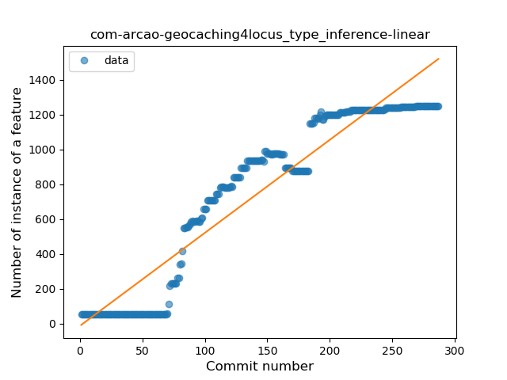
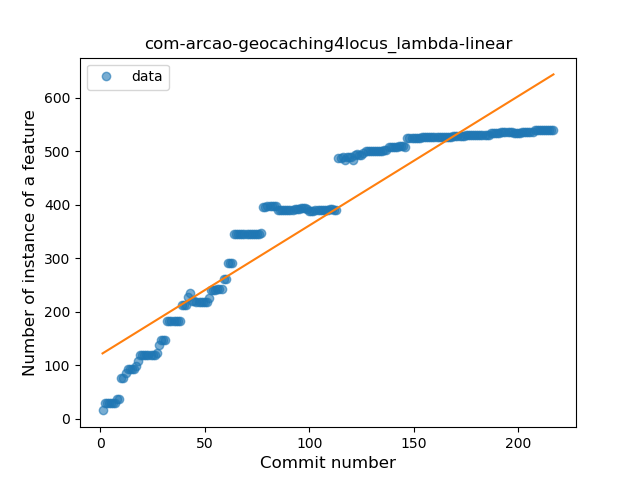
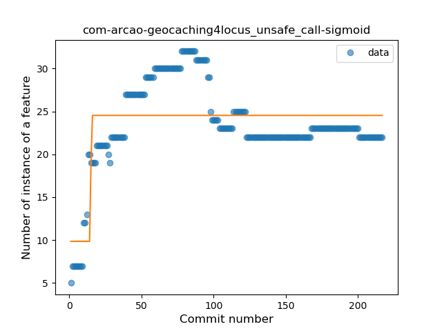
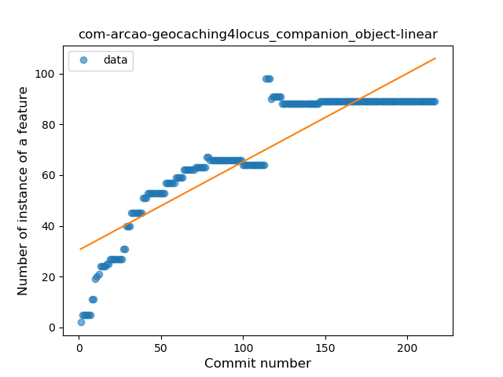
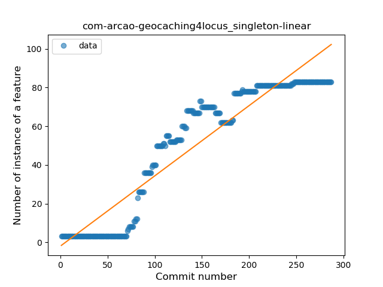
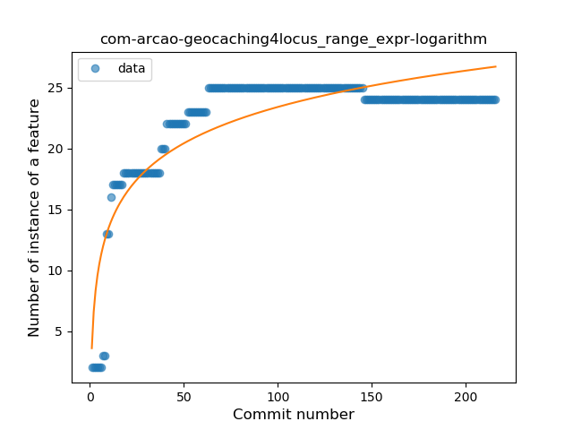
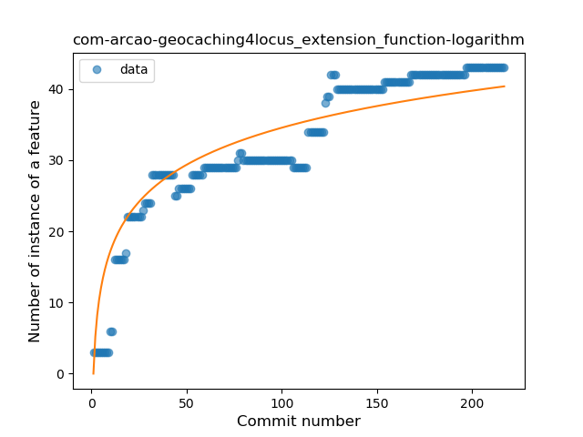
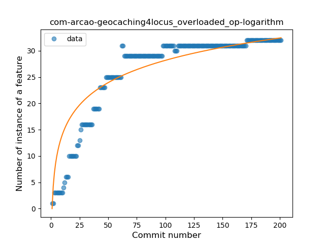

## com-arcao-geocaching4locus
----
#### Metrics provided by Detekt
* Number of lines of code 17636
* Number of Kotlin files: 289
* Cyclomatic complexity: 2230
* Cyclomatic complexity by thousands of lines: 235 

----
**21** features analyzed

*	<a href="#type_inference">Type Inference</a> 
*	<a href="#lambda">Lambda</a> 
*	<a href="#safe_call">Safe Call</a> 
*	<a href="#when_expr">When expression</a> 
*	<a href="#unsafe_call">Unsafe Call</a> 
*	<a href="#companion_object">Companion Object</a> 
*	<a href="#string_template">String Template</a> 
*	<a href="#func_with_default_value">Function with Default Value</a> 
*	<a href="#singleton">Singleton</a> 
*	<a href="#range_expr">Range Expression</a> 
*	<a href="#smart_cast">Smart Cast</a> 
*	<a href="#data_class">Data Class</a> 
*	<a href="#func_call_with_named_arg">Function call with Named Argument</a> 
*	<a href="#extension_function">Extension Function</a> 
*	<a href="#property_delegation">Property Delegation</a> 
*	<a href="#destructuring_declaration">Destructuring Declaration</a> 
*	<a href="#inline_func">Inline Function</a> 
*	<a href="#overloaded_op">Overloaded Operator</a> 
*	<a href="#coroutine">Coroutine</a> 
*	<a href="#sealed_class">Sealed Class</a> 
*	<a href="#contract">Contract</a> 

### <a name="type_inference">Type Inference</a>
----
#### Functions
* **Constant Rise - Linear:** 
    * **R_Squared:** 0.89704658
* **Plateau Sudden Rise - Binary Sigmoid:** 
    * **R_Squared:** 0.83071187
* **Sudden Rise Plateau - Logarithm:** 
    * **R_Squared:** 0.48046798

**Plots** :chart_with_upwards_trend:
-----

### <a name="lambda">Lambda</a>
----
#### Functions
* **Constant Rise - Linear:** 
    * **R_Squared:** 0.88324131
* **Sudden Rise Plateau - Logarithm:** 
    * **R_Squared:** 0.72051559

**Plots** :chart_with_upwards_trend:
-----

### <a name="safe_call">Safe Call</a>
----
#### Functions
* **Constant Rise - Linear:** 
    * **R_Squared:** 0.95270425
* **Sudden Rise Plateau - Logarithm:** 
    * **R_Squared:** 0.66973014
* **Plateau Sudden Rise - Binary Sigmoid:** 
    * **R_Squared:** 0.44871267

**Plots** :chart_with_upwards_trend:
-----

### <a name="when_expr">When expression</a>
----
#### Functions
* **Sudden Rise Plateau - Logarithm:** 
    * **R_Squared:** 0.89200481
* **Constant Rise - Linear:** 
    * **R_Squared:** 0.68582786

**Plots** :chart_with_upwards_trend:
-----

### <a name="unsafe_call">Unsafe Call</a>
----
#### Functions
* **Plateau Gradual Rise - Sigmoid:** 
    * **R_Squared:** 0.50101083
* **Sudden Rise Plateau - Logarithm:** 
    * **R_Squared:** 0.20687624
* **Constant Rise - Linear:** 
    * **R_Squared:** 0.00577896

**Plots** :chart_with_upwards_trend:
-----

### <a name="companion_object">Companion Object</a>
----
#### Functions
* **Constant Rise - Linear:** 
    * **R_Squared:** 0.80918958
* **Sudden Rise Plateau - Logarithm:** 
    * **R_Squared:** 0.80178337
* **Plateau Gradual Rise - Sigmoid:** 
    * **R_Squared:** 0.68217626

**Plots** :chart_with_upwards_trend:
-----

### <a name="string_template">String Template</a>
----
#### Functions
* **Sudden Rise Plateau - Logarithm:** 
    * **R_Squared:** 0.46919074
* **Constant Rise - Linear:** 
    * **R_Squared:** 0.36885055
* **Plateau Sudden Rise - Binary Sigmoid:** 
    * **R_Squared:** 0.02511887

**Plots** :chart_with_upwards_trend:
-----

### <a name="func_with_default_value">Function with Default Value</a>
----
#### Functions
* **Constant Rise - Linear:** 
    * **R_Squared:** 0.89655588
* **Sudden Rise Plateau - Logarithm:** 
    * **R_Squared:** 0.45394087
* **Plateau Gradual Rise - Sigmoid:** 
    * **R_Squared:** 0.41831222

**Plots** :chart_with_upwards_trend:
-----

### <a name="singleton">Singleton</a>
----
#### Functions
* **Constant Rise - Linear:** 
    * **R_Squared:** 0.880165
* **Plateau Gradual Rise - Sigmoid:** 
    * **R_Squared:** 0.86796316
* **Sudden Rise Plateau - Logarithm:** 
    * **R_Squared:** 0.46430236

**Plots** :chart_with_upwards_trend:
-----

### <a name="range_expr">Range Expression</a>
----
#### Functions
* **Sudden Rise Plateau - Logarithm:** 
    * **R_Squared:** 0.75891851
* **Plateau Sudden Rise - Binary Sigmoid:** 
    * **R_Squared:** 0.63210692
* **Constant Rise - Linear:** 
    * **R_Squared:** 0.34244267

**Plots** :chart_with_upwards_trend:
-----

### <a name="smart_cast">Smart Cast</a>
----
#### Functions
* **Sudden Rise Plateau - Logarithm:** 
    * **R_Squared:** 0.82742004
* **Plateau Gradual Rise - Sigmoid:** 
    * **R_Squared:** 0.79558623
* **Constant Rise - Linear:** 
    * **R_Squared:** 0.65617164

**Plots** :chart_with_upwards_trend:
-----

### <a name="data_class">Data Class</a>
----
#### Functions
* **Constant Rise - Linear:** 
    * **R_Squared:** 0.82279987
* **Sudden Rise Plateau - Logarithm:** 
    * **R_Squared:** 0.63205857
* **Plateau Sudden Rise - Binary Sigmoid:** 
    * **R_Squared:** 0.38347167

**Plots** :chart_with_upwards_trend:
-----

### <a name="func_call_with_named_arg">Function call with Named Argument</a>
----
#### Functions
* **Constant Rise - Linear:** 
    * **R_Squared:** 0.92177468
* **Plateau Gradual Rise - Sigmoid:** 
    * **R_Squared:** 0.72207581
* **Sudden Rise Plateau - Logarithm:** 
    * **R_Squared:** 0.48169628

**Plots** :chart_with_upwards_trend:
-----

### <a name="extension_function">Extension Function</a>
----
#### Functions
* **Sudden Rise Plateau - Logarithm:** 
    * **R_Squared:** 0.85467645
* **Constant Rise - Linear:** 
    * **R_Squared:** 0.81650936

**Plots** :chart_with_upwards_trend:
-----

### <a name="property_delegation">Property Delegation</a>
----
#### Functions
* **Constant Rise - Linear:** 
    * **R_Squared:** 0.84481222
* **Sudden Rise Plateau - Logarithm:** 
    * **R_Squared:** 0.81682359
* **Plateau Gradual Rise - Sigmoid:** 
    * **R_Squared:** 0.55985316

**Plots** :chart_with_upwards_trend:
-----

### <a name="destructuring_declaration">Destructuring Declaration</a>
----
#### Functions
* **Plateau Gradual Rise - Sigmoid:** 
    * **R_Squared:** 0.97625465
* **Constant Rise - Linear:** 
    * **R_Squared:** 0.8156732
* **Sudden Rise Plateau - Logarithm:** 
    * **R_Squared:** 0.75334908

**Plots** :chart_with_upwards_trend:
-----

### <a name="inline_func">Inline Function</a>
----
#### Functions
* **Sudden Rise Plateau - Logarithm:** 
    * **R_Squared:** 0.68718212
* **Plateau Sudden Rise - Binary Sigmoid:** 
    * **R_Squared:** 0.61518419
* **Constant Rise - Linear:** 
    * **R_Squared:** 0.3707375

**Plots** :chart_with_upwards_trend:
-----

### <a name="overloaded_op">Overloaded Operator</a>
----
#### Functions
* **Sudden Rise Plateau - Logarithm:** 
    * **R_Squared:** 0.83226984
* **Constant Rise - Linear:** 
    * **R_Squared:** 0.65905792

**Plots** :chart_with_upwards_trend:
-----

### <a name="coroutine">Coroutine</a>
----
#### Functions
* **Constant Rise - Linear:** 
    * **R_Squared:** 0.87015085
* **Sudden Rise Plateau - Logarithm:** 
    * **R_Squared:** 0.84305453
* **Plateau Gradual Rise - Sigmoid:** 
    * **R_Squared:** 0.63986376

**Plots** :chart_with_upwards_trend:
-----

### <a name="sealed_class">Sealed Class</a>
----
#### Functions
* **Sudden Rise Plateau - Logarithm:** 
    * **R_Squared:** 0.83316506
* **Constant Rise - Linear:** 
    * **R_Squared:** 0.63849781

**Plots** :chart_with_upwards_trend:
-----

### <a name="contract">Contract</a>
----
#### Functions
* **Plateau Sudden Rise - Binary Sigmoid:** 
    * **R_Squared:** 1.0
* **Sudden Rise Plateau - Logarithm:** 
    * **R_Squared:** 0.6719052
* **Constant Rise - Linear:** 
    * **R_Squared:** 0.46448692

**Plots** :chart_with_upwards_trend:
-----

