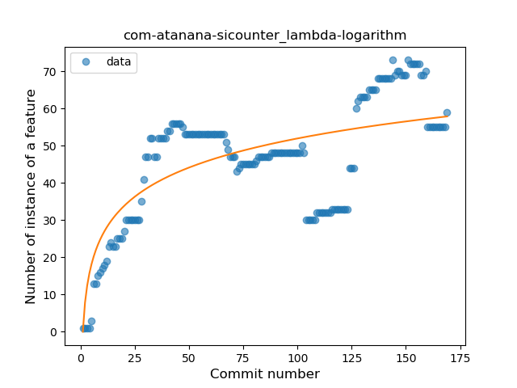
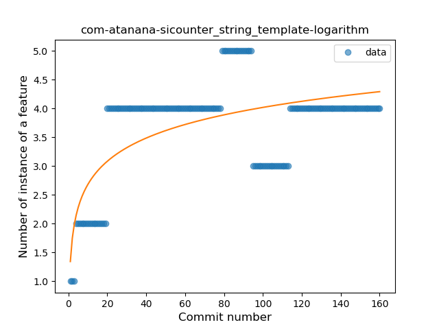

## com-atanana-sicounter
----
#### Metrics provided by Detekt
* Number of lines of code 1095
* Number of Kotlin files: 28
* Cyclomatic complexity: 135
* Cyclomatic complexity by thousands of lines: 241 

----
**15** features analyzed

*	<a href="#type_inference">Type Inference</a> 
*	<a href="#lambda">Lambda</a> 
*	<a href="#safe_call">Safe Call</a> 
*	<a href="#when_expr">When expression</a> 
*	<a href="#unsafe_call">Unsafe Call</a> 
*	<a href="#companion_object">Companion Object</a> 
*	<a href="#string_template">String Template</a> 
*	<a href="#singleton">Singleton</a> 
*	<a href="#smart_cast">Smart Cast</a> 
*	<a href="#data_class">Data Class</a> 
*	<a href="#func_call_with_named_arg">Function call with Named Argument</a> 
*	<a href="#extension_function">Extension Function</a> 
*	<a href="#property_delegation">Property Delegation</a> 
*	<a href="#destructuring_declaration">Destructuring Declaration</a> 
*	<a href="#coroutine">Coroutine</a> 

### <a name="type_inference">Type Inference</a>
----
#### Functions
* **Sudden Rise Plateau - Logarithm:** 
    * **R_Squared:** 0.48666255
* **Constant Rise - Linear:** 
    * **R_Squared:** 0.21230687
* **Plateau Sudden Rise - Binary Sigmoid:** 
    * **R_Squared:** 0.00141556

**Plots** :chart_with_upwards_trend:
-----

### <a name="lambda">Lambda</a>
----
#### Functions
* **Instability - Polinomial 3:** )
    * **R_Squared:** 0.65106463
* **Sudden Rise Plateau - Logarithm:** 
    * **R_Squared:** 0.55080496
* **Plateau Gradual Rise - Sigmoid:** 
    * **R_Squared:** 0.49852034
* **Constant Rise - Linear:** 
    * **R_Squared:** 0.42312918

**Plots** :chart_with_upwards_trend:
-----

### <a name="safe_call">Safe Call</a>
----
#### Functions
* **Plateau Gradual Rise - Sigmoid:** 
    * **R_Squared:** 0.1772252
* **Constant Decline - Linear:** 
    * **R_Squared:** 0.13603861
* **Sudden Rise Plateau - Logarithm:** 
    * **R_Squared:** 0.00077237

**Plots** :chart_with_upwards_trend:
-----

### <a name="when_expr">When expression</a>
----
#### Functions
* **Plateau Gradual Rise - Sigmoid:** 
    * **R_Squared:** 0.61871959
* **Sudden Rise Plateau - Logarithm:** 
    * **R_Squared:** 0.41069829
* **Constant Rise - Linear:** 
    * **R_Squared:** 0.18941985

**Plots** :chart_with_upwards_trend:
-----

### <a name="unsafe_call">Unsafe Call</a>
----
#### Functions
* **Plateau Sudden Decline - Binary Sigmoid:** 
    * **R_Squared:** 0.37937853
* **Sudden Decline - Exponential:** 
    * **R_Squared:** 0.16232889
* **Constant Decline - Linear:** 
    * **R_Squared:** 0.07263923
* **Sudden Rise Plateau - Logarithm:** 
    * **R_Squared:** -0.0

**Plots** :chart_with_upwards_trend:
-----

### <a name="companion_object">Companion Object</a>
----
#### Functions
* **Plateau Gradual Rise - Sigmoid:** 
    * **R_Squared:** 0.5206402
* **Sudden Rise Plateau - Logarithm:** 
    * **R_Squared:** 0.42676964
* **Constant Rise - Linear:** 
    * **R_Squared:** 0.28154629

**Plots** :chart_with_upwards_trend:
-----

### <a name="string_template">String Template</a>
----
#### Functions
* **Plateau Sudden Rise - Binary Sigmoid:** 
    * **R_Squared:** 0.67132423
* **Sudden Rise Plateau - Logarithm:** 
    * **R_Squared:** 0.4231379
* **Constant Rise - Linear:** 
    * **R_Squared:** 0.16910272

**Plots** :chart_with_upwards_trend:
-----

### <a name="singleton">Singleton</a>
----
#### Functions
* **Constant Decline - Linear:** 
    * **R_Squared:** 0.64293112
* **Plateau Sudden Decline - Binary Sigmoid:** 
    * **R_Squared:** 0.59454821
* **Sudden Rise Plateau - Logarithm:** 
    * **R_Squared:** 0.0

**Plots** :chart_with_upwards_trend:
-----

### <a name="smart_cast">Smart Cast</a>
----
#### Functions
* **Constant Decline - Linear:** 
    * **R_Squared:** 0.2039939
* **Sudden Rise Plateau - Logarithm:** 
    * **R_Squared:** -0.0

**Plots** :chart_with_upwards_trend:
-----

### <a name="data_class">Data Class</a>
----
#### Functions
* **Plateau Gradual Rise - Sigmoid:** 
    * **R_Squared:** 0.67746966
* **Sudden Rise Plateau - Logarithm:** 
    * **R_Squared:** 0.58205331
* **Constant Rise - Linear:** 
    * **R_Squared:** 0.32042541

**Plots** :chart_with_upwards_trend:
-----

### <a name="func_call_with_named_arg">Function call with Named Argument</a>
----
#### Functions
* **Plateau Sudden Rise - Binary Sigmoid:** 
    * **R_Squared:** 0.56581583
* **Sudden Rise Plateau - Logarithm:** 
    * **R_Squared:** 0.20694062
* **Constant Rise - Linear:** 
    * **R_Squared:** 0.01264956

**Plots** :chart_with_upwards_trend:
-----

### <a name="extension_function">Extension Function</a>
----
#### Functions
* **Plateau Sudden Rise - Binary Sigmoid:** 
    * **R_Squared:** 1.0
* **Instability - Polinomial 4:** 
    * **R_Squared:** 0.85201976
* **Instability - Polinomial 3:** )
    * **R_Squared:** 0.82282913
* **Sudden Rise Plateau - Logarithm:** 
    * **R_Squared:** 0.61739235
* **Constant Rise - Linear:** 
    * **R_Squared:** 0.34821429

**Plots** :chart_with_upwards_trend:
-----

### <a name="property_delegation">Property Delegation</a>
----
#### Functions
* **Constant Decline - Linear:** 
    * **R_Squared:** 0.19653158
* **Sudden Rise Plateau - Logarithm:** 
    * **R_Squared:** -0.0

**Plots** :chart_with_upwards_trend:
-----

### <a name="destructuring_declaration">Destructuring Declaration</a>
----
#### Functions
* **Plateau Gradual Rise - Sigmoid:** 
    * **R_Squared:** 0.95195891
* **Sudden Rise - Exponential:** 
    * **R_Squared:** 0.87219029
* **Constant Rise - Linear:** 
    * **R_Squared:** 0.68335586
* **Sudden Rise Plateau - Logarithm:** 
    * **R_Squared:** 0.39880934

**Plots** :chart_with_upwards_trend:
-----

### <a name="coroutine">Coroutine</a>
----
#### Functions
* **Instability - Polinomial 4:** 
    * **R_Squared:** 0.96074326
* **Instability - Polinomial 3:** )
    * **R_Squared:** 0.94825646
* **Sudden Rise Plateau - Logarithm:** 
    * **R_Squared:** 0.7115527
* **Constant Rise - Linear:** 
    * **R_Squared:** 0.37974002

**Plots** :chart_with_upwards_trend:
-----

