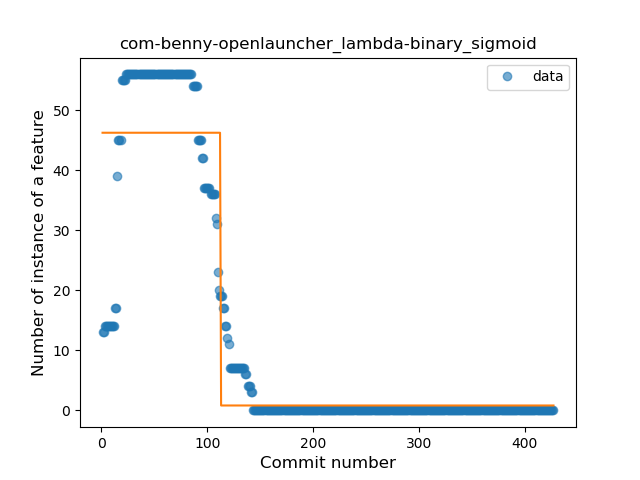
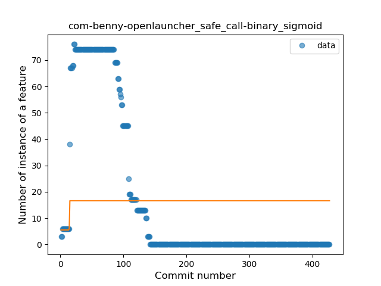
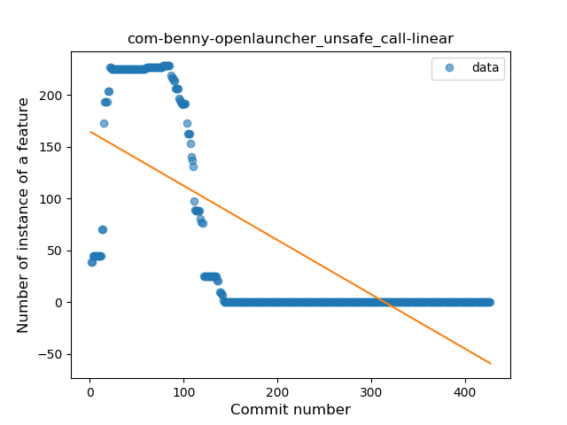
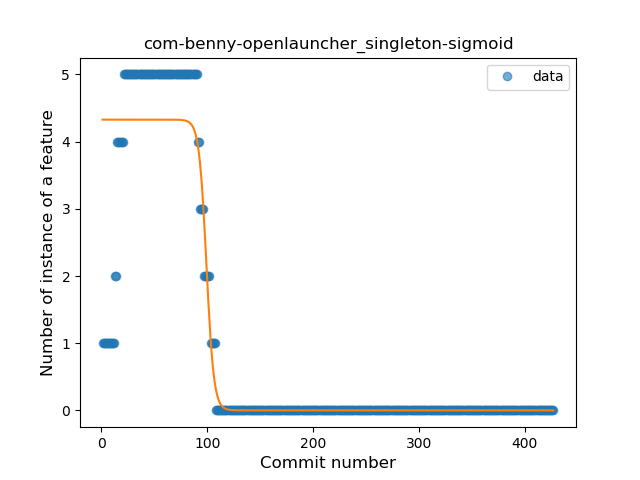
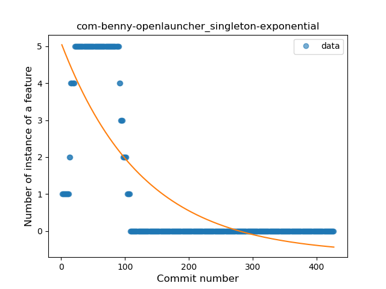
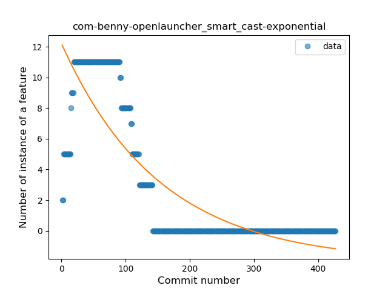
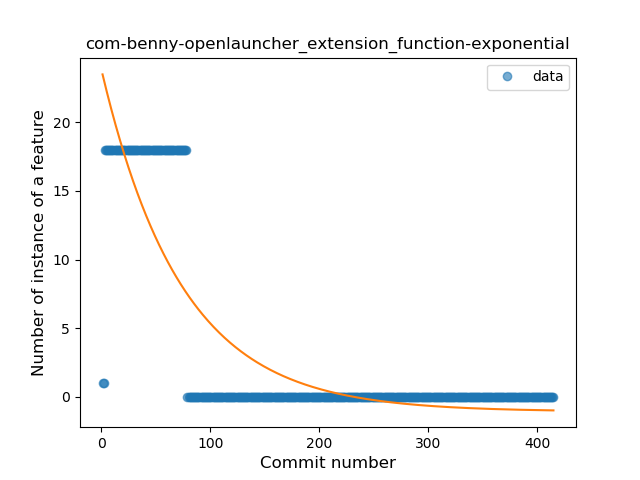

## com-benny-openlauncher
----
#### Metrics provided by Detekt
* Number of lines of code 0
* Number of Kotlin files: 0
* Cyclomatic complexity: 0
* Cyclomatic complexity by thousands of lines: 0 

----
**13** features analyzed

*	<a href="#type_inference">Type Inference</a> 
*	<a href="#lambda">Lambda</a> 
*	<a href="#safe_call">Safe Call</a> 
*	<a href="#when_expr">When expression</a> 
*	<a href="#unsafe_call">Unsafe Call</a> 
*	<a href="#companion_object">Companion Object</a> 
*	<a href="#func_with_default_value">Function with Default Value</a> 
*	<a href="#singleton">Singleton</a> 
*	<a href="#range_expr">Range Expression</a> 
*	<a href="#smart_cast">Smart Cast</a> 
*	<a href="#data_class">Data Class</a> 
*	<a href="#extension_function">Extension Function</a> 
*	<a href="#destructuring_declaration">Destructuring Declaration</a> 

### <a name="type_inference">Type Inference</a>
----
#### Functions
* **Constant Decline - Linear:** 
    * **R_Squared:** 0.53220576
* **Sudden Decline - Exponential:** 
    * **R_Squared:** 0.0
* **Sudden Rise Plateau - Logarithm:** 
    * **R_Squared:** -0.0

**Plots** :chart_with_upwards_trend:
-----

### <a name="lambda">Lambda</a>
----
#### Functions
* **Plateau Sudden Decline - Binary Sigmoid:** 
    * **R_Squared:** 0.86308918
* **Sudden Decline - Exponential:** 
    * **R_Squared:** 0.65073247
* **Constant Decline - Linear:** 
    * **R_Squared:** 0.53667164
* **Sudden Rise Plateau - Logarithm:** 
    * **R_Squared:** 0.0

**Plots** :chart_with_upwards_trend:
-----

### <a name="safe_call">Safe Call</a>
----
#### Functions
* **Sudden Decline - Exponential:** 
    * **R_Squared:** 0.58937966
* **Constant Decline - Linear:** 
    * **R_Squared:** 0.49493957
* **Sudden Rise Plateau - Logarithm:** 
    * **R_Squared:** -0.0
* **Plateau Sudden Rise - Binary Sigmoid:** 
    * **R_Squared:** 0.00480136

**Plots** :chart_with_upwards_trend:
-----

### <a name="when_expr">When expression</a>
----
#### Functions
* **Sudden Decline - Exponential:** 
    * **R_Squared:** 0.59882591
* **Constant Decline - Linear:** 
    * **R_Squared:** 0.51703778
* **Sudden Rise Plateau - Logarithm:** 
    * **R_Squared:** -0.0

**Plots** :chart_with_upwards_trend:
-----

### <a name="unsafe_call">Unsafe Call</a>
----
#### Functions
* **Constant Decline - Linear:** 
    * **R_Squared:** 0.5289138
* **Sudden Rise - Exponential:** 
    * **R_Squared:** 0.0
* **Sudden Rise Plateau - Logarithm:** 
    * **R_Squared:** -0.0

**Plots** :chart_with_upwards_trend:
-----

### <a name="companion_object">Companion Object</a>
----
#### Functions
* **Sudden Decline - Exponential:** 
    * **R_Squared:** 0.66128439
* **Constant Decline - Linear:** 
    * **R_Squared:** 0.57941612
* **Sudden Rise Plateau - Logarithm:** 
    * **R_Squared:** 0.0

**Plots** :chart_with_upwards_trend:
-----

### <a name="func_with_default_value">Function with Default Value</a>
----
#### Functions
* **Sudden Decline - Exponential:** 
    * **R_Squared:** 0.60701086
* **Constant Decline - Linear:** 
    * **R_Squared:** 0.51602181
* **Sudden Rise Plateau - Logarithm:** 
    * **R_Squared:** 0.0
* **Plateau Sudden Rise - Binary Sigmoid:** 
    * **R_Squared:** 0.00110484

**Plots** :chart_with_upwards_trend:
-----

### <a name="singleton">Singleton</a>
----
#### Functions
* **Plateau Gradual Decline - Sigmoid:** 
    * **R_Squared:** 0.88200112
* **Sudden Decline - Exponential:** 
    * **R_Squared:** 0.59536714
* **Constant Decline - Linear:** 
    * **R_Squared:** 0.46150151
* **Sudden Rise Plateau - Logarithm:** 
    * **R_Squared:** -0.0

**Plots** :chart_with_upwards_trend:
-----

### <a name="range_expr">Range Expression</a>
----
#### Functions
* **Sudden Decline - Exponential:** 
    * **R_Squared:** 0.71707435
* **Constant Decline - Linear:** 
    * **R_Squared:** 0.55387574
* **Sudden Rise Plateau - Logarithm:** 
    * **R_Squared:** -0.0

**Plots** :chart_with_upwards_trend:
-----

### <a name="smart_cast">Smart Cast</a>
----
#### Functions
* **Sudden Decline - Exponential:** 
    * **R_Squared:** 0.71435997
* **Constant Decline - Linear:** 
    * **R_Squared:** 0.59684704
* **Plateau Sudden Decline - Binary Sigmoid:** 
    * **R_Squared:** 0.18846541
* **Sudden Rise Plateau - Logarithm:** 
    * **R_Squared:** -0.0

**Plots** :chart_with_upwards_trend:
-----

### <a name="data_class">Data Class</a>
----
#### Functions
* **Sudden Decline - Exponential:** 
    * **R_Squared:** 0.77058145
* **Constant Decline - Linear:** 
    * **R_Squared:** 0.46938063
* **Plateau Sudden Decline - Binary Sigmoid:** 
    * **R_Squared:** 0.26855213
* **Sudden Rise Plateau - Logarithm:** 
    * **R_Squared:** 0.0

**Plots** :chart_with_upwards_trend:
-----

### <a name="extension_function">Extension Function</a>
----
#### Functions
* **Sudden Decline - Exponential:** 
    * **R_Squared:** 0.72653143
* **Plateau Sudden Decline - Binary Sigmoid:** 
    * **R_Squared:** 0.59724142
* **Constant Decline - Linear:** 
    * **R_Squared:** 0.44008544
* **Sudden Rise Plateau - Logarithm:** 
    * **R_Squared:** -0.0

**Plots** :chart_with_upwards_trend:
-----

### <a name="destructuring_declaration">Destructuring Declaration</a>
----
#### Functions
* **Plateau Sudden Decline - Binary Sigmoid:** 
    * **R_Squared:** 1.0
* **Sudden Decline - Exponential:** 
    * **R_Squared:** 0.77464209
* **Constant Decline - Linear:** 
    * **R_Squared:** 0.51897418
* **Sudden Rise Plateau - Logarithm:** 
    * **R_Squared:** -0.0

**Plots** :chart_with_upwards_trend:
-----

