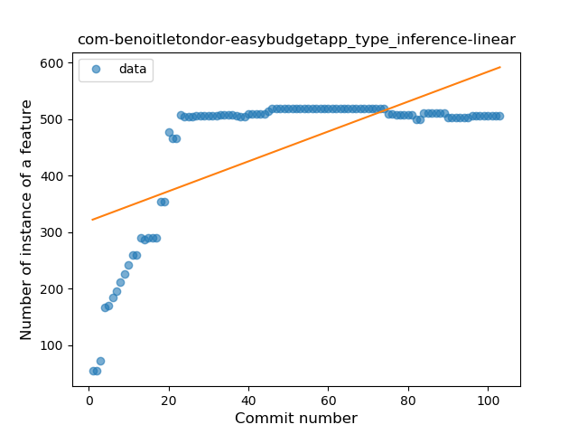
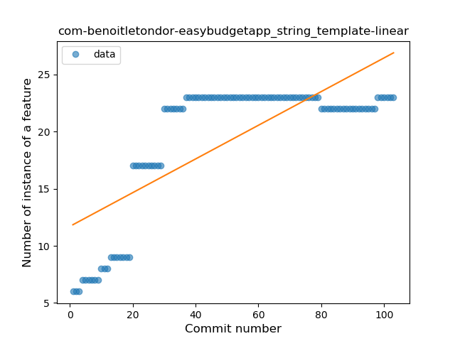
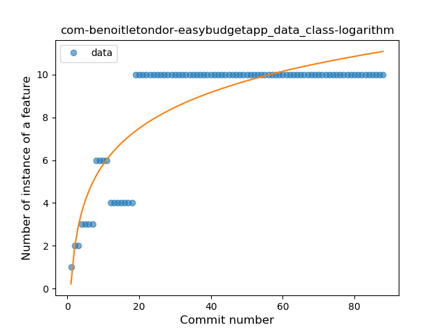
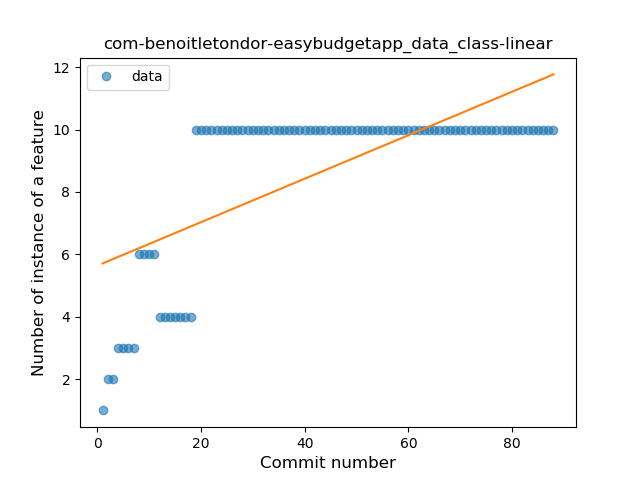
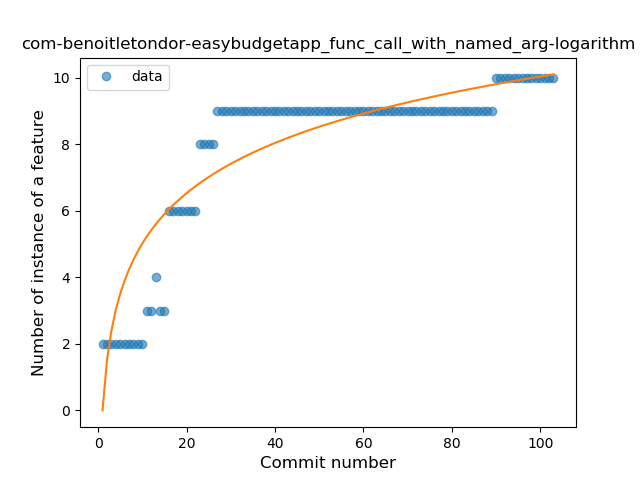

## com-benoitletondor-easybudgetapp
----
#### Metrics provided by Detekt
* Number of lines of code 8586
* Number of Kotlin files: 63
* Cyclomatic complexity: 955
* Cyclomatic complexity by thousands of lines: 279 

----
**18** features analyzed

*	<a href="#type_inference">Type Inference</a> 
*	<a href="#lambda">Lambda</a> 
*	<a href="#safe_call">Safe Call</a> 
*	<a href="#when_expr">When expression</a> 
*	<a href="#unsafe_call">Unsafe Call</a> 
*	<a href="#companion_object">Companion Object</a> 
*	<a href="#string_template">String Template</a> 
*	<a href="#singleton">Singleton</a> 
*	<a href="#range_expr">Range Expression</a> 
*	<a href="#smart_cast">Smart Cast</a> 
*	<a href="#data_class">Data Class</a> 
*	<a href="#func_call_with_named_arg">Function call with Named Argument</a> 
*	<a href="#extension_function">Extension Function</a> 
*	<a href="#property_delegation">Property Delegation</a> 
*	<a href="#destructuring_declaration">Destructuring Declaration</a> 
*	<a href="#coroutine">Coroutine</a> 
*	<a href="#sealed_class">Sealed Class</a> 
*	<a href="#super_delegation">Super Delegation</a> 

### <a name="type_inference">Type Inference</a>
----
#### Functions
* **Instability - Polinomial 3:** )
    * **R_Squared:** 0.95407877
* **Sudden Rise Plateau - Logarithm:** 
    * **R_Squared:** 0.80865313
* **Constant Rise - Linear:** 
    * **R_Squared:** 0.44741269

**Plots** :chart_with_upwards_trend:
-----

### <a name="lambda">Lambda</a>
----
#### Functions
* **Instability - Polinomial 3:** )
    * **R_Squared:** 0.97890633
* **Sudden Rise Plateau - Logarithm:** 
    * **R_Squared:** 0.86664364
* **Constant Rise - Linear:** 
    * **R_Squared:** 0.56004596

**Plots** :chart_with_upwards_trend:
-----

### <a name="safe_call">Safe Call</a>
----
#### Functions
* **Constant Rise - Linear:** 
    * **R_Squared:** 0.8062739
* **Sudden Rise Plateau - Logarithm:** 
    * **R_Squared:** 0.78254092
* **Plateau Gradual Rise - Sigmoid:** 
    * **R_Squared:** 0.44302837

**Plots** :chart_with_upwards_trend:
-----

### <a name="when_expr">When expression</a>
----
#### Functions
* **Instability - Polinomial 3:** )
    * **R_Squared:** 0.95533686
* **Sudden Rise Plateau - Logarithm:** 
    * **R_Squared:** 0.89546261
* **Constant Rise - Linear:** 
    * **R_Squared:** 0.60099713
* **Plateau Gradual Rise - Sigmoid:** 
    * **R_Squared:** 0.55413209

**Plots** :chart_with_upwards_trend:
-----

### <a name="unsafe_call">Unsafe Call</a>
----
#### Functions
* **Plateau Gradual Rise - Sigmoid:** 
    * **R_Squared:** 0.95825052
* **Instability - Polinomial 3:** )
    * **R_Squared:** 0.90872932
* **Sudden Rise Plateau - Logarithm:** 
    * **R_Squared:** 0.81436911
* **Constant Rise - Linear:** 
    * **R_Squared:** 0.54014843

**Plots** :chart_with_upwards_trend:
-----

### <a name="companion_object">Companion Object</a>
----
#### Functions
* **Plateau Gradual Rise - Sigmoid:** 
    * **R_Squared:** 0.95705915
* **Instability - Polinomial 3:** )
    * **R_Squared:** 0.93563261
* **Sudden Rise Plateau - Logarithm:** 
    * **R_Squared:** 0.84711084
* **Constant Rise - Linear:** 
    * **R_Squared:** 0.54133706

**Plots** :chart_with_upwards_trend:
-----

### <a name="string_template">String Template</a>
----
#### Functions
* **Instability - Polinomial 3:** )
    * **R_Squared:** 0.93176348
* **Sudden Rise Plateau - Logarithm:** 
    * **R_Squared:** 0.79218365
* **Constant Rise - Linear:** 
    * **R_Squared:** 0.56980772
* **Plateau Gradual Rise - Sigmoid:** 
    * **R_Squared:** 0.50394646

**Plots** :chart_with_upwards_trend:
-----

### <a name="singleton">Singleton</a>
----
#### Functions
* **Sudden Rise Plateau - Logarithm:** 
    * **R_Squared:** 0.34079239
* **Constant Rise - Linear:** 
    * **R_Squared:** 0.06815586

**Plots** :chart_with_upwards_trend:
-----

### <a name="range_expr">Range Expression</a>
----
#### Functions
* **Plateau Sudden Rise - Binary Sigmoid:** 
    * **R_Squared:** 0.96187911
* **Sudden Rise - Exponential:** 
    * **R_Squared:** 0.77576865
* **Constant Rise - Linear:** 
    * **R_Squared:** 0.48208896
* **Sudden Rise Plateau - Logarithm:** 
    * **R_Squared:** 0.29562929

**Plots** :chart_with_upwards_trend:
-----

### <a name="smart_cast">Smart Cast</a>
----
#### Functions
* **Sudden Rise Plateau - Logarithm:** 
    * **R_Squared:** 0.69579386
* **Plateau Sudden Rise - Binary Sigmoid:** 
    * **R_Squared:** 0.31964851
* **Constant Rise - Linear:** 
    * **R_Squared:** 0.30362773

**Plots** :chart_with_upwards_trend:
-----

### <a name="data_class">Data Class</a>
----
#### Functions
* **Plateau Sudden Rise - Binary Sigmoid:** 
    * **R_Squared:** 0.93722668
* **Instability - Polinomial 3:** )
    * **R_Squared:** 0.85565872
* **Sudden Rise Plateau - Logarithm:** 
    * **R_Squared:** 0.74775354
* **Constant Rise - Linear:** 
    * **R_Squared:** 0.47402892

**Plots** :chart_with_upwards_trend:
-----

### <a name="func_call_with_named_arg">Function call with Named Argument</a>
----
#### Functions
* **Sudden Rise Plateau - Logarithm:** 
    * **R_Squared:** 0.81716154
* **Constant Rise - Linear:** 
    * **R_Squared:** 0.59594397

**Plots** :chart_with_upwards_trend:
-----

### <a name="extension_function">Extension Function</a>
----
#### Functions
* **Instability - Polinomial 3:** )
    * **R_Squared:** 0.79715892
* **Sudden Rise - Exponential:** 
    * **R_Squared:** 0.6833551
* **Constant Rise - Linear:** 
    * **R_Squared:** 0.52759262
* **Sudden Rise Plateau - Logarithm:** 
    * **R_Squared:** 0.43286604

**Plots** :chart_with_upwards_trend:
-----

### <a name="property_delegation">Property Delegation</a>
----
#### Functions
* **Instability - Polinomial 3:** )
    * **R_Squared:** 0.97678444
* **Sudden Rise Plateau - Logarithm:** 
    * **R_Squared:** 0.86282727
* **Constant Rise - Linear:** 
    * **R_Squared:** 0.53889287
* **Plateau Sudden Rise - Binary Sigmoid:** 
    * **R_Squared:** 0.26201682

**Plots** :chart_with_upwards_trend:
-----

### <a name="destructuring_declaration">Destructuring Declaration</a>
----
#### Functions
* **Instability - Polinomial 3:** )
    * **R_Squared:** 0.93669616
* **Sudden Rise Plateau - Logarithm:** 
    * **R_Squared:** 0.80222202
* **Constant Rise - Linear:** 
    * **R_Squared:** 0.44129613

**Plots** :chart_with_upwards_trend:
-----

### <a name="coroutine">Coroutine</a>
----
#### Functions
* **Plateau Gradual Rise - Sigmoid:** 
    * **R_Squared:** 0.96364147
* **Instability - Polinomial 3:** )
    * **R_Squared:** 0.95055455
* **Sudden Rise Plateau - Logarithm:** 
    * **R_Squared:** 0.82386526
* **Constant Rise - Linear:** 
    * **R_Squared:** 0.45920441

**Plots** :chart_with_upwards_trend:
-----

### <a name="sealed_class">Sealed Class</a>
----
#### Functions
* **Plateau Gradual Rise - Sigmoid:** 
    * **R_Squared:** 0.91244487
* **Sudden Rise Plateau - Logarithm:** 
    * **R_Squared:** 0.72529317
* **Constant Rise - Linear:** 
    * **R_Squared:** 0.3530427

**Plots** :chart_with_upwards_trend:
-----

### <a name="super_delegation">Super Delegation</a>
----
#### Functions
* **Plateau Sudden Rise - Binary Sigmoid:** 
    * **R_Squared:** 0.65822785
* **Sudden Rise Plateau - Logarithm:** 
    * **R_Squared:** 0.19590331
* **Constant Rise - Linear:** 
    * **R_Squared:** 0.06864387

**Plots** :chart_with_upwards_trend:
-----

