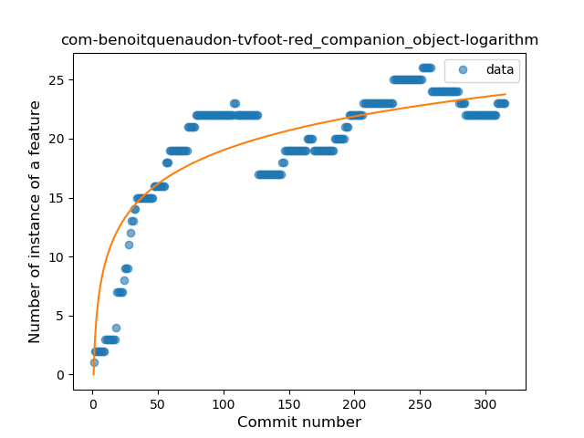
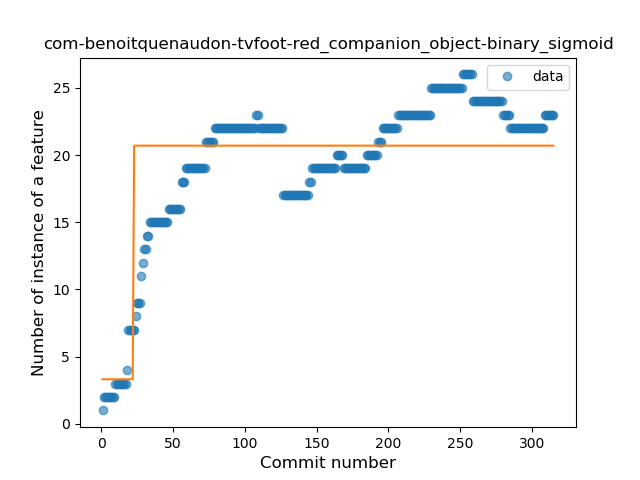
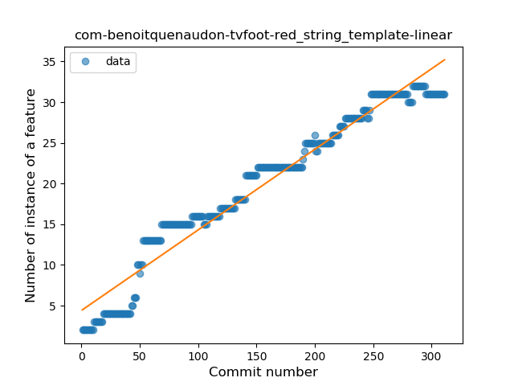
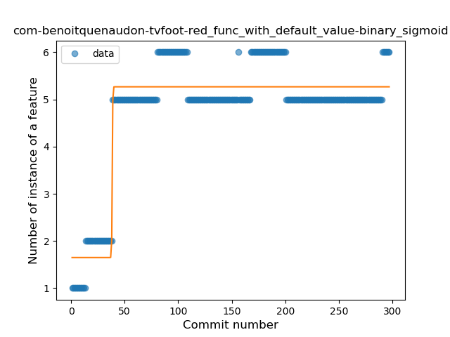
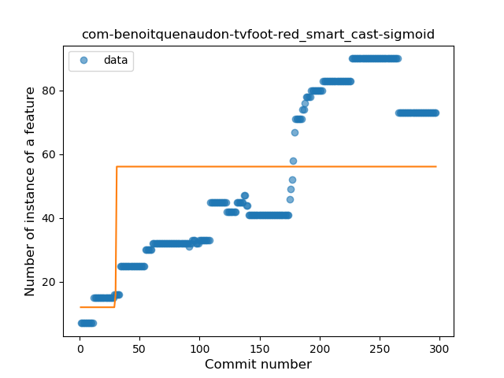
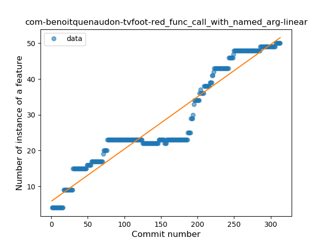
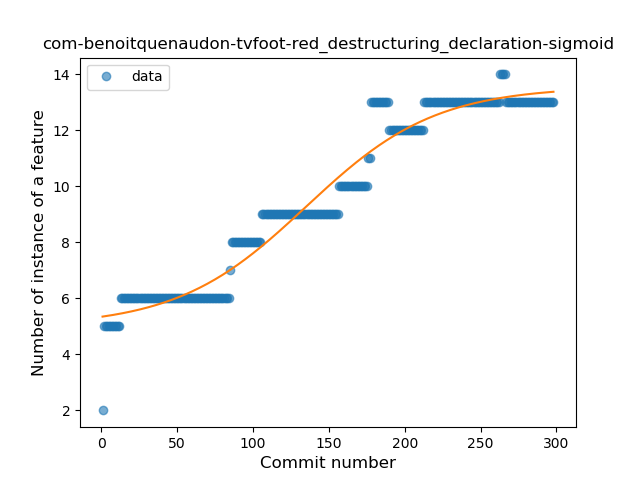
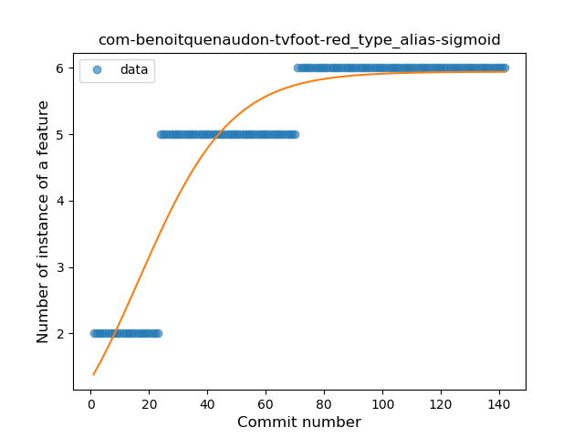

## com-benoitquenaudon-tvfoot-red
----
#### Metrics provided by Detekt
* Number of lines of code 6426
* Number of Kotlin files: 135
* Cyclomatic complexity: 757
* Cyclomatic complexity by thousands of lines: 222 

----
**19** features analyzed

*	<a href="#type_inference">Type Inference</a> 
*	<a href="#lambda">Lambda</a> 
*	<a href="#safe_call">Safe Call</a> 
*	<a href="#when_expr">When expression</a> 
*	<a href="#unsafe_call">Unsafe Call</a> 
*	<a href="#companion_object">Companion Object</a> 
*	<a href="#string_template">String Template</a> 
*	<a href="#func_with_default_value">Function with Default Value</a> 
*	<a href="#singleton">Singleton</a> 
*	<a href="#range_expr">Range Expression</a> 
*	<a href="#smart_cast">Smart Cast</a> 
*	<a href="#data_class">Data Class</a> 
*	<a href="#func_call_with_named_arg">Function call with Named Argument</a> 
*	<a href="#extension_function">Extension Function</a> 
*	<a href="#property_delegation">Property Delegation</a> 
*	<a href="#destructuring_declaration">Destructuring Declaration</a> 
*	<a href="#overloaded_op">Overloaded Operator</a> 
*	<a href="#sealed_class">Sealed Class</a> 
*	<a href="#type_alias">Type Alias</a> 

### <a name="type_inference">Type Inference</a>
----
#### Functions
* **Sudden Rise Plateau - Logarithm:** 
    * **R_Squared:** 0.86803727
* **Constant Rise - Linear:** 
    * **R_Squared:** 0.84971634
* **Plateau Sudden Rise - Binary Sigmoid:** 
    * **R_Squared:** 0.40752521

**Plots** :chart_with_upwards_trend:
-----

### <a name="lambda">Lambda</a>
----
#### Functions
* **Constant Rise - Linear:** 
    * **R_Squared:** 0.91873268
* **Sudden Rise Plateau - Logarithm:** 
    * **R_Squared:** 0.71817737
* **Plateau Gradual Rise - Sigmoid:** 
    * **R_Squared:** 0.65728528

**Plots** :chart_with_upwards_trend:
-----

### <a name="safe_call">Safe Call</a>
----
#### Functions
* **Constant Rise - Linear:** 
    * **R_Squared:** 0.85168406
* **Sudden Rise Plateau - Logarithm:** 
    * **R_Squared:** 0.82581876

**Plots** :chart_with_upwards_trend:
-----

### <a name="when_expr">When expression</a>
----
#### Functions
* **Constant Rise - Linear:** 
    * **R_Squared:** 0.90438058
* **Sudden Rise Plateau - Logarithm:** 
    * **R_Squared:** 0.7664237
* **Plateau Sudden Rise - Binary Sigmoid:** 
    * **R_Squared:** 0.23471406

**Plots** :chart_with_upwards_trend:
-----

### <a name="unsafe_call">Unsafe Call</a>
----
#### Functions
* **Plateau Gradual Rise - Sigmoid:** 
    * **R_Squared:** 0.82737773
* **Sudden Rise - Exponential:** 
    * **R_Squared:** 0.80518749
* **Constant Rise - Linear:** 
    * **R_Squared:** 0.76205789
* **Sudden Rise Plateau - Logarithm:** 
    * **R_Squared:** 0.25871598

**Plots** :chart_with_upwards_trend:
-----

### <a name="companion_object">Companion Object</a>
----
#### Functions
* **Sudden Rise Plateau - Logarithm:** 
    * **R_Squared:** 0.7702045
* **Plateau Sudden Rise - Binary Sigmoid:** 
    * **R_Squared:** 0.64354588
* **Constant Rise - Linear:** 
    * **R_Squared:** 0.52970583

**Plots** :chart_with_upwards_trend:
-----

### <a name="string_template">String Template</a>
----
#### Functions
* **Constant Rise - Linear:** 
    * **R_Squared:** 0.95172662
* **Sudden Rise Plateau - Logarithm:** 
    * **R_Squared:** 0.62847392
* **Plateau Sudden Rise - Binary Sigmoid:** 
    * **R_Squared:** 0.23453885

**Plots** :chart_with_upwards_trend:
-----

### <a name="func_with_default_value">Function with Default Value</a>
----
#### Functions
* **Plateau Sudden Rise - Binary Sigmoid:** 
    * **R_Squared:** 0.87980794
* **Sudden Rise Plateau - Logarithm:** 
    * **R_Squared:** 0.60284896
* **Constant Rise - Linear:** 
    * **R_Squared:** 0.27810314

**Plots** :chart_with_upwards_trend:
-----

### <a name="singleton">Singleton</a>
----
#### Functions
* **Sudden Rise Plateau - Logarithm:** 
    * **R_Squared:** 0.82308681
* **Plateau Gradual Rise - Sigmoid:** 
    * **R_Squared:** 0.74358997
* **Constant Rise - Linear:** 
    * **R_Squared:** 0.66750536

**Plots** :chart_with_upwards_trend:
-----

### <a name="range_expr">Range Expression</a>
----
#### Functions
* **Plateau Sudden Rise - Binary Sigmoid:** 
    * **R_Squared:** 0.95119633
* **Constant Rise - Linear:** 
    * **R_Squared:** 0.62161431
* **Sudden Rise Plateau - Logarithm:** 
    * **R_Squared:** 0.57857043

**Plots** :chart_with_upwards_trend:
-----

### <a name="smart_cast">Smart Cast</a>
----
#### Functions
* **Constant Rise - Linear:** 
    * **R_Squared:** 0.85361366
* **Sudden Rise Plateau - Logarithm:** 
    * **R_Squared:** 0.51526413
* **Plateau Gradual Rise - Sigmoid:** 
    * **R_Squared:** 0.2569917

**Plots** :chart_with_upwards_trend:
-----

### <a name="data_class">Data Class</a>
----
#### Functions
* **Plateau Gradual Rise - Sigmoid:** 
    * **R_Squared:** 0.94295701
* **Constant Rise - Linear:** 
    * **R_Squared:** 0.92705982
* **Sudden Rise - Exponential:** 
    * **R_Squared:** 0.92825515
* **Sudden Rise Plateau - Logarithm:** 
    * **R_Squared:** 0.56172997

**Plots** :chart_with_upwards_trend:
-----

### <a name="func_call_with_named_arg">Function call with Named Argument</a>
----
#### Functions
* **Constant Rise - Linear:** 
    * **R_Squared:** 0.91895266
* **Sudden Rise - Exponential:** 
    * **R_Squared:** 0.92573473
* **Sudden Rise Plateau - Logarithm:** 
    * **R_Squared:** 0.54175291
* **Plateau Gradual Rise - Sigmoid:** 
    * **R_Squared:** 0.35397228

**Plots** :chart_with_upwards_trend:
-----

### <a name="extension_function">Extension Function</a>
----
#### Functions
* **Constant Rise - Linear:** 
    * **R_Squared:** 0.84664068
* **Sudden Rise - Exponential:** 
    * **R_Squared:** 0.84848246
* **Sudden Rise Plateau - Logarithm:** 
    * **R_Squared:** 0.63159042

**Plots** :chart_with_upwards_trend:
-----

### <a name="property_delegation">Property Delegation</a>
----
#### Functions
* **Sudden Rise Plateau - Logarithm:** 
    * **R_Squared:** 0.565934
* **Constant Rise - Linear:** 
    * **R_Squared:** 0.16683083

**Plots** :chart_with_upwards_trend:
-----

### <a name="destructuring_declaration">Destructuring Declaration</a>
----
#### Functions
* **Plateau Gradual Rise - Sigmoid:** 
    * **R_Squared:** 0.95643442
* **Constant Rise - Linear:** 
    * **R_Squared:** 0.92524228
* **Sudden Rise Plateau - Logarithm:** 
    * **R_Squared:** 0.70531585

**Plots** :chart_with_upwards_trend:
-----

### <a name="overloaded_op">Overloaded Operator</a>
----
#### Functions
* **Plateau Gradual Rise - Sigmoid:** 
    * **R_Squared:** 0.97036197
* **Sudden Rise - Exponential:** 
    * **R_Squared:** 0.85458732
* **Constant Rise - Linear:** 
    * **R_Squared:** 0.80167937
* **Sudden Rise Plateau - Logarithm:** 
    * **R_Squared:** 0.21514382

**Plots** :chart_with_upwards_trend:
-----

### <a name="sealed_class">Sealed Class</a>
----
#### Functions
* **Plateau Gradual Rise - Sigmoid:** 
    * **R_Squared:** 0.97717652
* **Sudden Rise - Exponential:** 
    * **R_Squared:** 0.85184237
* **Constant Rise - Linear:** 
    * **R_Squared:** 0.83652052
* **Sudden Rise Plateau - Logarithm:** 
    * **R_Squared:** 0.40789888

**Plots** :chart_with_upwards_trend:
-----

### <a name="type_alias">Type Alias</a>
----
#### Functions
* **Plateau Gradual Rise - Sigmoid:** 
    * **R_Squared:** 0.88020503
* **Sudden Rise Plateau - Logarithm:** 
    * **R_Squared:** 0.80409758
* **Constant Rise - Linear:** 
    * **R_Squared:** 0.65958312

**Plots** :chart_with_upwards_trend:
-----

