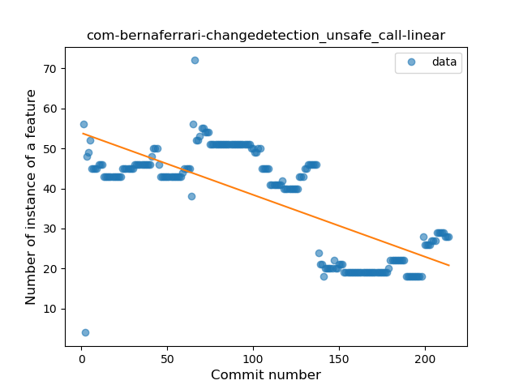
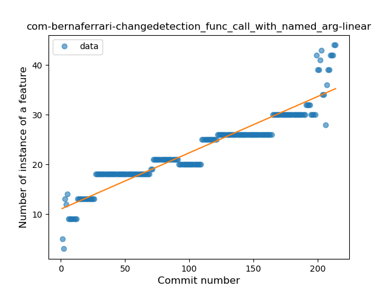
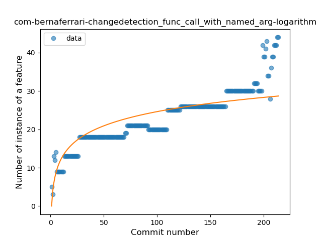
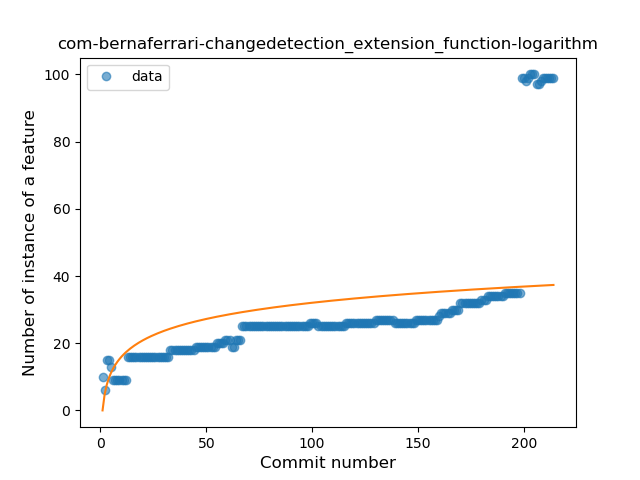
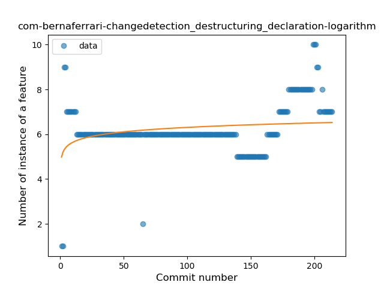
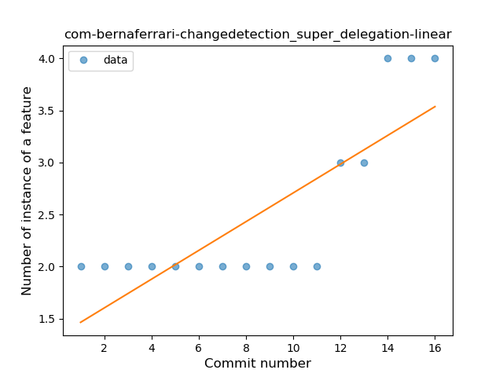

## com-bernaferrari-changedetection
----
#### Metrics provided by Detekt
* Number of lines of code 12742
* Number of Kotlin files: 139
* Cyclomatic complexity: 1355
* Cyclomatic complexity by thousands of lines: 227 

----
**21** features analyzed

*	<a href="#type_inference">Type Inference</a> 
*	<a href="#lambda">Lambda</a> 
*	<a href="#safe_call">Safe Call</a> 
*	<a href="#when_expr">When expression</a> 
*	<a href="#unsafe_call">Unsafe Call</a> 
*	<a href="#companion_object">Companion Object</a> 
*	<a href="#string_template">String Template</a> 
*	<a href="#func_with_default_value">Function with Default Value</a> 
*	<a href="#singleton">Singleton</a> 
*	<a href="#range_expr">Range Expression</a> 
*	<a href="#smart_cast">Smart Cast</a> 
*	<a href="#data_class">Data Class</a> 
*	<a href="#func_call_with_named_arg">Function call with Named Argument</a> 
*	<a href="#extension_function">Extension Function</a> 
*	<a href="#property_delegation">Property Delegation</a> 
*	<a href="#destructuring_declaration">Destructuring Declaration</a> 
*	<a href="#inline_func">Inline Function</a> 
*	<a href="#overloaded_op">Overloaded Operator</a> 
*	<a href="#coroutine">Coroutine</a> 
*	<a href="#sealed_class">Sealed Class</a> 
*	<a href="#super_delegation">Super Delegation</a> 

### <a name="type_inference">Type Inference</a>
----
#### Functions
* **Sudden Rise - Exponential:** 
    * **R_Squared:** 0.67689138
* **Constant Rise - Linear:** 
    * **R_Squared:** 0.64991951
* **Sudden Rise Plateau - Logarithm:** 
    * **R_Squared:** 0.47700303

**Plots** :chart_with_upwards_trend:
-----

### <a name="lambda">Lambda</a>
----
#### Functions
* **Constant Rise - Linear:** 
    * **R_Squared:** 0.83478214
* **Sudden Rise Plateau - Logarithm:** 
    * **R_Squared:** 0.69433214

**Plots** :chart_with_upwards_trend:
-----

### <a name="safe_call">Safe Call</a>
----
#### Functions
* **Sudden Rise - Exponential:** 
    * **R_Squared:** 0.90250842
* **Constant Rise - Linear:** 
    * **R_Squared:** 0.87214303
* **Sudden Rise Plateau - Logarithm:** 
    * **R_Squared:** 0.55270723

**Plots** :chart_with_upwards_trend:
-----

### <a name="when_expr">When expression</a>
----
#### Functions
* **Sudden Rise - Exponential:** 
    * **R_Squared:** 0.80682175
* **Constant Rise - Linear:** 
    * **R_Squared:** 0.69251855
* **Sudden Rise Plateau - Logarithm:** 
    * **R_Squared:** 0.3612511

**Plots** :chart_with_upwards_trend:
-----

### <a name="unsafe_call">Unsafe Call</a>
----
#### Functions
* **Constant Decline - Linear:** 
    * **R_Squared:** 0.53913703
* **Sudden Rise Plateau - Logarithm:** 
    * **R_Squared:** -0.0

**Plots** :chart_with_upwards_trend:
-----

### <a name="companion_object">Companion Object</a>
----
#### Functions
* **Plateau Sudden Rise - Binary Sigmoid:** 
    * **R_Squared:** 0.23366796
* **Sudden Rise Plateau - Logarithm:** 
    * **R_Squared:** 0.09848578
* **Constant Rise - Linear:** 
    * **R_Squared:** 0.04515027

**Plots** :chart_with_upwards_trend:
-----

### <a name="string_template">String Template</a>
----
#### Functions
* **Sudden Rise - Exponential:** 
    * **R_Squared:** 0.8473748
* **Constant Rise - Linear:** 
    * **R_Squared:** 0.39898603
* **Sudden Rise Plateau - Logarithm:** 
    * **R_Squared:** 0.19824248
* **Plateau Sudden Rise - Binary Sigmoid:** 
    * **R_Squared:** 0.04499897

**Plots** :chart_with_upwards_trend:
-----

### <a name="func_with_default_value">Function with Default Value</a>
----
#### Functions
* **Sudden Rise - Exponential:** 
    * **R_Squared:** 0.87279437
* **Constant Rise - Linear:** 
    * **R_Squared:** 0.81447049
* **Sudden Rise Plateau - Logarithm:** 
    * **R_Squared:** 0.5568015

**Plots** :chart_with_upwards_trend:
-----

### <a name="singleton">Singleton</a>
----
#### Functions
* **Sudden Rise - Exponential:** 
    * **R_Squared:** 0.80725407
* **Constant Rise - Linear:** 
    * **R_Squared:** 0.25430335
* **Sudden Rise Plateau - Logarithm:** 
    * **R_Squared:** 0.10634199

**Plots** :chart_with_upwards_trend:
-----

### <a name="range_expr">Range Expression</a>
----
#### Functions
* **Constant Rise - Linear:** 
    * **R_Squared:** 0.76196553
* **Sudden Rise Plateau - Logarithm:** 
    * **R_Squared:** 0.57131579

**Plots** :chart_with_upwards_trend:
-----

### <a name="smart_cast">Smart Cast</a>
----
#### Functions
* **Constant Decline - Linear:** 
    * **R_Squared:** 2.06e-05
* **Sudden Decline - Exponential:** 
    * **R_Squared:** 1.913e-05
* **Sudden Rise Plateau - Logarithm:** 
    * **R_Squared:** -0.0

**Plots** :chart_with_upwards_trend:
-----

### <a name="data_class">Data Class</a>
----
#### Functions
* **Sudden Rise - Exponential:** 
    * **R_Squared:** 0.45481769
* **Constant Rise - Linear:** 
    * **R_Squared:** 0.08490043
* **Plateau Sudden Rise - Binary Sigmoid:** 
    * **R_Squared:** 0.0782879
* **Sudden Rise Plateau - Logarithm:** 
    * **R_Squared:** 0.02204574

**Plots** :chart_with_upwards_trend:
-----

### <a name="func_call_with_named_arg">Function call with Named Argument</a>
----
#### Functions
* **Constant Rise - Linear:** 
    * **R_Squared:** 0.8819936
* **Sudden Rise - Exponential:** 
    * **R_Squared:** 0.88860063
* **Sudden Rise Plateau - Logarithm:** 
    * **R_Squared:** 0.69829147
* **Plateau Sudden Rise - Binary Sigmoid:** 
    * **R_Squared:** 0.3852577

**Plots** :chart_with_upwards_trend:
-----

### <a name="extension_function">Extension Function</a>
----
#### Functions
* **Sudden Rise - Exponential:** 
    * **R_Squared:** 0.84489394
* **Constant Rise - Linear:** 
    * **R_Squared:** 0.46557602
* **Sudden Rise Plateau - Logarithm:** 
    * **R_Squared:** 0.23360462

**Plots** :chart_with_upwards_trend:
-----

### <a name="property_delegation">Property Delegation</a>
----
#### Functions
* **Sudden Rise - Exponential:** 
    * **R_Squared:** 0.69482421
* **Constant Rise - Linear:** 
    * **R_Squared:** 0.58263962
* **Sudden Rise Plateau - Logarithm:** 
    * **R_Squared:** 0.2794603

**Plots** :chart_with_upwards_trend:
-----

### <a name="destructuring_declaration">Destructuring Declaration</a>
----
#### Functions
* **Sudden Rise - Exponential:** 
    * **R_Squared:** 0.30922004
* **Constant Rise - Linear:** 
    * **R_Squared:** 0.12952165
* **Sudden Rise Plateau - Logarithm:** 
    * **R_Squared:** 0.06004185
* **Plateau Gradual Rise - Sigmoid:** 
    * **R_Squared:** 0.00216415

**Plots** :chart_with_upwards_trend:
-----

### <a name="inline_func">Inline Function</a>
----
#### Functions
* **Sudden Rise - Exponential:** 
    * **R_Squared:** 0.91383059
* **Plateau Gradual Rise - Sigmoid:** 
    * **R_Squared:** 0.91565964
* **Constant Rise - Linear:** 
    * **R_Squared:** 0.60037012
* **Sudden Rise Plateau - Logarithm:** 
    * **R_Squared:** 0.21012064

**Plots** :chart_with_upwards_trend:
-----

### <a name="overloaded_op">Overloaded Operator</a>
----
#### Functions
* **Plateau Sudden Rise - Binary Sigmoid:** 
    * **R_Squared:** 1.0
* **Sudden Rise - Exponential:** 
    * **R_Squared:** 0.79579997
* **Constant Rise - Linear:** 
    * **R_Squared:** 0.28927544
* **Sudden Rise Plateau - Logarithm:** 
    * **R_Squared:** 0.11693721

**Plots** :chart_with_upwards_trend:
-----

### <a name="coroutine">Coroutine</a>
----
#### Functions
* **Sudden Rise - Exponential:** 
    * **R_Squared:** 0.82121675
* **Constant Rise - Linear:** 
    * **R_Squared:** 0.69329792
* **Sudden Rise Plateau - Logarithm:** 
    * **R_Squared:** 0.40231765

**Plots** :chart_with_upwards_trend:
-----

### <a name="sealed_class">Sealed Class</a>
----
#### Functions
* **Constant Decline - Linear:** 
    * **R_Squared:** 0.26128996
* **Sudden Rise Plateau - Logarithm:** 
    * **R_Squared:** -0.0

**Plots** :chart_with_upwards_trend:
-----

### <a name="super_delegation">Super Delegation</a>
----
#### Functions
* **Plateau Sudden Rise - Binary Sigmoid:** 
    * **R_Squared:** 0.96842772
* **Instability - Polinomial 4:** 
    * **R_Squared:** 0.93813209
* **Sudden Rise - Exponential:** 
    * **R_Squared:** 0.87878439
* **Constant Rise - Linear:** 
    * **R_Squared:** 0.64970588
* **Sudden Rise Plateau - Logarithm:** 
    * **R_Squared:** 0.37940001

**Plots** :chart_with_upwards_trend:
-----

