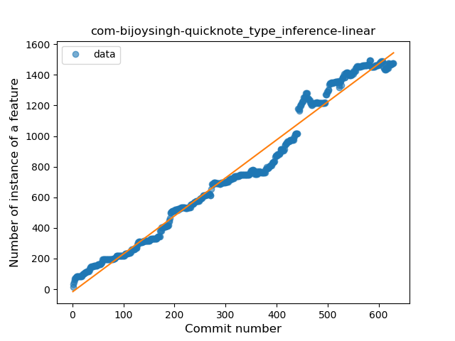
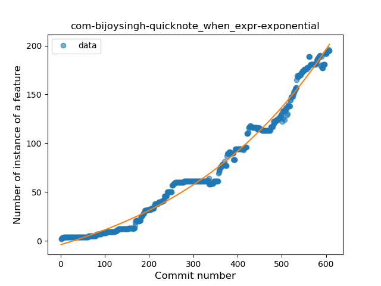
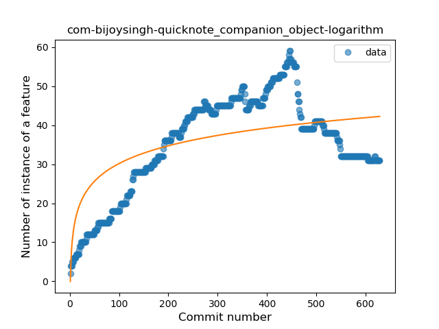
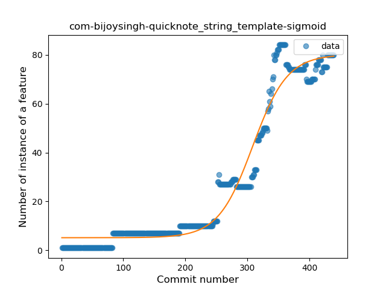
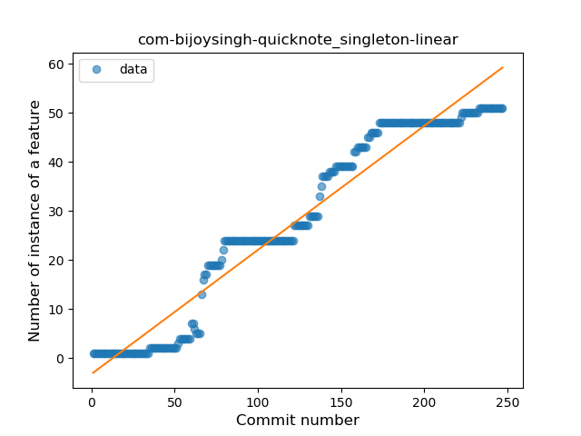
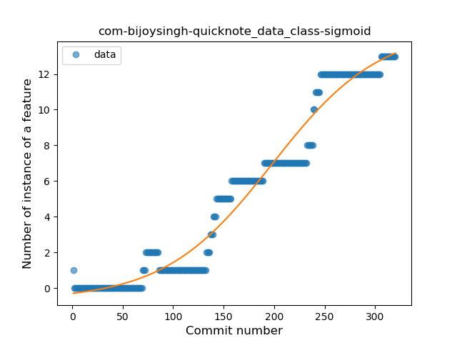
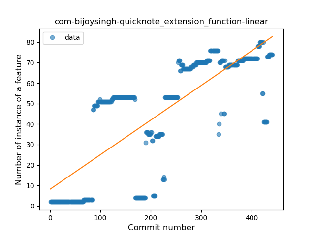
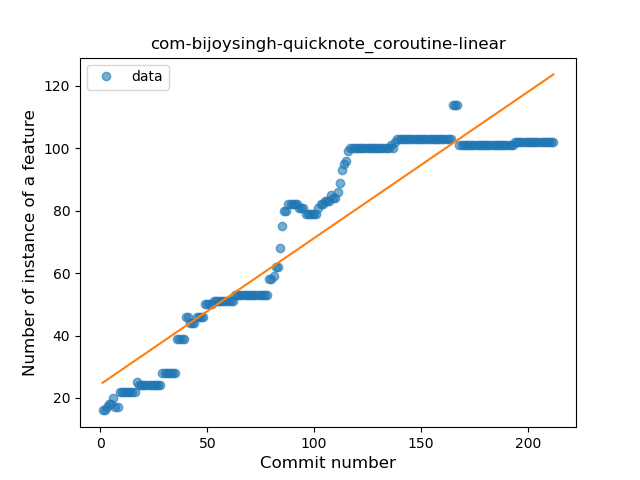

## com-bijoysingh-quicknote
----
#### Metrics provided by Detekt
* Number of lines of code 24738
* Number of Kotlin files: 280
* Cyclomatic complexity: 3344
* Cyclomatic complexity by thousands of lines: 223 

----
**16** features analyzed

*	<a href="#type_inference">Type Inference</a> 
*	<a href="#lambda">Lambda</a> 
*	<a href="#safe_call">Safe Call</a> 
*	<a href="#when_expr">When expression</a> 
*	<a href="#unsafe_call">Unsafe Call</a> 
*	<a href="#companion_object">Companion Object</a> 
*	<a href="#string_template">String Template</a> 
*	<a href="#func_with_default_value">Function with Default Value</a> 
*	<a href="#singleton">Singleton</a> 
*	<a href="#range_expr">Range Expression</a> 
*	<a href="#smart_cast">Smart Cast</a> 
*	<a href="#data_class">Data Class</a> 
*	<a href="#func_call_with_named_arg">Function call with Named Argument</a> 
*	<a href="#extension_function">Extension Function</a> 
*	<a href="#property_delegation">Property Delegation</a> 
*	<a href="#coroutine">Coroutine</a> 

### <a name="type_inference">Type Inference</a>
----
#### Functions
* **Constant Rise - Linear:** 
    * **R_Squared:** 0.97927307
* **Sudden Rise - Exponential:** 
    * **R_Squared:** 0.98354333
* **Sudden Rise Plateau - Logarithm:** 
    * **R_Squared:** 0.42412547
* **Plateau Sudden Rise - Binary Sigmoid:** 
    * **R_Squared:** 0.36447267

**Plots** :chart_with_upwards_trend:
-----

### <a name="lambda">Lambda</a>
----
#### Functions
* **Sudden Rise - Exponential:** 
    * **R_Squared:** 0.9782985
* **Constant Rise - Linear:** 
    * **R_Squared:** 0.9030582
* **Plateau Sudden Rise - Binary Sigmoid:** 
    * **R_Squared:** 0.50048826
* **Sudden Rise Plateau - Logarithm:** 
    * **R_Squared:** 0.29215763

**Plots** :chart_with_upwards_trend:
-----

### <a name="safe_call">Safe Call</a>
----
#### Functions
* **Sudden Rise - Exponential:** 
    * **R_Squared:** 0.88191346
* **Constant Rise - Linear:** 
    * **R_Squared:** 0.75023432
* **Sudden Rise Plateau - Logarithm:** 
    * **R_Squared:** 0.16980532
* **Plateau Sudden Rise - Binary Sigmoid:** 
    * **R_Squared:** 0.04751553

**Plots** :chart_with_upwards_trend:
-----

### <a name="when_expr">When expression</a>
----
#### Functions
* **Sudden Rise - Exponential:** 
    * **R_Squared:** 0.9865208
* **Constant Rise - Linear:** 
    * **R_Squared:** 0.94410461
* **Sudden Rise Plateau - Logarithm:** 
    * **R_Squared:** 0.303452
* **Plateau Sudden Rise - Binary Sigmoid:** 
    * **R_Squared:** 0.08282531

**Plots** :chart_with_upwards_trend:
-----

### <a name="unsafe_call">Unsafe Call</a>
----
#### Functions
* **Constant Rise - Linear:** 
    * **R_Squared:** 0.41991351
* **Sudden Rise Plateau - Logarithm:** 
    * **R_Squared:** 0.42346307

**Plots** :chart_with_upwards_trend:
-----

### <a name="companion_object">Companion Object</a>
----
#### Functions
* **Sudden Rise Plateau - Logarithm:** 
    * **R_Squared:** 0.53259233
* **Constant Rise - Linear:** 
    * **R_Squared:** 0.36122267

**Plots** :chart_with_upwards_trend:
-----

### <a name="string_template">String Template</a>
----
#### Functions
* **Plateau Gradual Rise - Sigmoid:** 
    * **R_Squared:** 0.96204809
* **Sudden Rise - Exponential:** 
    * **R_Squared:** 0.9014432
* **Constant Rise - Linear:** 
    * **R_Squared:** 0.80556641
* **Sudden Rise Plateau - Logarithm:** 
    * **R_Squared:** 0.21725086

**Plots** :chart_with_upwards_trend:
-----

### <a name="func_with_default_value">Function with Default Value</a>
----
#### Functions
* **Sudden Rise - Exponential:** 
    * **R_Squared:** 0.97131381
* **Constant Rise - Linear:** 
    * **R_Squared:** 0.8657764
* **Sudden Rise Plateau - Logarithm:** 
    * **R_Squared:** 0.22919652
* **Plateau Sudden Rise - Binary Sigmoid:** 
    * **R_Squared:** 0.01295921

**Plots** :chart_with_upwards_trend:
-----

### <a name="singleton">Singleton</a>
----
#### Functions
* **Constant Rise - Linear:** 
    * **R_Squared:** 0.94568461
* **Sudden Rise Plateau - Logarithm:** 
    * **R_Squared:** 0.46601892
* **Plateau Sudden Rise - Binary Sigmoid:** 
    * **R_Squared:** 0.43207926

**Plots** :chart_with_upwards_trend:
-----

### <a name="range_expr">Range Expression</a>
----
#### Functions
* **Plateau Gradual Rise - Sigmoid:** 
    * **R_Squared:** 0.91588527
* **Constant Rise - Linear:** 
    * **R_Squared:** 0.76798778
* **Sudden Rise Plateau - Logarithm:** 
    * **R_Squared:** 0.47500125

**Plots** :chart_with_upwards_trend:
-----

### <a name="smart_cast">Smart Cast</a>
----
#### Functions
* **Plateau Gradual Rise - Sigmoid:** 
    * **R_Squared:** 0.95097956
* **Sudden Rise - Exponential:** 
    * **R_Squared:** 0.86819449
* **Constant Rise - Linear:** 
    * **R_Squared:** 0.82180327
* **Sudden Rise Plateau - Logarithm:** 
    * **R_Squared:** 0.27105108

**Plots** :chart_with_upwards_trend:
-----

### <a name="data_class">Data Class</a>
----
#### Functions
* **Plateau Gradual Rise - Sigmoid:** 
    * **R_Squared:** 0.96358153
* **Sudden Rise - Exponential:** 
    * **R_Squared:** 0.94717173
* **Constant Rise - Linear:** 
    * **R_Squared:** 0.92876978
* **Sudden Rise Plateau - Logarithm:** 
    * **R_Squared:** 0.31484495

**Plots** :chart_with_upwards_trend:
-----

### <a name="func_call_with_named_arg">Function call with Named Argument</a>
----
#### Functions
* **Constant Rise - Linear:** 
    * **R_Squared:** 0.96333554
* **Sudden Rise - Exponential:** 
    * **R_Squared:** 0.96642887
* **Sudden Rise Plateau - Logarithm:** 
    * **R_Squared:** 0.52795916
* **Plateau Sudden Rise - Binary Sigmoid:** 
    * **R_Squared:** 0.47074501

**Plots** :chart_with_upwards_trend:
-----

### <a name="extension_function">Extension Function</a>
----
#### Functions
* **Constant Rise - Linear:** 
    * **R_Squared:** 0.61790414
* **Sudden Rise Plateau - Logarithm:** 
    * **R_Squared:** 0.38811702

**Plots** :chart_with_upwards_trend:
-----

### <a name="property_delegation">Property Delegation</a>
----
#### Functions
* **Constant Decline - Linear:** 
    * **R_Squared:** 0.34608209
* **Sudden Rise Plateau - Logarithm:** 
    * **R_Squared:** -0.0

**Plots** :chart_with_upwards_trend:
-----

### <a name="coroutine">Coroutine</a>
----
#### Functions
* **Constant Rise - Linear:** 
    * **R_Squared:** 0.87451213
* **Sudden Rise Plateau - Logarithm:** 
    * **R_Squared:** 0.68759343
* **Plateau Sudden Rise - Binary Sigmoid:** 
    * **R_Squared:** 0.59352942

**Plots** :chart_with_upwards_trend:
-----

