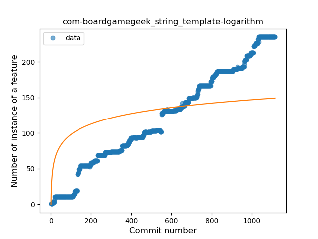
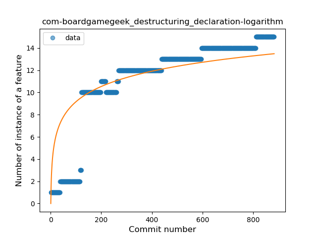

## com-boardgamegeek
----
#### Metrics provided by Detekt
* Number of lines of code 30480
* Number of Kotlin files: 420
* Cyclomatic complexity: 5131
* Cyclomatic complexity by thousands of lines: 297 

----
**19** features analyzed

*	<a href="#type_inference">Type Inference</a> 
*	<a href="#lambda">Lambda</a> 
*	<a href="#safe_call">Safe Call</a> 
*	<a href="#when_expr">When expression</a> 
*	<a href="#unsafe_call">Unsafe Call</a> 
*	<a href="#companion_object">Companion Object</a> 
*	<a href="#string_template">String Template</a> 
*	<a href="#func_with_default_value">Function with Default Value</a> 
*	<a href="#singleton">Singleton</a> 
*	<a href="#range_expr">Range Expression</a> 
*	<a href="#smart_cast">Smart Cast</a> 
*	<a href="#data_class">Data Class</a> 
*	<a href="#func_call_with_named_arg">Function call with Named Argument</a> 
*	<a href="#extension_function">Extension Function</a> 
*	<a href="#property_delegation">Property Delegation</a> 
*	<a href="#destructuring_declaration">Destructuring Declaration</a> 
*	<a href="#inline_func">Inline Function</a> 
*	<a href="#overloaded_op">Overloaded Operator</a> 
*	<a href="#sealed_class">Sealed Class</a> 

### <a name="type_inference">Type Inference</a>
----
#### Functions
* **Constant Rise - Linear:** 
    * **R_Squared:** 0.99001154
* **Sudden Rise - Exponential:** 
    * **R_Squared:** 0.99225423
* **Sudden Rise Plateau - Logarithm:** 
    * **R_Squared:** 0.35973571
* **Plateau Sudden Rise - Binary Sigmoid:** 
    * **R_Squared:** 0.15000066

**Plots** :chart_with_upwards_trend:
-----

### <a name="lambda">Lambda</a>
----
#### Functions
* **Sudden Rise - Exponential:** 
    * **R_Squared:** 0.98791579
* **Constant Rise - Linear:** 
    * **R_Squared:** 0.93660148
* **Plateau Sudden Rise - Binary Sigmoid:** 
    * **R_Squared:** 0.31352985
* **Sudden Rise Plateau - Logarithm:** 
    * **R_Squared:** 0.24990451

**Plots** :chart_with_upwards_trend:
-----

### <a name="safe_call">Safe Call</a>
----
#### Functions
* **Constant Rise - Linear:** 
    * **R_Squared:** 0.97289291
* **Sudden Rise - Exponential:** 
    * **R_Squared:** 0.97462456
* **Plateau Sudden Rise - Binary Sigmoid:** 
    * **R_Squared:** 0.40922182
* **Sudden Rise Plateau - Logarithm:** 
    * **R_Squared:** 0.3130777

**Plots** :chart_with_upwards_trend:
-----

### <a name="when_expr">When expression</a>
----
#### Functions
* **Sudden Rise - Exponential:** 
    * **R_Squared:** 0.9821404
* **Constant Rise - Linear:** 
    * **R_Squared:** 0.96654456
* **Sudden Rise Plateau - Logarithm:** 
    * **R_Squared:** 0.34145322
* **Plateau Sudden Rise - Binary Sigmoid:** 
    * **R_Squared:** 0.21324609

**Plots** :chart_with_upwards_trend:
-----

### <a name="unsafe_call">Unsafe Call</a>
----
#### Functions
* **Sudden Rise - Exponential:** 
    * **R_Squared:** 0.8231022
* **Constant Rise - Linear:** 
    * **R_Squared:** 0.80249985
* **Sudden Rise Plateau - Logarithm:** 
    * **R_Squared:** 0.31742608

**Plots** :chart_with_upwards_trend:
-----

### <a name="companion_object">Companion Object</a>
----
#### Functions
* **Sudden Rise - Exponential:** 
    * **R_Squared:** 0.98875571
* **Constant Rise - Linear:** 
    * **R_Squared:** 0.96383601
* **Sudden Rise Plateau - Logarithm:** 
    * **R_Squared:** 0.31623215
* **Plateau Sudden Rise - Binary Sigmoid:** 
    * **R_Squared:** 0.07105781

**Plots** :chart_with_upwards_trend:
-----

### <a name="string_template">String Template</a>
----
#### Functions
* **Constant Rise - Linear:** 
    * **R_Squared:** 0.98785143
* **Sudden Rise Plateau - Logarithm:** 
    * **R_Squared:** 0.43866158
* **Plateau Sudden Rise - Binary Sigmoid:** 
    * **R_Squared:** 0.3661167

**Plots** :chart_with_upwards_trend:
-----

### <a name="func_with_default_value">Function with Default Value</a>
----
#### Functions
* **Constant Rise - Linear:** 
    * **R_Squared:** 0.97627156
* **Sudden Rise - Exponential:** 
    * **R_Squared:** 0.98340523
* **Sudden Rise Plateau - Logarithm:** 
    * **R_Squared:** 0.4243548
* **Plateau Sudden Rise - Binary Sigmoid:** 
    * **R_Squared:** 0.16209251

**Plots** :chart_with_upwards_trend:
-----

### <a name="singleton">Singleton</a>
----
#### Functions
* **Sudden Rise Plateau - Logarithm:** 
    * **R_Squared:** 0.71440686
* **Constant Rise - Linear:** 
    * **R_Squared:** 0.64005502

**Plots** :chart_with_upwards_trend:
-----

### <a name="range_expr">Range Expression</a>
----
#### Functions
* **Constant Rise - Linear:** 
    * **R_Squared:** 0.90681554
* **Sudden Rise - Exponential:** 
    * **R_Squared:** 0.91393989
* **Sudden Rise Plateau - Logarithm:** 
    * **R_Squared:** 0.36265332
* **Plateau Sudden Rise - Binary Sigmoid:** 
    * **R_Squared:** 0.01570764

**Plots** :chart_with_upwards_trend:
-----

### <a name="smart_cast">Smart Cast</a>
----
#### Functions
* **Constant Rise - Linear:** 
    * **R_Squared:** 0.91675064
* **Sudden Rise Plateau - Logarithm:** 
    * **R_Squared:** 0.72620849

**Plots** :chart_with_upwards_trend:
-----

### <a name="data_class">Data Class</a>
----
#### Functions
* **Sudden Rise - Exponential:** 
    * **R_Squared:** 0.98100627
* **Constant Rise - Linear:** 
    * **R_Squared:** 0.9581846
* **Sudden Rise Plateau - Logarithm:** 
    * **R_Squared:** 0.357866

**Plots** :chart_with_upwards_trend:
-----

### <a name="func_call_with_named_arg">Function call with Named Argument</a>
----
#### Functions
* **Constant Rise - Linear:** 
    * **R_Squared:** 0.97221807
* **Sudden Rise Plateau - Logarithm:** 
    * **R_Squared:** 0.43593209
* **Plateau Sudden Rise - Binary Sigmoid:** 
    * **R_Squared:** 0.07545047

**Plots** :chart_with_upwards_trend:
-----

### <a name="extension_function">Extension Function</a>
----
#### Functions
* **Constant Rise - Linear:** 
    * **R_Squared:** 0.96647018
* **Sudden Rise Plateau - Logarithm:** 
    * **R_Squared:** 0.41141597
* **Plateau Sudden Rise - Binary Sigmoid:** 
    * **R_Squared:** 0.26611932

**Plots** :chart_with_upwards_trend:
-----

### <a name="property_delegation">Property Delegation</a>
----
#### Functions
* **Constant Rise - Linear:** 
    * **R_Squared:** 0.98712915
* **Sudden Rise - Exponential:** 
    * **R_Squared:** 0.98747189
* **Sudden Rise Plateau - Logarithm:** 
    * **R_Squared:** 0.42388108
* **Plateau Sudden Rise - Binary Sigmoid:** 
    * **R_Squared:** 0.23341619

**Plots** :chart_with_upwards_trend:
-----

### <a name="destructuring_declaration">Destructuring Declaration</a>
----
#### Functions
* **Constant Rise - Linear:** 
    * **R_Squared:** 0.68880716
* **Sudden Rise Plateau - Logarithm:** 
    * **R_Squared:** 0.6554015

**Plots** :chart_with_upwards_trend:
-----

### <a name="inline_func">Inline Function</a>
----
#### Functions
* **Constant Rise - Linear:** 
    * **R_Squared:** 0.77078935
* **Sudden Rise Plateau - Logarithm:** 
    * **R_Squared:** 0.42303651

**Plots** :chart_with_upwards_trend:
-----

### <a name="overloaded_op">Overloaded Operator</a>
----
#### Functions
* **Plateau Gradual Rise - Sigmoid:** 
    * **R_Squared:** 1.0
* **Constant Rise - Linear:** 
    * **R_Squared:** 0.73355707
* **Sudden Rise Plateau - Logarithm:** 
    * **R_Squared:** 0.41276976

**Plots** :chart_with_upwards_trend:
-----

### <a name="sealed_class">Sealed Class</a>
----
#### Functions
* **Plateau Gradual Rise - Sigmoid:** 
    * **R_Squared:** 0.94682931
* **Sudden Rise - Exponential:** 
    * **R_Squared:** 0.88415577
* **Constant Rise - Linear:** 
    * **R_Squared:** 0.73456005
* **Sudden Rise Plateau - Logarithm:** 
    * **R_Squared:** 0.19316263

**Plots** :chart_with_upwards_trend:
-----

