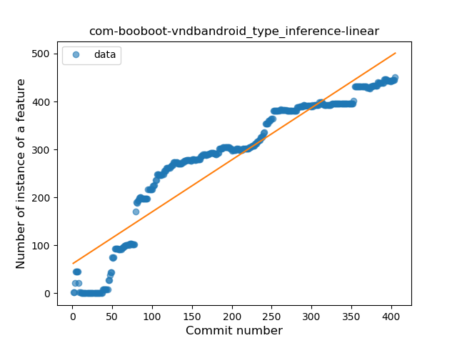
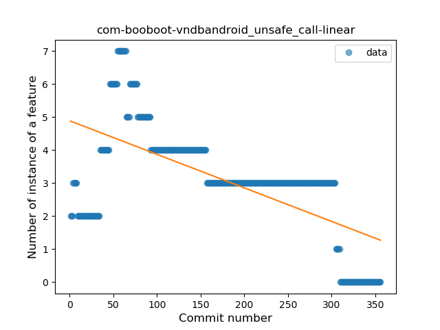
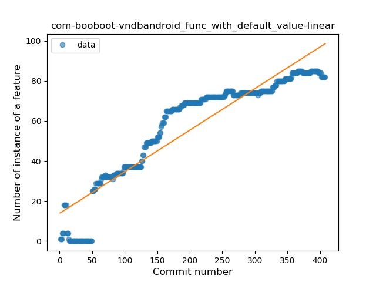
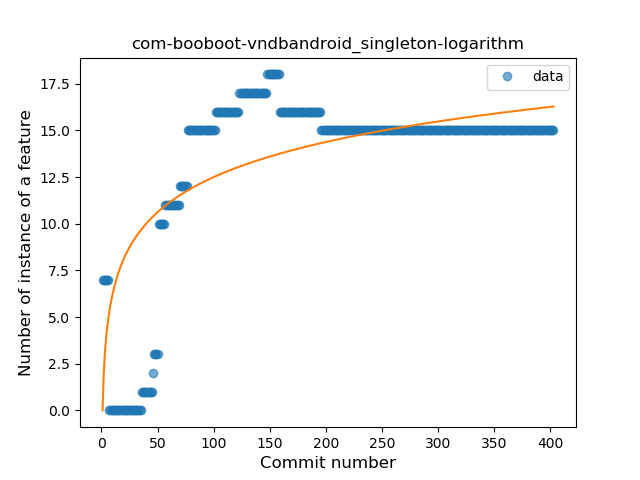
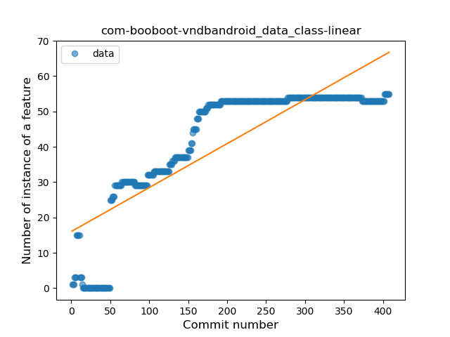
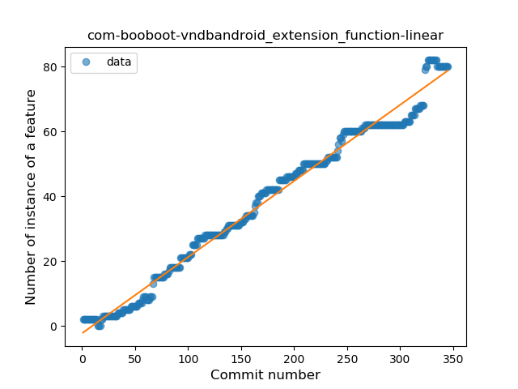
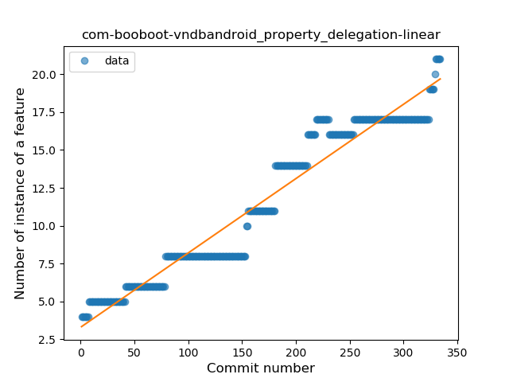

## com-booboot-vndbandroid
----
#### Metrics provided by Detekt
* Number of lines of code 6954
* Number of Kotlin files: 179
* Cyclomatic complexity: 1065
* Cyclomatic complexity by thousands of lines: 292 

----
**19** features analyzed

*	<a href="#type_inference">Type Inference</a> 
*	<a href="#lambda">Lambda</a> 
*	<a href="#safe_call">Safe Call</a> 
*	<a href="#when_expr">When expression</a> 
*	<a href="#unsafe_call">Unsafe Call</a> 
*	<a href="#companion_object">Companion Object</a> 
*	<a href="#string_template">String Template</a> 
*	<a href="#func_with_default_value">Function with Default Value</a> 
*	<a href="#singleton">Singleton</a> 
*	<a href="#range_expr">Range Expression</a> 
*	<a href="#smart_cast">Smart Cast</a> 
*	<a href="#data_class">Data Class</a> 
*	<a href="#func_call_with_named_arg">Function call with Named Argument</a> 
*	<a href="#extension_function">Extension Function</a> 
*	<a href="#property_delegation">Property Delegation</a> 
*	<a href="#destructuring_declaration">Destructuring Declaration</a> 
*	<a href="#inline_func">Inline Function</a> 
*	<a href="#overloaded_op">Overloaded Operator</a> 
*	<a href="#coroutine">Coroutine</a> 

### <a name="type_inference">Type Inference</a>
----
#### Functions
* **Constant Rise - Linear:** 
    * **R_Squared:** 0.88347782
* **Sudden Rise Plateau - Logarithm:** 
    * **R_Squared:** 0.59924592
* **Plateau Sudden Rise - Binary Sigmoid:** 
    * **R_Squared:** 0.13935813

**Plots** :chart_with_upwards_trend:
-----

### <a name="lambda">Lambda</a>
----
#### Functions
* **Constant Rise - Linear:** 
    * **R_Squared:** 0.86543877
* **Sudden Rise Plateau - Logarithm:** 
    * **R_Squared:** 0.51084045
* **Plateau Sudden Rise - Binary Sigmoid:** 
    * **R_Squared:** 0.08289398

**Plots** :chart_with_upwards_trend:
-----

### <a name="safe_call">Safe Call</a>
----
#### Functions
* **Constant Rise - Linear:** 
    * **R_Squared:** 0.95993972
* **Plateau Sudden Rise - Binary Sigmoid:** 
    * **R_Squared:** 0.63249855
* **Sudden Rise Plateau - Logarithm:** 
    * **R_Squared:** 0.46322412

**Plots** :chart_with_upwards_trend:
-----

### <a name="when_expr">When expression</a>
----
#### Functions
* **Constant Rise - Linear:** 
    * **R_Squared:** 0.76739211
* **Sudden Rise Plateau - Logarithm:** 
    * **R_Squared:** 0.61006095
* **Plateau Sudden Rise - Binary Sigmoid:** 
    * **R_Squared:** 0.3638668

**Plots** :chart_with_upwards_trend:
-----

### <a name="unsafe_call">Unsafe Call</a>
----
#### Functions
* **Constant Decline - Linear:** 
    * **R_Squared:** 0.41195217
* **Sudden Rise Plateau - Logarithm:** 
    * **R_Squared:** -0.0

**Plots** :chart_with_upwards_trend:
-----

### <a name="companion_object">Companion Object</a>
----
#### Functions
* **Plateau Sudden Rise - Binary Sigmoid:** 
    * **R_Squared:** 0.63286393
* **Sudden Rise Plateau - Logarithm:** 
    * **R_Squared:** 0.61341782
* **Constant Rise - Linear:** 
    * **R_Squared:** 0.51623796

**Plots** :chart_with_upwards_trend:
-----

### <a name="string_template">String Template</a>
----
#### Functions
* **Sudden Rise Plateau - Logarithm:** 
    * **R_Squared:** 0.88039372
* **Constant Rise - Linear:** 
    * **R_Squared:** 0.61772855

**Plots** :chart_with_upwards_trend:
-----

### <a name="func_with_default_value">Function with Default Value</a>
----
#### Functions
* **Constant Rise - Linear:** 
    * **R_Squared:** 0.85796669
* **Plateau Gradual Rise - Sigmoid:** 
    * **R_Squared:** 0.74130409
* **Sudden Rise Plateau - Logarithm:** 
    * **R_Squared:** 0.60206517

**Plots** :chart_with_upwards_trend:
-----

### <a name="singleton">Singleton</a>
----
#### Functions
* **Sudden Rise Plateau - Logarithm:** 
    * **R_Squared:** 0.53031917
* **Constant Rise - Linear:** 
    * **R_Squared:** 0.31886186

**Plots** :chart_with_upwards_trend:
-----

### <a name="range_expr">Range Expression</a>
----
#### Functions
* **Constant Rise - Linear:** 
    * **R_Squared:** 0.67783318
* **Sudden Rise Plateau - Logarithm:** 
    * **R_Squared:** 0.54581103
* **Plateau Sudden Rise - Binary Sigmoid:** 
    * **R_Squared:** 0.45141623

**Plots** :chart_with_upwards_trend:
-----

### <a name="smart_cast">Smart Cast</a>
----
#### Functions
* **Sudden Rise Plateau - Logarithm:** 
    * **R_Squared:** 0.47221495
* **Constant Rise - Linear:** 
    * **R_Squared:** 0.20642436

**Plots** :chart_with_upwards_trend:
-----

### <a name="data_class">Data Class</a>
----
#### Functions
* **Constant Rise - Linear:** 
    * **R_Squared:** 0.7104171
* **Sudden Rise Plateau - Logarithm:** 
    * **R_Squared:** 0.6376754

**Plots** :chart_with_upwards_trend:
-----

### <a name="func_call_with_named_arg">Function call with Named Argument</a>
----
#### Functions
* **Constant Rise - Linear:** 
    * **R_Squared:** 0.83101255
* **Sudden Rise Plateau - Logarithm:** 
    * **R_Squared:** 0.56095996

**Plots** :chart_with_upwards_trend:
-----

### <a name="extension_function">Extension Function</a>
----
#### Functions
* **Constant Rise - Linear:** 
    * **R_Squared:** 0.98510686
* **Sudden Rise Plateau - Logarithm:** 
    * **R_Squared:** 0.47207722

**Plots** :chart_with_upwards_trend:
-----

### <a name="property_delegation">Property Delegation</a>
----
#### Functions
* **Constant Rise - Linear:** 
    * **R_Squared:** 0.93983243
* **Sudden Rise Plateau - Logarithm:** 
    * **R_Squared:** 0.5690104

**Plots** :chart_with_upwards_trend:
-----

### <a name="destructuring_declaration">Destructuring Declaration</a>
----
#### Functions
* **Plateau Sudden Rise - Binary Sigmoid:** 
    * **R_Squared:** 0.53063049
* **Constant Decline - Linear:** 
    * **R_Squared:** 0.04001102
* **Sudden Rise Plateau - Logarithm:** 
    * **R_Squared:** 0.03588422

**Plots** :chart_with_upwards_trend:
-----

### <a name="inline_func">Inline Function</a>
----
#### Functions
* **Plateau Gradual Rise - Sigmoid:** 
    * **R_Squared:** 0.94331006
* **Constant Rise - Linear:** 
    * **R_Squared:** 0.53946462
* **Sudden Rise Plateau - Logarithm:** 
    * **R_Squared:** 0.47197576

**Plots** :chart_with_upwards_trend:
-----

### <a name="overloaded_op">Overloaded Operator</a>
----
#### Functions
* **Constant Rise - Linear:** 
    * **R_Squared:** 0.39038635
* **Sudden Rise Plateau - Logarithm:** 
    * **R_Squared:** 0.37356809

**Plots** :chart_with_upwards_trend:
-----

### <a name="coroutine">Coroutine</a>
----
#### Functions
* **Instability - Polinomial 3:** )
    * **R_Squared:** 0.58538519
* **Constant Decline - Linear:** 
    * **R_Squared:** 0.17391202
* **Sudden Rise Plateau - Logarithm:** 
    * **R_Squared:** 0.0

**Plots** :chart_with_upwards_trend:
-----

