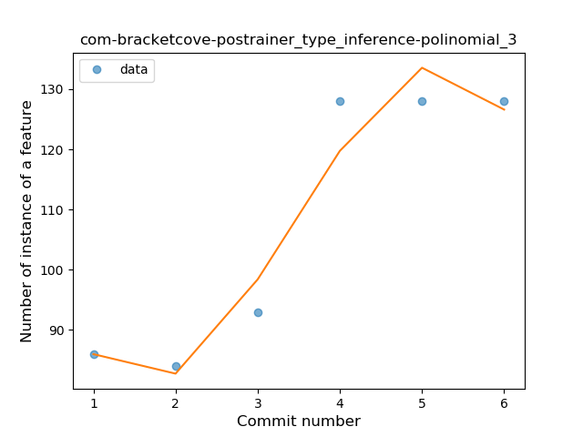
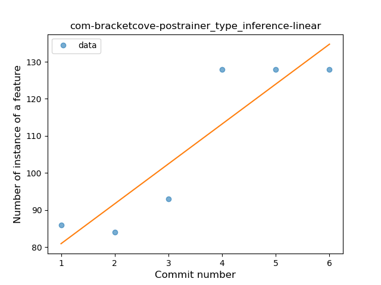
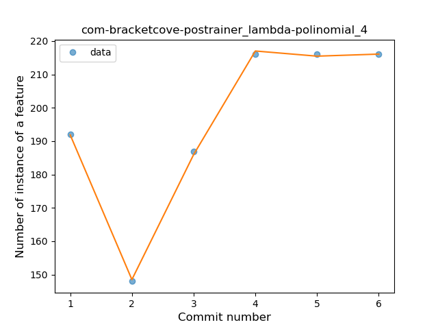
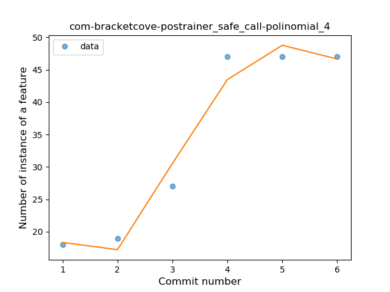
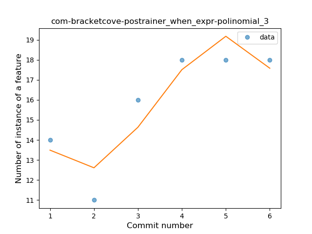
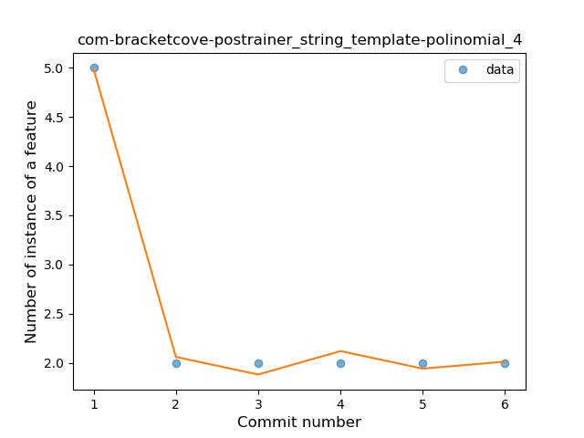
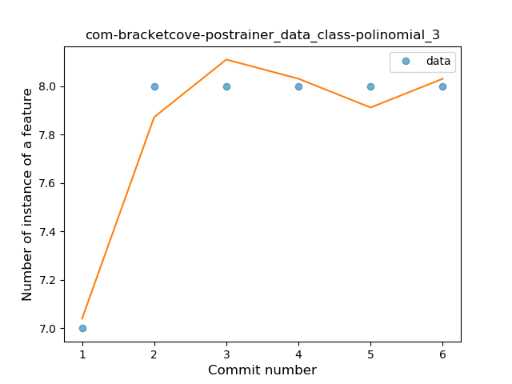
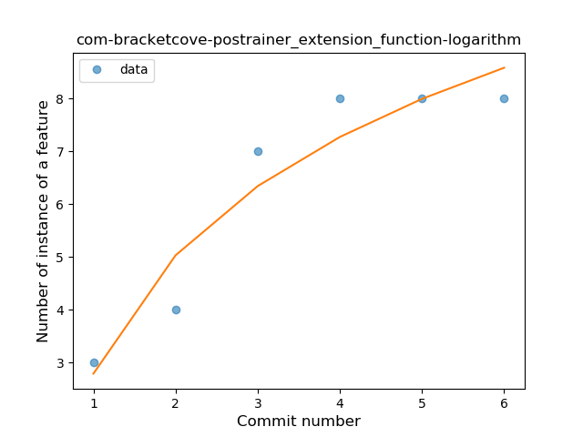
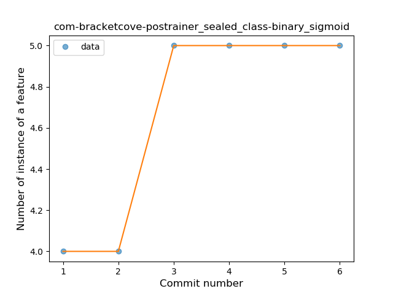

## com-bracketcove-postrainer
----
#### Metrics provided by Detekt
* Number of lines of code 3366
* Number of Kotlin files: 74
* Cyclomatic complexity: 364
* Cyclomatic complexity by thousands of lines: 239 

----
**15** features analyzed

*	<a href="#type_inference">Type Inference</a> 
*	<a href="#lambda">Lambda</a> 
*	<a href="#safe_call">Safe Call</a> 
*	<a href="#when_expr">When expression</a> 
*	<a href="#unsafe_call">Unsafe Call</a> 
*	<a href="#string_template">String Template</a> 
*	<a href="#func_with_default_value">Function with Default Value</a> 
*	<a href="#singleton">Singleton</a> 
*	<a href="#smart_cast">Smart Cast</a> 
*	<a href="#data_class">Data Class</a> 
*	<a href="#func_call_with_named_arg">Function call with Named Argument</a> 
*	<a href="#extension_function">Extension Function</a> 
*	<a href="#property_delegation">Property Delegation</a> 
*	<a href="#coroutine">Coroutine</a> 
*	<a href="#sealed_class">Sealed Class</a> 

### <a name="type_inference">Type Inference</a>
----
#### Functions
* **Instability - Polinomial 3:** )
    * **R_Squared:** 0.94700548
* **Instability - Polinomial 4:** 
    * **R_Squared:** 0.95275465
* **Constant Rise - Linear:** 
    * **R_Squared:** 0.81712293
* **Sudden Rise Plateau - Logarithm:** 
    * **R_Squared:** 0.74453191

**Plots** :chart_with_upwards_trend:
-----

### <a name="lambda">Lambda</a>
----
#### Functions
* **Instability - Polinomial 4:** 
    * **R_Squared:** 0.99925502
* **Instability - Polinomial 3:** )
    * **R_Squared:** 0.85163046
* **Constant Rise - Linear:** 
    * **R_Squared:** 0.49436572
* **Sudden Rise - Exponential:** 
    * **R_Squared:** 0.50119128
* **Sudden Rise Plateau - Logarithm:** 
    * **R_Squared:** 0.36460141

**Plots** :chart_with_upwards_trend:
-----

### <a name="safe_call">Safe Call</a>
----
#### Functions
* **Instability - Polinomial 4:** 
    * **R_Squared:** 0.9696841
* **Constant Rise - Linear:** 
    * **R_Squared:** 0.85426321
* **Sudden Rise Plateau - Logarithm:** 
    * **R_Squared:** 0.8142827

**Plots** :chart_with_upwards_trend:
-----

### <a name="when_expr">When expression</a>
----
#### Functions
* **Instability - Polinomial 4:** 
    * **R_Squared:** 0.98824101
* **Instability - Polinomial 3:** )
    * **R_Squared:** 0.8404276
* **Constant Rise - Linear:** 
    * **R_Squared:** 0.64688047
* **Sudden Rise Plateau - Logarithm:** 
    * **R_Squared:** 0.57918649

**Plots** :chart_with_upwards_trend:
-----

### <a name="unsafe_call">Unsafe Call</a>
----
#### Functions
* **Sudden Decline - Exponential:** 
    * **R_Squared:** 0.98320041
* **Instability - Polinomial 4:** 
    * **R_Squared:** 0.98135819
* **Instability - Polinomial 3:** )
    * **R_Squared:** 0.93532433
* **Constant Decline - Linear:** 
    * **R_Squared:** 0.53874834
* **Sudden Rise Plateau - Logarithm:** 
    * **R_Squared:** -0.0

**Plots** :chart_with_upwards_trend:
-----

### <a name="string_template">String Template</a>
----
#### Functions
* **Instability - Polinomial 4:** 
    * **R_Squared:** 0.9952381
* **Instability - Polinomial 3:** )
    * **R_Squared:** 0.95238095
* **Constant Decline - Linear:** 
    * **R_Squared:** 0.42857143
* **Sudden Rise Plateau - Logarithm:** 
    * **R_Squared:** -0.0

**Plots** :chart_with_upwards_trend:
-----

### <a name="func_with_default_value">Function with Default Value</a>
----
#### Functions
* **Instability - Polinomial 4:** 
    * **R_Squared:** 0.9985348
* **Sudden Rise Plateau - Logarithm:** 
    * **R_Squared:** 0.85054356
* **Constant Rise - Linear:** 
    * **R_Squared:** 0.82417582

**Plots** :chart_with_upwards_trend:
-----

### <a name="singleton">Singleton</a>
----
#### Functions
* **Instability - Polinomial 3:** )
    * **R_Squared:** 0.95014006
* **Instability - Polinomial 4:** 
    * **R_Squared:** 0.95266106
* **Sudden Rise Plateau - Logarithm:** 
    * **R_Squared:** 0.59236782
* **Constant Rise - Linear:** 
    * **R_Squared:** 0.36403361

**Plots** :chart_with_upwards_trend:
-----

### <a name="smart_cast">Smart Cast</a>
----
#### Functions
* **Instability - Polinomial 4:** 
    * **R_Squared:** 0.95892109
* **Instability - Polinomial 3:** )
    * **R_Squared:** 0.71847482
* **Constant Rise - Linear:** 
    * **R_Squared:** 0.46550398
* **Sudden Rise Plateau - Logarithm:** 
    * **R_Squared:** 0.38162878

**Plots** :chart_with_upwards_trend:
-----

### <a name="data_class">Data Class</a>
----
#### Functions
* **Instability - Polinomial 4:** 
    * **R_Squared:** 0.9952381
* **Instability - Polinomial 3:** )
    * **R_Squared:** 0.95238095
* **Sudden Rise Plateau - Logarithm:** 
    * **R_Squared:** 0.65720643
* **Constant Rise - Linear:** 
    * **R_Squared:** 0.42857143

**Plots** :chart_with_upwards_trend:
-----

### <a name="func_call_with_named_arg">Function call with Named Argument</a>
----
#### Functions
* **Instability - Polinomial 4:** 
    * **R_Squared:** 0.99957161
* **Constant Rise - Linear:** 
    * **R_Squared:** 0.81583431
* **Sudden Rise Plateau - Logarithm:** 
    * **R_Squared:** 0.81137838

**Plots** :chart_with_upwards_trend:
-----

### <a name="extension_function">Extension Function</a>
----
#### Functions
* **Instability - Polinomial 4:** 
    * **R_Squared:** 0.99608396
* **Sudden Rise Plateau - Logarithm:** 
    * **R_Squared:** 0.90487127
* **Constant Rise - Linear:** 
    * **R_Squared:** 0.81428571

**Plots** :chart_with_upwards_trend:
-----

### <a name="property_delegation">Property Delegation</a>
----
#### Functions
* **Instability - Polinomial 4:** 
    * **R_Squared:** 0.9952381
* **Instability - Polinomial 3:** )
    * **R_Squared:** 0.95238095
* **Constant Decline - Linear:** 
    * **R_Squared:** 0.42857143
* **Sudden Rise Plateau - Logarithm:** 
    * **R_Squared:** -0.0

**Plots** :chart_with_upwards_trend:
-----

### <a name="coroutine">Coroutine</a>
----
#### Functions
* **Instability - Polinomial 4:** 
    * **R_Squared:** 0.9985348
* **Sudden Rise Plateau - Logarithm:** 
    * **R_Squared:** 0.85054356
* **Constant Rise - Linear:** 
    * **R_Squared:** 0.82417582

**Plots** :chart_with_upwards_trend:
-----

### <a name="sealed_class">Sealed Class</a>
----
#### Functions
* **Plateau Sudden Rise - Binary Sigmoid:** 
    * **R_Squared:** 1.0
* **Instability - Polinomial 4:** 
    * **R_Squared:** 0.95238095
* **Sudden Rise Plateau - Logarithm:** 
    * **R_Squared:** 0.76855891
* **Constant Rise - Linear:** 
    * **R_Squared:** 0.68571429

**Plots** :chart_with_upwards_trend:
-----

