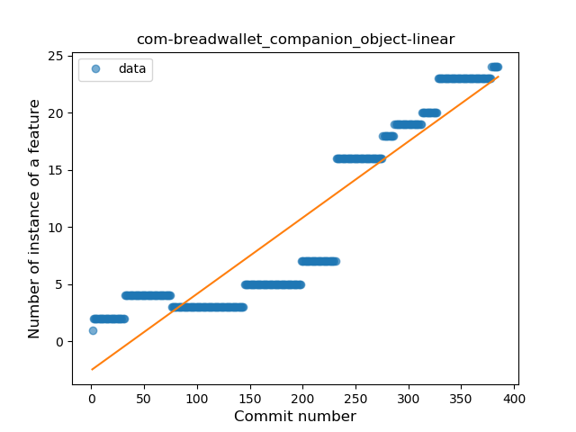
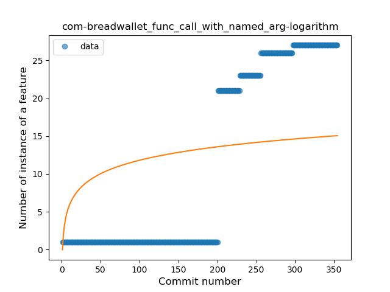

## com-breadwallet
----
#### Metrics provided by Detekt
* Number of lines of code 8174
* Number of Kotlin files: 66
* Cyclomatic complexity: 859
* Cyclomatic complexity by thousands of lines: 252 

----
**15** features analyzed

*	<a href="#type_inference">Type Inference</a> 
*	<a href="#lambda">Lambda</a> 
*	<a href="#safe_call">Safe Call</a> 
*	<a href="#when_expr">When expression</a> 
*	<a href="#unsafe_call">Unsafe Call</a> 
*	<a href="#companion_object">Companion Object</a> 
*	<a href="#string_template">String Template</a> 
*	<a href="#func_with_default_value">Function with Default Value</a> 
*	<a href="#singleton">Singleton</a> 
*	<a href="#range_expr">Range Expression</a> 
*	<a href="#data_class">Data Class</a> 
*	<a href="#func_call_with_named_arg">Function call with Named Argument</a> 
*	<a href="#extension_function">Extension Function</a> 
*	<a href="#property_delegation">Property Delegation</a> 
*	<a href="#inline_func">Inline Function</a> 

### <a name="type_inference">Type Inference</a>
----
#### Functions
* **Sudden Rise - Exponential:** 
    * **R_Squared:** 0.90895511
* **Constant Rise - Linear:** 
    * **R_Squared:** 0.81045399
* **Plateau Sudden Rise - Binary Sigmoid:** 
    * **R_Squared:** 0.55854978
* **Sudden Rise Plateau - Logarithm:** 
    * **R_Squared:** 0.23772176

**Plots** :chart_with_upwards_trend:
-----

### <a name="lambda">Lambda</a>
----
#### Functions
* **Sudden Rise - Exponential:** 
    * **R_Squared:** 0.80801018
* **Constant Rise - Linear:** 
    * **R_Squared:** 0.76605579
* **Sudden Rise Plateau - Logarithm:** 
    * **R_Squared:** 0.21993242

**Plots** :chart_with_upwards_trend:
-----

### <a name="safe_call">Safe Call</a>
----
#### Functions
* **Sudden Rise - Exponential:** 
    * **R_Squared:** 0.91260997
* **Plateau Gradual Rise - Sigmoid:** 
    * **R_Squared:** 0.91848979
* **Constant Rise - Linear:** 
    * **R_Squared:** 0.82392325
* **Sudden Rise Plateau - Logarithm:** 
    * **R_Squared:** 0.38613999

**Plots** :chart_with_upwards_trend:
-----

### <a name="when_expr">When expression</a>
----
#### Functions
* **Constant Rise - Linear:** 
    * **R_Squared:** 0.80849305
* **Plateau Sudden Rise - Binary Sigmoid:** 
    * **R_Squared:** 0.7635909
* **Sudden Rise Plateau - Logarithm:** 
    * **R_Squared:** 0.63641967

**Plots** :chart_with_upwards_trend:
-----

### <a name="unsafe_call">Unsafe Call</a>
----
#### Functions
* **Sudden Rise - Exponential:** 
    * **R_Squared:** 0.86140205
* **Constant Rise - Linear:** 
    * **R_Squared:** 0.78006908
* **Sudden Rise Plateau - Logarithm:** 
    * **R_Squared:** 0.21537695
* **Plateau Sudden Rise - Binary Sigmoid:** 
    * **R_Squared:** 0.19721332

**Plots** :chart_with_upwards_trend:
-----

### <a name="companion_object">Companion Object</a>
----
#### Functions
* **Plateau Gradual Rise - Sigmoid:** 
    * **R_Squared:** 0.97335427
* **Sudden Rise - Exponential:** 
    * **R_Squared:** 0.92118279
* **Constant Rise - Linear:** 
    * **R_Squared:** 0.86372689
* **Sudden Rise Plateau - Logarithm:** 
    * **R_Squared:** 0.30546366

**Plots** :chart_with_upwards_trend:
-----

### <a name="string_template">String Template</a>
----
#### Functions
* **Sudden Rise - Exponential:** 
    * **R_Squared:** 0.90902558
* **Constant Rise - Linear:** 
    * **R_Squared:** 0.81982795
* **Sudden Rise Plateau - Logarithm:** 
    * **R_Squared:** 0.25287406

**Plots** :chart_with_upwards_trend:
-----

### <a name="func_with_default_value">Function with Default Value</a>
----
#### Functions
* **Sudden Rise - Exponential:** 
    * **R_Squared:** 0.77665806
* **Constant Rise - Linear:** 
    * **R_Squared:** 0.74026782
* **Sudden Rise Plateau - Logarithm:** 
    * **R_Squared:** 0.19891974
* **Plateau Sudden Rise - Binary Sigmoid:** 
    * **R_Squared:** 0.05189199

**Plots** :chart_with_upwards_trend:
-----

### <a name="singleton">Singleton</a>
----
#### Functions
* **Plateau Gradual Rise - Sigmoid:** 
    * **R_Squared:** 0.9726953
* **Sudden Rise - Exponential:** 
    * **R_Squared:** 0.94897384
* **Constant Rise - Linear:** 
    * **R_Squared:** 0.9027075
* **Sudden Rise Plateau - Logarithm:** 
    * **R_Squared:** 0.31681663

**Plots** :chart_with_upwards_trend:
-----

### <a name="range_expr">Range Expression</a>
----
#### Functions
* **Plateau Gradual Rise - Sigmoid:** 
    * **R_Squared:** 0.9768223
* **Sudden Rise - Exponential:** 
    * **R_Squared:** 0.80289008
* **Constant Rise - Linear:** 
    * **R_Squared:** 0.76840288
* **Sudden Rise Plateau - Logarithm:** 
    * **R_Squared:** 0.33421226

**Plots** :chart_with_upwards_trend:
-----

### <a name="data_class">Data Class</a>
----
#### Functions
* **Sudden Rise - Exponential:** 
    * **R_Squared:** 0.92796126
* **Plateau Gradual Rise - Sigmoid:** 
    * **R_Squared:** 0.93443881
* **Constant Rise - Linear:** 
    * **R_Squared:** 0.81671668
* **Sudden Rise Plateau - Logarithm:** 
    * **R_Squared:** 0.39425107

**Plots** :chart_with_upwards_trend:
-----

### <a name="func_call_with_named_arg">Function call with Named Argument</a>
----
#### Functions
* **Plateau Gradual Rise - Sigmoid:** 
    * **R_Squared:** 0.9839682
* **Sudden Rise - Exponential:** 
    * **R_Squared:** 0.81497554
* **Constant Rise - Linear:** 
    * **R_Squared:** 0.78337889
* **Sudden Rise Plateau - Logarithm:** 
    * **R_Squared:** 0.22724125

**Plots** :chart_with_upwards_trend:
-----

### <a name="extension_function">Extension Function</a>
----
#### Functions
* **Sudden Rise Plateau - Logarithm:** 
    * **R_Squared:** 0.59648551
* **Constant Rise - Linear:** 
    * **R_Squared:** 0.43599863

**Plots** :chart_with_upwards_trend:
-----

### <a name="property_delegation">Property Delegation</a>
----
#### Functions
* **Plateau Gradual Rise - Sigmoid:** 
    * **R_Squared:** 0.92088869
* **Constant Rise - Linear:** 
    * **R_Squared:** 0.68585294
* **Sudden Rise Plateau - Logarithm:** 
    * **R_Squared:** 0.66464415

**Plots** :chart_with_upwards_trend:
-----

### <a name="inline_func">Inline Function</a>
----
#### Functions
* **Plateau Sudden Rise - Binary Sigmoid:** 
    * **R_Squared:** 1.0
* **Sudden Rise Plateau - Logarithm:** 
    * **R_Squared:** 0.6316225
* **Constant Rise - Linear:** 
    * **R_Squared:** 0.43599863

**Plots** :chart_with_upwards_trend:
-----

