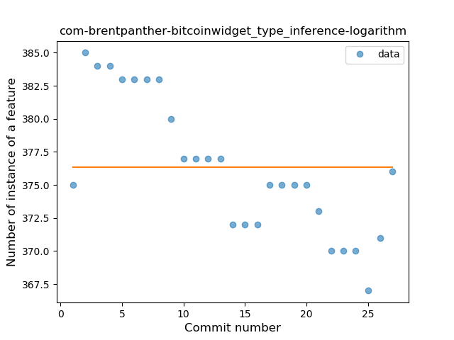
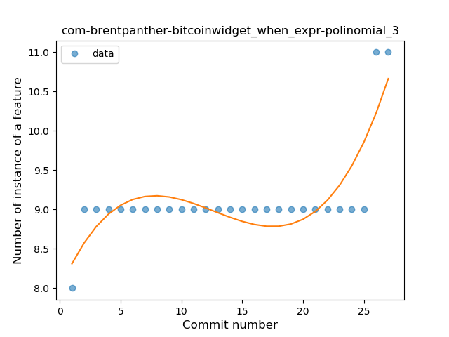
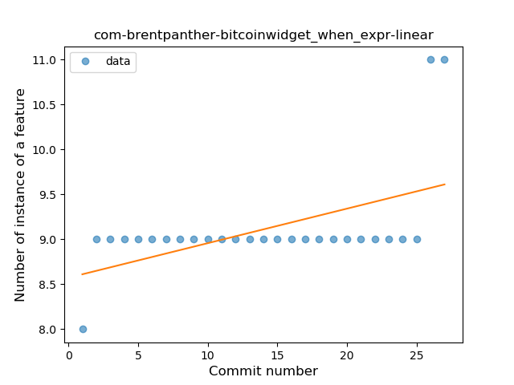

## com-brentpanther-bitcoinwidget
----
#### Metrics provided by Detekt
* Number of lines of code 2696
* Number of Kotlin files: 24
* Cyclomatic complexity: 448
* Cyclomatic complexity by thousands of lines: 265 

----
**9** features analyzed

*	<a href="#type_inference">Type Inference</a> 
*	<a href="#lambda">Lambda</a> 
*	<a href="#safe_call">Safe Call</a> 
*	<a href="#when_expr">When expression</a> 
*	<a href="#unsafe_call">Unsafe Call</a> 
*	<a href="#companion_object">Companion Object</a> 
*	<a href="#string_template">String Template</a> 
*	<a href="#func_with_default_value">Function with Default Value</a> 
*	<a href="#singleton">Singleton</a> 

### <a name="type_inference">Type Inference</a>
----
#### Functions
* **Instability - Polinomial 4:** 
    * **R_Squared:** 0.78619148
* **Instability - Polinomial 3:** )
    * **R_Squared:** 0.75871473
* **Constant Decline - Linear:** 
    * **R_Squared:** 0.66964832
* **Sudden Decline - Exponential:** 
    * **R_Squared:** 0.67346574
* **Sudden Rise Plateau - Logarithm:** 
    * **R_Squared:** -0.0

**Plots** :chart_with_upwards_trend:
-----

### <a name="lambda">Lambda</a>
----
#### Functions
* **Instability - Polinomial 4:** 
    * **R_Squared:** 0.75231063
* **Sudden Rise Plateau - Logarithm:** 
    * **R_Squared:** 0.65580844
* **Constant Rise - Linear:** 
    * **R_Squared:** 0.60361549

**Plots** :chart_with_upwards_trend:
-----

### <a name="safe_call">Safe Call</a>
----
#### Functions
* **Instability - Polinomial 4:** 
    * **R_Squared:** 0.81318616
* **Sudden Rise Plateau - Logarithm:** 
    * **R_Squared:** 0.37640735
* **Constant Rise - Linear:** 
    * **R_Squared:** 0.1251755

**Plots** :chart_with_upwards_trend:
-----

### <a name="when_expr">When expression</a>
----
#### Functions
* **Sudden Rise - Exponential:** 
    * **R_Squared:** 0.7522851
* **Instability - Polinomial 3:** )
    * **R_Squared:** 0.70821957
* **Constant Rise - Linear:** 
    * **R_Squared:** 0.2795858
* **Sudden Rise Plateau - Logarithm:** 
    * **R_Squared:** 0.2208697

**Plots** :chart_with_upwards_trend:
-----

### <a name="unsafe_call">Unsafe Call</a>
----
#### Functions
* **Instability - Polinomial 3:** )
    * **R_Squared:** 0.86283848
* **Instability - Polinomial 4:** 
    * **R_Squared:** 0.86641182
* **Constant Rise - Linear:** 
    * **R_Squared:** 0.78044754
* **Sudden Rise Plateau - Logarithm:** 
    * **R_Squared:** 0.68142948

**Plots** :chart_with_upwards_trend:
-----

### <a name="companion_object">Companion Object</a>
----
#### Functions
* **Instability - Polinomial 3:** )
    * **R_Squared:** 0.43349754
* **Sudden Rise Plateau - Logarithm:** 
    * **R_Squared:** 0.32265014
* **Constant Rise - Linear:** 
    * **R_Squared:** 0.10714286

**Plots** :chart_with_upwards_trend:
-----

### <a name="string_template">String Template</a>
----
#### Functions
* **Instability - Polinomial 3:** )
    * **R_Squared:** 0.41190761
* **Constant Decline - Linear:** 
    * **R_Squared:** 0.30080008
* **Sudden Rise Plateau - Logarithm:** 
    * **R_Squared:** 0.0

**Plots** :chart_with_upwards_trend:
-----

### <a name="func_with_default_value">Function with Default Value</a>
----
#### Functions
* **Sudden Rise - Exponential:** 
    * **R_Squared:** 0.7522851
* **Instability - Polinomial 3:** )
    * **R_Squared:** 0.70821957
* **Constant Rise - Linear:** 
    * **R_Squared:** 0.2795858
* **Sudden Rise Plateau - Logarithm:** 
    * **R_Squared:** 0.2208697
* **Plateau Sudden Rise - Binary Sigmoid:** 
    * **R_Squared:** 0.15213296

**Plots** :chart_with_upwards_trend:
-----

### <a name="singleton">Singleton</a>
----
#### Functions
* **Sudden Rise - Exponential:** 
    * **R_Squared:** 0.83613749
* **Plateau Gradual Rise - Sigmoid:** 
    * **R_Squared:** 0.83714266
* **Constant Rise - Linear:** 
    * **R_Squared:** 0.75170519
* **Sudden Rise Plateau - Logarithm:** 
    * **R_Squared:** 0.47981447

**Plots** :chart_with_upwards_trend:
-----

