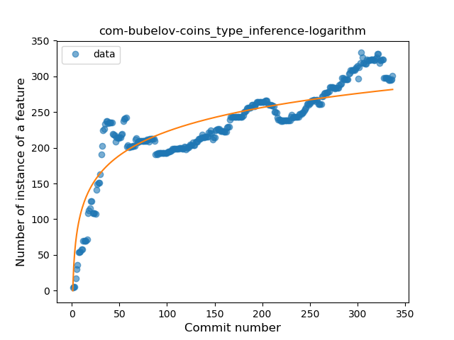
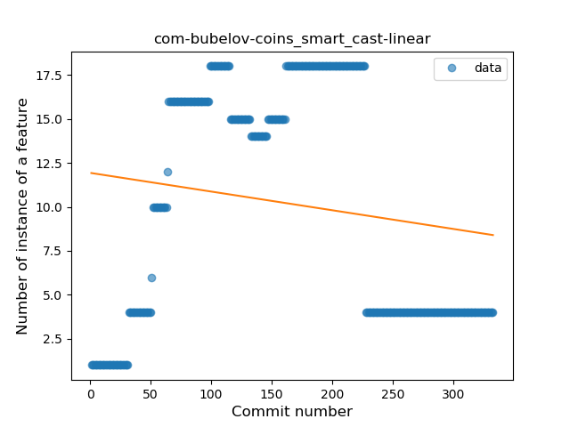
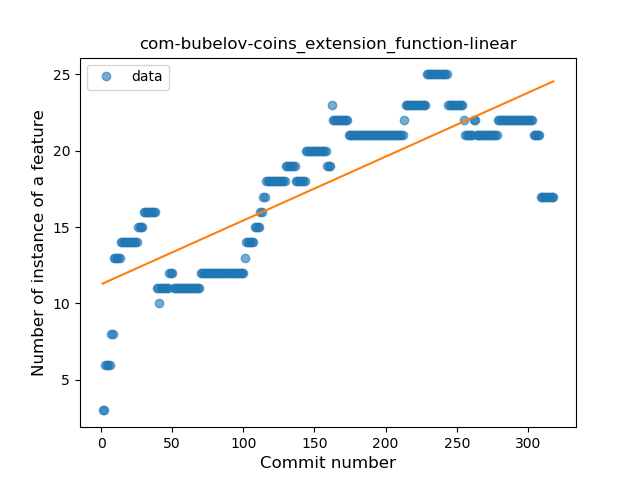
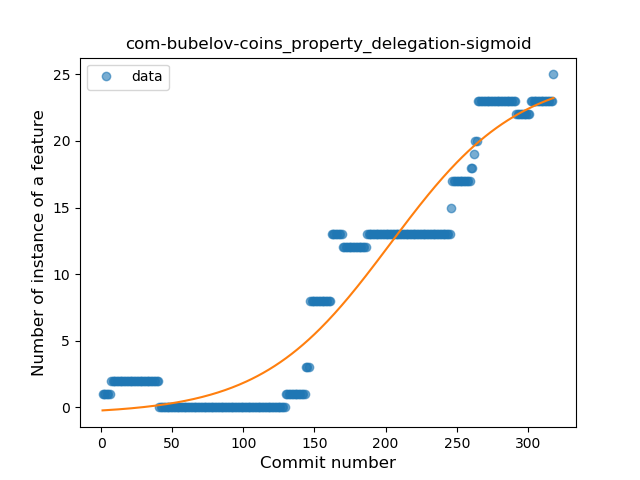
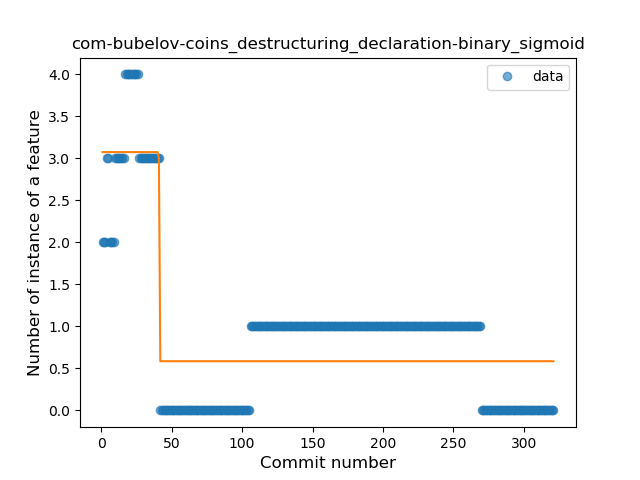
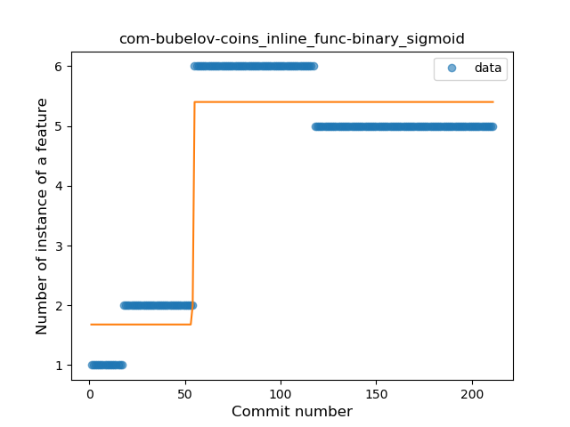
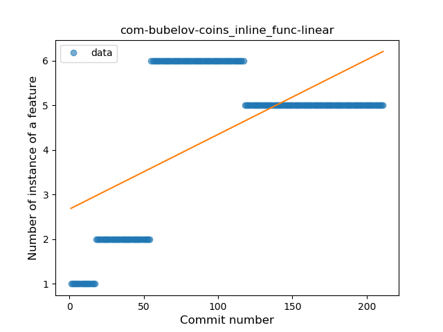

## com-bubelov-coins
----
#### Metrics provided by Detekt
* Number of lines of code 9092
* Number of Kotlin files: 146
* Cyclomatic complexity: 604
* Cyclomatic complexity by thousands of lines: 195 

----
**19** features analyzed

*	<a href="#type_inference">Type Inference</a> 
*	<a href="#lambda">Lambda</a> 
*	<a href="#safe_call">Safe Call</a> 
*	<a href="#when_expr">When expression</a> 
*	<a href="#unsafe_call">Unsafe Call</a> 
*	<a href="#companion_object">Companion Object</a> 
*	<a href="#string_template">String Template</a> 
*	<a href="#func_with_default_value">Function with Default Value</a> 
*	<a href="#singleton">Singleton</a> 
*	<a href="#range_expr">Range Expression</a> 
*	<a href="#smart_cast">Smart Cast</a> 
*	<a href="#data_class">Data Class</a> 
*	<a href="#func_call_with_named_arg">Function call with Named Argument</a> 
*	<a href="#extension_function">Extension Function</a> 
*	<a href="#property_delegation">Property Delegation</a> 
*	<a href="#destructuring_declaration">Destructuring Declaration</a> 
*	<a href="#inline_func">Inline Function</a> 
*	<a href="#coroutine">Coroutine</a> 
*	<a href="#sealed_class">Sealed Class</a> 

### <a name="type_inference">Type Inference</a>
----
#### Functions
* **Sudden Rise Plateau - Logarithm:** 
    * **R_Squared:** 0.8040491
* **Constant Rise - Linear:** 
    * **R_Squared:** 0.72495367

**Plots** :chart_with_upwards_trend:
-----

### <a name="lambda">Lambda</a>
----
#### Functions
* **Constant Rise - Linear:** 
    * **R_Squared:** 0.91602384
* **Sudden Rise Plateau - Logarithm:** 
    * **R_Squared:** 0.76120771
* **Plateau Sudden Rise - Binary Sigmoid:** 
    * **R_Squared:** 0.62101086

**Plots** :chart_with_upwards_trend:
-----

### <a name="safe_call">Safe Call</a>
----
#### Functions
* **Sudden Rise Plateau - Logarithm:** 
    * **R_Squared:** 0.43997216
* **Plateau Gradual Rise - Sigmoid:** 
    * **R_Squared:** 0.30056216
* **Constant Rise - Linear:** 
    * **R_Squared:** 0.21561215

**Plots** :chart_with_upwards_trend:
-----

### <a name="when_expr">When expression</a>
----
#### Functions
* **Plateau Gradual Rise - Sigmoid:** 
    * **R_Squared:** 0.52360741
* **Sudden Rise Plateau - Logarithm:** 
    * **R_Squared:** 0.39868133
* **Constant Rise - Linear:** 
    * **R_Squared:** 0.06132832

**Plots** :chart_with_upwards_trend:
-----

### <a name="unsafe_call">Unsafe Call</a>
----
#### Functions
* **Constant Decline - Linear:** 
    * **R_Squared:** 0.61971369
* **Plateau Gradual Decline - Sigmoid:** 
    * **R_Squared:** 0.56531423
* **Sudden Decline - Exponential:** 
    * **R_Squared:** -0.0
* **Sudden Rise Plateau - Logarithm:** 
    * **R_Squared:** -0.0

**Plots** :chart_with_upwards_trend:
-----

### <a name="companion_object">Companion Object</a>
----
#### Functions
* **Plateau Gradual Rise - Sigmoid:** 
    * **R_Squared:** 0.72227158
* **Sudden Rise Plateau - Logarithm:** 
    * **R_Squared:** 0.42125326
* **Constant Rise - Linear:** 
    * **R_Squared:** 0.12062166

**Plots** :chart_with_upwards_trend:
-----

### <a name="string_template">String Template</a>
----
#### Functions
* **Plateau Gradual Rise - Sigmoid:** 
    * **R_Squared:** 0.49556466
* **Sudden Rise Plateau - Logarithm:** 
    * **R_Squared:** 0.33288225
* **Constant Rise - Linear:** 
    * **R_Squared:** 0.29700935

**Plots** :chart_with_upwards_trend:
-----

### <a name="func_with_default_value">Function with Default Value</a>
----
#### Functions
* **Sudden Rise Plateau - Logarithm:** 
    * **R_Squared:** 0.25347778
* **Constant Rise - Linear:** 
    * **R_Squared:** 0.18834441
* **Plateau Sudden Rise - Binary Sigmoid:** 
    * **R_Squared:** 0.00378611

**Plots** :chart_with_upwards_trend:
-----

### <a name="singleton">Singleton</a>
----
#### Functions
* **Constant Decline - Linear:** 
    * **R_Squared:** 0.64133199
* **Sudden Decline - Exponential:** 
    * **R_Squared:** 0.64165518
* **Plateau Sudden Rise - Binary Sigmoid:** 
    * **R_Squared:** 0.04725869
* **Sudden Rise Plateau - Logarithm:** 
    * **R_Squared:** 0.0

**Plots** :chart_with_upwards_trend:
-----

### <a name="range_expr">Range Expression</a>
----
#### Functions
* **Constant Decline - Linear:** 
    * **R_Squared:** 0.53879005
* **Sudden Rise Plateau - Logarithm:** 
    * **R_Squared:** -0.0
* **Plateau Gradual Rise - Sigmoid:** 
    * **R_Squared:** 0.0033611

**Plots** :chart_with_upwards_trend:
-----

### <a name="smart_cast">Smart Cast</a>
----
#### Functions
* **Plateau Gradual Rise - Sigmoid:** 
    * **R_Squared:** 0.26465889
* **Sudden Rise Plateau - Logarithm:** 
    * **R_Squared:** 0.03646511
* **Constant Decline - Linear:** 
    * **R_Squared:** 0.02381051

**Plots** :chart_with_upwards_trend:
-----

### <a name="data_class">Data Class</a>
----
#### Functions
* **Sudden Rise Plateau - Logarithm:** 
    * **R_Squared:** 0.83808072
* **Constant Rise - Linear:** 
    * **R_Squared:** 0.75330603
* **Plateau Sudden Rise - Binary Sigmoid:** 
    * **R_Squared:** 0.48145407

**Plots** :chart_with_upwards_trend:
-----

### <a name="func_call_with_named_arg">Function call with Named Argument</a>
----
#### Functions
* **Constant Rise - Linear:** 
    * **R_Squared:** 0.59175144
* **Sudden Rise - Exponential:** 
    * **R_Squared:** 0.59773327
* **Sudden Rise Plateau - Logarithm:** 
    * **R_Squared:** 0.54352561

**Plots** :chart_with_upwards_trend:
-----

### <a name="extension_function">Extension Function</a>
----
#### Functions
* **Constant Rise - Linear:** 
    * **R_Squared:** 0.65854758
* **Sudden Rise Plateau - Logarithm:** 
    * **R_Squared:** 0.65232206
* **Plateau Sudden Rise - Binary Sigmoid:** 
    * **R_Squared:** 0.16625615

**Plots** :chart_with_upwards_trend:
-----

### <a name="property_delegation">Property Delegation</a>
----
#### Functions
* **Plateau Gradual Rise - Sigmoid:** 
    * **R_Squared:** 0.92846378
* **Sudden Rise - Exponential:** 
    * **R_Squared:** 0.90345713
* **Constant Rise - Linear:** 
    * **R_Squared:** 0.85673701
* **Sudden Rise Plateau - Logarithm:** 
    * **R_Squared:** 0.26161495

**Plots** :chart_with_upwards_trend:
-----

### <a name="destructuring_declaration">Destructuring Declaration</a>
----
#### Functions
* **Plateau Sudden Decline - Binary Sigmoid:** 
    * **R_Squared:** 0.72314989
* **Sudden Decline - Exponential:** 
    * **R_Squared:** 0.42487025
* **Constant Decline - Linear:** 
    * **R_Squared:** 0.20589182
* **Sudden Rise Plateau - Logarithm:** 
    * **R_Squared:** -0.0

**Plots** :chart_with_upwards_trend:
-----

### <a name="inline_func">Inline Function</a>
----
#### Functions
* **Plateau Sudden Rise - Binary Sigmoid:** 
    * **R_Squared:** 0.91846297
* **Sudden Rise Plateau - Logarithm:** 
    * **R_Squared:** 0.54683728
* **Constant Rise - Linear:** 
    * **R_Squared:** 0.36314786

**Plots** :chart_with_upwards_trend:
-----

### <a name="coroutine">Coroutine</a>
----
#### Functions
* **Sudden Rise - Exponential:** 
    * **R_Squared:** 0.91455486
* **Constant Rise - Linear:** 
    * **R_Squared:** 0.89538284
* **Sudden Rise Plateau - Logarithm:** 
    * **R_Squared:** 0.6308497

**Plots** :chart_with_upwards_trend:
-----

### <a name="sealed_class">Sealed Class</a>
----
#### Functions
* **Plateau Sudden Rise - Binary Sigmoid:** 
    * **R_Squared:** 0.3706965
* **Constant Decline - Linear:** 
    * **R_Squared:** 0.0298133
* **Sudden Rise Plateau - Logarithm:** 
    * **R_Squared:** 0.01122113

**Plots** :chart_with_upwards_trend:
-----

