## com-calintat-sensors
----
#### Metrics provided by Detekt
* Number of lines of code 1123
* Number of Kotlin files: 18
* Cyclomatic complexity: 94
* Cyclomatic complexity by thousands of lines: 205 

----
**16** features analyzed

*	<a href="#type_inference">Type Inference</a> 
*	<a href="#lambda">Lambda</a> 
*	<a href="#safe_call">Safe Call</a> 
*	<a href="#when_expr">When expression</a> 
*	<a href="#unsafe_call">Unsafe Call</a> 
*	<a href="#companion_object">Companion Object</a> 
*	<a href="#string_template">String Template</a> 
*	<a href="#func_with_default_value">Function with Default Value</a> 
*	<a href="#singleton">Singleton</a> 
*	<a href="#data_class">Data Class</a> 
*	<a href="#func_call_with_named_arg">Function call with Named Argument</a> 
*	<a href="#extension_function">Extension Function</a> 
*	<a href="#property_delegation">Property Delegation</a> 
*	<a href="#destructuring_declaration">Destructuring Declaration</a> 
*	<a href="#overloaded_op">Overloaded Operator</a> 
*	<a href="#infix_func">Infix Function</a> 

### <a name="type_inference">Type Inference</a>
----
#### Functions
* **Plateau Sudden Decline - Binary Sigmoid:** 
    * **R_Squared:** 0.80856459
* **Sudden Decline - Exponential:** 
    * **R_Squared:** 0.69423898
* **Constant Decline - Linear:** 
    * **R_Squared:** 0.51966816
* **Sudden Rise Plateau - Logarithm:** 
    * **R_Squared:** -0.0

**Plots** :chart_with_upwards_trend:
-----

### <a name="lambda">Lambda</a>
----
#### Functions
* **Plateau Gradual Rise - Sigmoid:** 
    * **R_Squared:** 0.92685036
* **Sudden Rise Plateau - Logarithm:** 
    * **R_Squared:** 0.7895359
* **Constant Rise - Linear:** 
    * **R_Squared:** 0.52441295

**Plots** :chart_with_upwards_trend:
-----

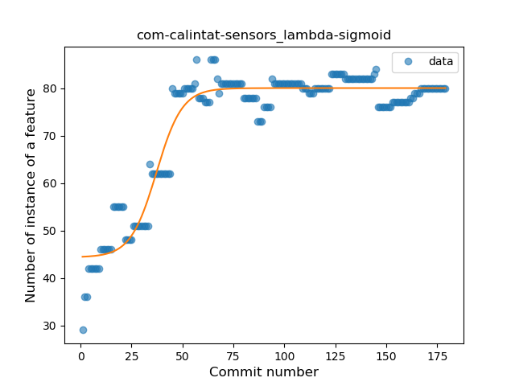

### <a name="safe_call">Safe Call</a>
----
#### Functions
* **Sudden Rise Plateau - Logarithm:** 
    * **R_Squared:** 0.58131562
* **Constant Rise - Linear:** 
    * **R_Squared:** 0.53653552
* **Plateau Sudden Rise - Binary Sigmoid:** 
    * **R_Squared:** 0.02557691

**Plots** :chart_with_upwards_trend:
-----

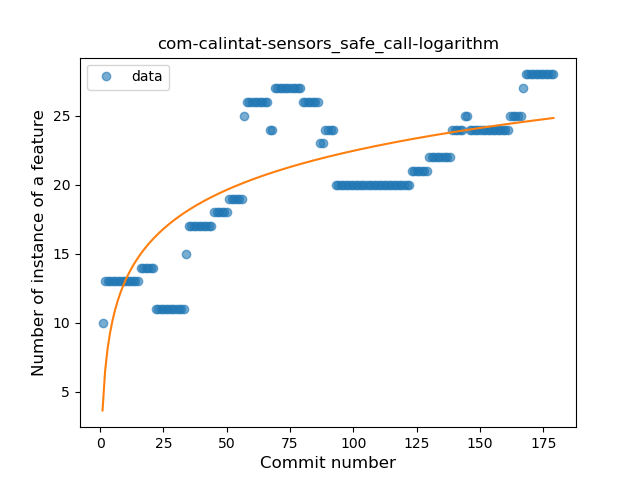

### <a name="when_expr">When expression</a>
----
#### Functions
* **Sudden Decline - Exponential:** 
    * **R_Squared:** 0.57036919
* **Constant Decline - Linear:** 
    * **R_Squared:** 0.553987
* **Sudden Rise Plateau - Logarithm:** 
    * **R_Squared:** -0.0

**Plots** :chart_with_upwards_trend:
-----

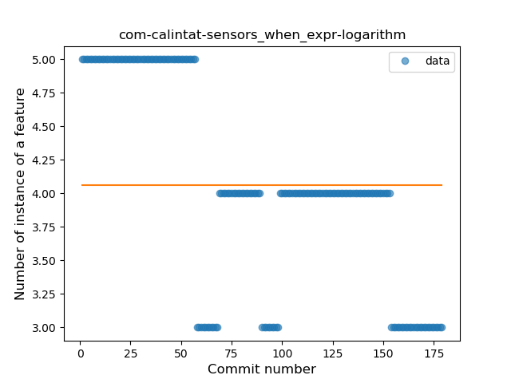
### <a name="unsafe_call">Unsafe Call</a>
----
#### Functions
* **Plateau Gradual Decline - Sigmoid:** 
    * **R_Squared:** 0.87685748
* **Sudden Decline - Exponential:** 
    * **R_Squared:** 0.80480415
* **Constant Decline - Linear:** 
    * **R_Squared:** 0.76115267
* **Sudden Rise Plateau - Logarithm:** 
    * **R_Squared:** -0.0

**Plots** :chart_with_upwards_trend:
-----

### <a name="companion_object">Companion Object</a>
----
#### Functions
* **Plateau Gradual Rise - Sigmoid:** 
    * **R_Squared:** 0.21748647
* **Constant Decline - Linear:** 
    * **R_Squared:** 0.07423077
* **Sudden Rise Plateau - Logarithm:** 
    * **R_Squared:** 0.00236687

**Plots** :chart_with_upwards_trend:
-----

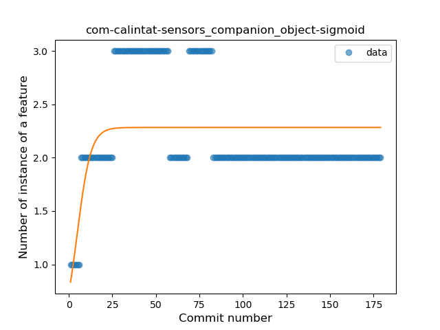

### <a name="string_template">String Template</a>
----
#### Functions
* **Plateau Gradual Decline - Sigmoid:** 
    * **R_Squared:** 0.84441775
* **Constant Decline - Linear:** 
    * **R_Squared:** 0.44259381
* **Sudden Rise - Exponential:** 
    * **R_Squared:** 0.00849595
* **Sudden Rise Plateau - Logarithm:** 
    * **R_Squared:** 0.0

**Plots** :chart_with_upwards_trend:
-----

### <a name="func_with_default_value">Function with Default Value</a>
----
#### Functions
* **Sudden Decline - Exponential:** 
    * **R_Squared:** 0.84943046
* **Plateau Gradual Decline - Sigmoid:** 
    * **R_Squared:** 0.85510346
* **Constant Decline - Linear:** 
    * **R_Squared:** 0.65124521
* **Sudden Rise Plateau - Logarithm:** 
    * **R_Squared:** 0.0

**Plots** :chart_with_upwards_trend:
-----

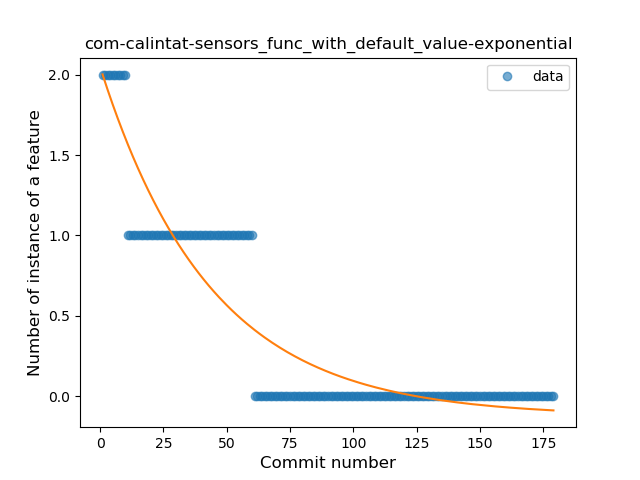

### <a name="singleton">Singleton</a>
----
#### Functions
* **Sudden Rise - Exponential:** 
    * **R_Squared:** 0.36813113
* **Constant Rise - Linear:** 
    * **R_Squared:** 0.32189416
* **Sudden Rise Plateau - Logarithm:** 
    * **R_Squared:** 0.15293137
* **Plateau Sudden Rise - Binary Sigmoid:** 
    * **R_Squared:** 0.02209536

**Plots** :chart_with_upwards_trend:
-----

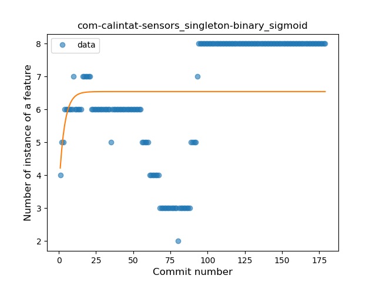
### <a name="data_class">Data Class</a>
----
#### Functions
* **Sudden Decline - Exponential:** 
    * **R_Squared:** 0.63689599
* **Constant Decline - Linear:** 
    * **R_Squared:** 0.59228821
* **Sudden Rise Plateau - Logarithm:** 
    * **R_Squared:** -0.0

**Plots** :chart_with_upwards_trend:
-----

### <a name="func_call_with_named_arg">Function call with Named Argument</a>
----
#### Functions
* **Plateau Gradual Rise - Sigmoid:** 
    * **R_Squared:** 0.88121717
* **Instability - Polinomial 3:** )
    * **R_Squared:** 0.83668787
* **Sudden Rise Plateau - Logarithm:** 
    * **R_Squared:** 0.55776861
* **Constant Rise - Linear:** 
    * **R_Squared:** 0.25961646

**Plots** :chart_with_upwards_trend:
-----

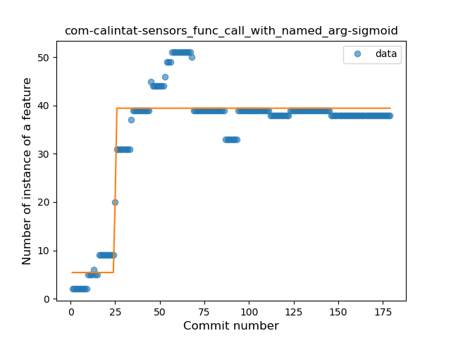

### <a name="extension_function">Extension Function</a>
----
#### Functions
* **Plateau Gradual Rise - Sigmoid:** 
    * **R_Squared:** 0.52416783
* **Sudden Rise Plateau - Logarithm:** 
    * **R_Squared:** 0.36837369
* **Constant Rise - Linear:** 
    * **R_Squared:** 0.25979971

**Plots** :chart_with_upwards_trend:
-----

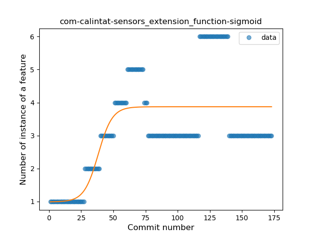

### <a name="property_delegation">Property Delegation</a>
----
#### Functions
* **Sudden Decline - Exponential:** 
    * **R_Squared:** 0.7020882
* **Constant Decline - Linear:** 
    * **R_Squared:** 0.65600708
* **Plateau Sudden Decline - Binary Sigmoid:** 
    * **R_Squared:** 0.06764074
* **Sudden Rise Plateau - Logarithm:** 
    * **R_Squared:** -0.0

**Plots** :chart_with_upwards_trend:
-----

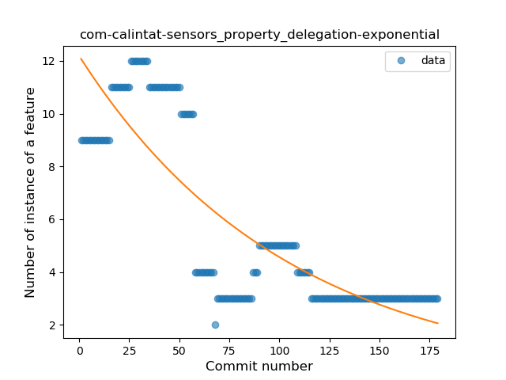

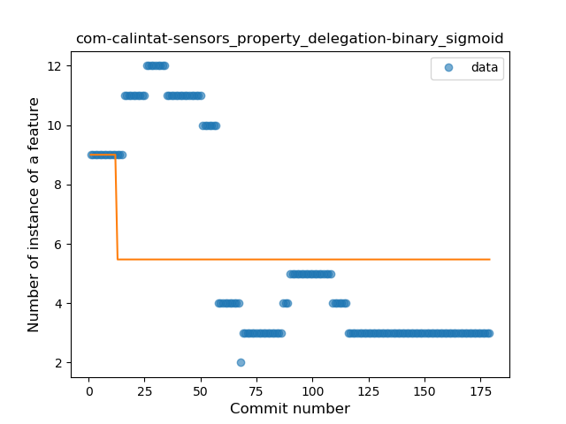
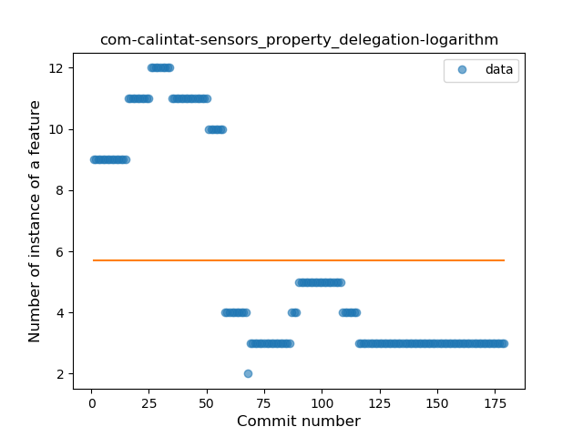
### <a name="destructuring_declaration">Destructuring Declaration</a>
----
#### Functions
* **Plateau Sudden Decline - Binary Sigmoid:** 
    * **R_Squared:** 1.0
* **Sudden Decline - Exponential:** 
    * **R_Squared:** 0.80255031
* **Constant Decline - Linear:** 
    * **R_Squared:** 0.20205993
* **Sudden Rise Plateau - Logarithm:** 
    * **R_Squared:** -0.0

**Plots** :chart_with_upwards_trend:
-----

### <a name="overloaded_op">Overloaded Operator</a>
----
#### Functions
* **Plateau Sudden Decline - Binary Sigmoid:** 
    * **R_Squared:** 1.0
* **Sudden Decline - Exponential:** 
    * **R_Squared:** 0.7942247
* **Constant Decline - Linear:** 
    * **R_Squared:** 0.30730619
* **Sudden Rise Plateau - Logarithm:** 
    * **R_Squared:** 0.0

**Plots** :chart_with_upwards_trend:
-----

### <a name="infix_func">Infix Function</a>
----
#### Functions
* **Plateau Sudden Decline - Binary Sigmoid:** 
    * **R_Squared:** 1.0
* **Sudden Decline - Exponential:** 
    * **R_Squared:** 0.75125321
* **Constant Decline - Linear:** 
    * **R_Squared:** 0.73897354
* **Sudden Rise Plateau - Logarithm:** 
    * **R_Squared:** -0.0

**Plots** :chart_with_upwards_trend:
-----

