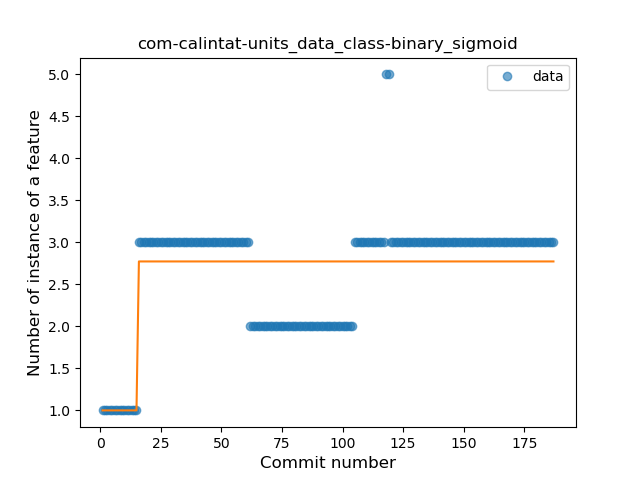
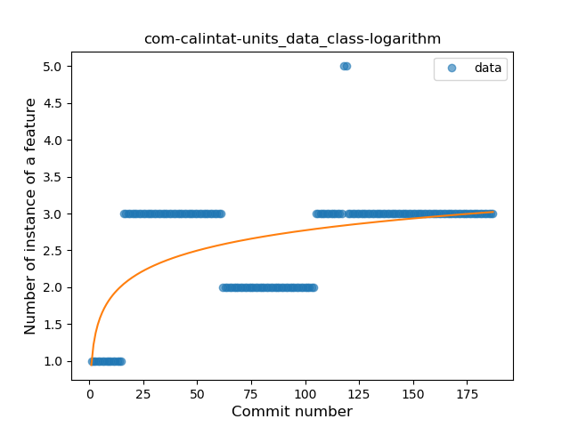
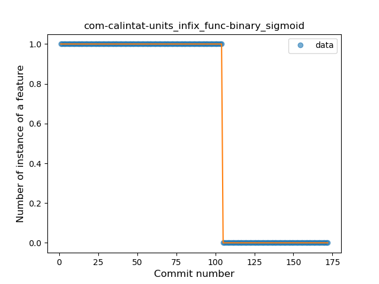

## com-calintat-units
----
#### Metrics provided by Detekt
* Number of lines of code 2063
* Number of Kotlin files: 17
* Cyclomatic complexity: 95
* Cyclomatic complexity by thousands of lines: 93 

----
**14** features analyzed

*	<a href="#type_inference">Type Inference</a> 
*	<a href="#lambda">Lambda</a> 
*	<a href="#safe_call">Safe Call</a> 
*	<a href="#when_expr">When expression</a> 
*	<a href="#unsafe_call">Unsafe Call</a> 
*	<a href="#companion_object">Companion Object</a> 
*	<a href="#string_template">String Template</a> 
*	<a href="#func_with_default_value">Function with Default Value</a> 
*	<a href="#singleton">Singleton</a> 
*	<a href="#data_class">Data Class</a> 
*	<a href="#func_call_with_named_arg">Function call with Named Argument</a> 
*	<a href="#extension_function">Extension Function</a> 
*	<a href="#property_delegation">Property Delegation</a> 
*	<a href="#infix_func">Infix Function</a> 

### <a name="type_inference">Type Inference</a>
----
#### Functions
* **Instability - Polinomial 3:** )
    * **R_Squared:** 0.79233119
* **Sudden Decline - Exponential:** 
    * **R_Squared:** 0.75338909
* **Constant Decline - Linear:** 
    * **R_Squared:** 0.42003143
* **Sudden Rise Plateau - Logarithm:** 
    * **R_Squared:** -0.0

**Plots** :chart_with_upwards_trend:
-----

### <a name="lambda">Lambda</a>
----
#### Functions
* **Plateau Gradual Rise - Sigmoid:** 
    * **R_Squared:** 0.88838036
* **Sudden Rise Plateau - Logarithm:** 
    * **R_Squared:** 0.78353798
* **Constant Rise - Linear:** 
    * **R_Squared:** 0.66477421

**Plots** :chart_with_upwards_trend:
-----

### <a name="safe_call">Safe Call</a>
----
#### Functions
* **Sudden Rise Plateau - Logarithm:** 
    * **R_Squared:** 0.59732605
* **Constant Rise - Linear:** 
    * **R_Squared:** 0.46694263

**Plots** :chart_with_upwards_trend:
-----

### <a name="when_expr">When expression</a>
----
#### Functions
* **Constant Decline - Linear:** 
    * **R_Squared:** 0.53039367
* **Sudden Rise Plateau - Logarithm:** 
    * **R_Squared:** -0.0

**Plots** :chart_with_upwards_trend:
-----

### <a name="unsafe_call">Unsafe Call</a>
----
#### Functions
* **Sudden Rise - Exponential:** 
    * **R_Squared:** 0.3723295
* **Constant Rise - Linear:** 
    * **R_Squared:** 0.16892427
* **Sudden Rise Plateau - Logarithm:** 
    * **R_Squared:** 0.00217809

**Plots** :chart_with_upwards_trend:
-----

### <a name="companion_object">Companion Object</a>
----
#### Functions
* **Sudden Rise - Exponential:** 
    * **R_Squared:** 0.50284551
* **Plateau Gradual Rise - Sigmoid:** 
    * **R_Squared:** 0.50794731
* **Constant Rise - Linear:** 
    * **R_Squared:** 0.47843887
* **Sudden Rise Plateau - Logarithm:** 
    * **R_Squared:** 0.29125759

**Plots** :chart_with_upwards_trend:
-----

### <a name="string_template">String Template</a>
----
#### Functions
* **Plateau Gradual Rise - Sigmoid:** 
    * **R_Squared:** 0.99065159
* **Sudden Rise - Exponential:** 
    * **R_Squared:** 0.78497237
* **Constant Rise - Linear:** 
    * **R_Squared:** 0.7621852
* **Sudden Rise Plateau - Logarithm:** 
    * **R_Squared:** 0.2940663

**Plots** :chart_with_upwards_trend:
-----

### <a name="func_with_default_value">Function with Default Value</a>
----
#### Functions
* **Plateau Gradual Decline - Sigmoid:** 
    * **R_Squared:** 0.92085427
* **Sudden Decline - Exponential:** 
    * **R_Squared:** 0.90680613
* **Constant Decline - Linear:** 
    * **R_Squared:** 0.33835129
* **Sudden Rise Plateau - Logarithm:** 
    * **R_Squared:** -0.0

**Plots** :chart_with_upwards_trend:
-----

### <a name="singleton">Singleton</a>
----
#### Functions
* **Plateau Gradual Rise - Sigmoid:** 
    * **R_Squared:** 0.86363969
* **Sudden Rise Plateau - Logarithm:** 
    * **R_Squared:** 0.74028712
* **Constant Rise - Linear:** 
    * **R_Squared:** 0.62580276

**Plots** :chart_with_upwards_trend:
-----

### <a name="data_class">Data Class</a>
----
#### Functions
* **Plateau Sudden Rise - Binary Sigmoid:** 
    * **R_Squared:** 0.50716713
* **Sudden Rise Plateau - Logarithm:** 
    * **R_Squared:** 0.31137473
* **Constant Rise - Linear:** 
    * **R_Squared:** 0.21300797

**Plots** :chart_with_upwards_trend:
-----

### <a name="func_call_with_named_arg">Function call with Named Argument</a>
----
#### Functions
* **Constant Rise - Linear:** 
    * **R_Squared:** 0.70969723
* **Sudden Rise Plateau - Logarithm:** 
    * **R_Squared:** 0.65426495

**Plots** :chart_with_upwards_trend:
-----

### <a name="extension_function">Extension Function</a>
----
#### Functions
* **Constant Rise - Linear:** 
    * **R_Squared:** 0.69682063
* **Sudden Rise Plateau - Logarithm:** 
    * **R_Squared:** 0.58908216

**Plots** :chart_with_upwards_trend:
-----

### <a name="property_delegation">Property Delegation</a>
----
#### Functions
* **Constant Decline - Linear:** 
    * **R_Squared:** 0.06275485
* **Sudden Rise Plateau - Logarithm:** 
    * **R_Squared:** 0.00197716

**Plots** :chart_with_upwards_trend:
-----

### <a name="infix_func">Infix Function</a>
----
#### Functions
* **Plateau Sudden Decline - Binary Sigmoid:** 
    * **R_Squared:** 1.0
* **Constant Decline - Linear:** 
    * **R_Squared:** 0.71716864
* **Sudden Rise Plateau - Logarithm:** 
    * **R_Squared:** -0.0

**Plots** :chart_with_upwards_trend:
-----

