## com-commit451-gitlab
----
#### Metrics provided by Detekt
* Number of lines of code 20824
* Number of Kotlin files: 269
* Cyclomatic complexity: 2473
* Cyclomatic complexity by thousands of lines: 222 

----
**15** features analyzed

*	<a href="#type_inference">Type Inference</a> 
*	<a href="#lambda">Lambda</a> 
*	<a href="#safe_call">Safe Call</a> 
*	<a href="#when_expr">When expression</a> 
*	<a href="#unsafe_call">Unsafe Call</a> 
*	<a href="#companion_object">Companion Object</a> 
*	<a href="#string_template">String Template</a> 
*	<a href="#func_with_default_value">Function with Default Value</a> 
*	<a href="#singleton">Singleton</a> 
*	<a href="#range_expr">Range Expression</a> 
*	<a href="#smart_cast">Smart Cast</a> 
*	<a href="#data_class">Data Class</a> 
*	<a href="#func_call_with_named_arg">Function call with Named Argument</a> 
*	<a href="#extension_function">Extension Function</a> 
*	<a href="#property_delegation">Property Delegation</a> 

### <a name="type_inference">Type Inference</a>
----
#### Functions
* **Sudden Rise Plateau - Logarithm:** 
    * **R_Squared:** 0.89207459
* **Constant Rise - Linear:** 
    * **R_Squared:** 0.65966574

**Plots** :chart_with_upwards_trend:
-----

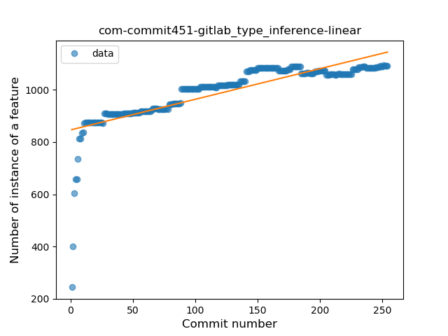
### <a name="lambda">Lambda</a>
----
#### Functions
* **Constant Rise - Linear:** 
    * **R_Squared:** 0.72811496
* **Sudden Rise - Exponential:** 
    * **R_Squared:** 0.72842415
* **Sudden Rise Plateau - Logarithm:** 
    * **R_Squared:** 0.72430661
* **Plateau Sudden Rise - Binary Sigmoid:** 
    * **R_Squared:** 0.19033006

**Plots** :chart_with_upwards_trend:
-----

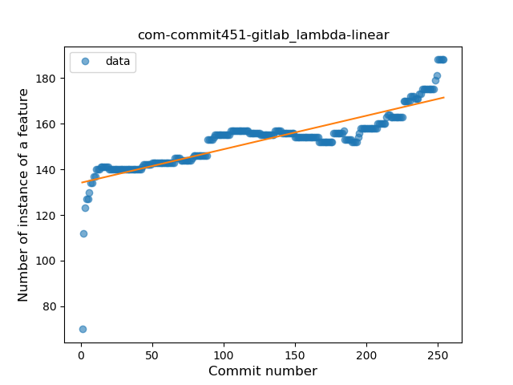
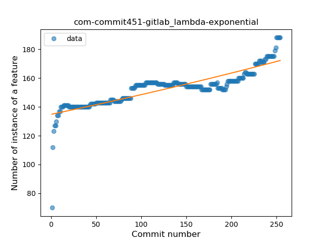
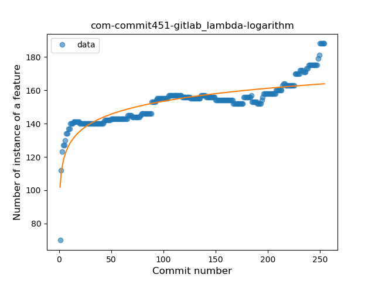
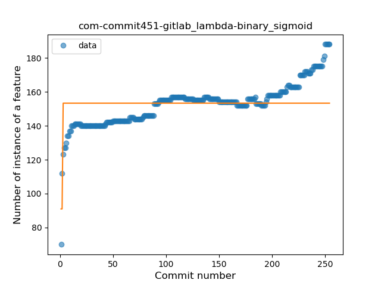
### <a name="safe_call">Safe Call</a>
----
#### Functions
* **Sudden Rise - Exponential:** 
    * **R_Squared:** 0.91183705
* **Constant Rise - Linear:** 
    * **R_Squared:** 0.83508047
* **Sudden Rise Plateau - Logarithm:** 
    * **R_Squared:** 0.35607469
* **Plateau Gradual Rise - Sigmoid:** 
    * **R_Squared:** 0.09157856

**Plots** :chart_with_upwards_trend:
-----

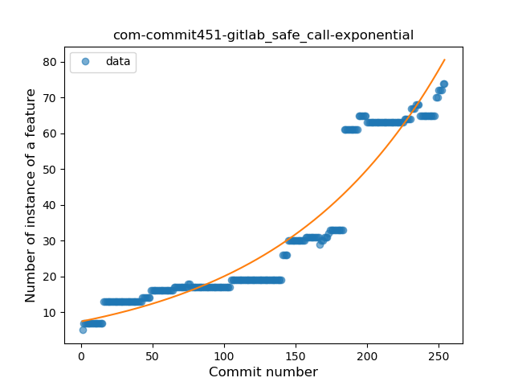
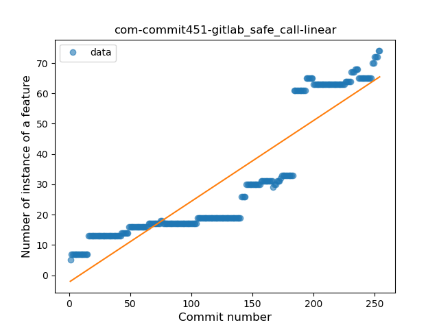
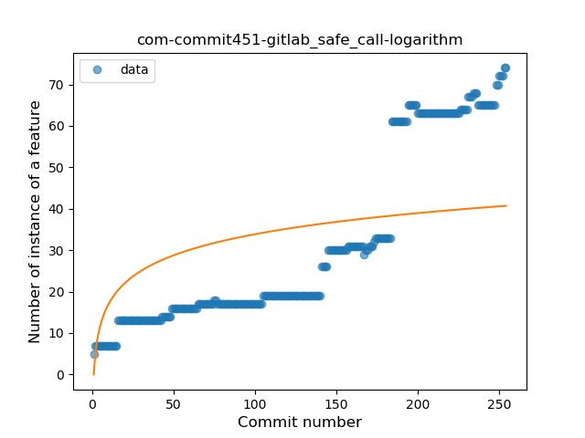
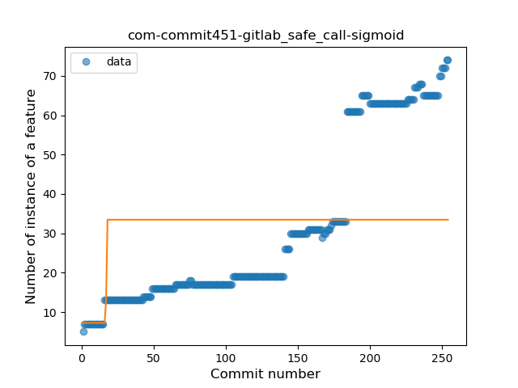
### <a name="when_expr">When expression</a>
----
#### Functions
* **Sudden Rise Plateau - Logarithm:** 
    * **R_Squared:** 0.58214847
* **Constant Rise - Linear:** 
    * **R_Squared:** 0.3515842

**Plots** :chart_with_upwards_trend:
-----

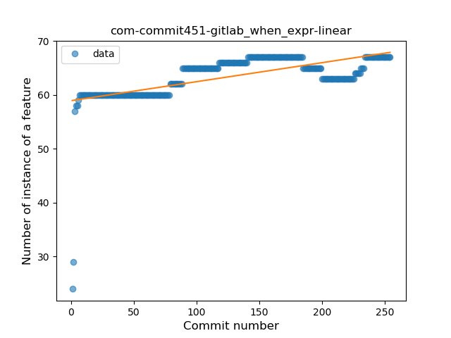
### <a name="unsafe_call">Unsafe Call</a>
----
#### Functions
* **Sudden Rise Plateau - Logarithm:** 
    * **R_Squared:** 0.29324264
* **Constant Rise - Linear:** 
    * **R_Squared:** 0.04946253

**Plots** :chart_with_upwards_trend:
-----

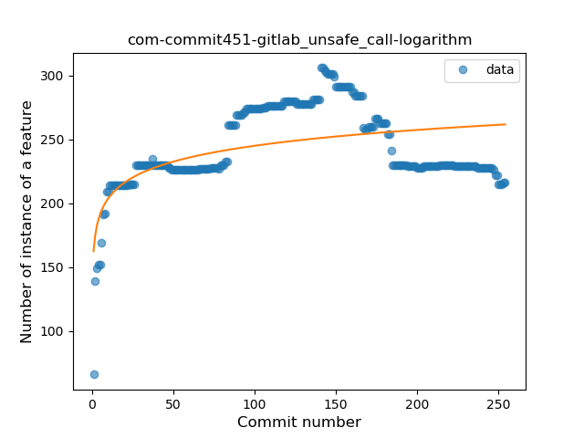
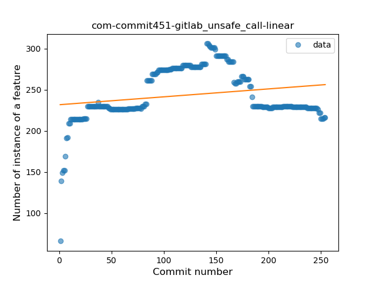
### <a name="companion_object">Companion Object</a>
----
#### Functions
* **Sudden Rise Plateau - Logarithm:** 
    * **R_Squared:** 0.74221552
* **Constant Rise - Linear:** 
    * **R_Squared:** 0.49763765
* **Plateau Sudden Rise - Binary Sigmoid:** 
    * **R_Squared:** 0.23942741

**Plots** :chart_with_upwards_trend:
-----

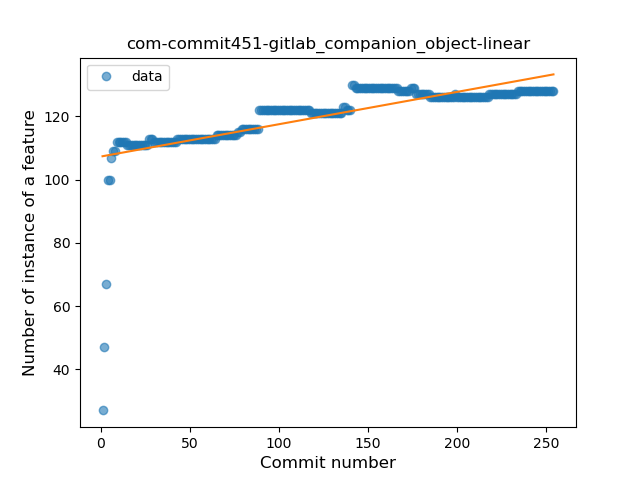
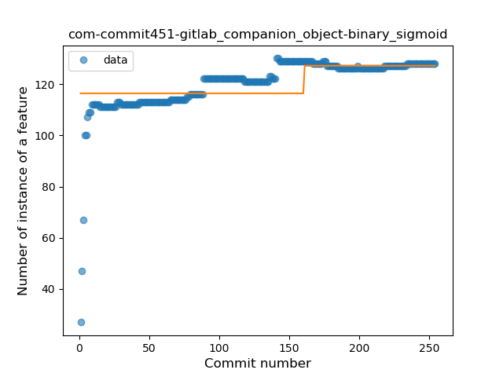
### <a name="string_template">String Template</a>
----
#### Functions
* **Constant Rise - Linear:** 
    * **R_Squared:** 0.15827543
* **Sudden Rise - Exponential:** 
    * **R_Squared:** 0.16353225
* **Sudden Rise Plateau - Logarithm:** 
    * **R_Squared:** 0.05198772

**Plots** :chart_with_upwards_trend:
-----

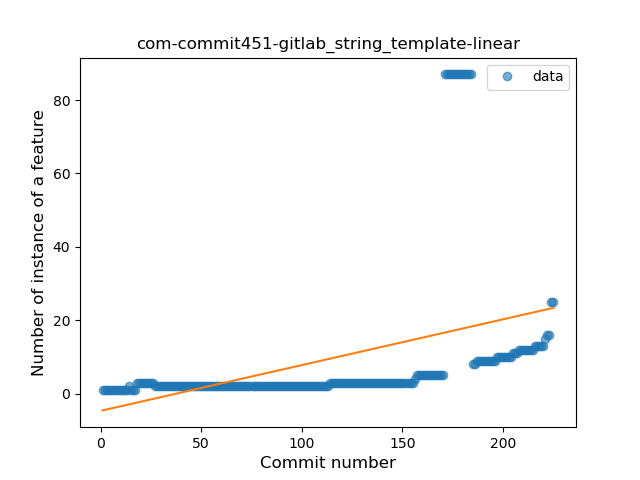
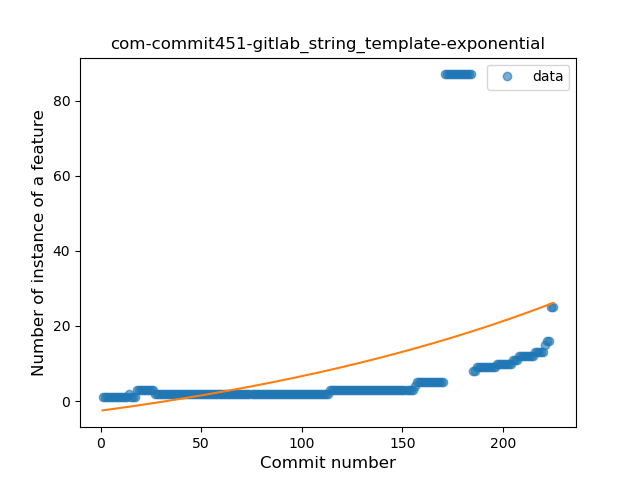
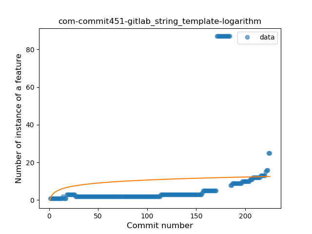
### <a name="func_with_default_value">Function with Default Value</a>
----
#### Functions
* **Sudden Rise - Exponential:** 
    * **R_Squared:** 0.73893797
* **Constant Rise - Linear:** 
    * **R_Squared:** 0.37261558
* **Plateau Gradual Rise - Sigmoid:** 
    * **R_Squared:** 0.2544299
* **Sudden Rise Plateau - Logarithm:** 
    * **R_Squared:** 0.18547532

**Plots** :chart_with_upwards_trend:
-----

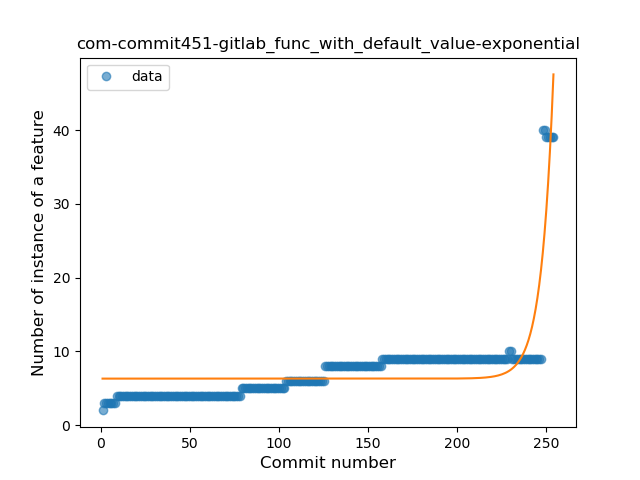
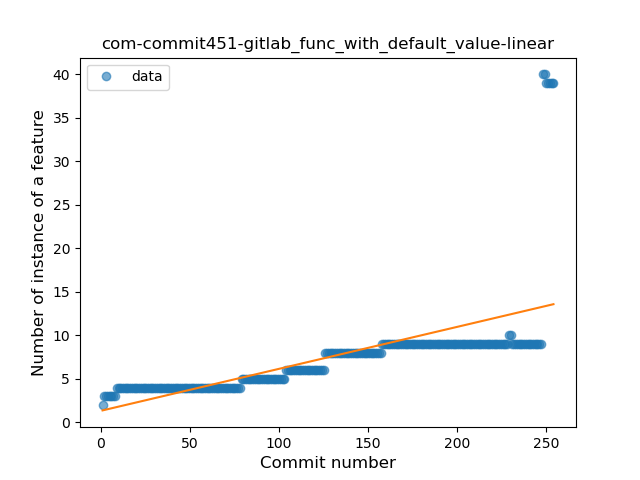
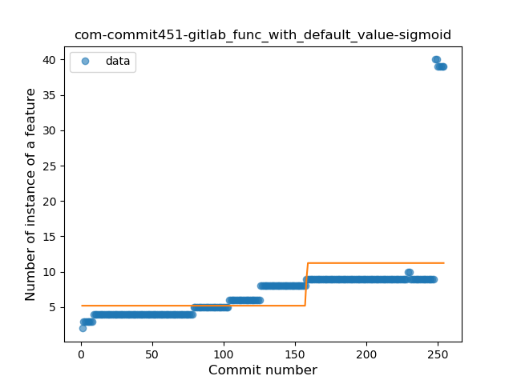
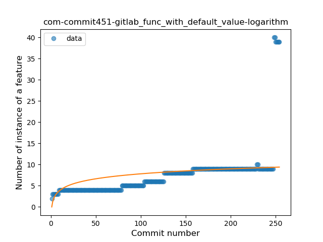
### <a name="singleton">Singleton</a>
----
#### Functions
* **Sudden Rise Plateau - Logarithm:** 
    * **R_Squared:** 0.72892422
* **Constant Rise - Linear:** 
    * **R_Squared:** 0.48242417
* **Plateau Sudden Rise - Binary Sigmoid:** 
    * **R_Squared:** 0.31203676

**Plots** :chart_with_upwards_trend:
-----

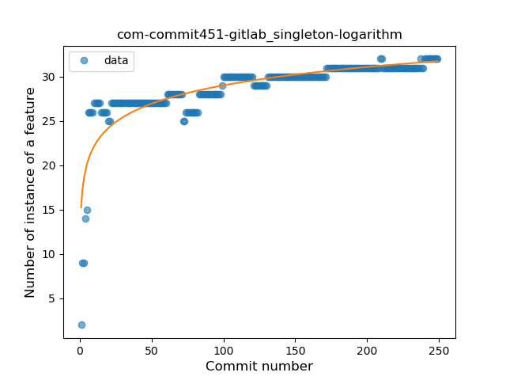
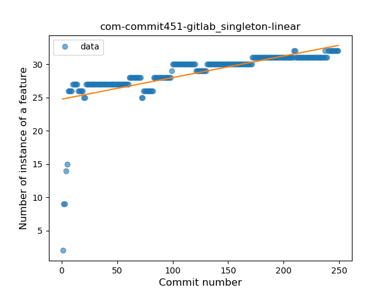
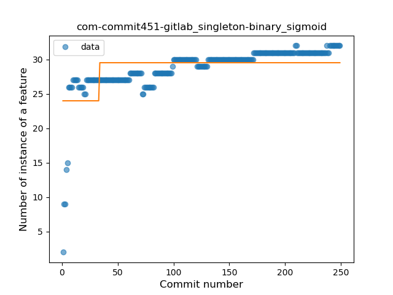
### <a name="range_expr">Range Expression</a>
----
#### Functions
* **Plateau Sudden Decline - Binary Sigmoid:** 
    * **R_Squared:** 1.0
* **Constant Decline - Linear:** 
    * **R_Squared:** 0.30551313
* **Sudden Rise Plateau - Logarithm:** 
    * **R_Squared:** -0.0

**Plots** :chart_with_upwards_trend:
-----

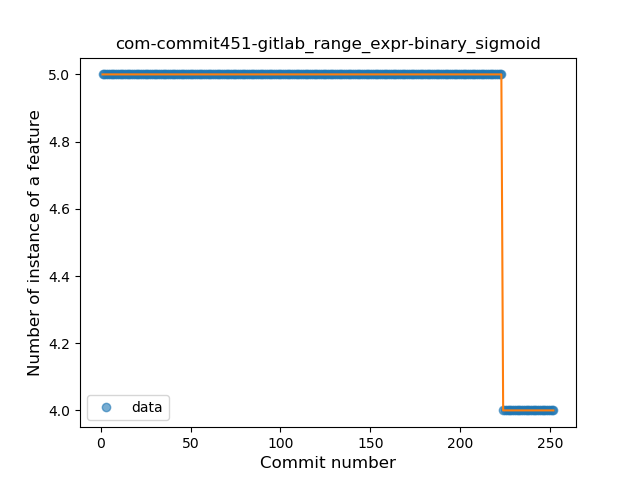
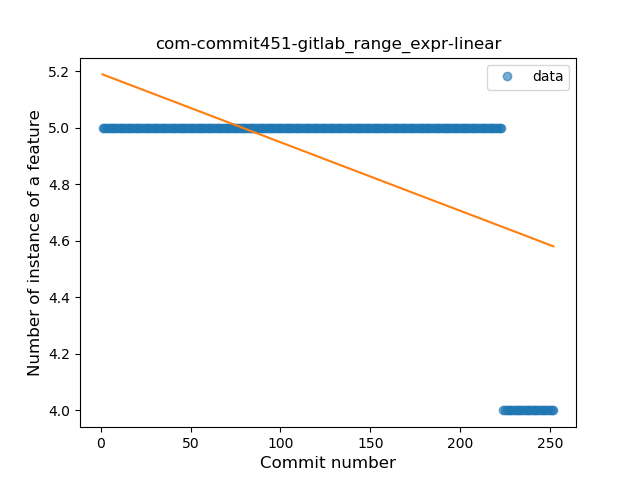
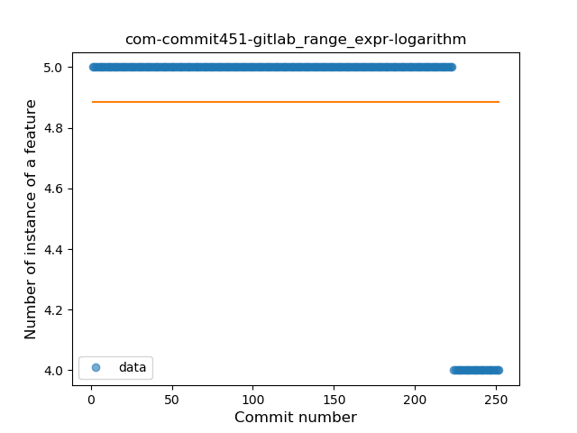
### <a name="smart_cast">Smart Cast</a>
----
#### Functions
* **Constant Decline - Linear:** 
    * **R_Squared:** 0.03288698
* **Sudden Rise Plateau - Logarithm:** 
    * **R_Squared:** 0.03226109

**Plots** :chart_with_upwards_trend:
-----

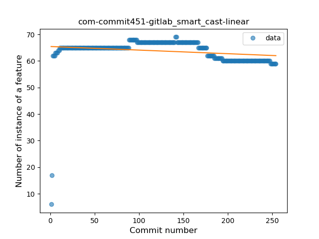
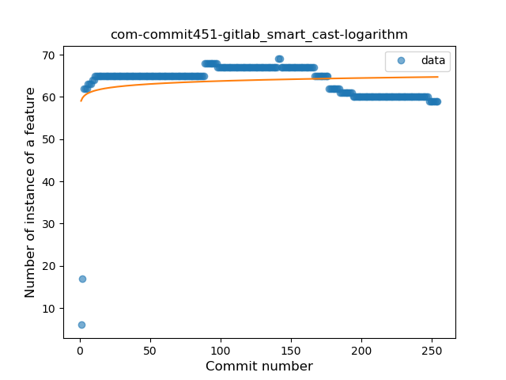
### <a name="data_class">Data Class</a>
----
#### Functions
* **Instability - Polinomial 4:** 
    * **R_Squared:** 0.90606061
* **Sudden Decline - Exponential:** 
    * **R_Squared:** 0.80050266
* **Constant Decline - Linear:** 
    * **R_Squared:** 0.625
* **Sudden Rise Plateau - Logarithm:** 
    * **R_Squared:** -0.0

**Plots** :chart_with_upwards_trend:
-----

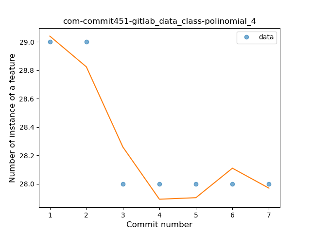
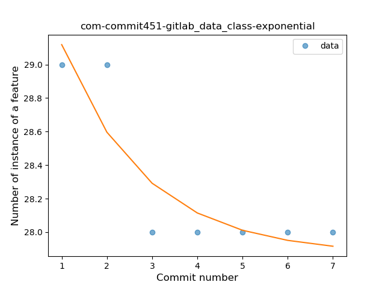
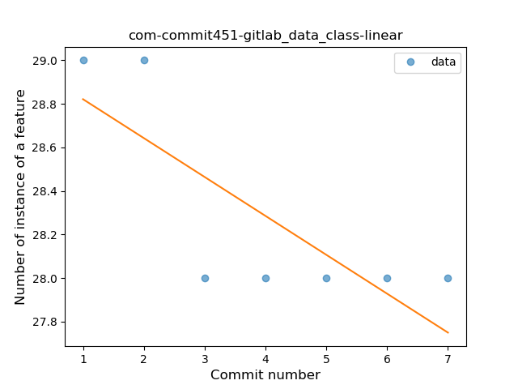
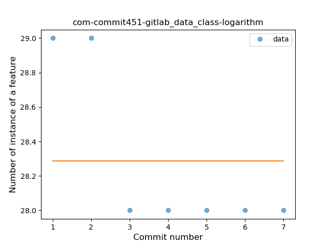
### <a name="func_call_with_named_arg">Function call with Named Argument</a>
----
#### Functions
* **Plateau Sudden Decline - Binary Sigmoid:** 
    * **R_Squared:** 1.0
* **Constant Decline - Linear:** 
    * **R_Squared:** 0.59893048
* **Sudden Rise Plateau - Logarithm:** 
    * **R_Squared:** -0.0

**Plots** :chart_with_upwards_trend:
-----

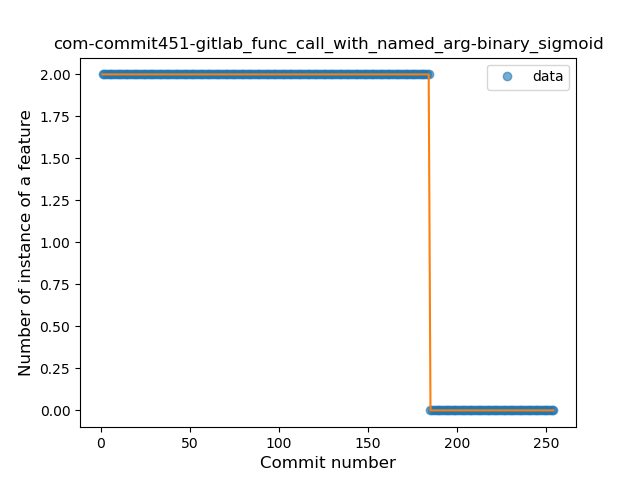
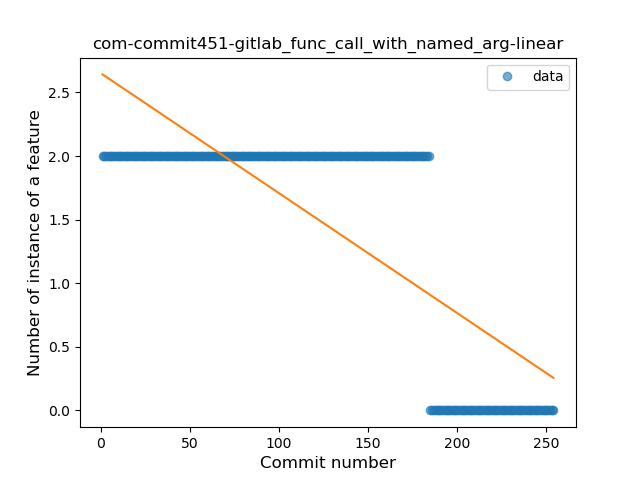
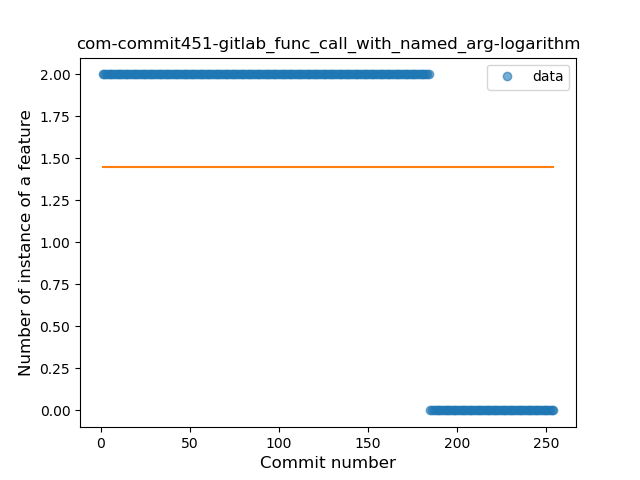
### <a name="extension_function">Extension Function</a>
----
#### Functions
* **Constant Rise - Linear:** 
    * **R_Squared:** 0.68427628
* **Sudden Rise Plateau - Logarithm:** 
    * **R_Squared:** 0.63265644

**Plots** :chart_with_upwards_trend:
-----

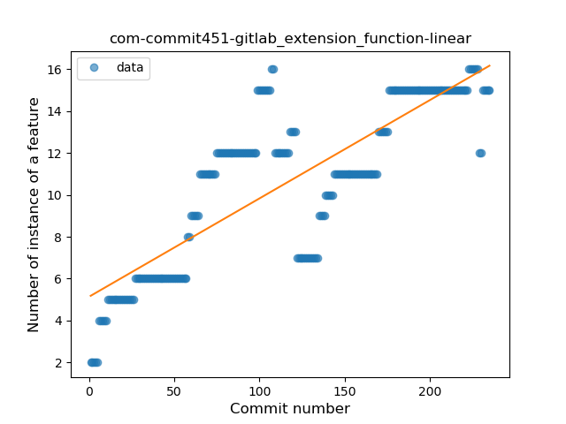
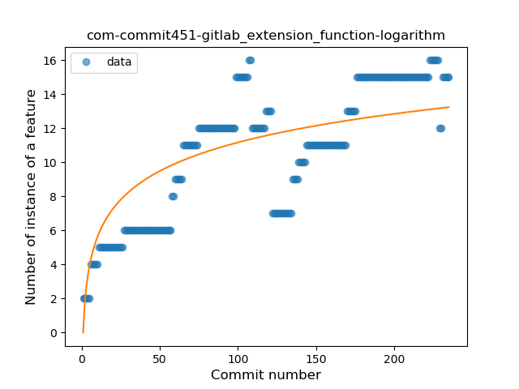
### <a name="property_delegation">Property Delegation</a>
----
#### Functions
* **Constant Rise - Linear:** 
    * **R_Squared:** 0.94761734
* **Sudden Rise - Exponential:** 
    * **R_Squared:** 0.95007406
* **Sudden Rise Plateau - Logarithm:** 
    * **R_Squared:** 0.47417467

**Plots** :chart_with_upwards_trend:
-----

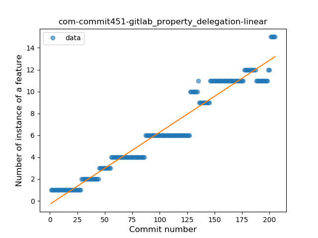
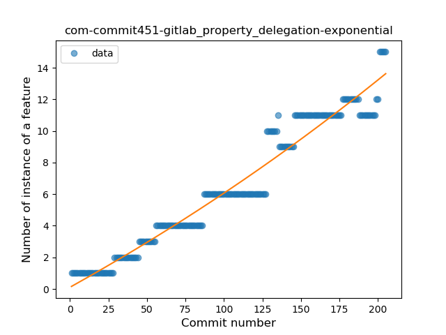
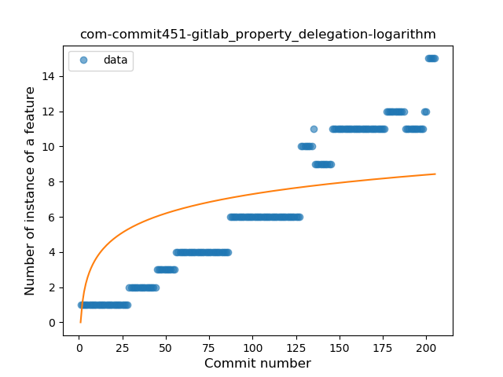
