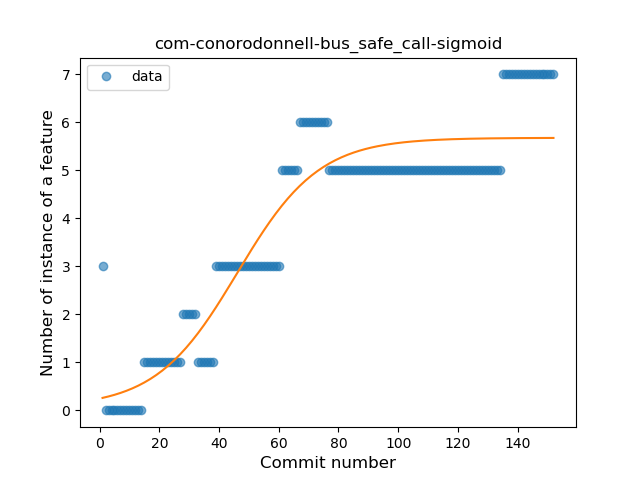
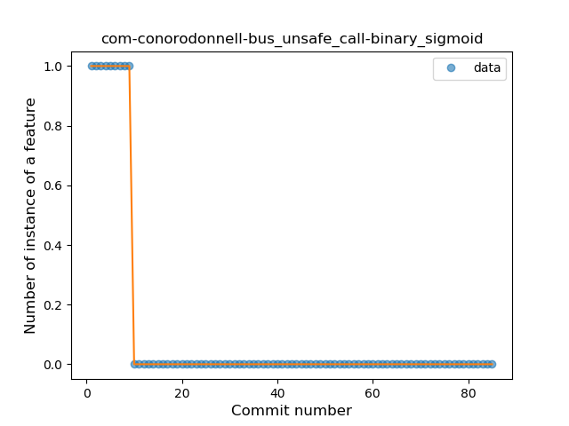
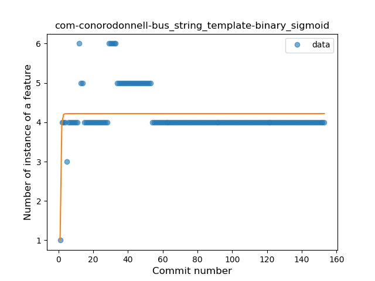
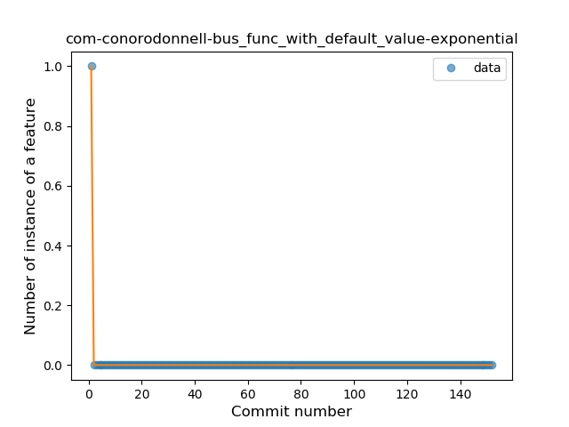
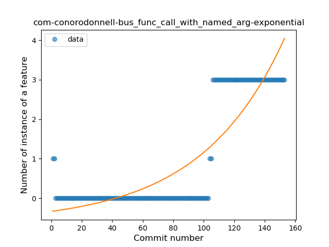
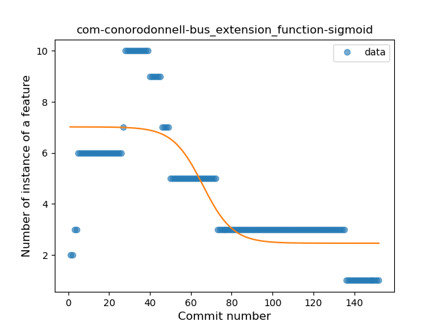
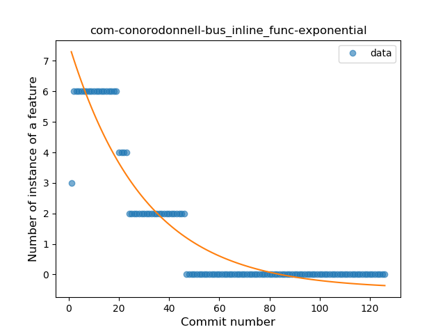

## com-conorodonnell-bus
----
#### Metrics provided by Detekt
* Number of lines of code 533
* Number of Kotlin files: 12
* Cyclomatic complexity: 52
* Cyclomatic complexity by thousands of lines: 182 

----
**14** features analyzed

*	<a href="#type_inference">Type Inference</a> 
*	<a href="#lambda">Lambda</a> 
*	<a href="#safe_call">Safe Call</a> 
*	<a href="#when_expr">When expression</a> 
*	<a href="#unsafe_call">Unsafe Call</a> 
*	<a href="#companion_object">Companion Object</a> 
*	<a href="#string_template">String Template</a> 
*	<a href="#func_with_default_value">Function with Default Value</a> 
*	<a href="#singleton">Singleton</a> 
*	<a href="#data_class">Data Class</a> 
*	<a href="#func_call_with_named_arg">Function call with Named Argument</a> 
*	<a href="#extension_function">Extension Function</a> 
*	<a href="#property_delegation">Property Delegation</a> 
*	<a href="#inline_func">Inline Function</a> 

### <a name="type_inference">Type Inference</a>
----
#### Functions
* **Plateau Gradual Rise - Sigmoid:** 
    * **R_Squared:** 0.6124219
* **Sudden Rise Plateau - Logarithm:** 
    * **R_Squared:** 0.34458995
* **Constant Rise - Linear:** 
    * **R_Squared:** 0.07906158

**Plots** :chart_with_upwards_trend:
-----

### <a name="lambda">Lambda</a>
----
#### Functions
* **Sudden Rise Plateau - Logarithm:** 
    * **R_Squared:** 0.75398585
* **Constant Rise - Linear:** 
    * **R_Squared:** 0.4734653
* **Plateau Sudden Rise - Binary Sigmoid:** 
    * **R_Squared:** 0.44066312

**Plots** :chart_with_upwards_trend:
-----

### <a name="safe_call">Safe Call</a>
----
#### Functions
* **Plateau Gradual Rise - Sigmoid:** 
    * **R_Squared:** 0.86903699
* **Constant Rise - Linear:** 
    * **R_Squared:** 0.80387736
* **Sudden Rise Plateau - Logarithm:** 
    * **R_Squared:** 0.56613701

**Plots** :chart_with_upwards_trend:
-----

### <a name="when_expr">When expression</a>
----
#### Functions
* **Plateau Sudden Decline - Binary Sigmoid:** 
    * **R_Squared:** 0.6184108
* **Constant Decline - Linear:** 
    * **R_Squared:** 0.5977332
* **Sudden Decline - Exponential:** 
    * **R_Squared:** 0.60409786
* **Sudden Rise Plateau - Logarithm:** 
    * **R_Squared:** 0.0

**Plots** :chart_with_upwards_trend:
-----

### <a name="unsafe_call">Unsafe Call</a>
----
#### Functions
* **Plateau Sudden Decline - Binary Sigmoid:** 
    * **R_Squared:** 1.0
* **Sudden Decline - Exponential:** 
    * **R_Squared:** 0.7972088
* **Constant Decline - Linear:** 
    * **R_Squared:** 0.28405316
* **Sudden Rise Plateau - Logarithm:** 
    * **R_Squared:** -0.0

**Plots** :chart_with_upwards_trend:
-----

### <a name="companion_object">Companion Object</a>
----
#### Functions
* **Plateau Sudden Decline - Binary Sigmoid:** 
    * **R_Squared:** 1.0
* **Sudden Decline - Exponential:** 
    * **R_Squared:** 0.77867203
* **Constant Decline - Linear:** 
    * **R_Squared:** 0.48003072
* **Sudden Rise Plateau - Logarithm:** 
    * **R_Squared:** -0.0

**Plots** :chart_with_upwards_trend:
-----

### <a name="string_template">String Template</a>
----
#### Functions
* **Plateau Sudden Rise - Binary Sigmoid:** 
    * **R_Squared:** 0.20626784
* **Constant Decline - Linear:** 
    * **R_Squared:** 0.07899397
* **Sudden Rise Plateau - Logarithm:** 
    * **R_Squared:** -0.0

**Plots** :chart_with_upwards_trend:
-----

### <a name="func_with_default_value">Function with Default Value</a>
----
#### Functions
* **Sudden Decline - Exponential:** 
    * **R_Squared:** 1.0
* **Constant Decline - Linear:** 
    * **R_Squared:** 0.01960784
* **Sudden Rise Plateau - Logarithm:** 
    * **R_Squared:** -0.0

**Plots** :chart_with_upwards_trend:
-----

### <a name="singleton">Singleton</a>
----
#### Functions
* **Plateau Sudden Decline - Binary Sigmoid:** 
    * **R_Squared:** 1.0
* **Sudden Decline - Exponential:** 
    * **R_Squared:** 0.76145969
* **Constant Decline - Linear:** 
    * **R_Squared:** 0.64593301
* **Sudden Rise Plateau - Logarithm:** 
    * **R_Squared:** 0.0

**Plots** :chart_with_upwards_trend:
-----

### <a name="data_class">Data Class</a>
----
#### Functions
* **Sudden Rise Plateau - Logarithm:** 
    * **R_Squared:** 0.13787107
* **Constant Rise - Linear:** 
    * **R_Squared:** 0.01618198

**Plots** :chart_with_upwards_trend:
-----

### <a name="func_call_with_named_arg">Function call with Named Argument</a>
----
#### Functions
* **Sudden Rise - Exponential:** 
    * **R_Squared:** 0.75790577
* **Constant Rise - Linear:** 
    * **R_Squared:** 0.63744601
* **Sudden Rise Plateau - Logarithm:** 
    * **R_Squared:** 0.16008537

**Plots** :chart_with_upwards_trend:
-----

### <a name="extension_function">Extension Function</a>
----
#### Functions
* **Plateau Gradual Decline - Sigmoid:** 
    * **R_Squared:** 0.66388587
* **Constant Decline - Linear:** 
    * **R_Squared:** 0.55909666
* **Sudden Rise Plateau - Logarithm:** 
    * **R_Squared:** -0.0

**Plots** :chart_with_upwards_trend:
-----

### <a name="property_delegation">Property Delegation</a>
----
#### Functions
* **Sudden Rise Plateau - Logarithm:** 
    * **R_Squared:** 0.46538255
* **Constant Rise - Linear:** 
    * **R_Squared:** 0.28285325
* **Plateau Gradual Rise - Sigmoid:** 
    * **R_Squared:** 0.04656319

**Plots** :chart_with_upwards_trend:
-----

### <a name="inline_func">Inline Function</a>
----
#### Functions
* **Sudden Decline - Exponential:** 
    * **R_Squared:** 0.87717116
* **Plateau Gradual Decline - Sigmoid:** 
    * **R_Squared:** 0.81236398
* **Constant Decline - Linear:** 
    * **R_Squared:** 0.64971793
* **Sudden Rise Plateau - Logarithm:** 
    * **R_Squared:** 0.0

**Plots** :chart_with_upwards_trend:
-----

