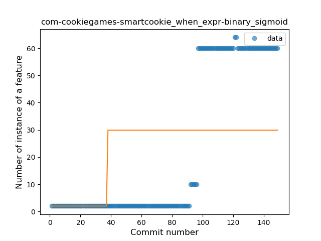
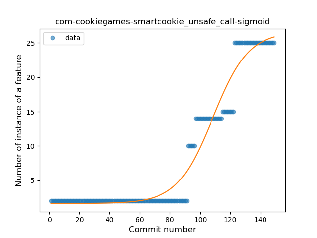
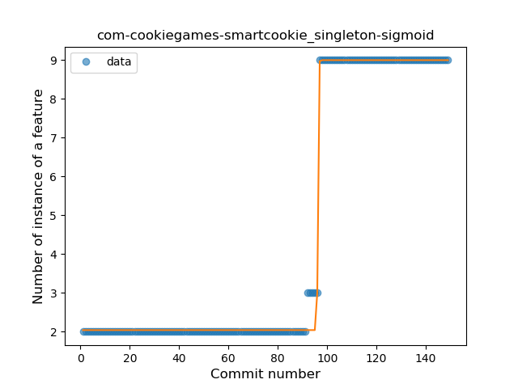
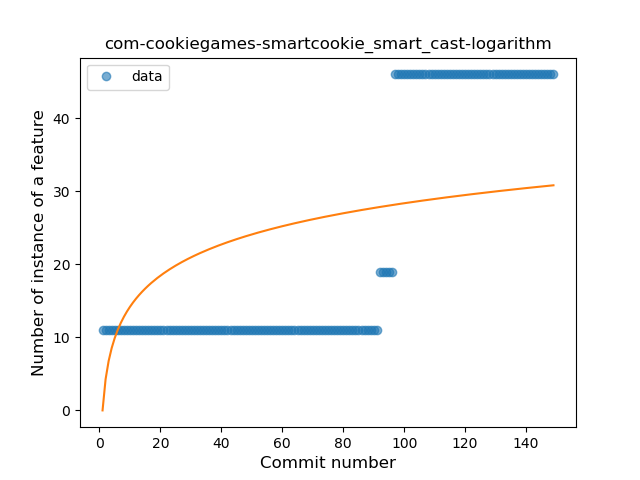
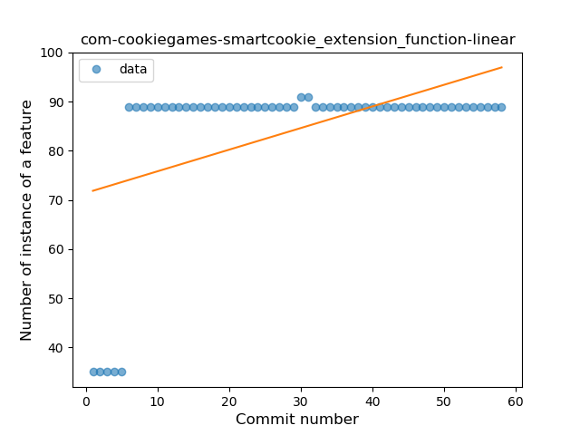

## com-cookiegames-smartcookie
----
#### Metrics provided by Detekt
* Number of lines of code 16964
* Number of Kotlin files: 194
* Cyclomatic complexity: 2054
* Cyclomatic complexity by thousands of lines: 248 

----
**17** features analyzed

*	<a href="#type_inference">Type Inference</a> 
*	<a href="#lambda">Lambda</a> 
*	<a href="#safe_call">Safe Call</a> 
*	<a href="#when_expr">When expression</a> 
*	<a href="#unsafe_call">Unsafe Call</a> 
*	<a href="#companion_object">Companion Object</a> 
*	<a href="#string_template">String Template</a> 
*	<a href="#func_with_default_value">Function with Default Value</a> 
*	<a href="#singleton">Singleton</a> 
*	<a href="#range_expr">Range Expression</a> 
*	<a href="#smart_cast">Smart Cast</a> 
*	<a href="#func_call_with_named_arg">Function call with Named Argument</a> 
*	<a href="#extension_function">Extension Function</a> 
*	<a href="#property_delegation">Property Delegation</a> 
*	<a href="#destructuring_declaration">Destructuring Declaration</a> 
*	<a href="#inline_func">Inline Function</a> 
*	<a href="#sealed_class">Sealed Class</a> 

### <a name="type_inference">Type Inference</a>
----
#### Functions
* **Sudden Rise - Exponential:** 
    * **R_Squared:** 0.78382484
* **Constant Rise - Linear:** 
    * **R_Squared:** 0.70603023
* **Plateau Sudden Rise - Binary Sigmoid:** 
    * **R_Squared:** 0.51034452
* **Sudden Rise Plateau - Logarithm:** 
    * **R_Squared:** 0.25305574

**Plots** :chart_with_upwards_trend:
-----

### <a name="lambda">Lambda</a>
----
#### Functions
* **Sudden Rise - Exponential:** 
    * **R_Squared:** 0.78109054
* **Constant Rise - Linear:** 
    * **R_Squared:** 0.70821609
* **Sudden Rise Plateau - Logarithm:** 
    * **R_Squared:** 0.21102295

**Plots** :chart_with_upwards_trend:
-----

### <a name="safe_call">Safe Call</a>
----
#### Functions
* **Sudden Rise - Exponential:** 
    * **R_Squared:** 0.76945834
* **Constant Rise - Linear:** 
    * **R_Squared:** 0.70156517
* **Sudden Rise Plateau - Logarithm:** 
    * **R_Squared:** 0.19955705

**Plots** :chart_with_upwards_trend:
-----

### <a name="when_expr">When expression</a>
----
#### Functions
* **Sudden Rise - Exponential:** 
    * **R_Squared:** 0.7682204
* **Constant Rise - Linear:** 
    * **R_Squared:** 0.70253696
* **Sudden Rise Plateau - Logarithm:** 
    * **R_Squared:** 0.21327033
* **Plateau Sudden Rise - Binary Sigmoid:** 
    * **R_Squared:** 0.18930493

**Plots** :chart_with_upwards_trend:
-----

### <a name="unsafe_call">Unsafe Call</a>
----
#### Functions
* **Plateau Gradual Rise - Sigmoid:** 
    * **R_Squared:** 0.95520953
* **Sudden Rise - Exponential:** 
    * **R_Squared:** 0.8995229
* **Constant Rise - Linear:** 
    * **R_Squared:** 0.74288034
* **Sudden Rise Plateau - Logarithm:** 
    * **R_Squared:** 0.23493434

**Plots** :chart_with_upwards_trend:
-----

### <a name="companion_object">Companion Object</a>
----
#### Functions
* **Sudden Rise - Exponential:** 
    * **R_Squared:** 0.76954515
* **Constant Rise - Linear:** 
    * **R_Squared:** 0.69625015
* **Sudden Rise Plateau - Logarithm:** 
    * **R_Squared:** 0.2461462

**Plots** :chart_with_upwards_trend:
-----

### <a name="string_template">String Template</a>
----
#### Functions
* **Sudden Rise - Exponential:** 
    * **R_Squared:** 0.75373907
* **Constant Rise - Linear:** 
    * **R_Squared:** 0.68370662
* **Sudden Rise Plateau - Logarithm:** 
    * **R_Squared:** 0.24130596
* **Plateau Sudden Rise - Binary Sigmoid:** 
    * **R_Squared:** 0.18073206

**Plots** :chart_with_upwards_trend:
-----

### <a name="func_with_default_value">Function with Default Value</a>
----
#### Functions
* **Instability - Polinomial 3:** )
    * **R_Squared:** 0.71019481
* **Sudden Rise Plateau - Logarithm:** 
    * **R_Squared:** 0.55133835
* **Constant Rise - Linear:** 
    * **R_Squared:** 0.23639607
* **Plateau Sudden Rise - Binary Sigmoid:** 
    * **R_Squared:** 0.07665094

**Plots** :chart_with_upwards_trend:
-----

### <a name="singleton">Singleton</a>
----
#### Functions
* **Plateau Gradual Rise - Sigmoid:** 
    * **R_Squared:** 0.99768265
* **Sudden Rise - Exponential:** 
    * **R_Squared:** 0.76920988
* **Constant Rise - Linear:** 
    * **R_Squared:** 0.70335842
* **Sudden Rise Plateau - Logarithm:** 
    * **R_Squared:** 0.29952374

**Plots** :chart_with_upwards_trend:
-----

### <a name="range_expr">Range Expression</a>
----
#### Functions
* **Plateau Sudden Rise - Binary Sigmoid:** 
    * **R_Squared:** 1.0
* **Instability - Polinomial 3:** )
    * **R_Squared:** 0.71019481
* **Sudden Rise Plateau - Logarithm:** 
    * **R_Squared:** 0.55133835
* **Constant Rise - Linear:** 
    * **R_Squared:** 0.23639607

**Plots** :chart_with_upwards_trend:
-----

### <a name="smart_cast">Smart Cast</a>
----
#### Functions
* **Sudden Rise - Exponential:** 
    * **R_Squared:** 0.77462287
* **Constant Rise - Linear:** 
    * **R_Squared:** 0.71102761
* **Sudden Rise Plateau - Logarithm:** 
    * **R_Squared:** 0.31194885

**Plots** :chart_with_upwards_trend:
-----

### <a name="func_call_with_named_arg">Function call with Named Argument</a>
----
#### Functions
* **Instability - Polinomial 4:** 
    * **R_Squared:** 0.82050585
* **Instability - Polinomial 3:** )
    * **R_Squared:** 0.72817725
* **Sudden Rise Plateau - Logarithm:** 
    * **R_Squared:** 0.57290353
* **Constant Rise - Linear:** 
    * **R_Squared:** 0.25230548

**Plots** :chart_with_upwards_trend:
-----

### <a name="extension_function">Extension Function</a>
----
#### Functions
* **Instability - Polinomial 4:** 
    * **R_Squared:** 0.80854449
* **Instability - Polinomial 3:** )
    * **R_Squared:** 0.71278618
* **Sudden Rise Plateau - Logarithm:** 
    * **R_Squared:** 0.55180146
* **Constant Rise - Linear:** 
    * **R_Squared:** 0.23586442

**Plots** :chart_with_upwards_trend:
-----

### <a name="property_delegation">Property Delegation</a>
----
#### Functions
* **Plateau Gradual Rise - Sigmoid:** 
    * **R_Squared:** 0.99988604
* **Sudden Rise - Exponential:** 
    * **R_Squared:** 0.76238846
* **Constant Rise - Linear:** 
    * **R_Squared:** 0.69073667
* **Sudden Rise Plateau - Logarithm:** 
    * **R_Squared:** 0.2050073

**Plots** :chart_with_upwards_trend:
-----

### <a name="destructuring_declaration">Destructuring Declaration</a>
----
#### Functions
* **Plateau Sudden Rise - Binary Sigmoid:** 
    * **R_Squared:** 1.0
* **Instability - Polinomial 3:** )
    * **R_Squared:** 0.71019481
* **Sudden Rise Plateau - Logarithm:** 
    * **R_Squared:** 0.55133835
* **Constant Rise - Linear:** 
    * **R_Squared:** 0.23639607

**Plots** :chart_with_upwards_trend:
-----

### <a name="inline_func">Inline Function</a>
----
#### Functions
* **Instability - Polinomial 3:** )
    * **R_Squared:** 0.71019481
* **Sudden Rise Plateau - Logarithm:** 
    * **R_Squared:** 0.55133835
* **Constant Rise - Linear:** 
    * **R_Squared:** 0.23639607
* **Plateau Sudden Rise - Binary Sigmoid:** 
    * **R_Squared:** 0.07146941

**Plots** :chart_with_upwards_trend:
-----

### <a name="sealed_class">Sealed Class</a>
----
#### Functions
* **Plateau Sudden Rise - Binary Sigmoid:** 
    * **R_Squared:** 1.0
* **Instability - Polinomial 3:** )
    * **R_Squared:** 0.71019481
* **Sudden Rise Plateau - Logarithm:** 
    * **R_Squared:** 0.55133835
* **Constant Rise - Linear:** 
    * **R_Squared:** 0.23639607

**Plots** :chart_with_upwards_trend:
-----

