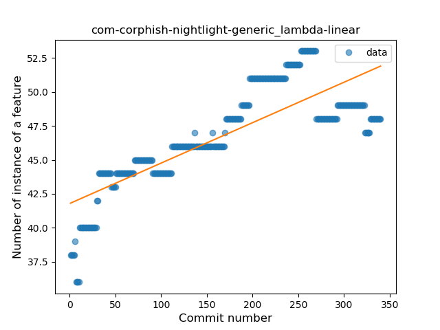
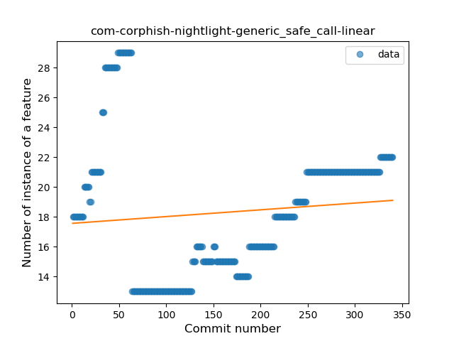
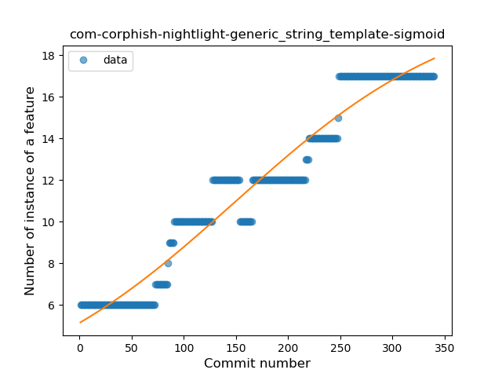
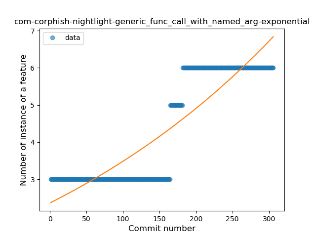

## com-corphish-nightlight-generic
----
#### Metrics provided by Detekt
* Number of lines of code 5100
* Number of Kotlin files: 56
* Cyclomatic complexity: 663
* Cyclomatic complexity by thousands of lines: 304 

----
**13** features analyzed

*	<a href="#type_inference">Type Inference</a> 
*	<a href="#lambda">Lambda</a> 
*	<a href="#safe_call">Safe Call</a> 
*	<a href="#when_expr">When expression</a> 
*	<a href="#unsafe_call">Unsafe Call</a> 
*	<a href="#companion_object">Companion Object</a> 
*	<a href="#string_template">String Template</a> 
*	<a href="#func_with_default_value">Function with Default Value</a> 
*	<a href="#singleton">Singleton</a> 
*	<a href="#smart_cast">Smart Cast</a> 
*	<a href="#data_class">Data Class</a> 
*	<a href="#func_call_with_named_arg">Function call with Named Argument</a> 
*	<a href="#extension_function">Extension Function</a> 

### <a name="type_inference">Type Inference</a>
----
#### Functions
* **Constant Rise - Linear:** 
    * **R_Squared:** 0.94731213
* **Sudden Rise - Exponential:** 
    * **R_Squared:** 0.95001603
* **Sudden Rise Plateau - Logarithm:** 
    * **R_Squared:** 0.65730862

**Plots** :chart_with_upwards_trend:
-----

### <a name="lambda">Lambda</a>
----
#### Functions
* **Sudden Rise Plateau - Logarithm:** 
    * **R_Squared:** 0.74685247
* **Constant Rise - Linear:** 
    * **R_Squared:** 0.64440705

**Plots** :chart_with_upwards_trend:
-----

### <a name="safe_call">Safe Call</a>
----
#### Functions
* **Sudden Rise - Exponential:** 
    * **R_Squared:** 0.10781357
* **Constant Rise - Linear:** 
    * **R_Squared:** 0.01007195
* **Sudden Rise Plateau - Logarithm:** 
    * **R_Squared:** -0.0

**Plots** :chart_with_upwards_trend:
-----

### <a name="when_expr">When expression</a>
----
#### Functions
* **Plateau Sudden Rise - Binary Sigmoid:** 
    * **R_Squared:** 0.98503402
* **Sudden Rise - Exponential:** 
    * **R_Squared:** 0.7771106
* **Constant Rise - Linear:** 
    * **R_Squared:** 0.6367057
* **Sudden Rise Plateau - Logarithm:** 
    * **R_Squared:** 0.29444559

**Plots** :chart_with_upwards_trend:
-----

### <a name="unsafe_call">Unsafe Call</a>
----
#### Functions
* **Constant Decline - Linear:** 
    * **R_Squared:** 0.35929536
* **Sudden Rise - Exponential:** 
    * **R_Squared:** -0.0
* **Sudden Rise Plateau - Logarithm:** 
    * **R_Squared:** -0.0

**Plots** :chart_with_upwards_trend:
-----

### <a name="companion_object">Companion Object</a>
----
#### Functions
* **Constant Rise - Linear:** 
    * **R_Squared:** 0.03102168
* **Sudden Rise Plateau - Logarithm:** 
    * **R_Squared:** 0.03468604

**Plots** :chart_with_upwards_trend:
-----

### <a name="string_template">String Template</a>
----
#### Functions
* **Constant Rise - Linear:** 
    * **R_Squared:** 0.94026659
* **Plateau Gradual Rise - Sigmoid:** 
    * **R_Squared:** 0.94394347
* **Sudden Rise Plateau - Logarithm:** 
    * **R_Squared:** 0.64766301

**Plots** :chart_with_upwards_trend:
-----

### <a name="func_with_default_value">Function with Default Value</a>
----
#### Functions
* **Plateau Gradual Rise - Sigmoid:** 
    * **R_Squared:** 0.97595002
* **Constant Rise - Linear:** 
    * **R_Squared:** 0.85368624
* **Sudden Rise - Exponential:** 
    * **R_Squared:** 0.8612241
* **Sudden Rise Plateau - Logarithm:** 
    * **R_Squared:** 0.57381533

**Plots** :chart_with_upwards_trend:
-----

### <a name="singleton">Singleton</a>
----
#### Functions
* **Sudden Rise - Exponential:** 
    * **R_Squared:** 0.49505892
* **Constant Rise - Linear:** 
    * **R_Squared:** 0.38825136
* **Sudden Rise Plateau - Logarithm:** 
    * **R_Squared:** 0.0817469

**Plots** :chart_with_upwards_trend:
-----

### <a name="smart_cast">Smart Cast</a>
----
#### Functions
* **Constant Decline - Linear:** 
    * **R_Squared:** 0.47469745
* **Plateau Sudden Rise - Binary Sigmoid:** 
    * **R_Squared:** 0.04079244
* **Sudden Rise Plateau - Logarithm:** 
    * **R_Squared:** -0.0

**Plots** :chart_with_upwards_trend:
-----

### <a name="data_class">Data Class</a>
----
#### Functions
* **Plateau Sudden Rise - Binary Sigmoid:** 
    * **R_Squared:** 1.0
* **Constant Rise - Linear:** 
    * **R_Squared:** 0.70848364
* **Sudden Rise Plateau - Logarithm:** 
    * **R_Squared:** 0.58290567

**Plots** :chart_with_upwards_trend:
-----

### <a name="func_call_with_named_arg">Function call with Named Argument</a>
----
#### Functions
* **Plateau Gradual Rise - Sigmoid:** 
    * **R_Squared:** 0.9872344
* **Sudden Rise - Exponential:** 
    * **R_Squared:** 0.78603045
* **Constant Rise - Linear:** 
    * **R_Squared:** 0.77576824
* **Sudden Rise Plateau - Logarithm:** 
    * **R_Squared:** 0.46820178

**Plots** :chart_with_upwards_trend:
-----

### <a name="extension_function">Extension Function</a>
----
#### Functions
* **Plateau Sudden Rise - Binary Sigmoid:** 
    * **R_Squared:** 0.95553658
* **Constant Rise - Linear:** 
    * **R_Squared:** 0.73114149
* **Sudden Rise Plateau - Logarithm:** 
    * **R_Squared:** 0.56941591

**Plots** :chart_with_upwards_trend:
-----

