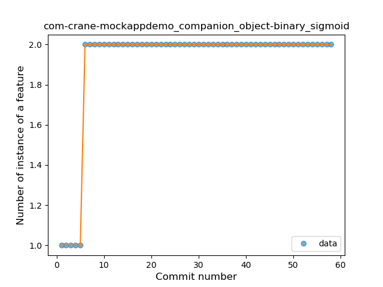

## com-crane-mockappdemo
----
#### Metrics provided by Detekt
* Number of lines of code 679
* Number of Kotlin files: 11
* Cyclomatic complexity: 62
* Cyclomatic complexity by thousands of lines: 189 

----
**4** features analyzed

*	<a href="#type_inference">Type Inference</a> 
*	<a href="#lambda">Lambda</a> 
*	<a href="#companion_object">Companion Object</a> 
*	<a href="#string_template">String Template</a> 

### <a name="type_inference">Type Inference</a>
----
#### Functions
* **Constant Rise - Linear:** 
    * **R_Squared:** 0.86150745
* **Sudden Rise Plateau - Logarithm:** 
    * **R_Squared:** 0.76558394

**Plots** :chart_with_upwards_trend:
-----

### <a name="lambda">Lambda</a>
----
#### Functions
* **Plateau Gradual Rise - Sigmoid:** 
    * **R_Squared:** 0.96235097
* **Constant Rise - Linear:** 
    * **R_Squared:** 0.89072464
* **Sudden Rise Plateau - Logarithm:** 
    * **R_Squared:** 0.82829807

**Plots** :chart_with_upwards_trend:
-----

### <a name="companion_object">Companion Object</a>
----
#### Functions
* **Plateau Sudden Rise - Binary Sigmoid:** 
    * **R_Squared:** 1.0
* **Sudden Rise Plateau - Logarithm:** 
    * **R_Squared:** 0.55133835
* **Constant Rise - Linear:** 
    * **R_Squared:** 0.23639607

**Plots** :chart_with_upwards_trend:
-----

### <a name="string_template">String Template</a>
----
#### Functions
* **Plateau Gradual Rise - Sigmoid:** 
    * **R_Squared:** 0.97672565
* **Constant Rise - Linear:** 
    * **R_Squared:** 0.73311632
* **Sudden Rise Plateau - Logarithm:** 
    * **R_Squared:** 0.64675507

**Plots** :chart_with_upwards_trend:
-----

