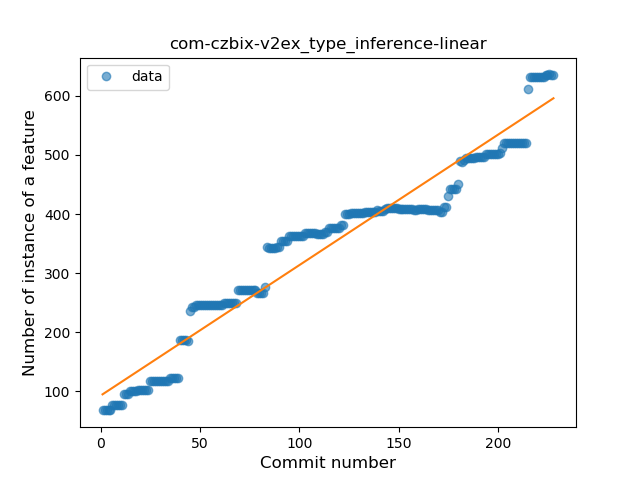
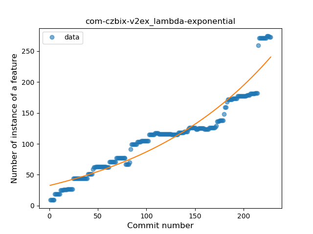
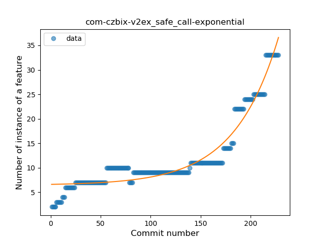
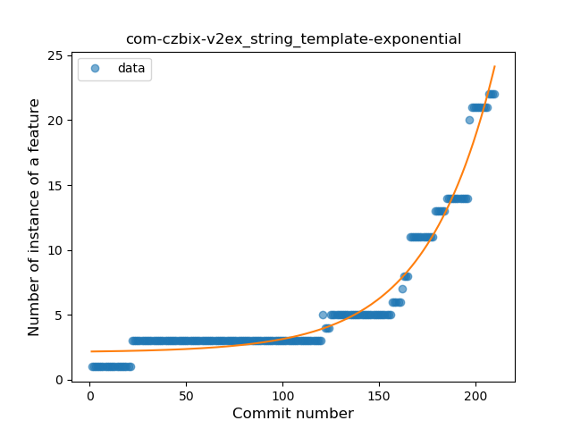
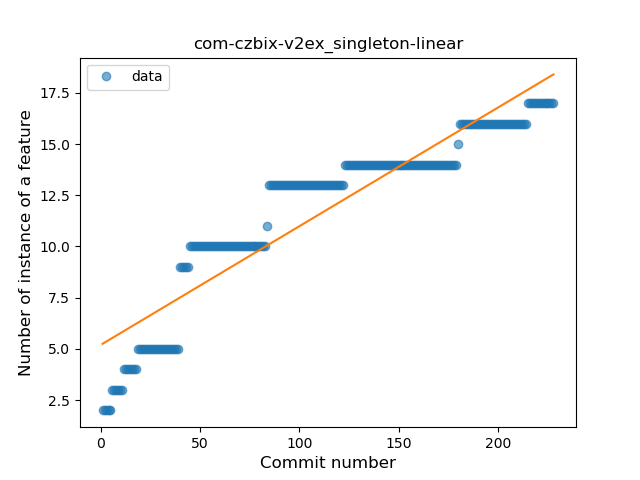
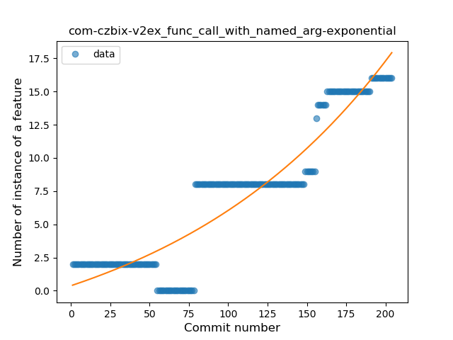
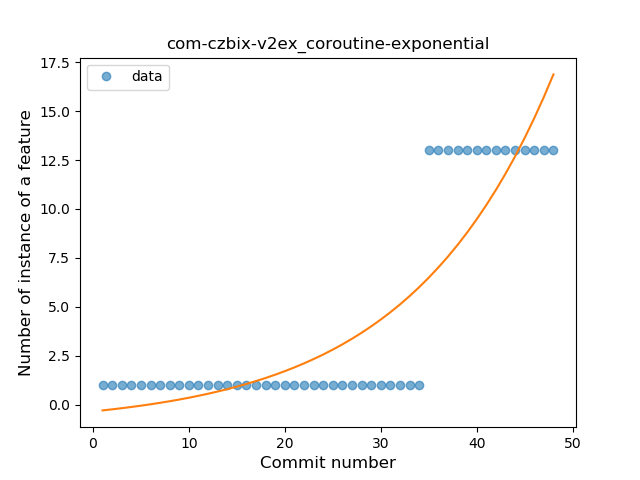
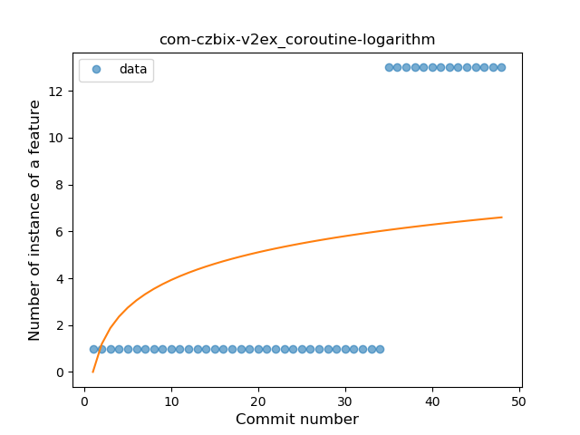
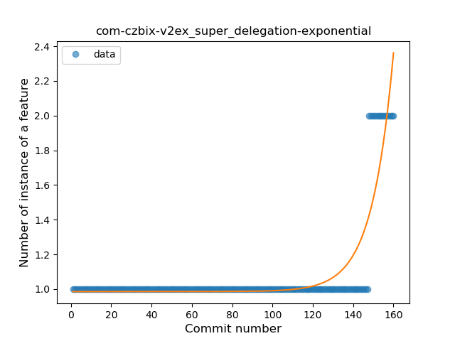

## com-czbix-v2ex
----
#### Metrics provided by Detekt
* Number of lines of code 8927
* Number of Kotlin files: 104
* Cyclomatic complexity: 1225
* Cyclomatic complexity by thousands of lines: 256 

----
**19** features analyzed

*	<a href="#type_inference">Type Inference</a> 
*	<a href="#lambda">Lambda</a> 
*	<a href="#safe_call">Safe Call</a> 
*	<a href="#when_expr">When expression</a> 
*	<a href="#unsafe_call">Unsafe Call</a> 
*	<a href="#companion_object">Companion Object</a> 
*	<a href="#string_template">String Template</a> 
*	<a href="#func_with_default_value">Function with Default Value</a> 
*	<a href="#singleton">Singleton</a> 
*	<a href="#range_expr">Range Expression</a> 
*	<a href="#smart_cast">Smart Cast</a> 
*	<a href="#data_class">Data Class</a> 
*	<a href="#func_call_with_named_arg">Function call with Named Argument</a> 
*	<a href="#extension_function">Extension Function</a> 
*	<a href="#property_delegation">Property Delegation</a> 
*	<a href="#destructuring_declaration">Destructuring Declaration</a> 
*	<a href="#inline_func">Inline Function</a> 
*	<a href="#coroutine">Coroutine</a> 
*	<a href="#super_delegation">Super Delegation</a> 

### <a name="type_inference">Type Inference</a>
----
#### Functions
* **Constant Rise - Linear:** 
    * **R_Squared:** 0.94210946
* **Sudden Rise Plateau - Logarithm:** 
    * **R_Squared:** 0.65735937
* **Plateau Sudden Rise - Binary Sigmoid:** 
    * **R_Squared:** 0.48001039

**Plots** :chart_with_upwards_trend:
-----

### <a name="lambda">Lambda</a>
----
#### Functions
* **Sudden Rise - Exponential:** 
    * **R_Squared:** 0.91313106
* **Constant Rise - Linear:** 
    * **R_Squared:** 0.88914949
* **Plateau Sudden Rise - Binary Sigmoid:** 
    * **R_Squared:** 0.56147558
* **Sudden Rise Plateau - Logarithm:** 
    * **R_Squared:** 0.4915051

**Plots** :chart_with_upwards_trend:
-----

### <a name="safe_call">Safe Call</a>
----
#### Functions
* **Sudden Rise - Exponential:** 
    * **R_Squared:** 0.9348097
* **Constant Rise - Linear:** 
    * **R_Squared:** 0.70493842
* **Sudden Rise Plateau - Logarithm:** 
    * **R_Squared:** 0.34135197

**Plots** :chart_with_upwards_trend:
-----

### <a name="when_expr">When expression</a>
----
#### Functions
* **Constant Rise - Linear:** 
    * **R_Squared:** 0.92450642
* **Sudden Rise - Exponential:** 
    * **R_Squared:** 0.93170311
* **Sudden Rise Plateau - Logarithm:** 
    * **R_Squared:** 0.52986928

**Plots** :chart_with_upwards_trend:
-----

### <a name="unsafe_call">Unsafe Call</a>
----
#### Functions
* **Sudden Rise - Exponential:** 
    * **R_Squared:** 0.89158504
* **Constant Rise - Linear:** 
    * **R_Squared:** 0.70798561
* **Sudden Rise Plateau - Logarithm:** 
    * **R_Squared:** 0.32192876
* **Plateau Gradual Rise - Sigmoid:** 
    * **R_Squared:** 0.19565155

**Plots** :chart_with_upwards_trend:
-----

### <a name="companion_object">Companion Object</a>
----
#### Functions
* **Constant Rise - Linear:** 
    * **R_Squared:** 0.92915343
* **Sudden Rise Plateau - Logarithm:** 
    * **R_Squared:** 0.5927353

**Plots** :chart_with_upwards_trend:
-----

### <a name="string_template">String Template</a>
----
#### Functions
* **Sudden Rise - Exponential:** 
    * **R_Squared:** 0.96651333
* **Constant Rise - Linear:** 
    * **R_Squared:** 0.66356074
* **Sudden Rise Plateau - Logarithm:** 
    * **R_Squared:** 0.23593116

**Plots** :chart_with_upwards_trend:
-----

### <a name="func_with_default_value">Function with Default Value</a>
----
#### Functions
* **Sudden Rise - Exponential:** 
    * **R_Squared:** 0.83399986
* **Constant Rise - Linear:** 
    * **R_Squared:** 0.8087615
* **Sudden Rise Plateau - Logarithm:** 
    * **R_Squared:** 0.45364959

**Plots** :chart_with_upwards_trend:
-----

### <a name="singleton">Singleton</a>
----
#### Functions
* **Constant Rise - Linear:** 
    * **R_Squared:** 0.86603055
* **Sudden Rise Plateau - Logarithm:** 
    * **R_Squared:** 0.79917702

**Plots** :chart_with_upwards_trend:
-----

### <a name="range_expr">Range Expression</a>
----
#### Functions
* **Plateau Sudden Rise - Binary Sigmoid:** 
    * **R_Squared:** 1.0
* **Sudden Rise - Exponential:** 
    * **R_Squared:** 0.76944526
* **Constant Rise - Linear:** 
    * **R_Squared:** 0.57632933
* **Sudden Rise Plateau - Logarithm:** 
    * **R_Squared:** 0.29560355

**Plots** :chart_with_upwards_trend:
-----

### <a name="smart_cast">Smart Cast</a>
----
#### Functions
* **Sudden Rise - Exponential:** 
    * **R_Squared:** 0.88046169
* **Constant Rise - Linear:** 
    * **R_Squared:** 0.81050512
* **Sudden Rise Plateau - Logarithm:** 
    * **R_Squared:** 0.47446785

**Plots** :chart_with_upwards_trend:
-----

### <a name="data_class">Data Class</a>
----
#### Functions
* **Sudden Rise - Exponential:** 
    * **R_Squared:** 0.8550459
* **Constant Rise - Linear:** 
    * **R_Squared:** 0.55621437
* **Sudden Rise Plateau - Logarithm:** 
    * **R_Squared:** 0.24815044

**Plots** :chart_with_upwards_trend:
-----

### <a name="func_call_with_named_arg">Function call with Named Argument</a>
----
#### Functions
* **Sudden Rise - Exponential:** 
    * **R_Squared:** 0.87004305
* **Constant Rise - Linear:** 
    * **R_Squared:** 0.83878993
* **Sudden Rise Plateau - Logarithm:** 
    * **R_Squared:** 0.34719151

**Plots** :chart_with_upwards_trend:
-----

### <a name="extension_function">Extension Function</a>
----
#### Functions
* **Constant Rise - Linear:** 
    * **R_Squared:** 0.61315061
* **Sudden Rise Plateau - Logarithm:** 
    * **R_Squared:** 0.5610421
* **Plateau Sudden Rise - Binary Sigmoid:** 
    * **R_Squared:** 0.49152197

**Plots** :chart_with_upwards_trend:
-----

### <a name="property_delegation">Property Delegation</a>
----
#### Functions
* **Sudden Rise - Exponential:** 
    * **R_Squared:** 0.93624682
* **Constant Rise - Linear:** 
    * **R_Squared:** 0.43972989
* **Sudden Rise Plateau - Logarithm:** 
    * **R_Squared:** 0.09515062

**Plots** :chart_with_upwards_trend:
-----

### <a name="destructuring_declaration">Destructuring Declaration</a>
----
#### Functions
* **Sudden Rise - Exponential:** 
    * **R_Squared:** 0.66777925
* **Constant Rise - Linear:** 
    * **R_Squared:** 0.62893129
* **Sudden Rise Plateau - Logarithm:** 
    * **R_Squared:** 0.45414037

**Plots** :chart_with_upwards_trend:
-----

### <a name="inline_func">Inline Function</a>
----
#### Functions
* **Plateau Gradual Rise - Sigmoid:** 
    * **R_Squared:** 0.8344191
* **Constant Rise - Linear:** 
    * **R_Squared:** 0.59305104
* **Sudden Rise Plateau - Logarithm:** 
    * **R_Squared:** 0.60267745

**Plots** :chart_with_upwards_trend:
-----

### <a name="coroutine">Coroutine</a>
----
#### Functions
* **Plateau Sudden Rise - Binary Sigmoid:** 
    * **R_Squared:** 1.0
* **Instability - Polinomial 4:** 
    * **R_Squared:** 0.86580666
* **Sudden Rise - Exponential:** 
    * **R_Squared:** 0.76486141
* **Constant Rise - Linear:** 
    * **R_Squared:** 0.62006079
* **Sudden Rise Plateau - Logarithm:** 
    * **R_Squared:** 0.233547

**Plots** :chart_with_upwards_trend:
-----

### <a name="super_delegation">Super Delegation</a>
----
#### Functions
* **Plateau Sudden Rise - Binary Sigmoid:** 
    * **R_Squared:** 1.0
* **Sudden Rise - Exponential:** 
    * **R_Squared:** 0.80098314
* **Constant Rise - Linear:** 
    * **R_Squared:** 0.22395406
* **Sudden Rise Plateau - Logarithm:** 
    * **R_Squared:** 0.08763687

**Plots** :chart_with_upwards_trend:
-----

