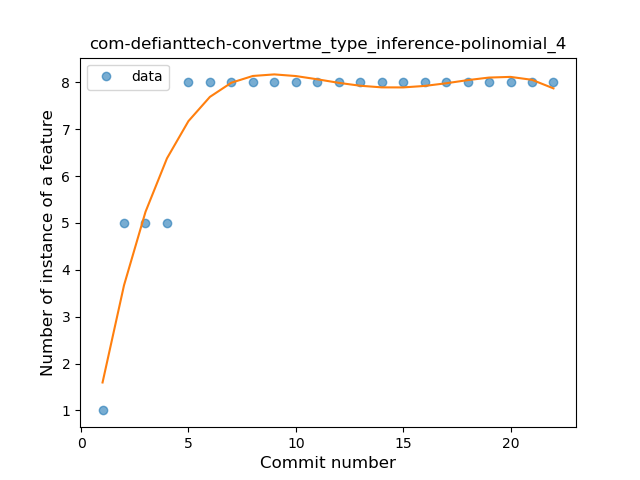
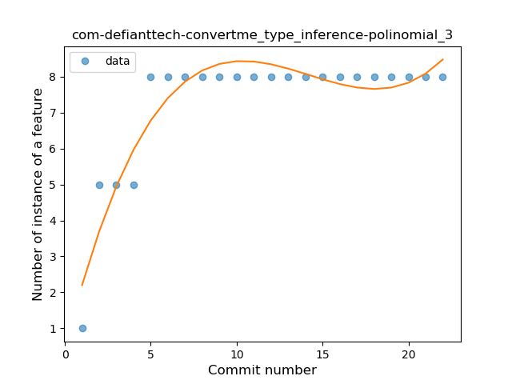
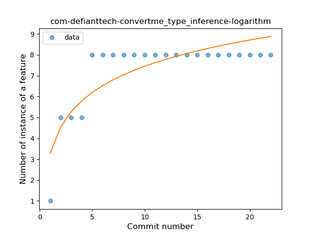
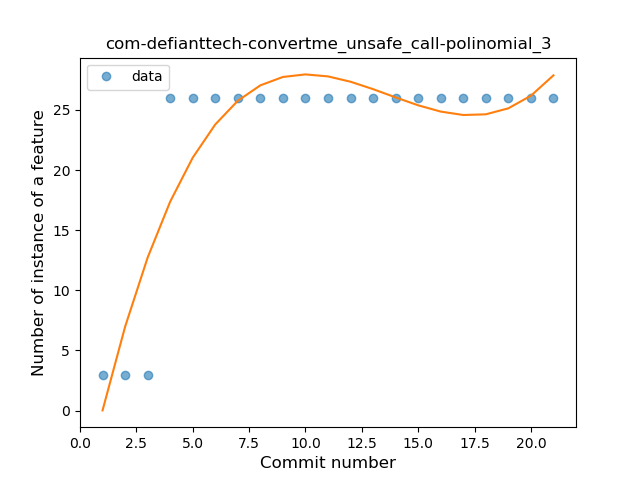
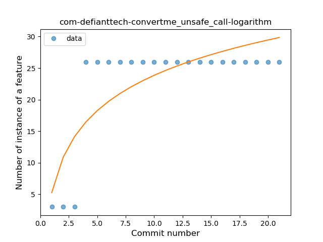
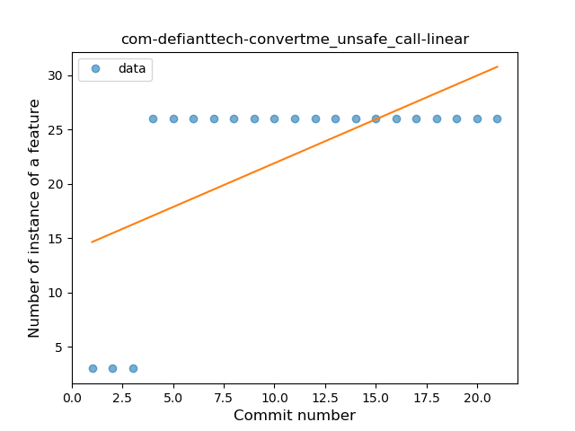
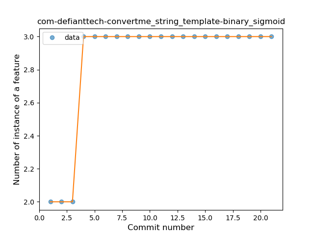
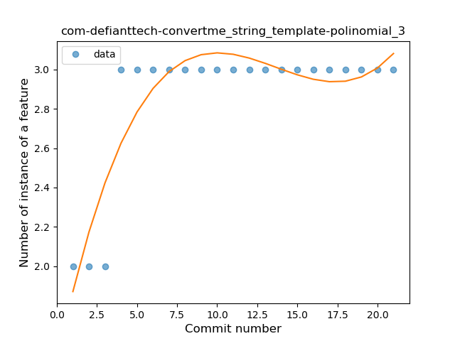
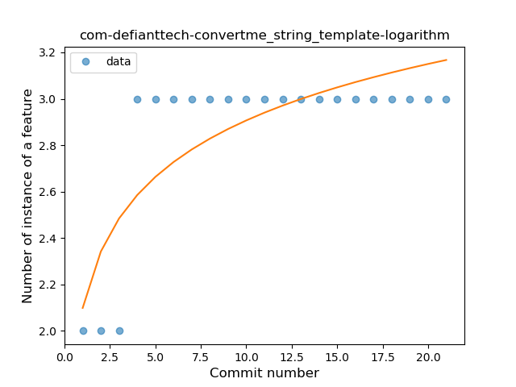
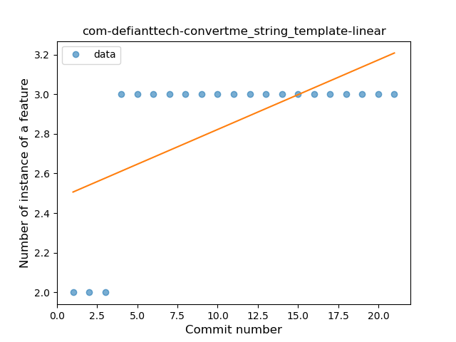

## com-defianttech-convertme
----
#### Metrics provided by Detekt
* Number of lines of code 225
* Number of Kotlin files: 3
* Cyclomatic complexity: 37
* Cyclomatic complexity by thousands of lines: 298 

----
**3** features analyzed

*	<a href="#type_inference">Type Inference</a> 
*	<a href="#unsafe_call">Unsafe Call</a> 
*	<a href="#string_template">String Template</a> 

### <a name="type_inference">Type Inference</a>
----
#### Functions
* **Instability - Polinomial 4:** 
    * **R_Squared:** 0.92217361
* **Instability - Polinomial 3:** )
    * **R_Squared:** 0.88763609
* **Sudden Rise Plateau - Logarithm:** 
    * **R_Squared:** 0.72391138
* **Constant Rise - Linear:** 
    * **R_Squared:** 0.3947784

**Plots** :chart_with_upwards_trend:
-----

### <a name="unsafe_call">Unsafe Call</a>
----
#### Functions
* **Instability - Polinomial 4:** 
    * **R_Squared:** 0.83307676
* **Instability - Polinomial 3:** )
    * **R_Squared:** 0.8187539
* **Sudden Rise Plateau - Logarithm:** 
    * **R_Squared:** 0.64013401
* **Constant Rise - Linear:** 
    * **R_Squared:** 0.36818182

**Plots** :chart_with_upwards_trend:
-----

### <a name="string_template">String Template</a>
----
#### Functions
* **Plateau Sudden Rise - Binary Sigmoid:** 
    * **R_Squared:** 1.0
* **Instability - Polinomial 3:** )
    * **R_Squared:** 0.8187539
* **Sudden Rise Plateau - Logarithm:** 
    * **R_Squared:** 0.64013401
* **Constant Rise - Linear:** 
    * **R_Squared:** 0.36818182

**Plots** :chart_with_upwards_trend:
-----

