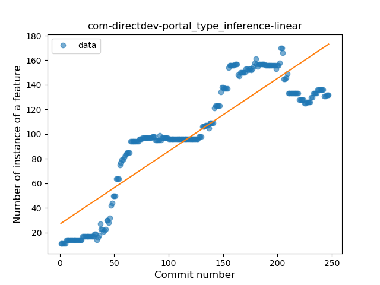
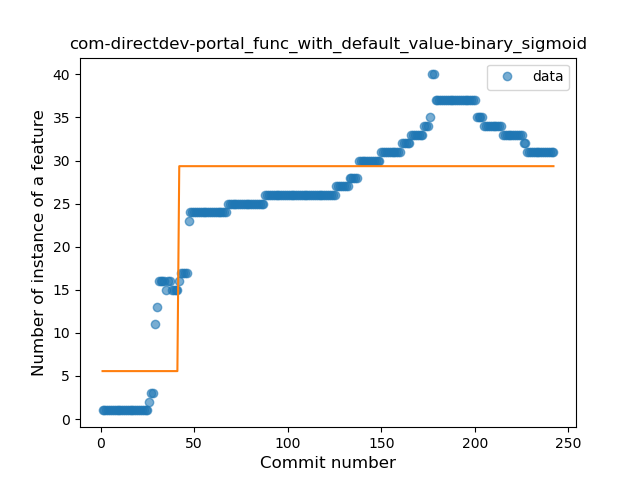
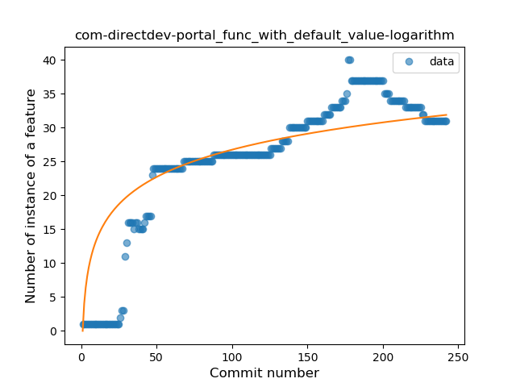
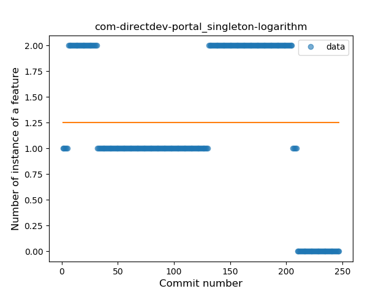
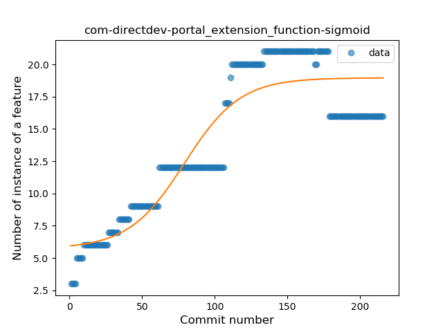

## com-directdev-portal
----
#### Metrics provided by Detekt
* Number of lines of code 3999
* Number of Kotlin files: 91
* Cyclomatic complexity: 554
* Cyclomatic complexity by thousands of lines: 268 

----
**13** features analyzed

*	<a href="#type_inference">Type Inference</a> 
*	<a href="#lambda">Lambda</a> 
*	<a href="#safe_call">Safe Call</a> 
*	<a href="#when_expr">When expression</a> 
*	<a href="#string_template">String Template</a> 
*	<a href="#func_with_default_value">Function with Default Value</a> 
*	<a href="#singleton">Singleton</a> 
*	<a href="#smart_cast">Smart Cast</a> 
*	<a href="#data_class">Data Class</a> 
*	<a href="#func_call_with_named_arg">Function call with Named Argument</a> 
*	<a href="#extension_function">Extension Function</a> 
*	<a href="#property_delegation">Property Delegation</a> 
*	<a href="#destructuring_declaration">Destructuring Declaration</a> 

### <a name="type_inference">Type Inference</a>
----
#### Functions
* **Constant Rise - Linear:** 
    * **R_Squared:** 0.79054096
* **Plateau Sudden Rise - Binary Sigmoid:** 
    * **R_Squared:** 0.62625146
* **Sudden Rise Plateau - Logarithm:** 
    * **R_Squared:** 0.60625226

**Plots** :chart_with_upwards_trend:
-----

### <a name="lambda">Lambda</a>
----
#### Functions
* **Constant Rise - Linear:** 
    * **R_Squared:** 0.85120056
* **Plateau Sudden Rise - Binary Sigmoid:** 
    * **R_Squared:** 0.61051243
* **Sudden Rise Plateau - Logarithm:** 
    * **R_Squared:** 0.58509872

**Plots** :chart_with_upwards_trend:
-----

### <a name="safe_call">Safe Call</a>
----
#### Functions
* **Sudden Rise Plateau - Logarithm:** 
    * **R_Squared:** 0.81170368
* **Constant Rise - Linear:** 
    * **R_Squared:** 0.54551352

**Plots** :chart_with_upwards_trend:
-----

### <a name="when_expr">When expression</a>
----
#### Functions
* **Sudden Rise Plateau - Logarithm:** 
    * **R_Squared:** 0.67643571
* **Constant Rise - Linear:** 
    * **R_Squared:** 0.63562854

**Plots** :chart_with_upwards_trend:
-----

### <a name="string_template">String Template</a>
----
#### Functions
* **Plateau Gradual Rise - Sigmoid:** 
    * **R_Squared:** 0.89687342
* **Sudden Rise Plateau - Logarithm:** 
    * **R_Squared:** 0.73542259
* **Constant Rise - Linear:** 
    * **R_Squared:** 0.6716031

**Plots** :chart_with_upwards_trend:
-----

### <a name="func_with_default_value">Function with Default Value</a>
----
#### Functions
* **Plateau Sudden Rise - Binary Sigmoid:** 
    * **R_Squared:** 0.75349616
* **Constant Rise - Linear:** 
    * **R_Squared:** 0.72331431
* **Sudden Rise Plateau - Logarithm:** 
    * **R_Squared:** 0.70747814

**Plots** :chart_with_upwards_trend:
-----

### <a name="singleton">Singleton</a>
----
#### Functions
* **Constant Decline - Linear:** 
    * **R_Squared:** 0.0755027
* **Sudden Rise Plateau - Logarithm:** 
    * **R_Squared:** -0.0

**Plots** :chart_with_upwards_trend:
-----

### <a name="smart_cast">Smart Cast</a>
----
#### Functions
* **Plateau Gradual Rise - Sigmoid:** 
    * **R_Squared:** 0.54796986
* **Constant Rise - Linear:** 
    * **R_Squared:** 0.48590246
* **Sudden Rise Plateau - Logarithm:** 
    * **R_Squared:** 0.44603419

**Plots** :chart_with_upwards_trend:
-----

### <a name="data_class">Data Class</a>
----
#### Functions
* **Plateau Gradual Rise - Sigmoid:** 
    * **R_Squared:** 0.83901773
* **Constant Rise - Linear:** 
    * **R_Squared:** 0.57968744
* **Sudden Rise - Exponential:** 
    * **R_Squared:** 0.57989597
* **Sudden Rise Plateau - Logarithm:** 
    * **R_Squared:** 0.28789346

**Plots** :chart_with_upwards_trend:
-----

### <a name="func_call_with_named_arg">Function call with Named Argument</a>
----
#### Functions
* **Sudden Rise - Exponential:** 
    * **R_Squared:** 0.34594309
* **Constant Rise - Linear:** 
    * **R_Squared:** 0.28241971
* **Plateau Sudden Decline - Binary Sigmoid:** 
    * **R_Squared:** 0.12531149
* **Sudden Rise Plateau - Logarithm:** 
    * **R_Squared:** 0.05203883

**Plots** :chart_with_upwards_trend:
-----

### <a name="extension_function">Extension Function</a>
----
#### Functions
* **Plateau Gradual Rise - Sigmoid:** 
    * **R_Squared:** 0.84416965
* **Constant Rise - Linear:** 
    * **R_Squared:** 0.66630682
* **Sudden Rise Plateau - Logarithm:** 
    * **R_Squared:** 0.62336352

**Plots** :chart_with_upwards_trend:
-----

### <a name="property_delegation">Property Delegation</a>
----
#### Functions
* **Plateau Gradual Decline - Sigmoid:** 
    * **R_Squared:** 0.96221901
* **Constant Decline - Linear:** 
    * **R_Squared:** 0.71983378
* **Sudden Rise Plateau - Logarithm:** 
    * **R_Squared:** 0.0

**Plots** :chart_with_upwards_trend:
-----

### <a name="destructuring_declaration">Destructuring Declaration</a>
----
#### Functions
* **Plateau Sudden Decline - Binary Sigmoid:** 
    * **R_Squared:** 1.0
* **Constant Decline - Linear:** 
    * **R_Squared:** 0.7081577
* **Sudden Rise Plateau - Logarithm:** 
    * **R_Squared:** -0.0

**Plots** :chart_with_upwards_trend:
-----

