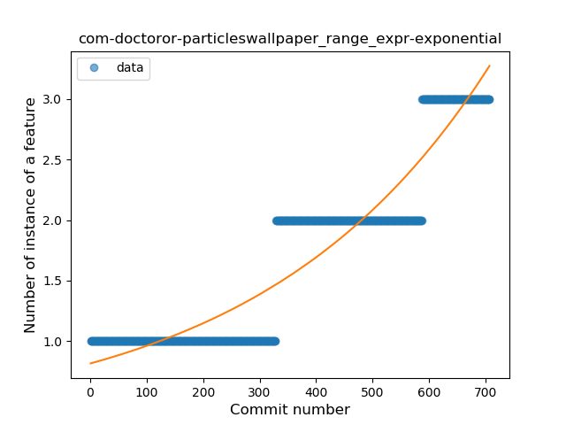
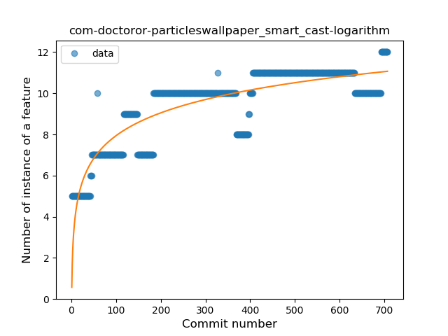
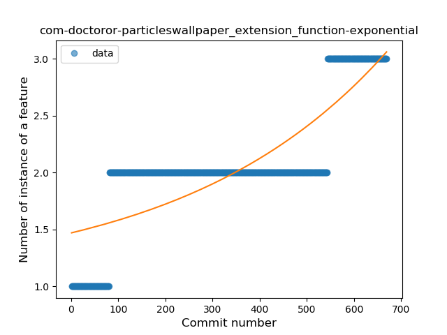
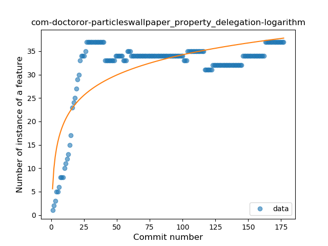
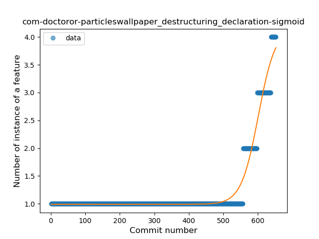
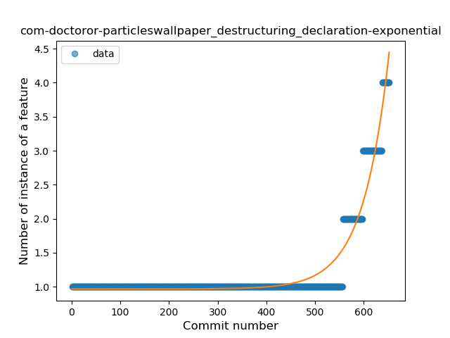
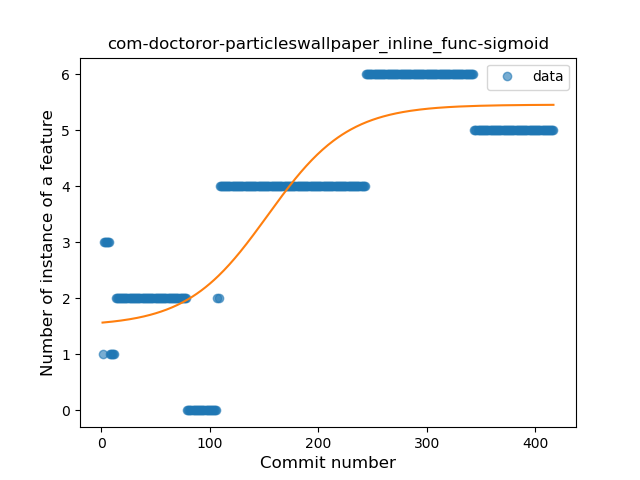

## com-doctoror-particleswallpaper
----
#### Metrics provided by Detekt
* Number of lines of code 16801
* Number of Kotlin files: 228
* Cyclomatic complexity: 1256
* Cyclomatic complexity by thousands of lines: 191 

----
**17** features analyzed

*	<a href="#type_inference">Type Inference</a> 
*	<a href="#lambda">Lambda</a> 
*	<a href="#safe_call">Safe Call</a> 
*	<a href="#when_expr">When expression</a> 
*	<a href="#unsafe_call">Unsafe Call</a> 
*	<a href="#companion_object">Companion Object</a> 
*	<a href="#string_template">String Template</a> 
*	<a href="#func_with_default_value">Function with Default Value</a> 
*	<a href="#singleton">Singleton</a> 
*	<a href="#range_expr">Range Expression</a> 
*	<a href="#smart_cast">Smart Cast</a> 
*	<a href="#data_class">Data Class</a> 
*	<a href="#func_call_with_named_arg">Function call with Named Argument</a> 
*	<a href="#extension_function">Extension Function</a> 
*	<a href="#property_delegation">Property Delegation</a> 
*	<a href="#destructuring_declaration">Destructuring Declaration</a> 
*	<a href="#inline_func">Inline Function</a> 

### <a name="type_inference">Type Inference</a>
----
#### Functions
* **Constant Rise - Linear:** 
    * **R_Squared:** 0.96651276
* **Sudden Rise Plateau - Logarithm:** 
    * **R_Squared:** 0.54765027
* **Plateau Sudden Rise - Binary Sigmoid:** 
    * **R_Squared:** 0.23446035

**Plots** :chart_with_upwards_trend:
-----

### <a name="lambda">Lambda</a>
----
#### Functions
* **Sudden Rise - Exponential:** 
    * **R_Squared:** 0.9737244
* **Constant Rise - Linear:** 
    * **R_Squared:** 0.87124175
* **Sudden Rise Plateau - Logarithm:** 
    * **R_Squared:** 0.33409654
* **Plateau Sudden Rise - Binary Sigmoid:** 
    * **R_Squared:** 0.08045196

**Plots** :chart_with_upwards_trend:
-----

### <a name="safe_call">Safe Call</a>
----
#### Functions
* **Sudden Rise - Exponential:** 
    * **R_Squared:** 0.79888314
* **Constant Rise - Linear:** 
    * **R_Squared:** 0.78816868
* **Sudden Rise Plateau - Logarithm:** 
    * **R_Squared:** 0.60987564

**Plots** :chart_with_upwards_trend:
-----

### <a name="when_expr">When expression</a>
----
#### Functions
* **Sudden Rise - Exponential:** 
    * **R_Squared:** 0.77316682
* **Constant Rise - Linear:** 
    * **R_Squared:** 0.48754166
* **Sudden Rise Plateau - Logarithm:** 
    * **R_Squared:** 0.28456877

**Plots** :chart_with_upwards_trend:
-----

### <a name="unsafe_call">Unsafe Call</a>
----
#### Functions
* **Constant Rise - Linear:** 
    * **R_Squared:** 0.00102529
* **Sudden Rise - Exponential:** 
    * **R_Squared:** 0.00101469
* **Sudden Rise Plateau - Logarithm:** 
    * **R_Squared:** 0.00049617

**Plots** :chart_with_upwards_trend:
-----

### <a name="companion_object">Companion Object</a>
----
#### Functions
* **Plateau Gradual Decline - Sigmoid:** 
    * **R_Squared:** 0.79371494
* **Sudden Decline - Exponential:** 
    * **R_Squared:** 0.65801923
* **Constant Decline - Linear:** 
    * **R_Squared:** 0.54298498
* **Sudden Rise Plateau - Logarithm:** 
    * **R_Squared:** -0.0

**Plots** :chart_with_upwards_trend:
-----

### <a name="string_template">String Template</a>
----
#### Functions
* **Plateau Gradual Rise - Sigmoid:** 
    * **R_Squared:** 0.82887549
* **Constant Rise - Linear:** 
    * **R_Squared:** 0.75947954
* **Sudden Rise Plateau - Logarithm:** 
    * **R_Squared:** 0.66456346

**Plots** :chart_with_upwards_trend:
-----

### <a name="func_with_default_value">Function with Default Value</a>
----
#### Functions
* **Constant Rise - Linear:** 
    * **R_Squared:** 0.86700937
* **Sudden Rise - Exponential:** 
    * **R_Squared:** 0.87139375
* **Sudden Rise Plateau - Logarithm:** 
    * **R_Squared:** 0.64110841

**Plots** :chart_with_upwards_trend:
-----

### <a name="singleton">Singleton</a>
----
#### Functions
* **Constant Rise - Linear:** 
    * **R_Squared:** 0.04612814
* **Sudden Rise Plateau - Logarithm:** 
    * **R_Squared:** 0.02982958
* **Plateau Sudden Rise - Binary Sigmoid:** 
    * **R_Squared:** 0.02088798

**Plots** :chart_with_upwards_trend:
-----

### <a name="range_expr">Range Expression</a>
----
#### Functions
* **Sudden Rise - Exponential:** 
    * **R_Squared:** 0.87889659
* **Plateau Gradual Rise - Sigmoid:** 
    * **R_Squared:** 0.88244082
* **Constant Rise - Linear:** 
    * **R_Squared:** 0.83240424
* **Sudden Rise Plateau - Logarithm:** 
    * **R_Squared:** 0.40573375

**Plots** :chart_with_upwards_trend:
-----

### <a name="smart_cast">Smart Cast</a>
----
#### Functions
* **Sudden Rise Plateau - Logarithm:** 
    * **R_Squared:** 0.75854364
* **Constant Rise - Linear:** 
    * **R_Squared:** 0.61918239
* **Plateau Sudden Rise - Binary Sigmoid:** 
    * **R_Squared:** 0.59834357

**Plots** :chart_with_upwards_trend:
-----

### <a name="data_class">Data Class</a>
----
#### Functions
* **Plateau Gradual Rise - Sigmoid:** 
    * **R_Squared:** 0.94855328
* **Sudden Rise - Exponential:** 
    * **R_Squared:** 0.90668204
* **Constant Rise - Linear:** 
    * **R_Squared:** 0.81600242
* **Sudden Rise Plateau - Logarithm:** 
    * **R_Squared:** 0.29571465

**Plots** :chart_with_upwards_trend:
-----

### <a name="func_call_with_named_arg">Function call with Named Argument</a>
----
#### Functions
* **Sudden Rise - Exponential:** 
    * **R_Squared:** 0.90316263
* **Constant Rise - Linear:** 
    * **R_Squared:** 0.67702121
* **Sudden Rise Plateau - Logarithm:** 
    * **R_Squared:** 0.12936468

**Plots** :chart_with_upwards_trend:
-----

### <a name="extension_function">Extension Function</a>
----
#### Functions
* **Sudden Rise - Exponential:** 
    * **R_Squared:** 0.66968407
* **Constant Rise - Linear:** 
    * **R_Squared:** 0.65939589
* **Sudden Rise Plateau - Logarithm:** 
    * **R_Squared:** 0.5902606

**Plots** :chart_with_upwards_trend:
-----

### <a name="property_delegation">Property Delegation</a>
----
#### Functions
* **Sudden Rise Plateau - Logarithm:** 
    * **R_Squared:** 0.60647111
* **Constant Rise - Linear:** 
    * **R_Squared:** 0.24848464

**Plots** :chart_with_upwards_trend:
-----

### <a name="destructuring_declaration">Destructuring Declaration</a>
----
#### Functions
* **Plateau Gradual Rise - Sigmoid:** 
    * **R_Squared:** 0.95728799
* **Sudden Rise - Exponential:** 
    * **R_Squared:** 0.93656475
* **Constant Rise - Linear:** 
    * **R_Squared:** 0.33794398
* **Sudden Rise Plateau - Logarithm:** 
    * **R_Squared:** 0.13014019

**Plots** :chart_with_upwards_trend:
-----

### <a name="inline_func">Inline Function</a>
----
#### Functions
* **Plateau Gradual Rise - Sigmoid:** 
    * **R_Squared:** 0.75488677
* **Constant Rise - Linear:** 
    * **R_Squared:** 0.63677857
* **Sudden Rise Plateau - Logarithm:** 
    * **R_Squared:** 0.44668791

**Plots** :chart_with_upwards_trend:
-----

