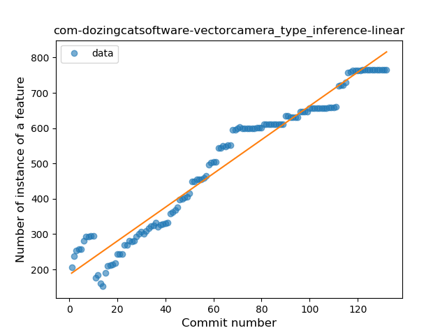
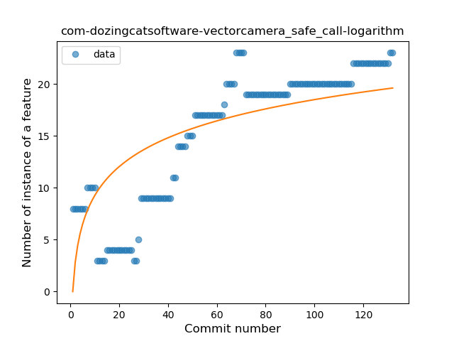
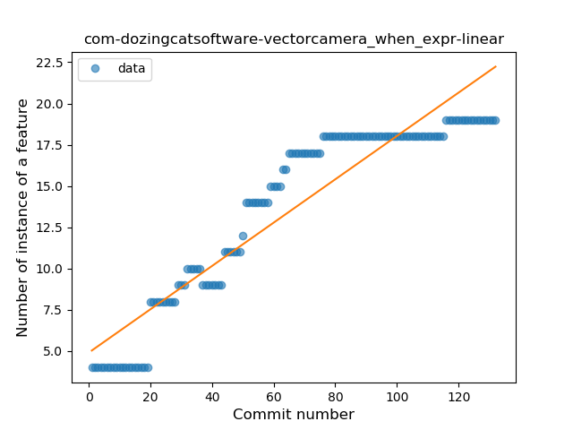
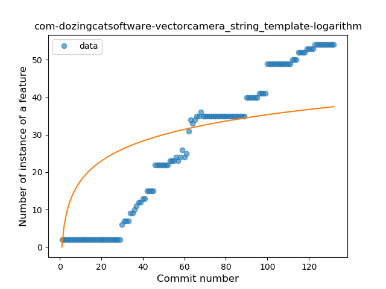
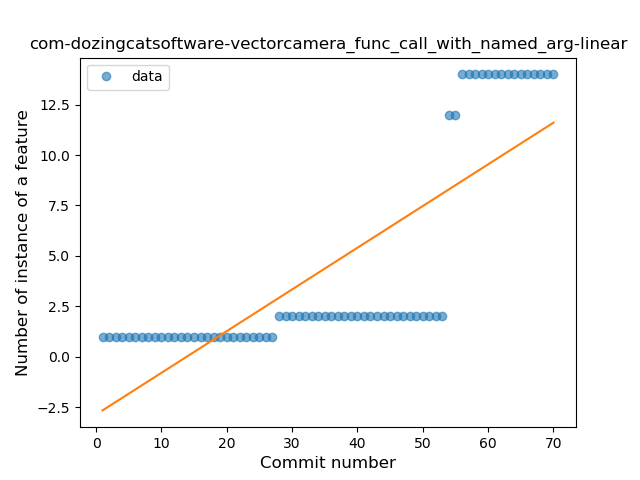
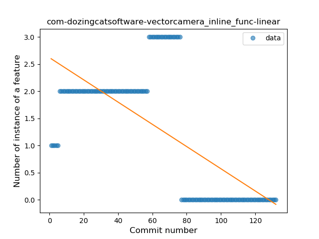

## com-dozingcatsoftware-vectorcamera
----
#### Metrics provided by Detekt
* Number of lines of code 6345
* Number of Kotlin files: 54
* Cyclomatic complexity: 892
* Cyclomatic complexity by thousands of lines: 225 

----
**15** features analyzed

*	<a href="#type_inference">Type Inference</a> 
*	<a href="#lambda">Lambda</a> 
*	<a href="#safe_call">Safe Call</a> 
*	<a href="#when_expr">When expression</a> 
*	<a href="#unsafe_call">Unsafe Call</a> 
*	<a href="#companion_object">Companion Object</a> 
*	<a href="#string_template">String Template</a> 
*	<a href="#func_with_default_value">Function with Default Value</a> 
*	<a href="#singleton">Singleton</a> 
*	<a href="#range_expr">Range Expression</a> 
*	<a href="#smart_cast">Smart Cast</a> 
*	<a href="#data_class">Data Class</a> 
*	<a href="#func_call_with_named_arg">Function call with Named Argument</a> 
*	<a href="#inline_func">Inline Function</a> 
*	<a href="#coroutine">Coroutine</a> 

### <a name="type_inference">Type Inference</a>
----
#### Functions
* **Constant Rise - Linear:** 
    * **R_Squared:** 0.9539219
* **Sudden Rise Plateau - Logarithm:** 
    * **R_Squared:** 0.70163784

**Plots** :chart_with_upwards_trend:
-----

### <a name="lambda">Lambda</a>
----
#### Functions
* **Constant Rise - Linear:** 
    * **R_Squared:** 0.96148717
* **Sudden Rise - Exponential:** 
    * **R_Squared:** 0.96180426
* **Sudden Rise Plateau - Logarithm:** 
    * **R_Squared:** 0.63003729

**Plots** :chart_with_upwards_trend:
-----

### <a name="safe_call">Safe Call</a>
----
#### Functions
* **Plateau Gradual Rise - Sigmoid:** 
    * **R_Squared:** 0.92882554
* **Constant Rise - Linear:** 
    * **R_Squared:** 0.79114664
* **Sudden Rise Plateau - Logarithm:** 
    * **R_Squared:** 0.60563266

**Plots** :chart_with_upwards_trend:
-----

### <a name="when_expr">When expression</a>
----
#### Functions
* **Constant Rise - Linear:** 
    * **R_Squared:** 0.87564655
* **Sudden Rise Plateau - Logarithm:** 
    * **R_Squared:** 0.75390194

**Plots** :chart_with_upwards_trend:
-----

### <a name="unsafe_call">Unsafe Call</a>
----
#### Functions
* **Constant Rise - Linear:** 
    * **R_Squared:** 0.7482747
* **Sudden Rise Plateau - Logarithm:** 
    * **R_Squared:** 0.68687146
* **Plateau Sudden Rise - Binary Sigmoid:** 
    * **R_Squared:** 0.66819999

**Plots** :chart_with_upwards_trend:
-----

### <a name="companion_object">Companion Object</a>
----
#### Functions
* **Constant Rise - Linear:** 
    * **R_Squared:** 0.87855994
* **Plateau Sudden Rise - Binary Sigmoid:** 
    * **R_Squared:** 0.82868258
* **Sudden Rise Plateau - Logarithm:** 
    * **R_Squared:** 0.79765205

**Plots** :chart_with_upwards_trend:
-----

### <a name="string_template">String Template</a>
----
#### Functions
* **Constant Rise - Linear:** 
    * **R_Squared:** 0.96727621
* **Sudden Rise Plateau - Logarithm:** 
    * **R_Squared:** 0.5038545
* **Plateau Sudden Rise - Binary Sigmoid:** 
    * **R_Squared:** 0.36363253

**Plots** :chart_with_upwards_trend:
-----

### <a name="func_with_default_value">Function with Default Value</a>
----
#### Functions
* **Constant Rise - Linear:** 
    * **R_Squared:** 0.96709889
* **Sudden Rise Plateau - Logarithm:** 
    * **R_Squared:** 0.7068085

**Plots** :chart_with_upwards_trend:
-----

### <a name="singleton">Singleton</a>
----
#### Functions
* **Plateau Gradual Rise - Sigmoid:** 
    * **R_Squared:** 0.74392478
* **Sudden Rise Plateau - Logarithm:** 
    * **R_Squared:** 0.54772889
* **Constant Rise - Linear:** 
    * **R_Squared:** 0.25158853

**Plots** :chart_with_upwards_trend:
-----

### <a name="range_expr">Range Expression</a>
----
#### Functions
* **Sudden Rise - Exponential:** 
    * **R_Squared:** 0.75043703
* **Constant Rise - Linear:** 
    * **R_Squared:** 0.67388983
* **Sudden Rise Plateau - Logarithm:** 
    * **R_Squared:** 0.29934919

**Plots** :chart_with_upwards_trend:
-----

### <a name="smart_cast">Smart Cast</a>
----
#### Functions
* **Sudden Rise - Exponential:** 
    * **R_Squared:** 0.79708984
* **Constant Rise - Linear:** 
    * **R_Squared:** 0.64793391
* **Sudden Rise Plateau - Logarithm:** 
    * **R_Squared:** 0.37454941

**Plots** :chart_with_upwards_trend:
-----

### <a name="data_class">Data Class</a>
----
#### Functions
* **Constant Rise - Linear:** 
    * **R_Squared:** 0.77255051
* **Sudden Rise Plateau - Logarithm:** 
    * **R_Squared:** 0.66851788

**Plots** :chart_with_upwards_trend:
-----

### <a name="func_call_with_named_arg">Function call with Named Argument</a>
----
#### Functions
* **Plateau Gradual Rise - Sigmoid:** 
    * **R_Squared:** 0.99150066
* **Sudden Rise - Exponential:** 
    * **R_Squared:** 0.81937114
* **Constant Rise - Linear:** 
    * **R_Squared:** 0.62386642
* **Sudden Rise Plateau - Logarithm:** 
    * **R_Squared:** 0.21942372

**Plots** :chart_with_upwards_trend:
-----

### <a name="inline_func">Inline Function</a>
----
#### Functions
* **Constant Decline - Linear:** 
    * **R_Squared:** 0.45963086
* **Sudden Rise Plateau - Logarithm:** 
    * **R_Squared:** -0.0

**Plots** :chart_with_upwards_trend:
-----

### <a name="coroutine">Coroutine</a>
----
#### Functions
* **Plateau Sudden Rise - Binary Sigmoid:** 
    * **R_Squared:** 1.0
* **Sudden Rise - Exponential:** 
    * **R_Squared:** 0.79734604
* **Constant Rise - Linear:** 
    * **R_Squared:** 0.27407886
* **Sudden Rise Plateau - Logarithm:** 
    * **R_Squared:** 0.11136746

**Plots** :chart_with_upwards_trend:
-----

