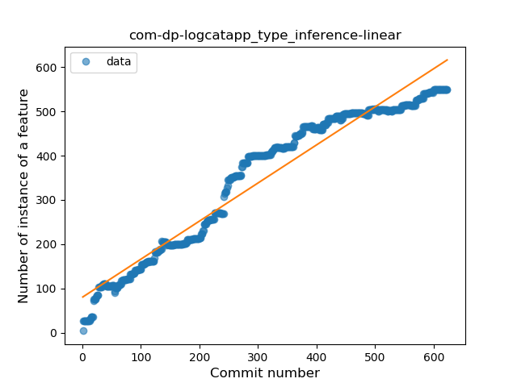
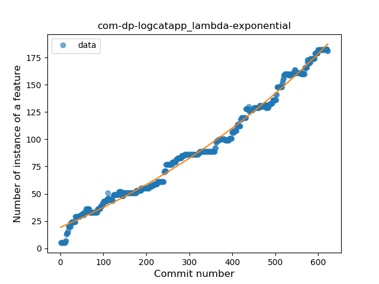
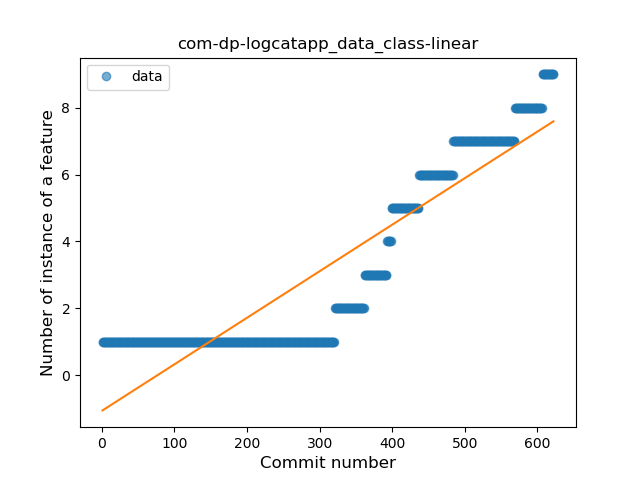
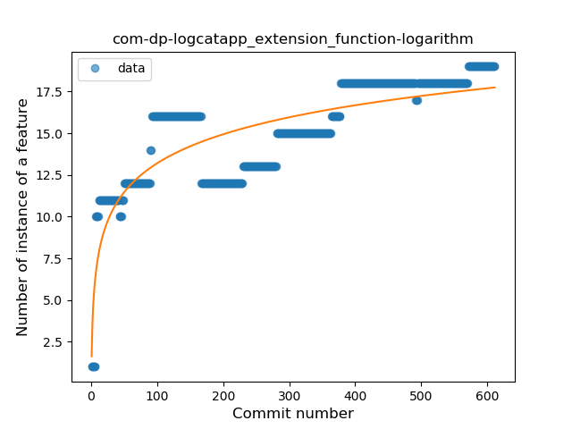
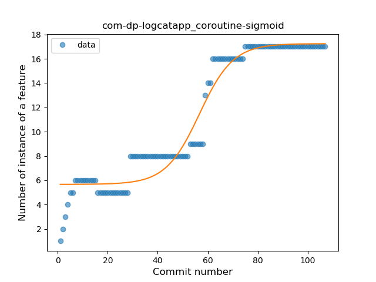

## com-dp-logcatapp
----
#### Metrics provided by Detekt
* Number of lines of code 6347
* Number of Kotlin files: 56
* Cyclomatic complexity: 1020
* Cyclomatic complexity by thousands of lines: 279 

----
**17** features analyzed

*	<a href="#type_inference">Type Inference</a> 
*	<a href="#lambda">Lambda</a> 
*	<a href="#safe_call">Safe Call</a> 
*	<a href="#when_expr">When expression</a> 
*	<a href="#unsafe_call">Unsafe Call</a> 
*	<a href="#companion_object">Companion Object</a> 
*	<a href="#string_template">String Template</a> 
*	<a href="#func_with_default_value">Function with Default Value</a> 
*	<a href="#singleton">Singleton</a> 
*	<a href="#range_expr">Range Expression</a> 
*	<a href="#data_class">Data Class</a> 
*	<a href="#func_call_with_named_arg">Function call with Named Argument</a> 
*	<a href="#extension_function">Extension Function</a> 
*	<a href="#destructuring_declaration">Destructuring Declaration</a> 
*	<a href="#inline_func">Inline Function</a> 
*	<a href="#overloaded_op">Overloaded Operator</a> 
*	<a href="#coroutine">Coroutine</a> 

### <a name="type_inference">Type Inference</a>
----
#### Functions
* **Constant Rise - Linear:** 
    * **R_Squared:** 0.94449728
* **Plateau Sudden Rise - Binary Sigmoid:** 
    * **R_Squared:** 0.84199127
* **Sudden Rise Plateau - Logarithm:** 
    * **R_Squared:** 0.5690373

**Plots** :chart_with_upwards_trend:
-----

### <a name="lambda">Lambda</a>
----
#### Functions
* **Sudden Rise - Exponential:** 
    * **R_Squared:** 0.99020833
* **Constant Rise - Linear:** 
    * **R_Squared:** 0.97856316
* **Sudden Rise Plateau - Logarithm:** 
    * **R_Squared:** 0.46572676
* **Plateau Sudden Rise - Binary Sigmoid:** 
    * **R_Squared:** 0.2671621

**Plots** :chart_with_upwards_trend:
-----

### <a name="safe_call">Safe Call</a>
----
#### Functions
* **Plateau Gradual Rise - Sigmoid:** 
    * **R_Squared:** 0.96918915
* **Constant Rise - Linear:** 
    * **R_Squared:** 0.95030859
* **Sudden Rise Plateau - Logarithm:** 
    * **R_Squared:** 0.66132047

**Plots** :chart_with_upwards_trend:
-----

### <a name="when_expr">When expression</a>
----
#### Functions
* **Constant Rise - Linear:** 
    * **R_Squared:** 0.97349159
* **Sudden Rise Plateau - Logarithm:** 
    * **R_Squared:** 0.55827199
* **Plateau Sudden Rise - Binary Sigmoid:** 
    * **R_Squared:** 0.10619624

**Plots** :chart_with_upwards_trend:
-----

### <a name="unsafe_call">Unsafe Call</a>
----
#### Functions
* **Constant Rise - Linear:** 
    * **R_Squared:** 0.92048023
* **Plateau Sudden Rise - Binary Sigmoid:** 
    * **R_Squared:** 0.78972879
* **Sudden Rise Plateau - Logarithm:** 
    * **R_Squared:** 0.349903

**Plots** :chart_with_upwards_trend:
-----

### <a name="companion_object">Companion Object</a>
----
#### Functions
* **Constant Rise - Linear:** 
    * **R_Squared:** 0.96592415
* **Plateau Gradual Rise - Sigmoid:** 
    * **R_Squared:** 0.97157465
* **Sudden Rise Plateau - Logarithm:** 
    * **R_Squared:** 0.57256909

**Plots** :chart_with_upwards_trend:
-----

### <a name="string_template">String Template</a>
----
#### Functions
* **Constant Rise - Linear:** 
    * **R_Squared:** 0.88671137
* **Sudden Rise Plateau - Logarithm:** 
    * **R_Squared:** 0.73980682
* **Plateau Gradual Rise - Sigmoid:** 
    * **R_Squared:** 0.32868082

**Plots** :chart_with_upwards_trend:
-----

### <a name="func_with_default_value">Function with Default Value</a>
----
#### Functions
* **Constant Rise - Linear:** 
    * **R_Squared:** 0.8976621
* **Sudden Rise - Exponential:** 
    * **R_Squared:** 0.902066
* **Sudden Rise Plateau - Logarithm:** 
    * **R_Squared:** 0.42670953
* **Plateau Gradual Rise - Sigmoid:** 
    * **R_Squared:** -0.0

**Plots** :chart_with_upwards_trend:
-----

### <a name="singleton">Singleton</a>
----
#### Functions
* **Constant Rise - Linear:** 
    * **R_Squared:** 0.83419848
* **Sudden Rise Plateau - Logarithm:** 
    * **R_Squared:** 0.80292591
* **Plateau Sudden Rise - Binary Sigmoid:** 
    * **R_Squared:** 0.11521699

**Plots** :chart_with_upwards_trend:
-----

### <a name="range_expr">Range Expression</a>
----
#### Functions
* **Constant Rise - Linear:** 
    * **R_Squared:** 0.75113991
* **Sudden Rise Plateau - Logarithm:** 
    * **R_Squared:** 0.38049196

**Plots** :chart_with_upwards_trend:
-----

### <a name="data_class">Data Class</a>
----
#### Functions
* **Plateau Gradual Rise - Sigmoid:** 
    * **R_Squared:** 0.98342171
* **Sudden Rise - Exponential:** 
    * **R_Squared:** 0.92512565
* **Constant Rise - Linear:** 
    * **R_Squared:** 0.82073873
* **Sudden Rise Plateau - Logarithm:** 
    * **R_Squared:** 0.24072659

**Plots** :chart_with_upwards_trend:
-----

### <a name="func_call_with_named_arg">Function call with Named Argument</a>
----
#### Functions
* **Constant Rise - Linear:** 
    * **R_Squared:** 0.77787632
* **Sudden Rise - Exponential:** 
    * **R_Squared:** 0.77883218
* **Sudden Rise Plateau - Logarithm:** 
    * **R_Squared:** 0.71994686

**Plots** :chart_with_upwards_trend:
-----

### <a name="extension_function">Extension Function</a>
----
#### Functions
* **Sudden Rise Plateau - Logarithm:** 
    * **R_Squared:** 0.6695939
* **Constant Rise - Linear:** 
    * **R_Squared:** 0.65198717

**Plots** :chart_with_upwards_trend:
-----

### <a name="destructuring_declaration">Destructuring Declaration</a>
----
#### Functions
* **Constant Rise - Linear:** 
    * **R_Squared:** 0.01955572
* **Sudden Rise - Exponential:** 
    * **R_Squared:** 0.02458826
* **Sudden Rise Plateau - Logarithm:** 
    * **R_Squared:** 0.00366703
* **Plateau Gradual Decline - Sigmoid:** 
    * **R_Squared:** 0.00026537

**Plots** :chart_with_upwards_trend:
-----

### <a name="inline_func">Inline Function</a>
----
#### Functions
* **Plateau Gradual Decline - Sigmoid:** 
    * **R_Squared:** 0.72991287
* **Constant Decline - Linear:** 
    * **R_Squared:** 0.29025958
* **Sudden Rise Plateau - Logarithm:** 
    * **R_Squared:** -0.0

**Plots** :chart_with_upwards_trend:
-----

### <a name="overloaded_op">Overloaded Operator</a>
----
#### Functions
* **Plateau Gradual Rise - Sigmoid:** 
    * **R_Squared:** 0.94486798
* **Constant Rise - Linear:** 
    * **R_Squared:** 0.82234566
* **Sudden Rise Plateau - Logarithm:** 
    * **R_Squared:** 0.4265365

**Plots** :chart_with_upwards_trend:
-----

### <a name="coroutine">Coroutine</a>
----
#### Functions
* **Plateau Gradual Rise - Sigmoid:** 
    * **R_Squared:** 0.9459107
* **Constant Rise - Linear:** 
    * **R_Squared:** 0.88676069
* **Sudden Rise Plateau - Logarithm:** 
    * **R_Squared:** 0.61970293

**Plots** :chart_with_upwards_trend:
-----

