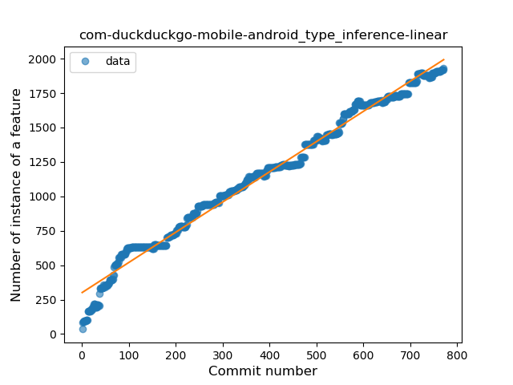
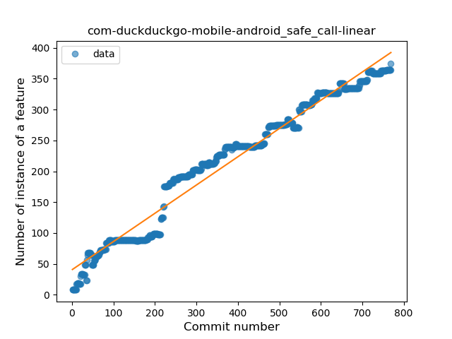
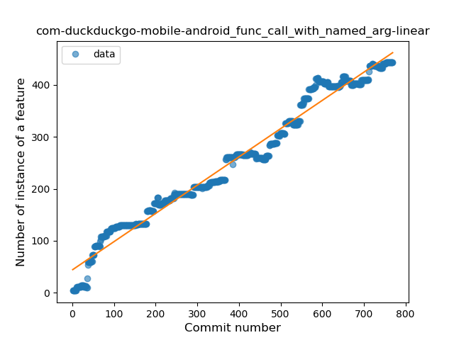
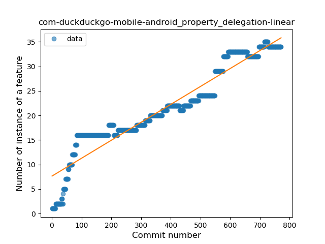
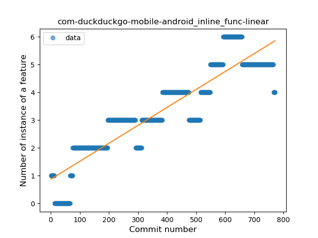
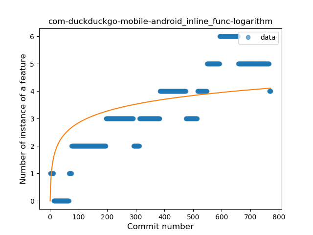

## com-duckduckgo-mobile-android
----
#### Metrics provided by Detekt
* Number of lines of code 41419
* Number of Kotlin files: 456
* Cyclomatic complexity: 4219
* Cyclomatic complexity by thousands of lines: 227 

----
**19** features analyzed

*	<a href="#type_inference">Type Inference</a> 
*	<a href="#lambda">Lambda</a> 
*	<a href="#safe_call">Safe Call</a> 
*	<a href="#when_expr">When expression</a> 
*	<a href="#unsafe_call">Unsafe Call</a> 
*	<a href="#companion_object">Companion Object</a> 
*	<a href="#string_template">String Template</a> 
*	<a href="#func_with_default_value">Function with Default Value</a> 
*	<a href="#singleton">Singleton</a> 
*	<a href="#range_expr">Range Expression</a> 
*	<a href="#smart_cast">Smart Cast</a> 
*	<a href="#data_class">Data Class</a> 
*	<a href="#func_call_with_named_arg">Function call with Named Argument</a> 
*	<a href="#extension_function">Extension Function</a> 
*	<a href="#property_delegation">Property Delegation</a> 
*	<a href="#destructuring_declaration">Destructuring Declaration</a> 
*	<a href="#inline_func">Inline Function</a> 
*	<a href="#coroutine">Coroutine</a> 
*	<a href="#sealed_class">Sealed Class</a> 

### <a name="type_inference">Type Inference</a>
----
#### Functions
* **Constant Rise - Linear:** 
    * **R_Squared:** 0.98496859
* **Sudden Rise Plateau - Logarithm:** 
    * **R_Squared:** 0.58038928
* **Plateau Sudden Rise - Binary Sigmoid:** 
    * **R_Squared:** 0.26152024

**Plots** :chart_with_upwards_trend:
-----

### <a name="lambda">Lambda</a>
----
#### Functions
* **Sudden Rise - Exponential:** 
    * **R_Squared:** 0.97335432
* **Constant Rise - Linear:** 
    * **R_Squared:** 0.94860228
* **Plateau Sudden Rise - Binary Sigmoid:** 
    * **R_Squared:** 0.46371995
* **Sudden Rise Plateau - Logarithm:** 
    * **R_Squared:** 0.37400416

**Plots** :chart_with_upwards_trend:
-----

### <a name="safe_call">Safe Call</a>
----
#### Functions
* **Constant Rise - Linear:** 
    * **R_Squared:** 0.96693813
* **Plateau Sudden Rise - Binary Sigmoid:** 
    * **R_Squared:** 0.7190405
* **Sudden Rise Plateau - Logarithm:** 
    * **R_Squared:** 0.53278449

**Plots** :chart_with_upwards_trend:
-----

### <a name="when_expr">When expression</a>
----
#### Functions
* **Sudden Rise - Exponential:** 
    * **R_Squared:** 0.87970804
* **Constant Rise - Linear:** 
    * **R_Squared:** 0.86691433
* **Sudden Rise Plateau - Logarithm:** 
    * **R_Squared:** 0.51208439
* **Plateau Gradual Rise - Sigmoid:** 
    * **R_Squared:** 0.21682423

**Plots** :chart_with_upwards_trend:
-----

### <a name="unsafe_call">Unsafe Call</a>
----
#### Functions
* **Constant Rise - Linear:** 
    * **R_Squared:** 0.77964921
* **Sudden Rise Plateau - Logarithm:** 
    * **R_Squared:** 0.64063272
* **Plateau Sudden Rise - Binary Sigmoid:** 
    * **R_Squared:** 0.49591091

**Plots** :chart_with_upwards_trend:
-----

### <a name="companion_object">Companion Object</a>
----
#### Functions
* **Constant Rise - Linear:** 
    * **R_Squared:** 0.98102861
* **Sudden Rise Plateau - Logarithm:** 
    * **R_Squared:** 0.52361992
* **Plateau Sudden Rise - Binary Sigmoid:** 
    * **R_Squared:** 0.36974019

**Plots** :chart_with_upwards_trend:
-----

### <a name="string_template">String Template</a>
----
#### Functions
* **Constant Rise - Linear:** 
    * **R_Squared:** 0.97159317
* **Sudden Rise - Exponential:** 
    * **R_Squared:** 0.97344932
* **Sudden Rise Plateau - Logarithm:** 
    * **R_Squared:** 0.48307463
* **Plateau Sudden Rise - Binary Sigmoid:** 
    * **R_Squared:** 0.357718

**Plots** :chart_with_upwards_trend:
-----

### <a name="func_with_default_value">Function with Default Value</a>
----
#### Functions
* **Constant Rise - Linear:** 
    * **R_Squared:** 0.98508538
* **Sudden Rise - Exponential:** 
    * **R_Squared:** 0.9857145
* **Sudden Rise Plateau - Logarithm:** 
    * **R_Squared:** 0.4261206

**Plots** :chart_with_upwards_trend:
-----

### <a name="singleton">Singleton</a>
----
#### Functions
* **Constant Rise - Linear:** 
    * **R_Squared:** 0.95579592
* **Sudden Rise - Exponential:** 
    * **R_Squared:** 0.95971908
* **Sudden Rise Plateau - Logarithm:** 
    * **R_Squared:** 0.48217936
* **Plateau Gradual Rise - Sigmoid:** 
    * **R_Squared:** 0.42947124

**Plots** :chart_with_upwards_trend:
-----

### <a name="range_expr">Range Expression</a>
----
#### Functions
* **Constant Rise - Linear:** 
    * **R_Squared:** 0.81955746
* **Sudden Rise - Exponential:** 
    * **R_Squared:** 0.82012106
* **Sudden Rise Plateau - Logarithm:** 
    * **R_Squared:** 0.55601745

**Plots** :chart_with_upwards_trend:
-----

### <a name="smart_cast">Smart Cast</a>
----
#### Functions
* **Sudden Rise - Exponential:** 
    * **R_Squared:** 0.95244437
* **Constant Rise - Linear:** 
    * **R_Squared:** 0.92039151
* **Sudden Rise Plateau - Logarithm:** 
    * **R_Squared:** 0.34990116
* **Plateau Sudden Rise - Binary Sigmoid:** 
    * **R_Squared:** 0.32110883

**Plots** :chart_with_upwards_trend:
-----

### <a name="data_class">Data Class</a>
----
#### Functions
* **Sudden Rise - Exponential:** 
    * **R_Squared:** 0.94730622
* **Constant Rise - Linear:** 
    * **R_Squared:** 0.93570558
* **Sudden Rise Plateau - Logarithm:** 
    * **R_Squared:** 0.39730598
* **Plateau Gradual Rise - Sigmoid:** 
    * **R_Squared:** 0.25042465

**Plots** :chart_with_upwards_trend:
-----

### <a name="func_call_with_named_arg">Function call with Named Argument</a>
----
#### Functions
* **Constant Rise - Linear:** 
    * **R_Squared:** 0.97410839
* **Plateau Sudden Rise - Binary Sigmoid:** 
    * **R_Squared:** 0.71870752
* **Sudden Rise Plateau - Logarithm:** 
    * **R_Squared:** 0.51861471

**Plots** :chart_with_upwards_trend:
-----

### <a name="extension_function">Extension Function</a>
----
#### Functions
* **Constant Rise - Linear:** 
    * **R_Squared:** 0.97393594
* **Sudden Rise Plateau - Logarithm:** 
    * **R_Squared:** 0.64357025

**Plots** :chart_with_upwards_trend:
-----

### <a name="property_delegation">Property Delegation</a>
----
#### Functions
* **Constant Rise - Linear:** 
    * **R_Squared:** 0.91161139
* **Sudden Rise Plateau - Logarithm:** 
    * **R_Squared:** 0.60748011

**Plots** :chart_with_upwards_trend:
-----

### <a name="destructuring_declaration">Destructuring Declaration</a>
----
#### Functions
* **Plateau Gradual Rise - Sigmoid:** 
    * **R_Squared:** 0.27920227
* **Sudden Rise Plateau - Logarithm:** 
    * **R_Squared:** 0.06804089
* **Constant Rise - Linear:** 
    * **R_Squared:** 0.02497184

**Plots** :chart_with_upwards_trend:
-----

### <a name="inline_func">Inline Function</a>
----
#### Functions
* **Constant Rise - Linear:** 
    * **R_Squared:** 0.82807826
* **Sudden Rise Plateau - Logarithm:** 
    * **R_Squared:** 0.50232848

**Plots** :chart_with_upwards_trend:
-----

### <a name="coroutine">Coroutine</a>
----
#### Functions
* **Plateau Gradual Rise - Sigmoid:** 
    * **R_Squared:** 0.95383247
* **Constant Rise - Linear:** 
    * **R_Squared:** 0.90577929
* **Sudden Rise Plateau - Logarithm:** 
    * **R_Squared:** 0.61618369

**Plots** :chart_with_upwards_trend:
-----

### <a name="sealed_class">Sealed Class</a>
----
#### Functions
* **Constant Rise - Linear:** 
    * **R_Squared:** 0.94903958
* **Sudden Rise - Exponential:** 
    * **R_Squared:** 0.95617629
* **Sudden Rise Plateau - Logarithm:** 
    * **R_Squared:** 0.44320712

**Plots** :chart_with_upwards_trend:
-----

