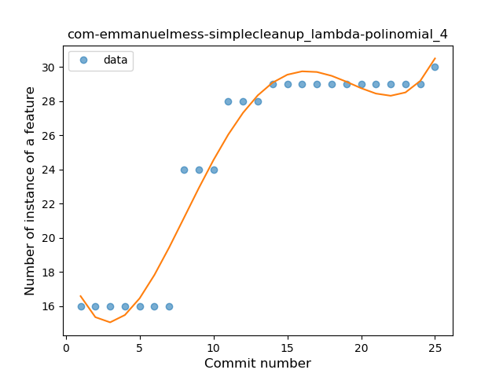
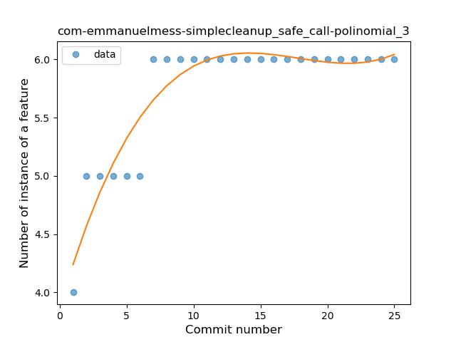
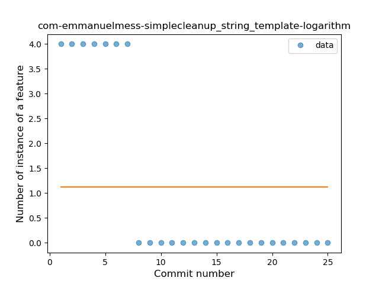
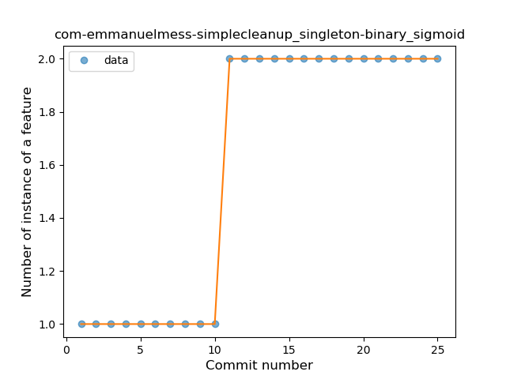
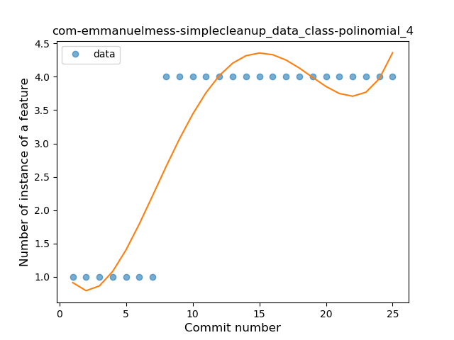

## com-emmanuelmess-simplecleanup
----
#### Metrics provided by Detekt
* Number of lines of code 925
* Number of Kotlin files: 19
* Cyclomatic complexity: 139
* Cyclomatic complexity by thousands of lines: 303 

----
**9** features analyzed

*	<a href="#type_inference">Type Inference</a> 
*	<a href="#lambda">Lambda</a> 
*	<a href="#safe_call">Safe Call</a> 
*	<a href="#unsafe_call">Unsafe Call</a> 
*	<a href="#companion_object">Companion Object</a> 
*	<a href="#string_template">String Template</a> 
*	<a href="#singleton">Singleton</a> 
*	<a href="#data_class">Data Class</a> 
*	<a href="#extension_function">Extension Function</a> 

### <a name="type_inference">Type Inference</a>
----
#### Functions
* **Instability - Polinomial 4:** 
    * **R_Squared:** 0.95954886
* **Sudden Rise Plateau - Logarithm:** 
    * **R_Squared:** 0.82648355
* **Plateau Sudden Rise - Binary Sigmoid:** 
    * **R_Squared:** 0.77947952
* **Constant Rise - Linear:** 
    * **R_Squared:** 0.74700256

**Plots** :chart_with_upwards_trend:
-----

### <a name="lambda">Lambda</a>
----
#### Functions
* **Instability - Polinomial 4:** 
    * **R_Squared:** 0.95698384
* **Sudden Rise Plateau - Logarithm:** 
    * **R_Squared:** 0.79260931
* **Constant Rise - Linear:** 
    * **R_Squared:** 0.77290169

**Plots** :chart_with_upwards_trend:
-----

### <a name="safe_call">Safe Call</a>
----
#### Functions
* **Instability - Polinomial 3:** )
    * **R_Squared:** 0.88072021
* **Sudden Rise Plateau - Logarithm:** 
    * **R_Squared:** 0.79380519
* **Constant Rise - Linear:** 
    * **R_Squared:** 0.52021416

**Plots** :chart_with_upwards_trend:
-----

### <a name="unsafe_call">Unsafe Call</a>
----
#### Functions
* **Sudden Rise Plateau - Logarithm:** 
    * **R_Squared:** 0.8116831
* **Plateau Sudden Rise - Binary Sigmoid:** 
    * **R_Squared:** 0.80332996
* **Constant Rise - Linear:** 
    * **R_Squared:** 0.63438369

**Plots** :chart_with_upwards_trend:
-----

### <a name="companion_object">Companion Object</a>
----
#### Functions
* **Instability - Polinomial 4:** 
    * **R_Squared:** 0.84130954
* **Instability - Polinomial 3:** )
    * **R_Squared:** 0.80889182
* **Plateau Sudden Rise - Binary Sigmoid:** 
    * **R_Squared:** 0.75420173
* **Sudden Rise Plateau - Logarithm:** 
    * **R_Squared:** 0.6404634
* **Constant Rise - Linear:** 
    * **R_Squared:** 0.52504098

**Plots** :chart_with_upwards_trend:
-----

### <a name="string_template">String Template</a>
----
#### Functions
* **Instability - Polinomial 4:** 
    * **R_Squared:** 0.86249008
* **Sudden Decline - Exponential:** 
    * **R_Squared:** 0.76844394
* **Constant Decline - Linear:** 
    * **R_Squared:** 0.60576923
* **Sudden Rise Plateau - Logarithm:** 
    * **R_Squared:** -0.0

**Plots** :chart_with_upwards_trend:
-----

### <a name="singleton">Singleton</a>
----
#### Functions
* **Plateau Sudden Rise - Binary Sigmoid:** 
    * **R_Squared:** 1.0
* **Instability - Polinomial 4:** 
    * **R_Squared:** 0.87813028
* **Instability - Polinomial 3:** )
    * **R_Squared:** 0.83717611
* **Constant Rise - Linear:** 
    * **R_Squared:** 0.72115385
* **Sudden Rise Plateau - Logarithm:** 
    * **R_Squared:** 0.65414564

**Plots** :chart_with_upwards_trend:
-----

### <a name="data_class">Data Class</a>
----
#### Functions
* **Plateau Sudden Rise - Binary Sigmoid:** 
    * **R_Squared:** 1.0
* **Instability - Polinomial 4:** 
    * **R_Squared:** 0.86249008
* **Sudden Rise Plateau - Logarithm:** 
    * **R_Squared:** 0.70696447
* **Constant Rise - Linear:** 
    * **R_Squared:** 0.60576923

**Plots** :chart_with_upwards_trend:
-----

### <a name="extension_function">Extension Function</a>
----
#### Functions
* **Instability - Polinomial 4:** 
    * **R_Squared:** 0.87033749
* **Sudden Rise Plateau - Logarithm:** 
    * **R_Squared:** 0.7313472
* **Constant Rise - Linear:** 
    * **R_Squared:** 0.57870674

**Plots** :chart_with_upwards_trend:
-----

