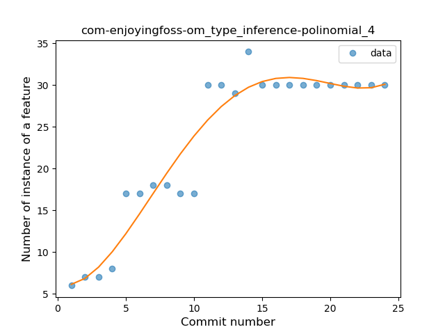
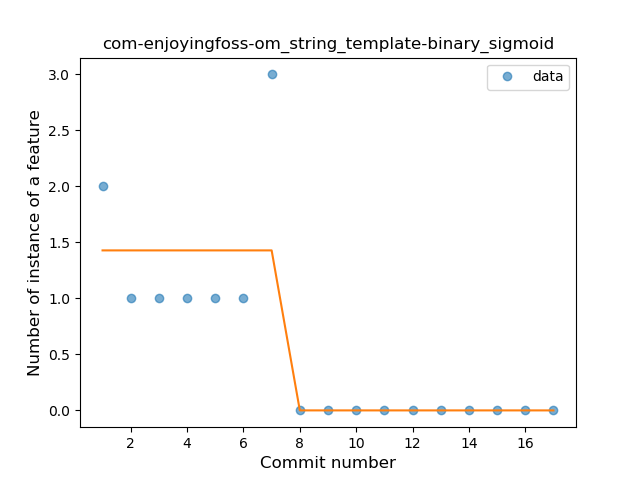

## com-enjoyingfoss-om
----
#### Metrics provided by Detekt
* Number of lines of code 956
* Number of Kotlin files: 11
* Cyclomatic complexity: 108
* Cyclomatic complexity by thousands of lines: 238 

----
**11** features analyzed

*	<a href="#type_inference">Type Inference</a> 
*	<a href="#lambda">Lambda</a> 
*	<a href="#safe_call">Safe Call</a> 
*	<a href="#when_expr">When expression</a> 
*	<a href="#unsafe_call">Unsafe Call</a> 
*	<a href="#companion_object">Companion Object</a> 
*	<a href="#string_template">String Template</a> 
*	<a href="#singleton">Singleton</a> 
*	<a href="#data_class">Data Class</a> 
*	<a href="#func_call_with_named_arg">Function call with Named Argument</a> 
*	<a href="#property_delegation">Property Delegation</a> 

### <a name="type_inference">Type Inference</a>
----
#### Functions
* **Instability - Polinomial 4:** 
    * **R_Squared:** 0.92200333
* **Sudden Rise Plateau - Logarithm:** 
    * **R_Squared:** 0.84113499
* **Constant Rise - Linear:** 
    * **R_Squared:** 0.75782678

**Plots** :chart_with_upwards_trend:
-----

### <a name="lambda">Lambda</a>
----
#### Functions
* **Plateau Gradual Rise - Sigmoid:** 
    * **R_Squared:** 0.94781898
* **Instability - Polinomial 3:** )
    * **R_Squared:** 0.93971649
* **Constant Rise - Linear:** 
    * **R_Squared:** 0.89359169
* **Sudden Rise - Exponential:** 
    * **R_Squared:** 0.90054402
* **Sudden Rise Plateau - Logarithm:** 
    * **R_Squared:** 0.67644523

**Plots** :chart_with_upwards_trend:
-----

### <a name="safe_call">Safe Call</a>
----
#### Functions
* **Instability - Polinomial 4:** 
    * **R_Squared:** 0.26591056
* **Sudden Rise Plateau - Logarithm:** 
    * **R_Squared:** 0.20640794
* **Plateau Sudden Rise - Binary Sigmoid:** 
    * **R_Squared:** 0.20100368
* **Constant Rise - Linear:** 
    * **R_Squared:** 0.16314213

**Plots** :chart_with_upwards_trend:
-----

### <a name="when_expr">When expression</a>
----
#### Functions
* **Plateau Gradual Rise - Sigmoid:** 
    * **R_Squared:** 0.83411077
* **Instability - Polinomial 4:** 
    * **R_Squared:** 0.74875437
* **Instability - Polinomial 3:** )
    * **R_Squared:** 0.69344627
* **Constant Rise - Linear:** 
    * **R_Squared:** 0.55717532
* **Sudden Rise Plateau - Logarithm:** 
    * **R_Squared:** 0.52208587

**Plots** :chart_with_upwards_trend:
-----

### <a name="unsafe_call">Unsafe Call</a>
----
#### Functions
* **Instability - Polinomial 4:** 
    * **R_Squared:** 0.52789537
* **Plateau Sudden Rise - Binary Sigmoid:** 
    * **R_Squared:** 0.23590173
* **Constant Decline - Linear:** 
    * **R_Squared:** 0.01030722
* **Sudden Rise Plateau - Logarithm:** 
    * **R_Squared:** 0.01859132

**Plots** :chart_with_upwards_trend:
-----

### <a name="companion_object">Companion Object</a>
----
#### Functions
* **Plateau Sudden Rise - Binary Sigmoid:** 
    * **R_Squared:** 0.98476282
* **Instability - Polinomial 3:** )
    * **R_Squared:** 0.82294842
* **Sudden Rise Plateau - Logarithm:** 
    * **R_Squared:** 0.69960151
* **Constant Rise - Linear:** 
    * **R_Squared:** 0.46911197

**Plots** :chart_with_upwards_trend:
-----

### <a name="string_template">String Template</a>
----
#### Functions
* **Plateau Sudden Decline - Binary Sigmoid:** 
    * **R_Squared:** 0.69348128
* **Sudden Decline - Exponential:** 
    * **R_Squared:** 0.45690124
* **Constant Decline - Linear:** 
    * **R_Squared:** 0.44680421
* **Sudden Rise Plateau - Logarithm:** 
    * **R_Squared:** -0.0

**Plots** :chart_with_upwards_trend:
-----

### <a name="singleton">Singleton</a>
----
#### Functions
* **Instability - Polinomial 4:** 
    * **R_Squared:** 0.43361015
* **Instability - Polinomial 3:** )
    * **R_Squared:** 0.29383739
* **Constant Decline - Linear:** 
    * **R_Squared:** 0.15261966
* **Sudden Rise Plateau - Logarithm:** 
    * **R_Squared:** -0.0

**Plots** :chart_with_upwards_trend:
-----

### <a name="data_class">Data Class</a>
----
#### Functions
* **Plateau Sudden Rise - Binary Sigmoid:** 
    * **R_Squared:** 1.0
* **Instability - Polinomial 4:** 
    * **R_Squared:** 0.83710407
* **Instability - Polinomial 3:** )
    * **R_Squared:** 0.82352941
* **Sudden Rise Plateau - Logarithm:** 
    * **R_Squared:** 0.70828724
* **Constant Rise - Linear:** 
    * **R_Squared:** 0.50769231

**Plots** :chart_with_upwards_trend:
-----

### <a name="func_call_with_named_arg">Function call with Named Argument</a>
----
#### Functions
* **Instability - Polinomial 4:** 
    * **R_Squared:** 0.63083334
* **Instability - Polinomial 3:** )
    * **R_Squared:** 0.5198125
* **Sudden Rise Plateau - Logarithm:** 
    * **R_Squared:** 0.2067764
* **Constant Rise - Linear:** 
    * **R_Squared:** 0.06579696

**Plots** :chart_with_upwards_trend:
-----

### <a name="property_delegation">Property Delegation</a>
----
#### Functions
* **Plateau Gradual Decline - Sigmoid:** 
    * **R_Squared:** 0.93263865
* **Instability - Polinomial 4:** 
    * **R_Squared:** 0.93846092
* **Sudden Decline - Exponential:** 
    * **R_Squared:** 0.88754173
* **Constant Decline - Linear:** 
    * **R_Squared:** 0.83667984
* **Sudden Rise Plateau - Logarithm:** 
    * **R_Squared:** -0.0

**Plots** :chart_with_upwards_trend:
-----

