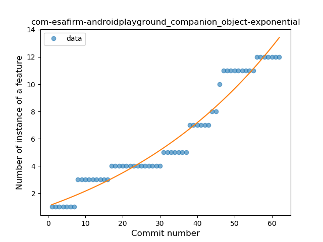
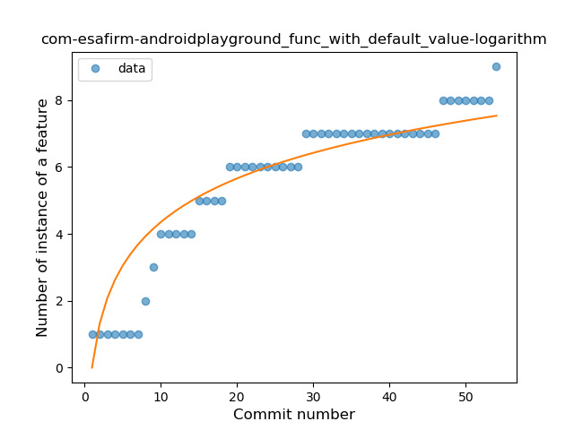

## com-esafirm-androidplayground
----
#### Metrics provided by Detekt
* Number of lines of code 4232
* Number of Kotlin files: 108
* Cyclomatic complexity: 505
* Cyclomatic complexity by thousands of lines: 259 

----
**17** features analyzed

*	<a href="#type_inference">Type Inference</a> 
*	<a href="#lambda">Lambda</a> 
*	<a href="#safe_call">Safe Call</a> 
*	<a href="#when_expr">When expression</a> 
*	<a href="#unsafe_call">Unsafe Call</a> 
*	<a href="#companion_object">Companion Object</a> 
*	<a href="#string_template">String Template</a> 
*	<a href="#func_with_default_value">Function with Default Value</a> 
*	<a href="#singleton">Singleton</a> 
*	<a href="#range_expr">Range Expression</a> 
*	<a href="#data_class">Data Class</a> 
*	<a href="#func_call_with_named_arg">Function call with Named Argument</a> 
*	<a href="#extension_function">Extension Function</a> 
*	<a href="#property_delegation">Property Delegation</a> 
*	<a href="#destructuring_declaration">Destructuring Declaration</a> 
*	<a href="#coroutine">Coroutine</a> 
*	<a href="#infix_func">Infix Function</a> 

### <a name="type_inference">Type Inference</a>
----
#### Functions
* **Constant Rise - Linear:** 
    * **R_Squared:** 0.98630683
* **Sudden Rise Plateau - Logarithm:** 
    * **R_Squared:** 0.57158887

**Plots** :chart_with_upwards_trend:
-----

### <a name="lambda">Lambda</a>
----
#### Functions
* **Constant Rise - Linear:** 
    * **R_Squared:** 0.97739785
* **Sudden Rise Plateau - Logarithm:** 
    * **R_Squared:** 0.60281975

**Plots** :chart_with_upwards_trend:
-----

### <a name="safe_call">Safe Call</a>
----
#### Functions
* **Constant Rise - Linear:** 
    * **R_Squared:** 0.92130641
* **Sudden Rise Plateau - Logarithm:** 
    * **R_Squared:** 0.68671875

**Plots** :chart_with_upwards_trend:
-----

### <a name="when_expr">When expression</a>
----
#### Functions
* **Plateau Gradual Rise - Sigmoid:** 
    * **R_Squared:** 0.91610221
* **Constant Rise - Linear:** 
    * **R_Squared:** 0.76452686
* **Sudden Rise Plateau - Logarithm:** 
    * **R_Squared:** 0.75594135

**Plots** :chart_with_upwards_trend:
-----

### <a name="unsafe_call">Unsafe Call</a>
----
#### Functions
* **Constant Rise - Linear:** 
    * **R_Squared:** 0.96257076
* **Plateau Gradual Rise - Sigmoid:** 
    * **R_Squared:** 0.97068565
* **Sudden Rise Plateau - Logarithm:** 
    * **R_Squared:** 0.66519129

**Plots** :chart_with_upwards_trend:
-----

### <a name="companion_object">Companion Object</a>
----
#### Functions
* **Sudden Rise - Exponential:** 
    * **R_Squared:** 0.95031262
* **Plateau Gradual Rise - Sigmoid:** 
    * **R_Squared:** 0.95726753
* **Constant Rise - Linear:** 
    * **R_Squared:** 0.92389048
* **Sudden Rise Plateau - Logarithm:** 
    * **R_Squared:** 0.55926267

**Plots** :chart_with_upwards_trend:
-----

### <a name="string_template">String Template</a>
----
#### Functions
* **Constant Rise - Linear:** 
    * **R_Squared:** 0.9333323
* **Sudden Rise Plateau - Logarithm:** 
    * **R_Squared:** 0.77749156
* **Plateau Sudden Rise - Binary Sigmoid:** 
    * **R_Squared:** 0.62708931

**Plots** :chart_with_upwards_trend:
-----

### <a name="func_with_default_value">Function with Default Value</a>
----
#### Functions
* **Sudden Rise Plateau - Logarithm:** 
    * **R_Squared:** 0.86313559
* **Constant Rise - Linear:** 
    * **R_Squared:** 0.84195319

**Plots** :chart_with_upwards_trend:
-----

### <a name="singleton">Singleton</a>
----
#### Functions
* **Plateau Gradual Rise - Sigmoid:** 
    * **R_Squared:** 0.96756798
* **Sudden Rise - Exponential:** 
    * **R_Squared:** 0.90490221
* **Constant Rise - Linear:** 
    * **R_Squared:** 0.86725707
* **Sudden Rise Plateau - Logarithm:** 
    * **R_Squared:** 0.49100416

**Plots** :chart_with_upwards_trend:
-----

### <a name="range_expr">Range Expression</a>
----
#### Functions
* **Plateau Sudden Rise - Binary Sigmoid:** 
    * **R_Squared:** 0.95563952
* **Instability - Polinomial 3:** )
    * **R_Squared:** 0.87248736
* **Constant Rise - Linear:** 
    * **R_Squared:** 0.83240844
* **Sudden Rise - Exponential:** 
    * **R_Squared:** 0.83280766
* **Sudden Rise Plateau - Logarithm:** 
    * **R_Squared:** 0.57161688

**Plots** :chart_with_upwards_trend:
-----

### <a name="data_class">Data Class</a>
----
#### Functions
* **Plateau Gradual Rise - Sigmoid:** 
    * **R_Squared:** 0.89687884
* **Instability - Polinomial 3:** )
    * **R_Squared:** 0.86622265
* **Sudden Rise Plateau - Logarithm:** 
    * **R_Squared:** 0.79835874
* **Constant Rise - Linear:** 
    * **R_Squared:** 0.65504572

**Plots** :chart_with_upwards_trend:
-----

### <a name="func_call_with_named_arg">Function call with Named Argument</a>
----
#### Functions
* **Instability - Polinomial 4:** 
    * **R_Squared:** 0.9294421
* **Sudden Rise Plateau - Logarithm:** 
    * **R_Squared:** 0.81885144
* **Constant Rise - Linear:** 
    * **R_Squared:** 0.72979014
* **Plateau Sudden Rise - Binary Sigmoid:** 
    * **R_Squared:** 0.29113904

**Plots** :chart_with_upwards_trend:
-----

### <a name="extension_function">Extension Function</a>
----
#### Functions
* **Sudden Rise - Exponential:** 
    * **R_Squared:** 0.92647206
* **Constant Rise - Linear:** 
    * **R_Squared:** 0.80164529
* **Sudden Rise Plateau - Logarithm:** 
    * **R_Squared:** 0.3471728

**Plots** :chart_with_upwards_trend:
-----

### <a name="property_delegation">Property Delegation</a>
----
#### Functions
* **Plateau Gradual Rise - Sigmoid:** 
    * **R_Squared:** 0.93771451
* **Constant Rise - Linear:** 
    * **R_Squared:** 0.91186639
* **Sudden Rise Plateau - Logarithm:** 
    * **R_Squared:** 0.63415815

**Plots** :chart_with_upwards_trend:
-----

### <a name="destructuring_declaration">Destructuring Declaration</a>
----
#### Functions
* **Plateau Sudden Rise - Binary Sigmoid:** 
    * **R_Squared:** 1.0
* **Sudden Rise Plateau - Logarithm:** 
    * **R_Squared:** 0.70035318
* **Constant Rise - Linear:** 
    * **R_Squared:** 0.57352941

**Plots** :chart_with_upwards_trend:
-----

### <a name="coroutine">Coroutine</a>
----
#### Functions
* **Instability - Polinomial 3:** )
    * **R_Squared:** 0.89202267
* **Sudden Rise Plateau - Logarithm:** 
    * **R_Squared:** 0.64614618
* **Constant Rise - Linear:** 
    * **R_Squared:** 0.58312417
* **Plateau Sudden Rise - Binary Sigmoid:** 
    * **R_Squared:** 0.59008356

**Plots** :chart_with_upwards_trend:
-----

### <a name="infix_func">Infix Function</a>
----
#### Functions
* **Plateau Sudden Rise - Binary Sigmoid:** 
    * **R_Squared:** 0.99058701
* **Sudden Rise - Exponential:** 
    * **R_Squared:** 0.82521995
* **Constant Rise - Linear:** 
    * **R_Squared:** 0.43935032
* **Sudden Rise Plateau - Logarithm:** 
    * **R_Squared:** 0.19939482

**Plots** :chart_with_upwards_trend:
-----

