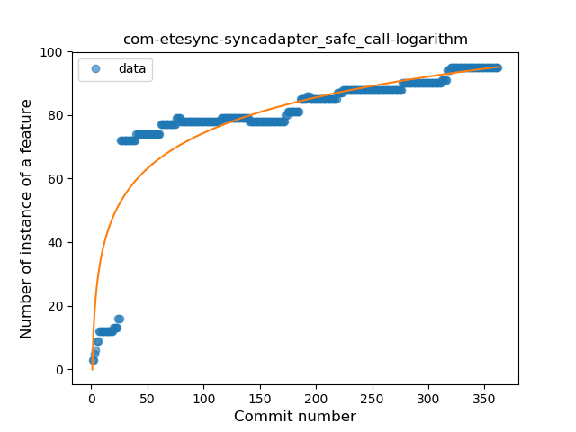
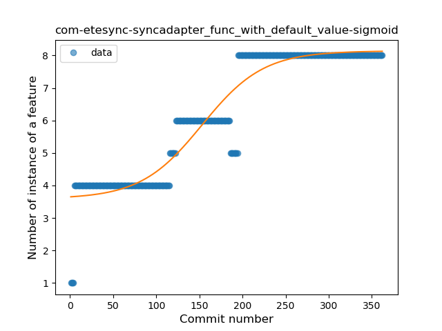
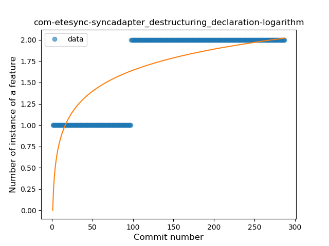

## com-etesync-syncadapter
----
#### Metrics provided by Detekt
* Number of lines of code 13948
* Number of Kotlin files: 99
* Cyclomatic complexity: 1963
* Cyclomatic complexity by thousands of lines: 260 

----
**13** features analyzed

*	<a href="#type_inference">Type Inference</a> 
*	<a href="#lambda">Lambda</a> 
*	<a href="#safe_call">Safe Call</a> 
*	<a href="#when_expr">When expression</a> 
*	<a href="#unsafe_call">Unsafe Call</a> 
*	<a href="#companion_object">Companion Object</a> 
*	<a href="#string_template">String Template</a> 
*	<a href="#func_with_default_value">Function with Default Value</a> 
*	<a href="#singleton">Singleton</a> 
*	<a href="#smart_cast">Smart Cast</a> 
*	<a href="#func_call_with_named_arg">Function call with Named Argument</a> 
*	<a href="#destructuring_declaration">Destructuring Declaration</a> 
*	<a href="#overloaded_op">Overloaded Operator</a> 

### <a name="type_inference">Type Inference</a>
----
#### Functions
* **Sudden Rise Plateau - Logarithm:** 
    * **R_Squared:** 0.64518926
* **Constant Rise - Linear:** 
    * **R_Squared:** 0.2542985

**Plots** :chart_with_upwards_trend:
-----

### <a name="lambda">Lambda</a>
----
#### Functions
* **Sudden Rise Plateau - Logarithm:** 
    * **R_Squared:** 0.94394927
* **Constant Rise - Linear:** 
    * **R_Squared:** 0.80338515
* **Plateau Sudden Rise - Binary Sigmoid:** 
    * **R_Squared:** 0.61357968

**Plots** :chart_with_upwards_trend:
-----

### <a name="safe_call">Safe Call</a>
----
#### Functions
* **Sudden Rise Plateau - Logarithm:** 
    * **R_Squared:** 0.78961659
* **Constant Rise - Linear:** 
    * **R_Squared:** 0.50541601
* **Plateau Sudden Rise - Binary Sigmoid:** 
    * **R_Squared:** 0.47536803

**Plots** :chart_with_upwards_trend:
-----

### <a name="when_expr">When expression</a>
----
#### Functions
* **Sudden Rise Plateau - Logarithm:** 
    * **R_Squared:** 0.93054037
* **Constant Rise - Linear:** 
    * **R_Squared:** 0.76232426

**Plots** :chart_with_upwards_trend:
-----

### <a name="unsafe_call">Unsafe Call</a>
----
#### Functions
* **Sudden Rise Plateau - Logarithm:** 
    * **R_Squared:** 0.13614387
* **Constant Rise - Linear:** 
    * **R_Squared:** 0.00055131
* **Sudden Rise - Exponential:** 
    * **R_Squared:** 0.00053314

**Plots** :chart_with_upwards_trend:
-----

### <a name="companion_object">Companion Object</a>
----
#### Functions
* **Sudden Rise Plateau - Logarithm:** 
    * **R_Squared:** 0.15492395
* **Constant Rise - Linear:** 
    * **R_Squared:** 0.00059795
* **Sudden Rise - Exponential:** 
    * **R_Squared:** 0.00025062
* **Plateau Gradual Decline - Sigmoid:** 
    * **R_Squared:** 0.00572912

**Plots** :chart_with_upwards_trend:
-----

### <a name="string_template">String Template</a>
----
#### Functions
* **Sudden Rise Plateau - Logarithm:** 
    * **R_Squared:** 0.92985984
* **Constant Rise - Linear:** 
    * **R_Squared:** 0.73375032
* **Plateau Gradual Rise - Sigmoid:** 
    * **R_Squared:** 0.63975228

**Plots** :chart_with_upwards_trend:
-----

### <a name="func_with_default_value">Function with Default Value</a>
----
#### Functions
* **Plateau Gradual Rise - Sigmoid:** 
    * **R_Squared:** 0.90966363
* **Constant Rise - Linear:** 
    * **R_Squared:** 0.83954306
* **Sudden Rise Plateau - Logarithm:** 
    * **R_Squared:** 0.69089492

**Plots** :chart_with_upwards_trend:
-----

### <a name="singleton">Singleton</a>
----
#### Functions
* **Sudden Rise Plateau - Logarithm:** 
    * **R_Squared:** 0.77989905
* **Constant Rise - Linear:** 
    * **R_Squared:** 0.50565613

**Plots** :chart_with_upwards_trend:
-----

### <a name="smart_cast">Smart Cast</a>
----
#### Functions
* **Constant Decline - Linear:** 
    * **R_Squared:** 0.22569609
* **Sudden Rise Plateau - Logarithm:** 
    * **R_Squared:** -0.0
* **Plateau Sudden Decline - Binary Sigmoid:** 
    * **R_Squared:** 0.00369289

**Plots** :chart_with_upwards_trend:
-----

### <a name="func_call_with_named_arg">Function call with Named Argument</a>
----
#### Functions
* **Plateau Sudden Decline - Binary Sigmoid:** 
    * **R_Squared:** 0.93716905
* **Sudden Decline - Exponential:** 
    * **R_Squared:** 0.63323334
* **Constant Decline - Linear:** 
    * **R_Squared:** 0.61276682
* **Sudden Rise Plateau - Logarithm:** 
    * **R_Squared:** -0.0

**Plots** :chart_with_upwards_trend:
-----

### <a name="destructuring_declaration">Destructuring Declaration</a>
----
#### Functions
* **Plateau Sudden Rise - Binary Sigmoid:** 
    * **R_Squared:** 1.0
* **Constant Rise - Linear:** 
    * **R_Squared:** 0.67125583
* **Sudden Rise Plateau - Logarithm:** 
    * **R_Squared:** 0.62022655

**Plots** :chart_with_upwards_trend:
-----

### <a name="overloaded_op">Overloaded Operator</a>
----
#### Functions
* **Plateau Sudden Decline - Binary Sigmoid:** 
    * **R_Squared:** 1.0
* **Sudden Decline - Exponential:** 
    * **R_Squared:** 0.77772531
* **Constant Decline - Linear:** 
    * **R_Squared:** 0.48790092
* **Sudden Rise Plateau - Logarithm:** 
    * **R_Squared:** -0.0

**Plots** :chart_with_upwards_trend:
-----

