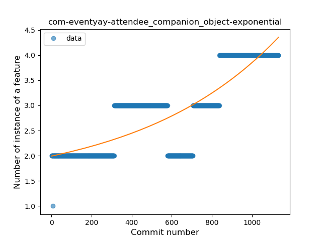
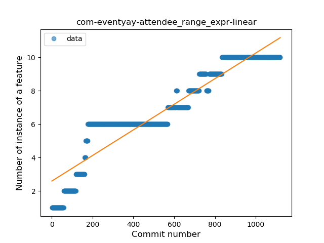
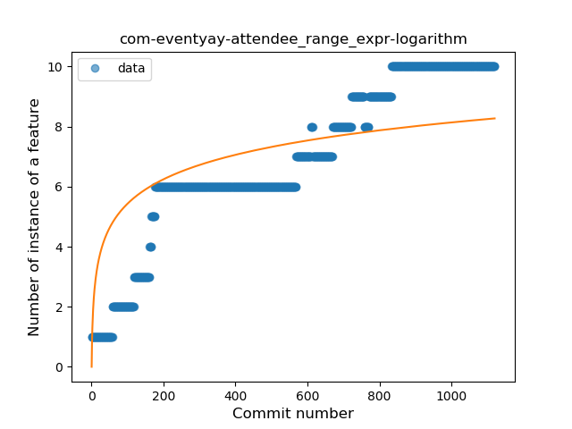
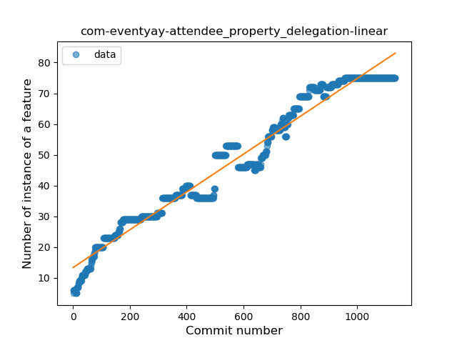
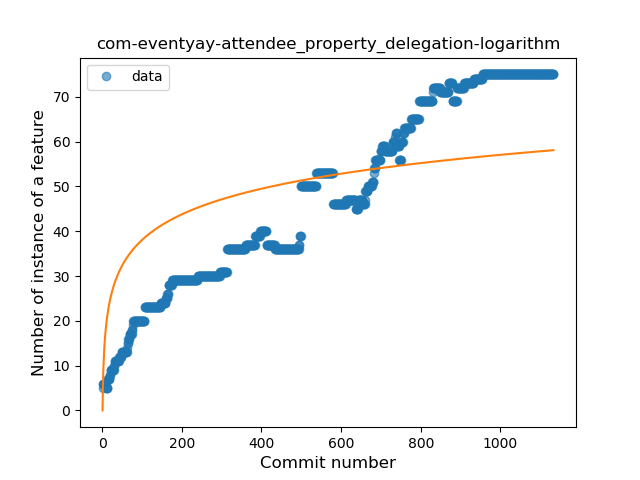

## com-eventyay-attendee
----
#### Metrics provided by Detekt
* Number of lines of code 21464
* Number of Kotlin files: 281
* Cyclomatic complexity: 2667
* Cyclomatic complexity by thousands of lines: 214 

----
**16** features analyzed

*	<a href="#type_inference">Type Inference</a> 
*	<a href="#lambda">Lambda</a> 
*	<a href="#safe_call">Safe Call</a> 
*	<a href="#when_expr">When expression</a> 
*	<a href="#unsafe_call">Unsafe Call</a> 
*	<a href="#companion_object">Companion Object</a> 
*	<a href="#string_template">String Template</a> 
*	<a href="#func_with_default_value">Function with Default Value</a> 
*	<a href="#singleton">Singleton</a> 
*	<a href="#range_expr">Range Expression</a> 
*	<a href="#smart_cast">Smart Cast</a> 
*	<a href="#data_class">Data Class</a> 
*	<a href="#func_call_with_named_arg">Function call with Named Argument</a> 
*	<a href="#extension_function">Extension Function</a> 
*	<a href="#property_delegation">Property Delegation</a> 
*	<a href="#destructuring_declaration">Destructuring Declaration</a> 

### <a name="type_inference">Type Inference</a>
----
#### Functions
* **Sudden Rise - Exponential:** 
    * **R_Squared:** 0.93475227
* **Constant Rise - Linear:** 
    * **R_Squared:** 0.91079163
* **Sudden Rise Plateau - Logarithm:** 
    * **R_Squared:** 0.47174417
* **Plateau Sudden Rise - Binary Sigmoid:** 
    * **R_Squared:** 0.34639954

**Plots** :chart_with_upwards_trend:
-----

### <a name="lambda">Lambda</a>
----
#### Functions
* **Sudden Rise - Exponential:** 
    * **R_Squared:** 0.94986027
* **Constant Rise - Linear:** 
    * **R_Squared:** 0.9253832
* **Sudden Rise Plateau - Logarithm:** 
    * **R_Squared:** 0.4631313
* **Plateau Sudden Rise - Binary Sigmoid:** 
    * **R_Squared:** 0.31485511

**Plots** :chart_with_upwards_trend:
-----

### <a name="safe_call">Safe Call</a>
----
#### Functions
* **Sudden Rise Plateau - Logarithm:** 
    * **R_Squared:** 0.32240547
* **Sudden Rise - Exponential:** 
    * **R_Squared:** 0.22204414
* **Constant Rise - Linear:** 
    * **R_Squared:** 0.20465171
* **Plateau Sudden Rise - Binary Sigmoid:** 
    * **R_Squared:** 0.01195981

**Plots** :chart_with_upwards_trend:
-----

### <a name="when_expr">When expression</a>
----
#### Functions
* **Plateau Gradual Rise - Sigmoid:** 
    * **R_Squared:** 0.9715524
* **Sudden Rise - Exponential:** 
    * **R_Squared:** 0.91779101
* **Constant Rise - Linear:** 
    * **R_Squared:** 0.90413747
* **Sudden Rise Plateau - Logarithm:** 
    * **R_Squared:** 0.31894305

**Plots** :chart_with_upwards_trend:
-----

### <a name="unsafe_call">Unsafe Call</a>
----
#### Functions
* **Sudden Decline - Exponential:** 
    * **R_Squared:** 0.09708244
* **Constant Decline - Linear:** 
    * **R_Squared:** 0.07854267
* **Sudden Rise Plateau - Logarithm:** 
    * **R_Squared:** -0.0

**Plots** :chart_with_upwards_trend:
-----

### <a name="companion_object">Companion Object</a>
----
#### Functions
* **Sudden Rise - Exponential:** 
    * **R_Squared:** 0.70248957
* **Constant Rise - Linear:** 
    * **R_Squared:** 0.67630735
* **Sudden Rise Plateau - Logarithm:** 
    * **R_Squared:** 0.44951854

**Plots** :chart_with_upwards_trend:
-----

### <a name="string_template">String Template</a>
----
#### Functions
* **Constant Rise - Linear:** 
    * **R_Squared:** 0.95454871
* **Sudden Rise - Exponential:** 
    * **R_Squared:** 0.9563916
* **Sudden Rise Plateau - Logarithm:** 
    * **R_Squared:** 0.45777481
* **Plateau Sudden Rise - Binary Sigmoid:** 
    * **R_Squared:** 0.14890854

**Plots** :chart_with_upwards_trend:
-----

### <a name="func_with_default_value">Function with Default Value</a>
----
#### Functions
* **Sudden Rise - Exponential:** 
    * **R_Squared:** 0.95342797
* **Constant Rise - Linear:** 
    * **R_Squared:** 0.85188015
* **Sudden Rise Plateau - Logarithm:** 
    * **R_Squared:** 0.35979733

**Plots** :chart_with_upwards_trend:
-----

### <a name="singleton">Singleton</a>
----
#### Functions
* **Sudden Rise - Exponential:** 
    * **R_Squared:** 0.96870235
* **Plateau Gradual Rise - Sigmoid:** 
    * **R_Squared:** 0.97220176
* **Constant Rise - Linear:** 
    * **R_Squared:** 0.84003708
* **Sudden Rise Plateau - Logarithm:** 
    * **R_Squared:** 0.2780025

**Plots** :chart_with_upwards_trend:
-----

### <a name="range_expr">Range Expression</a>
----
#### Functions
* **Constant Rise - Linear:** 
    * **R_Squared:** 0.88424828
* **Sudden Rise Plateau - Logarithm:** 
    * **R_Squared:** 0.60488991

**Plots** :chart_with_upwards_trend:
-----

### <a name="smart_cast">Smart Cast</a>
----
#### Functions
* **Sudden Rise Plateau - Logarithm:** 
    * **R_Squared:** 0.49812273
* **Constant Rise - Linear:** 
    * **R_Squared:** 0.40209154
* **Plateau Sudden Rise - Binary Sigmoid:** 
    * **R_Squared:** 0.28154065

**Plots** :chart_with_upwards_trend:
-----

### <a name="data_class">Data Class</a>
----
#### Functions
* **Constant Rise - Linear:** 
    * **R_Squared:** 0.92271126
* **Sudden Rise - Exponential:** 
    * **R_Squared:** 0.92445337
* **Sudden Rise Plateau - Logarithm:** 
    * **R_Squared:** 0.49274634
* **Plateau Gradual Rise - Sigmoid:** 
    * **R_Squared:** 0.25210505

**Plots** :chart_with_upwards_trend:
-----

### <a name="func_call_with_named_arg">Function call with Named Argument</a>
----
#### Functions
* **Sudden Rise - Exponential:** 
    * **R_Squared:** 0.94897476
* **Constant Rise - Linear:** 
    * **R_Squared:** 0.90152471
* **Sudden Rise Plateau - Logarithm:** 
    * **R_Squared:** 0.33451234
* **Plateau Sudden Rise - Binary Sigmoid:** 
    * **R_Squared:** 0.03692607

**Plots** :chart_with_upwards_trend:
-----

### <a name="extension_function">Extension Function</a>
----
#### Functions
* **Sudden Rise - Exponential:** 
    * **R_Squared:** 0.94653888
* **Constant Rise - Linear:** 
    * **R_Squared:** 0.90046438
* **Sudden Rise Plateau - Logarithm:** 
    * **R_Squared:** 0.24932171

**Plots** :chart_with_upwards_trend:
-----

### <a name="property_delegation">Property Delegation</a>
----
#### Functions
* **Constant Rise - Linear:** 
    * **R_Squared:** 0.96262683
* **Sudden Rise Plateau - Logarithm:** 
    * **R_Squared:** 0.54084989

**Plots** :chart_with_upwards_trend:
-----

### <a name="destructuring_declaration">Destructuring Declaration</a>
----
#### Functions
* **Sudden Rise - Exponential:** 
    * **R_Squared:** 0.67226294
* **Constant Rise - Linear:** 
    * **R_Squared:** 0.47849739
* **Sudden Rise Plateau - Logarithm:** 
    * **R_Squared:** 0.07334557
* **Plateau Sudden Decline - Binary Sigmoid:** 
    * **R_Squared:** 0.00734362

**Plots** :chart_with_upwards_trend:
-----

