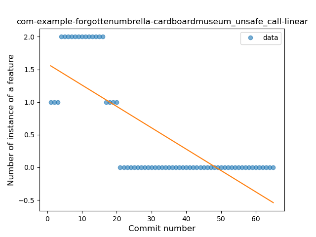
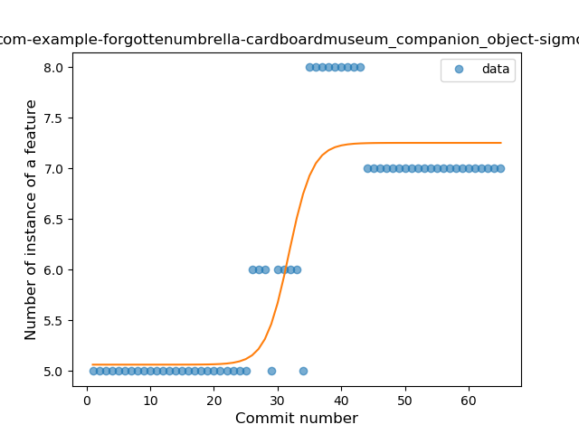

## com-example-forgottenumbrella-cardboardmuseum
----
#### Metrics provided by Detekt
* Number of lines of code 888
* Number of Kotlin files: 9
* Cyclomatic complexity: 78
* Cyclomatic complexity by thousands of lines: 232 

----
**13** features analyzed

*	<a href="#type_inference">Type Inference</a> 
*	<a href="#lambda">Lambda</a> 
*	<a href="#safe_call">Safe Call</a> 
*	<a href="#unsafe_call">Unsafe Call</a> 
*	<a href="#companion_object">Companion Object</a> 
*	<a href="#string_template">String Template</a> 
*	<a href="#func_with_default_value">Function with Default Value</a> 
*	<a href="#smart_cast">Smart Cast</a> 
*	<a href="#data_class">Data Class</a> 
*	<a href="#func_call_with_named_arg">Function call with Named Argument</a> 
*	<a href="#extension_function">Extension Function</a> 
*	<a href="#property_delegation">Property Delegation</a> 
*	<a href="#inline_func">Inline Function</a> 

### <a name="type_inference">Type Inference</a>
----
#### Functions
* **Sudden Rise Plateau - Logarithm:** 
    * **R_Squared:** 0.2036467
* **Constant Rise - Linear:** 
    * **R_Squared:** 0.15309663

**Plots** :chart_with_upwards_trend:
-----

### <a name="lambda">Lambda</a>
----
#### Functions
* **Instability - Polinomial 3:** )
    * **R_Squared:** 0.78724468
* **Constant Rise - Linear:** 
    * **R_Squared:** 0.69426759
* **Sudden Rise Plateau - Logarithm:** 
    * **R_Squared:** 0.49681855

**Plots** :chart_with_upwards_trend:
-----

### <a name="safe_call">Safe Call</a>
----
#### Functions
* **Constant Rise - Linear:** 
    * **R_Squared:** 0.6789093
* **Sudden Rise Plateau - Logarithm:** 
    * **R_Squared:** 0.64940808

**Plots** :chart_with_upwards_trend:
-----

### <a name="unsafe_call">Unsafe Call</a>
----
#### Functions
* **Plateau Gradual Decline - Sigmoid:** 
    * **R_Squared:** 0.92402335
* **Sudden Decline - Exponential:** 
    * **R_Squared:** 0.68470598
* **Constant Decline - Linear:** 
    * **R_Squared:** 0.58039069
* **Sudden Rise Plateau - Logarithm:** 
    * **R_Squared:** 0.0

**Plots** :chart_with_upwards_trend:
-----

### <a name="companion_object">Companion Object</a>
----
#### Functions
* **Plateau Gradual Rise - Sigmoid:** 
    * **R_Squared:** 0.83702249
* **Instability - Polinomial 3:** )
    * **R_Squared:** 0.76619779
* **Constant Rise - Linear:** 
    * **R_Squared:** 0.62326872
* **Sudden Rise Plateau - Logarithm:** 
    * **R_Squared:** 0.50965906

**Plots** :chart_with_upwards_trend:
-----

### <a name="string_template">String Template</a>
----
#### Functions
* **Instability - Polinomial 3:** )
    * **R_Squared:** 0.86444932
* **Constant Rise - Linear:** 
    * **R_Squared:** 0.70547463
* **Sudden Rise Plateau - Logarithm:** 
    * **R_Squared:** 0.51574291

**Plots** :chart_with_upwards_trend:
-----

### <a name="func_with_default_value">Function with Default Value</a>
----
#### Functions
* **Plateau Gradual Rise - Sigmoid:** 
    * **R_Squared:** 0.98111765
* **Constant Rise - Linear:** 
    * **R_Squared:** 0.76835265
* **Sudden Rise Plateau - Logarithm:** 
    * **R_Squared:** 0.7205718

**Plots** :chart_with_upwards_trend:
-----

### <a name="smart_cast">Smart Cast</a>
----
#### Functions
* **Plateau Sudden Decline - Binary Sigmoid:** 
    * **R_Squared:** 1.0
* **Constant Decline - Linear:** 
    * **R_Squared:** 0.74573864
* **Sudden Rise Plateau - Logarithm:** 
    * **R_Squared:** 0.0

**Plots** :chart_with_upwards_trend:
-----

### <a name="data_class">Data Class</a>
----
#### Functions
* **Plateau Gradual Rise - Sigmoid:** 
    * **R_Squared:** 0.87276416
* **Constant Rise - Linear:** 
    * **R_Squared:** 0.78479354
* **Sudden Rise Plateau - Logarithm:** 
    * **R_Squared:** 0.64273131

**Plots** :chart_with_upwards_trend:
-----

### <a name="func_call_with_named_arg">Function call with Named Argument</a>
----
#### Functions
* **Instability - Polinomial 3:** )
    * **R_Squared:** 0.85642066
* **Constant Rise - Linear:** 
    * **R_Squared:** 0.74428093
* **Sudden Rise - Exponential:** 
    * **R_Squared:** 0.74637587
* **Sudden Rise Plateau - Logarithm:** 
    * **R_Squared:** 0.42600655

**Plots** :chart_with_upwards_trend:
-----

### <a name="extension_function">Extension Function</a>
----
#### Functions
* **Plateau Gradual Rise - Sigmoid:** 
    * **R_Squared:** 0.93845735
* **Instability - Polinomial 3:** )
    * **R_Squared:** 0.87770633
* **Constant Rise - Linear:** 
    * **R_Squared:** 0.75529332
* **Sudden Rise Plateau - Logarithm:** 
    * **R_Squared:** 0.53138035

**Plots** :chart_with_upwards_trend:
-----

### <a name="property_delegation">Property Delegation</a>
----
#### Functions
* **Sudden Decline - Exponential:** 
    * **R_Squared:** 0.81947884
* **Constant Decline - Linear:** 
    * **R_Squared:** 0.13210227
* **Sudden Rise Plateau - Logarithm:** 
    * **R_Squared:** -0.0

**Plots** :chart_with_upwards_trend:
-----

### <a name="inline_func">Inline Function</a>
----
#### Functions
* **Instability - Polinomial 3:** )
    * **R_Squared:** 0.81124232
* **Sudden Rise - Exponential:** 
    * **R_Squared:** 0.33343147
* **Constant Rise - Linear:** 
    * **R_Squared:** 0.20012315
* **Plateau Sudden Decline - Binary Sigmoid:** 
    * **R_Squared:** 0.13074713
* **Sudden Rise Plateau - Logarithm:** 
    * **R_Squared:** 0.01560909

**Plots** :chart_with_upwards_trend:
-----

