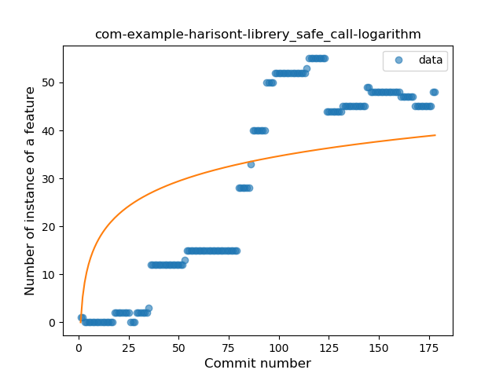
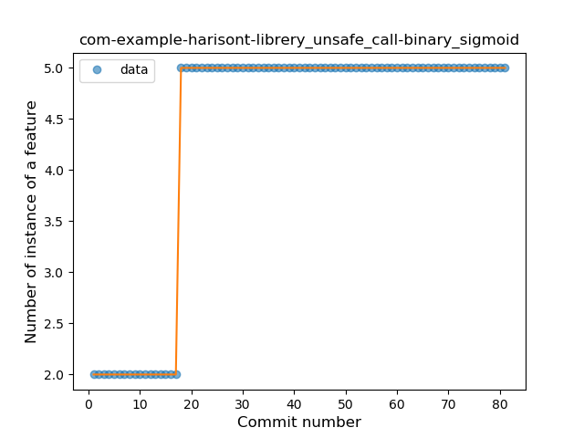

## com-example-harisont-librery
----
#### Metrics provided by Detekt
* Number of lines of code 930
* Number of Kotlin files: 18
* Cyclomatic complexity: 91
* Cyclomatic complexity by thousands of lines: 202 

----
**7** features analyzed

*	<a href="#type_inference">Type Inference</a> 
*	<a href="#lambda">Lambda</a> 
*	<a href="#safe_call">Safe Call</a> 
*	<a href="#when_expr">When expression</a> 
*	<a href="#unsafe_call">Unsafe Call</a> 
*	<a href="#companion_object">Companion Object</a> 
*	<a href="#string_template">String Template</a> 

### <a name="type_inference">Type Inference</a>
----
#### Functions
* **Plateau Gradual Rise - Sigmoid:** 
    * **R_Squared:** 0.97367922
* **Constant Rise - Linear:** 
    * **R_Squared:** 0.95347732
* **Sudden Rise Plateau - Logarithm:** 
    * **R_Squared:** 0.50537564

**Plots** :chart_with_upwards_trend:
-----

### <a name="lambda">Lambda</a>
----
#### Functions
* **Sudden Rise - Exponential:** 
    * **R_Squared:** 0.9137567
* **Constant Rise - Linear:** 
    * **R_Squared:** 0.89314493
* **Sudden Rise Plateau - Logarithm:** 
    * **R_Squared:** 0.34578638
* **Plateau Sudden Rise - Binary Sigmoid:** 
    * **R_Squared:** 0.07119616

**Plots** :chart_with_upwards_trend:
-----

### <a name="safe_call">Safe Call</a>
----
#### Functions
* **Constant Rise - Linear:** 
    * **R_Squared:** 0.80691525
* **Sudden Rise Plateau - Logarithm:** 
    * **R_Squared:** 0.45306303
* **Plateau Sudden Rise - Binary Sigmoid:** 
    * **R_Squared:** 0.22464006

**Plots** :chart_with_upwards_trend:
-----

### <a name="when_expr">When expression</a>
----
#### Functions
* **Plateau Sudden Rise - Binary Sigmoid:** 
    * **R_Squared:** 1.0
* **Constant Rise - Linear:** 
    * **R_Squared:** 0.65396341
* **Sudden Rise Plateau - Logarithm:** 
    * **R_Squared:** 0.65885649

**Plots** :chart_with_upwards_trend:
-----

### <a name="unsafe_call">Unsafe Call</a>
----
#### Functions
* **Plateau Sudden Rise - Binary Sigmoid:** 
    * **R_Squared:** 1.0
* **Sudden Rise Plateau - Logarithm:** 
    * **R_Squared:** 0.68260726
* **Constant Rise - Linear:** 
    * **R_Squared:** 0.49756098

**Plots** :chart_with_upwards_trend:
-----

### <a name="companion_object">Companion Object</a>
----
#### Functions
* **Plateau Gradual Rise - Sigmoid:** 
    * **R_Squared:** 0.78657845
* **Constant Rise - Linear:** 
    * **R_Squared:** 0.41091429
* **Sudden Rise Plateau - Logarithm:** 
    * **R_Squared:** 0.36200747

**Plots** :chart_with_upwards_trend:
-----

### <a name="string_template">String Template</a>
----
#### Functions
* **Plateau Gradual Rise - Sigmoid:** 
    * **R_Squared:** 0.66971651
* **Sudden Rise Plateau - Logarithm:** 
    * **R_Squared:** 0.6136401
* **Constant Rise - Linear:** 
    * **R_Squared:** 0.57135691

**Plots** :chart_with_upwards_trend:
-----

