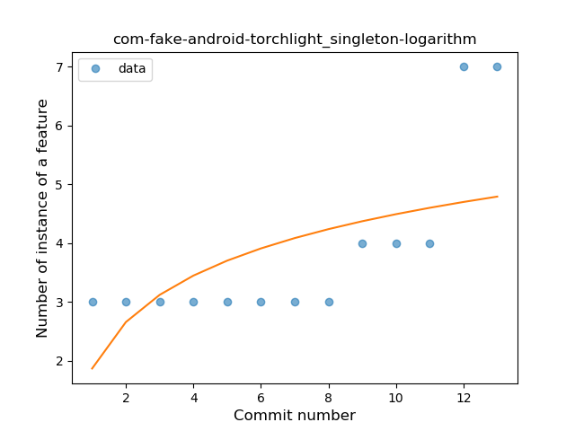

## com-fake-android-torchlight
----
#### Metrics provided by Detekt
* Number of lines of code 1243
* Number of Kotlin files: 17
* Cyclomatic complexity: 183
* Cyclomatic complexity by thousands of lines: 304 

----
**3** features analyzed

*	<a href="#type_inference">Type Inference</a> 
*	<a href="#string_template">String Template</a> 
*	<a href="#singleton">Singleton</a> 

### <a name="type_inference">Type Inference</a>
----
#### Functions
* **Instability - Polinomial 3:** )
    * **R_Squared:** 0.88126928
* **Instability - Polinomial 4:** 
    * **R_Squared:** 0.8826528
* **Sudden Rise - Exponential:** 
    * **R_Squared:** 0.86418455
* **Constant Rise - Linear:** 
    * **R_Squared:** 0.49030612
* **Sudden Rise Plateau - Logarithm:** 
    * **R_Squared:** 0.26732253

**Plots** :chart_with_upwards_trend:
-----

### <a name="string_template">String Template</a>
----
#### Functions
* **Plateau Sudden Rise - Binary Sigmoid:** 
    * **R_Squared:** 1.0
* **Instability - Polinomial 4:** 
    * **R_Squared:** 0.88968678
* **Sudden Rise - Exponential:** 
    * **R_Squared:** 0.76008193
* **Constant Rise - Linear:** 
    * **R_Squared:** 0.71428571
* **Sudden Rise Plateau - Logarithm:** 
    * **R_Squared:** 0.4953867

**Plots** :chart_with_upwards_trend:
-----

### <a name="singleton">Singleton</a>
----
#### Functions
* **Instability - Polinomial 3:** )
    * **R_Squared:** 0.91203632
* **Instability - Polinomial 4:** 
    * **R_Squared:** 0.91206434
* **Sudden Rise - Exponential:** 
    * **R_Squared:** 0.90168023
* **Constant Rise - Linear:** 
    * **R_Squared:** 0.60072712
* **Sudden Rise Plateau - Logarithm:** 
    * **R_Squared:** 0.35558947

**Plots** :chart_with_upwards_trend:
-----

